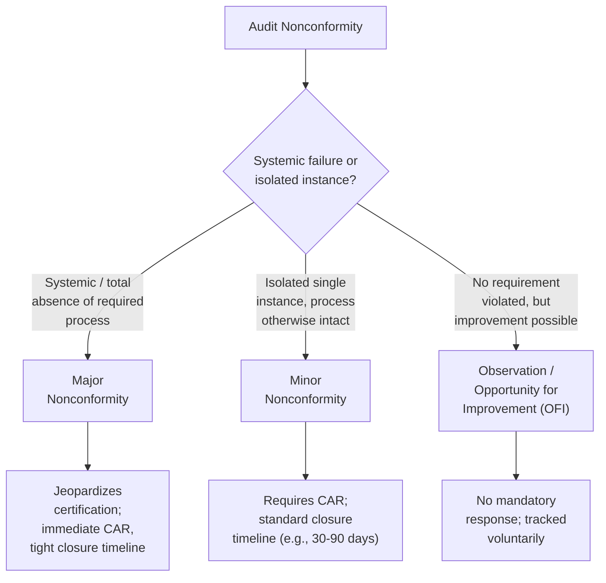
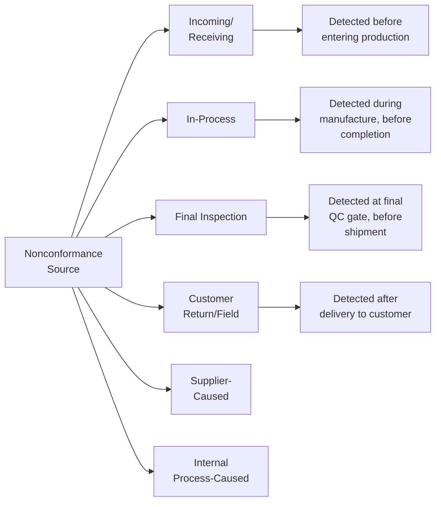
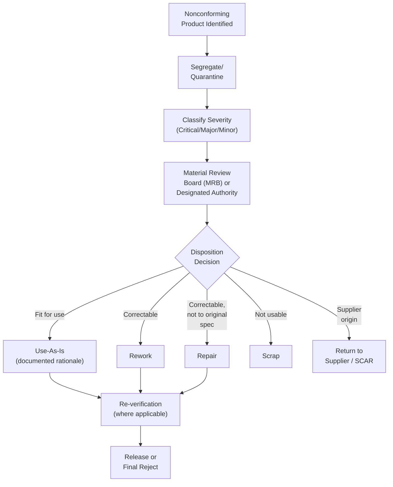

## Nonconformance Classification

### Definition and Purpose

Nonconformance classification is the systematic categorization of audit findings, inspection results, or process deviations according to their severity, scope, and potential impact on product/service conformity, safety, and system effectiveness. Classification determines the urgency and formality of the required response — including timeline for correction, level of management involvement, and potential impact on certification status or product disposition. The framework applies across two related but distinct contexts: **audit nonconformities** (findings against a QMS during an audit) and **product/process nonconformances** (deviations identified during production, inspection, or in-service use). Both share the same underlying logic — evaluating evidence against defined requirements — but differ in scope of impact and disposition pathway.

### Nonconformance vs. Nonconformity — Terminology Note

ISO 9000:2015 (Fundamentals and Vocabulary) defines a **nonconformity** as the non-fulfillment of a requirement. In practice, many organizations use "nonconformance" interchangeably (particularly in North American industrial usage) or apply "nonconformity" specifically to audit/system findings and "nonconformance" to product/process deviations. This document uses the terms per their common domain usage: audit findings as nonconformities, product/process deviations as nonconformances.

### Classification Axis 1 — Audit Nonconformity Severity

**Major Nonconformity**

Represents a significant failure of the management system to meet a requirement — commonly defined as the total absence or complete breakdown of a system or process required by the standard, a situation that raises significant doubt that product/service will meet specified requirements, or a cluster of related minor nonconformities against the same clause/requirement indicating a systemic rather than isolated failure. Major nonconformities typically require immediate corrective action and, in certification audits, can result in certificate suspension or withholding of certification until resolved and verified.

**Minor Nonconformity**

An isolated lapse in meeting a requirement that does not, on its own, indicate a systemic breakdown of the QMS — for example, a single expired calibration sticker on an otherwise well-controlled gauge population, or a single training record missing a signature. Requires a documented corrective action but generally does not by itself jeopardize certification status.

**Observation / Opportunity for Improvement (OFI)**

Not a nonconformity — no requirement has been violated — but the auditor identifies a practice, risk, or trend that, if left unaddressed, could develop into a future nonconformity, or that represents a chance to improve efficiency or robustness beyond minimum compliance. Response is discretionary.

[Inference] Exact thresholds distinguishing major from minor severity (e.g., how many related minor findings constitute a major) can vary between certification bodies and accreditation schemes; some schemes also define an intermediate "critical nonconformity" tier for findings with direct safety or regulatory reporting implications (common in medical device and aerospace certification). Organizations should confirm classification criteria with their specific registrar's documented rules.

### Classification Axis 2 — Product/Process Nonconformance Severity

For product and process nonconformances (as distinct from audit findings), classification is typically driven by impact on form, fit, function, safety, and regulatory compliance:

| Class | Definition | Typical Disposition Path |
| --- | --- | --- |
| **Critical** | Affects safety, regulatory compliance, or renders product unusable/hazardous | Immediate quarantine, MRB (Material Review Board) escalation, potential recall assessment |
| **Major** | Affects fit, form, function, or a specified requirement but not safety-critical | Formal disposition required (use-as-is, rework, repair, scrap), documented rationale |
| **Minor** | Deviation from specification with negligible impact on function or customer requirements | Simplified disposition, may qualify for use-as-is with lower approval authority |
| **Cosmetic/Incidental** | Appearance-only deviation with no functional impact | Often use-as-is by default per documented criteria, minimal review burden |

[Inference] Terminology and exact tiering for product nonconformance severity (critical/major/minor/incidental) are organization- and industry-specific rather than universally standardized; AS9100 aerospace and IATF 16949 automotive supply chains often define these tiers explicitly in customer-specific requirements (CSRs), while general manufacturing may use a simpler two-tier (major/minor) system.

### Classification Axis 3 — Source/Origin of Nonconformance

Classifying by source/detection point informs cost-of-quality analysis (internal failure cost vs. external failure cost) and drives different escalation pathways — customer-detected/field nonconformances typically trigger mandatory 8D or similar formal problem-solving processes and may carry regulatory reporting obligations (e.g., medical device vigilance reporting, automotive field action assessment).

### Disposition Categories for Product Nonconformance

Once classified, nonconforming product must be dispositioned. Standard disposition categories include:

- **Use-As-Is:** Product does not meet specification but is determined fit for intended use through engineering/technical evaluation; requires documented justification and appropriate approval authority (often including customer concurrence for form/fit/function-affecting deviations under aerospace/automotive contracts).
- **Rework:** Product is reprocessed to bring it into full conformance with original specifications, followed by re-verification.
- **Repair:** Product is processed to make it usable for its intended purpose, though it may not conform fully to original specifications; typically requires re-inspection/verification and, in regulated industries, documented approval and potential customer/regulatory notification.
- **Scrap:** Product is rejected and removed from further use, with traceability records updated and disposal per applicable requirements (e.g., preventing scrap material re-entry into the supply stream).
- **Return to Supplier:** Nonconforming incoming material or component is rejected and returned, typically triggering supplier corrective action request (SCAR).

### Material Review Board (MRB) Process

Many industries (particularly aerospace under AS9100 and defense manufacturing) formalize nonconformance disposition through a **Material Review Board** — a cross-functional authority (typically including quality engineering, design engineering, and sometimes customer/regulatory representation) empowered to review nonconformance data and approve disposition, especially for use-as-is and repair dispositions affecting form, fit, or function. MRB authority levels are often tiered, with certain disposition types (e.g., use-as-is affecting a safety-critical characteristic) requiring customer or regulatory authority concurrence rather than internal MRB approval alone.

### Example: Classification Decision Logic

**Example**

A dimensional inspection on a machined aerospace bracket reveals a hole diameter 0.05 mm outside the upper tolerance limit.

1. **Detect and segregate:** Part is immediately tagged and moved to a quarantine/hold area (preventing further processing or shipment).
2. **Classify:** Engineering evaluates whether the affected hole is a critical characteristic (e.g., involved in a fastener load path) or a non-critical feature. If it affects a fastener fit critical to structural integrity, this is classified as **major** (affects form/fit/function); if purely cosmetic clearance, it may be classified **minor**.
3. **Disposition path:** Given aerospace context and a major classification, the nonconformance is routed to the MRB. Engineering evaluates whether the oversized hole can be used-as-is (e.g., within a documented engineering tolerance stack-up allowance) or requires rework (e.g., installing a bushing/insert) or scrap.
4. **Customer concurrence:** Because the affected feature is form/fit/function-related on a customer-designed part, contractual flow-down (typical under AS9100 and customer-specific requirements) may mandate customer notification and approval before use-as-is disposition can be finalized.
5. **Root cause and corrective action:** Regardless of disposition, a root cause investigation is initiated (e.g., tool wear, program error) and corrective action implemented to prevent recurrence, closing the loop per the CAPA system.

### Linkage to Corrective and Preventive Action (CAPA)

Nonconformance classification directly drives CAPA prioritization and rigor:

| Classification | Typical CAPA Response |
| --- | --- |
| Major/Critical | Mandatory formal root cause analysis (e.g., 8D, fishbone/5-Why), management notification, effectiveness verification required |
| Minor | Documented corrective action, may use simplified root cause method, standard closure timeline |
| Observation/Cosmetic | Tracked but corrective action optional; may feed into continual improvement initiatives rather than formal CAPA |

### Regulatory and Reporting Implications

In regulated sectors, nonconformance classification can trigger mandatory external reporting obligations independent of internal disposition:

- **Medical devices (ISO 13485/FDA):** A nonconformance detected post-delivery that meets adverse event criteria may require regulatory vigilance reporting (e.g., FDA MDR, EU MDR vigilance system) regardless of internal severity classification.
- **Aerospace:** Nonconformances affecting airworthiness may trigger mandatory reporting to certifying authorities or customer notification per contractual flow-down.
- **Automotive:** Field-related nonconformances affecting safety may trigger formal field action/recall assessment processes under IATF 16949-aligned procedures.

[Inference] Specific regulatory reporting thresholds and timelines are jurisdiction- and product-class-dependent; practitioners should verify current applicable regulatory reporting criteria directly against the relevant authority's current guidance rather than relying on general classification severity alone.

### Common Pitfalls in Nonconformance Classification

- Under-classifying a systemic issue as minor because individual instances appear isolated, missing the pattern across related findings
- Inconsistent classification criteria applied by different auditors or inspectors, undermining trend analysis and CAPA prioritization
- Failing to distinguish audit nonconformity classification (system-level) from product nonconformance classification (part-level), applying the wrong framework to the wrong context
- Disposition decisions (especially use-as-is) made without adequate engineering evaluation or required customer/regulatory concurrence
- Closing out classification without linking to root cause analysis, treating classification as an end point rather than a trigger for CAPA

### Related Topics

- Corrective Action Request (CAR) and CAPA Systems
- Material Review Board (MRB) Process and Authority Levels
- 8D Problem-Solving Methodology
- Root Cause Analysis Techniques (5 Why, Fishbone/Ishikawa, Fault Tree Analysis)
- Audit Execution and Evidence Gathering
- Supplier Corrective Action Request (SCAR)
- Regulatory Reporting Obligations (FDA MDR, EU MDR Vigilance, Aerospace Airworthiness)
- Cost of Quality (Internal vs. External Failure Costs)
- ISO 9000:2015 Fundamentals and Vocabulary
- Use-As-Is Disposition and Engineering Tolerance Stack-Up Analysis