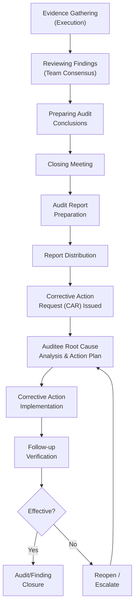
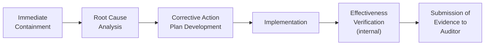
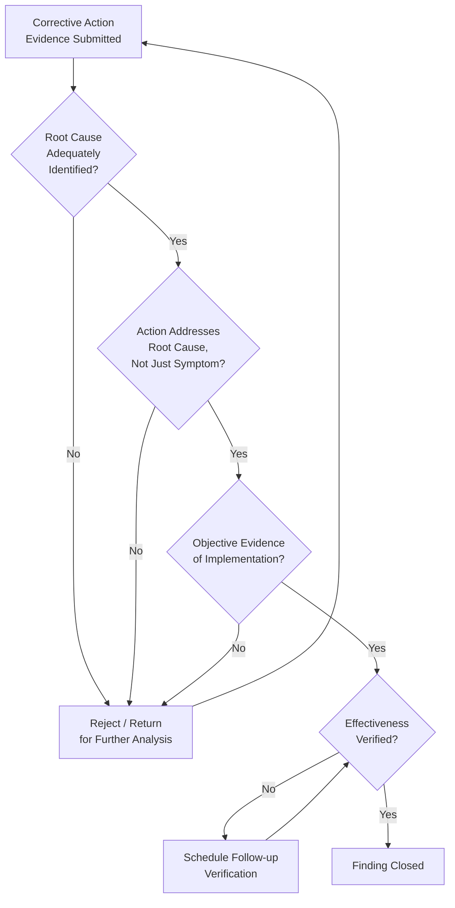

## Audit Reporting and Follow-up

### Definition and Purpose

Audit reporting is the formal documentation of audit findings, conclusions, and recommendations following the execution phase, providing a complete and accurate record of the audit for the audit client, auditee, and any relevant accreditation or regulatory body. Follow-up is the subsequent process of verifying that corrective actions addressing identified nonconformities have been implemented and are effective, closing the loop between audit findings and sustained conformity. Together, these phases are governed primarily by **ISO 19011** Clause 6.5 (Preparing and distributing the audit report) and Clause 6.6/6.7 (Completing the audit / Conducting audit follow-up).

### Position in the Overall Audit Process

### Closing Meeting

The closing meeting precedes formal report issuance and serves to present findings to the auditee's management in a manner that ensures they are understood and acknowledged. Standard closing meeting content includes:

- Restatement of audit scope, objectives, and criteria
- Presentation of audit findings and conclusions, including nonconformities with their classification (major/minor/observation)
- Explanation of the grading rationale for each nonconformity, referencing the specific evidence and criteria clause
- Positive observations and areas of good practice, where applicable
- Explanation of the post-audit process — corrective action submission timeline, follow-up verification method, and any certification decision implications
- Opportunity for the auditee to raise disagreement with findings, with a documented process for resolving differing opinions before the report is finalized

Any unresolved disagreement between the audit team and the auditee regarding findings should be documented in the audit report, along with both the audit team's position and the auditee's response, rather than being silently resolved in the report itself.

### Audit Report — Standard Contents

Per ISO 19011 guidance, a complete audit report typically includes:

- Audit objectives, scope, and criteria
- Identification of the audit client, audit team, and auditee organization/locations
- Dates and duration of audit activities
- Audit methodology/methods used (on-site, remote, sampling approach)
- Summary of the audit process, including any obstacles encountered (e.g., limited access, unavailable personnel)
- Audit findings, with supporting evidence and classification (conformity, nonconformity — major/minor, observation/OFI)
- Audit conclusions, addressing the extent of conformity to audit criteria, effective implementation/maintenance of the management system, and achievement of audit objectives
- Areas not covered, if scope was limited, with explanation
- Unresolved diverging opinions between audit team and auditee
- A statement on confidentiality of report content
- Recommendations for improvement, where applicable and agreed as part of audit objectives (note: recommendations are distinct from mandatory corrective actions and should not compromise audit independence/objectivity)
- Distribution list for the report

### Report Formats by Audit Type

| Audit Type | Typical Report Emphasis | Distribution |
| --- | --- | --- |
| Internal (First-Party) | Detailed findings feeding CAPA and management review | Internal QMS owner, process owners, top management |
| Second-Party (Supplier) | Vendor scorecard/rating impact, contractual conformance | Customer procurement/quality, supplier management |
| Third-Party Certification | Formal certification decision recommendation, standardized nonconformity grading | Certification body decision-maker, auditee top management |
| Regulatory Inspection | Formal regulatory finding classification (e.g., FDA Form 483 observations) | Regulatory authority, auditee regulatory/quality affairs |

### Nonconformity Documentation — Corrective Action Request (CAR)

Each nonconformity identified should be documented individually, typically on a standardized **Corrective Action Request (CAR)** or nonconformity report form, containing:

- Unique identifier/reference number
- Precise statement of the nonconformity (what requirement was not met)
- Reference to the specific audit criteria clause violated
- Objective evidence supporting the finding (specific record, observation, or interview reference)
- Classification (major/minor/critical, per applicable scheme)
- Auditee's required response timeline (e.g., root cause and containment within 10 days, full corrective action plan within 30 days)
- Space for auditee's root cause analysis, corrective action plan, and implementation evidence
- Space for auditor's follow-up verification and closure decision

**Example**

**CAR Statement (well-formed):** "During review of calibration records for critical gauges (Clause 7.1.5.1), gauge MIC-22 was found with an expired calibration due date of 2026-02-01, still in active use on the production floor as of the audit date 2026-03-15, with no evidence of an out-of-tolerance containment action. This constitutes a nonconformity against the requirement that monitoring and measuring resources be calibrated at specified intervals."

This statement is effective because it specifies the exact requirement, cites objective evidence (gauge ID, dates), and states the gap between requirement and observed condition — avoiding vague language such as "calibration control is inadequate."

### Corrective Action Process (Auditee Response)

Following report issuance, the auditee is responsible for:

1. **Containment:** Immediate action to prevent continued nonconformity impact (e.g., removing the affected gauge from service, quarantining potentially affected product).
2. **Root cause analysis:** Formal investigation using structured methods (5-Why, fishbone/Ishikawa, fault tree analysis) appropriate to the nonconformity's severity and complexity.
3. **Corrective action plan:** Defined actions addressing the root cause (not merely the symptom), responsible owner, and target completion dates.
4. **Implementation:** Execution of the planned actions.
5. **Internal effectiveness verification:** The auditee's own confirmation that the action resolved the root cause before submitting closure evidence.
6. **Evidence submission:** Documentation submitted to the audit team/certification body supporting closure.

### Follow-up Verification Methods

The audit team (or certification body) verifies corrective action effectiveness through one or more methods, selected based on nonconformity severity and risk:

| Method | Description | Typical Use |
| --- | --- | --- |
| **Desk review of evidence** | Auditor reviews submitted documentation (photos, revised procedures, records) without a site visit | Minor nonconformities, low-risk corrections |
| **Follow-up audit (on-site)** | A dedicated, scoped audit visit focused only on the affected area(s) | Major nonconformities, or where documentary evidence alone is insufficient |
| **Verification at next scheduled audit** | Closure deferred to the next surveillance/internal audit cycle, with interim monitoring | Lower-risk minor findings where immediate re-visit is not warranted |
| **Remote verification** | Video walkthrough or screen-share confirming implementation | Where permitted by the audit program/accreditation rules |

For third-party certification audits, **major nonconformities typically require verification before a certification decision can be made or maintained** — meaning a major finding can delay certificate issuance or trigger suspension of an existing certificate if not resolved within the required timeframe (commonly 90 days, though this varies by certification body policy). Minor nonconformities are generally permitted to remain open for verification at the next scheduled audit, provided a credible corrective action plan is in place.

[Inference] Exact closure timeframes and escalation consequences (e.g., certificate suspension triggers) are governed by each accreditation body's and certification body's specific rules (e.g., IAF mandatory documents) and can vary; organizations should confirm current timeframes with their specific registrar rather than assume a universal figure.

### Closure Decision Logic

A finding should not be closed based on correction (the immediate fix) alone — closure requires verified evidence that the corrective action (addressing root cause) has been effective in preventing recurrence, which may require observing performance over a defined period before final sign-off, particularly for major nonconformities.

### Distinguishing Correction, Corrective Action, and Preventive Action

| Term | Definition | Example |
| --- | --- | --- |
| **Correction** | Immediate action to eliminate a detected nonconformity itself | Re-calibrating the expired gauge |
| **Corrective Action** | Action to eliminate the cause of a nonconformity and prevent recurrence | Revising the calibration scheduling system/software alert to prevent future overdue gauges |
| **Preventive Action** | Action to eliminate the cause of a *potential* nonconformity before it occurs | Proactively auditing calibration due-date data integrity across all equipment types after the gauge finding, even where no other overdue instance yet exists |

### Management Review Linkage

Audit reports and follow-up status are mandatory inputs to **management review** (e.g., ISO 9001 Clause 9.3, ISO 13485 Clause 5.6). Top management uses aggregated audit data — including open nonconformity trends, recurring finding patterns, and overdue corrective actions — to assess QMS effectiveness and allocate resources for systemic improvement, distinct from the closure of any single finding.

### Certification Decision Impact (Third-Party Audits)

For third-party certification audits, the audit report and any open major nonconformities feed into a formal **certification decision** made by a person or committee at the certification body independent of the audit team that conducted the audit (a requirement under ISO 17021 to preserve decision impartiality). Outcomes can include: certification granted/maintained, certification granted conditional on timely closure evidence, certificate suspension pending resolution, or certificate withdrawal for failure to adequately address major nonconformities within required timeframes.

### Common Pitfalls in Audit Reporting and Follow-up

- Vague nonconformity statements lacking specific objective evidence, making independent verification and effective corrective action difficult
- Closing findings based on submitted paperwork alone without verifying actual on-site implementation and effectiveness, particularly for major findings
- Treating "correction" (the immediate fix) as sufficient closure evidence without addressing root cause
- Failing to document unresolved disagreements between audit team and auditee in the final report
- Allowing corrective action timelines to lapse without escalation, undermining certification credibility and systemic risk management
- Not feeding aggregated audit/follow-up trend data into management review, missing systemic patterns visible only across multiple audit cycles

### Related Topics

- ISO 19011 – Guidelines for Auditing Management Systems
- Audit Execution and Evidence Gathering
- Nonconformance Classification
- Root Cause Analysis Methods (5-Why, Fishbone/Ishikawa, Fault Tree Analysis)
- Correction vs. Corrective Action vs. Preventive Action
- Management Review Process (Inputs and Outputs)
- ISO 17021 – Certification Body Impartiality and Decision-Making
- Supplier Corrective Action Request (SCAR)
- Certificate Suspension and Withdrawal Criteria
- 8D Problem-Solving Methodology