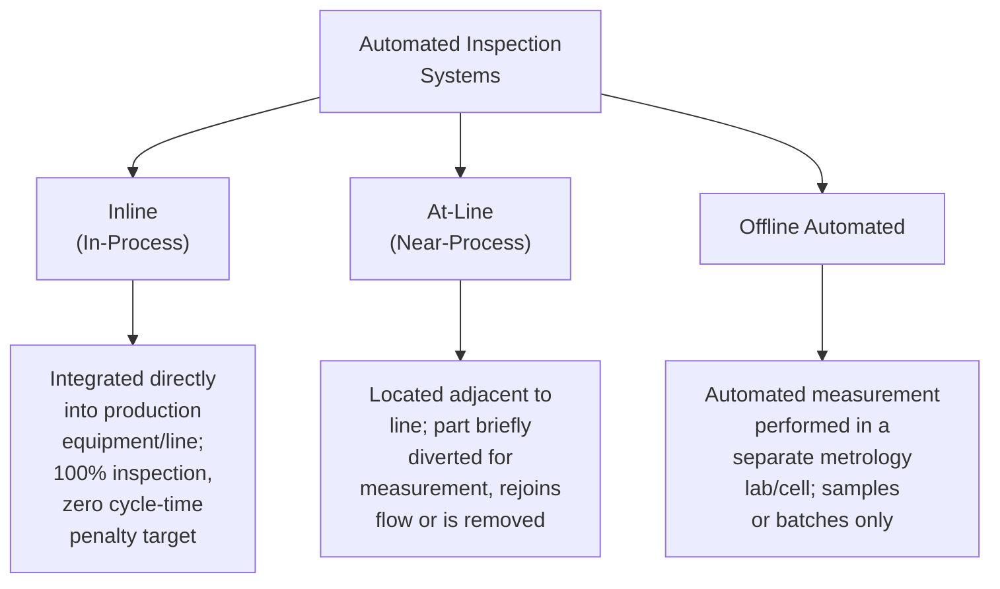
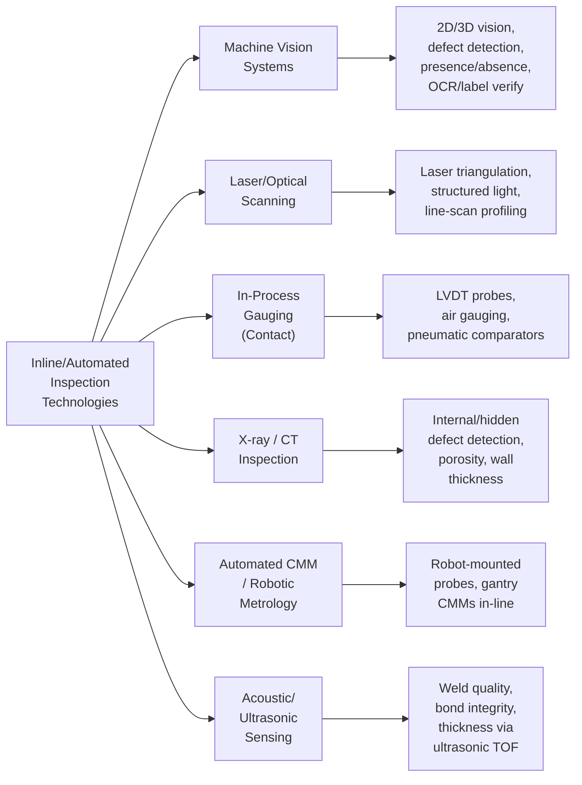
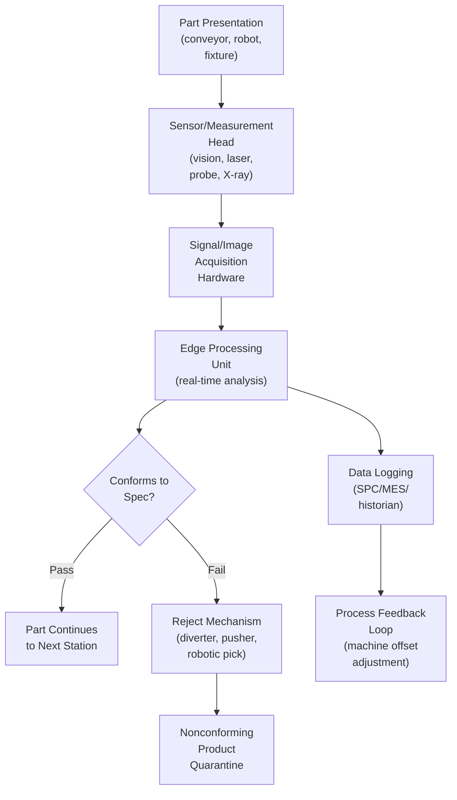
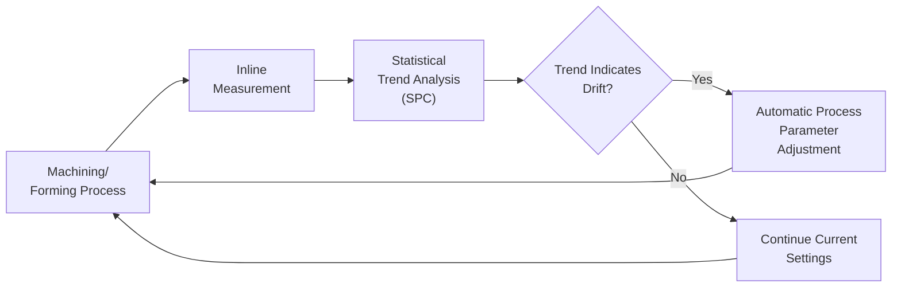

## Inline and Automated Inspection Systems

### Definition and Purpose

Inline and automated inspection systems are metrology and quality control technologies integrated directly into or immediately adjacent to a production process to perform measurement, defect detection, or conformity verification without removing parts from the manufacturing flow (inline) or with minimal manual intervention (automated). These systems enable 100% inspection at production rate rather than statistical sampling, providing real-time or near-real-time feedback that supports process control, immediate nonconforming product segregation, and closed-loop process adjustment. They represent a core enabling technology within the broader Industry 4.0 / smart manufacturing transition, shifting quality control from a downstream gate to a continuous, embedded process attribute.

### Classification by Integration Point

**Inline (In-Process) Inspection:** Sensors or measurement devices are embedded directly within the production line, measuring parts as they move through the process without stopping or diverting flow (e.g., laser triangulation sensors on a stamping line, vision systems on a conveyor). This category targets true 100% inspection at full production cycle time.

**At-Line Inspection:** Measurement occurs immediately adjacent to the process, typically requiring a part to be briefly removed from the main flow (often robotically) for measurement before returning to the line or being rejected. Cycle time impact exists but is minimized through automation (e.g., a robot-mounted CMM probe station beside a machining cell).

**Offline Automated Inspection:** Measurement is fully automated but performed in a separate metrology environment (e.g., an automated CMM lab), typically applied to samples rather than full production volume, retaining traditional statistical sampling logic while automating the measurement execution itself.

### Core Technology Categories

**Machine Vision Systems:** Camera-based systems (2D or 3D) combined with image processing software to perform dimensional measurement, surface defect detection (scratches, cracks, discoloration), presence/absence verification (component/fastener checks), optical character recognition (OCR) for label/marking verification, and color/pattern matching. Modern systems increasingly incorporate deep learning-based defect classification alongside traditional rule-based image processing, particularly for defects with high visual variability that are difficult to define through fixed geometric rules.

**Laser and Structured-Light Scanning:** Non-contact optical methods projecting a laser line or structured light pattern onto a part surface and triangulating dimensional data from the deformation/reflection pattern. Enables full-surface 3D profile capture at production speed, commonly used for sheet metal, casting, and molded part dimensional verification without contact-induced measurement error or part damage risk.

**In-Process Contact Gauging:** Traditional contact-based measurement principles (LVDTs — linear variable differential transformers, air/pneumatic gauging, touch-trigger probes) integrated into machine tools or fixtures for direct dimensional verification during or immediately after a machining/forming operation, often used for closed-loop compensation (feeding measurement data back to adjust machine offsets in real time).

**X-ray and Computed Tomography (CT) Inspection:** Used for detecting internal/hidden defects not visible or accessible to surface-based methods — porosity in castings, weld penetration, internal crack detection, wall thickness verification, and internal assembly verification (e.g., component placement inside a sealed housing). Industrial CT additionally enables full 3D internal and external dimensional metrology from a single scan, increasingly used for complex geometries including additively manufactured (3D-printed) parts where internal lattice structures cannot be verified by any contact or line-of-sight optical method.

**Automated/Robotic CMM Integration:** Coordinate measuring machines integrated with robotic part loading/unloading or mounted on robotic arms, enabling automated multi-feature dimensional inspection without manual fixturing for each part, often paired with automated part-recognition (vision-guided robotics) to select appropriate measurement programs.

**Acoustic and Ultrasonic Sensing:** Time-of-flight ultrasonic methods for wall thickness measurement, weld/bond integrity verification, and internal flaw detection, applied inline particularly in pipe, tube, and composite material manufacturing.

### System Architecture — Generic Inline Inspection Cell

### Real-Time Process Feedback (Closed-Loop Control)

A defining capability distinguishing advanced inline inspection from simple pass/fail gating is the **closed-loop feedback** architecture, where measurement data is fed directly back to upstream process control systems to automatically adjust process parameters (tool offsets, forming pressure, temperature setpoints) and correct drift before it produces nonconforming parts, rather than only detecting nonconformance after the fact.

### Integration with Manufacturing Execution Systems (MES) and Quality Data Infrastructure

Inline inspection data typically feeds into a broader digital quality infrastructure:

- **Manufacturing Execution System (MES):** Receives pass/fail and measurement data tied to specific serial numbers/lot IDs for traceability and genealogy tracking
- **Statistical Process Control (SPC) software:** Consumes real-time measurement streams for control chart generation and out-of-control condition alerting
- **Quality Management Software / eQMS:** Nonconforming product events can auto-generate nonconformance records, reducing manual data entry and transcription error
- **Data historians/Industrial IoT platforms:** Long-term storage of raw measurement data supporting trend analysis, predictive maintenance correlation, and audit traceability

Interoperability commonly relies on industrial communication protocols including **OPC-UA**, **MQTT**, and increasingly **Digital Twin** frameworks that maintain a synchronized virtual representation of measured part conformity against nominal CAD geometry.

### Measurement System Analysis (MSA) Considerations for Automated Systems

Automated inspection systems still require validation of measurement capability, following the same underlying statistical principles as manual gauge MSA (Gage R&R), though with distinct emphasis:

- **Repeatability:** Since a single automated system replaces the "multiple appraisers" dimension of manual Gage R&R, repeatability studies focus on system-to-system variation (if multiple identical stations exist) and within-system repeat-measurement variation under fixed conditions
- **Reproducibility:** Evaluated across environmental variation (lighting changes for vision systems, temperature drift for laser systems), part presentation variation (fixturing repeatability, part orientation tolerance), and, where applicable, comparison against a certified reference measurement (e.g., CMM ground truth) to establish correlation/bias
- **Linearity and Bias:** Verified across the full measurement range using certified reference artifacts
- **Correlation studies:** Frequently required to demonstrate that inline/automated measurement results correlate acceptably with a traditional reference method (e.g., laboratory CMM) before the automated system can be relied upon as the sole inspection method

[Inference] Formal statistical acceptance criteria for automated/vision system correlation studies (e.g., required correlation coefficient thresholds) are not universally standardized across a single normative document and are typically defined by internal MSA procedures or customer-specific requirements (particularly in automotive AIAG MSA manual practice); practitioners should confirm applicable acceptance criteria against their specific quality system procedure or customer requirements.

### Example: Vision-Based Inline Defect Detection Workflow

**Example**

A stamped automotive body panel line integrates a machine vision system for surface defect detection immediately after the final stamping station.

1. **Image acquisition:** High-resolution cameras with structured/diffuse lighting capture full-panel images as each part passes on the conveyor at line speed.
2. **Pre-processing:** Image normalization corrects for lighting variation and part positioning tolerance.
3. **Defect detection algorithm:** A combination of rule-based edge/contrast detection (for dents, scratches) and a trained deep-learning classification model (for subtler surface defects like orange-peel texture or minor wrinkling) analyzes the image against a trained "golden sample" baseline.
4. **Classification and decision:** Detected anomalies are classified by type and severity; parts exceeding defect thresholds trigger a reject signal to a downstream pneumatic diverter before reaching the next assembly station.
5. **Data logging:** Every part's pass/fail result, defect type (if any), and image reference are logged against the part's unique identifier in the MES for traceability and SPC trending.
6. **Feedback loop:** A statistically significant increase in a specific defect type (e.g., recurring die-line marks) triggers an automated alert to process engineering, prompting die maintenance before defect rate escalates.

### Advantages Over Manual/Sample-Based Inspection

- **100% inspection coverage** versus statistical sampling, eliminating sampling risk for the inspected characteristics
- **Elimination of inspector fatigue and subjectivity** for repetitive visual/dimensional checks
- **Real-time feedback** enabling process correction before large quantities of nonconforming product accumulate
- **Full traceability** with measurement data automatically linked to unique part identifiers
- **Reduced cycle time impact** relative to manual inspection removal-and-return workflows, particularly for true inline configurations

### Limitations and Implementation Challenges

- **Capital and integration cost:** Significant upfront investment in sensors, processing hardware, and line integration engineering
- **Environmental sensitivity:** Vision and optical systems are sensitive to ambient lighting, vibration, and contamination (coolant, dust) requiring robust environmental control or compensation
- **Defect library/training data requirements:** Deep-learning-based defect classification requires substantial labeled training data covering the full range of defect types and severities, with ongoing retraining as new defect modes emerge
- **False positive/negative management:** Overly sensitive thresholds generate excessive false rejects (impacting yield and requiring manual re-verification), while insensitive thresholds risk escaping true defects — threshold tuning is an ongoing calibration activity
- **Validation burden:** Formal MSA/correlation study requirements before an automated system can replace a validated manual/reference method, particularly in regulated industries (aerospace, medical device)
- **Maintenance and calibration:** Optical and laser systems require periodic recalibration and lens/sensor cleaning to maintain measurement accuracy over time

### Common Pitfalls in Implementation

- Deploying vision/automated systems without adequate correlation studies against an established reference method, risking undetected systematic bias
- Underestimating environmental control requirements (lighting stability, vibration isolation) leading to inconsistent measurement performance
- Insufficient defect/training data diversity for AI-based classification, resulting in poor generalization to real production variation
- Treating automated inspection deployment as a one-time validation rather than an ongoing MSA program requiring periodic re-verification
- Failing to integrate reject/nonconformance data with the broader quality data infrastructure, losing traceability and trend visibility

### Related Topics

- Measurement Systems Analysis (Gage R&R) for Automated Systems
- Machine Vision Fundamentals and Deep Learning Defect Classification
- Statistical Process Control (SPC) and Real-Time Control Charting
- Industrial Computed Tomography (CT) for Dimensional Metrology
- Digital Twin and Industry 4.0 Quality Architectures
- OPC-UA and MQTT in Industrial Metrology Data Integration
- Closed-Loop Machining and Adaptive Process Control
- Robotic Metrology and Automated CMM Programming
- Non-Destructive Testing (NDT) Methods Overview
- Manufacturing Execution System (MES) Quality Module Integration