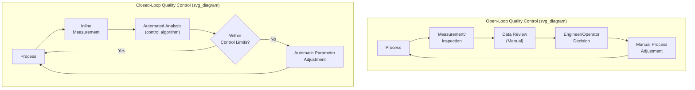
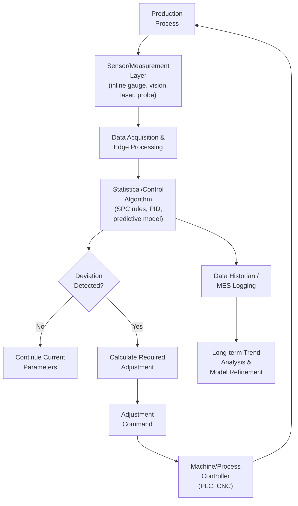
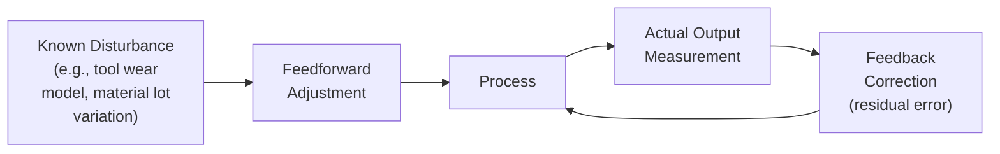
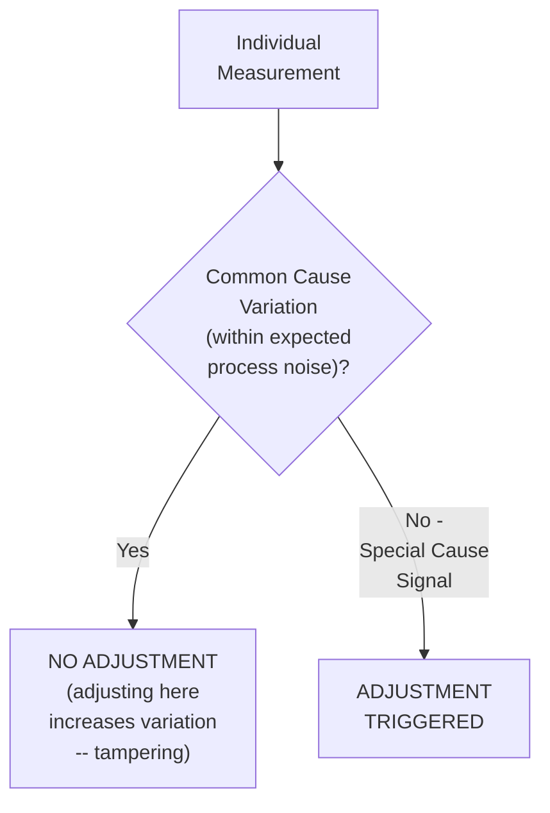

## Closed Loop Quality Feedback to Production

### Definition and Purpose

Closed loop quality feedback is a control architecture in which measurement data collected during or immediately after production is automatically analyzed and used to adjust upstream process parameters in real time or near-real time, without requiring manual intervention to interpret data and issue corrective instructions. This distinguishes closed-loop systems from traditional "open loop" quality control, where inspection detects nonconformance but correction of the process depends on a separate, manually-triggered decision cycle (e.g., an operator or engineer reviewing SPC charts and adjusting a machine offset). Closed-loop feedback is a foundational capability of adaptive/smart manufacturing, enabling process drift to be corrected before it produces nonconforming output rather than only detecting nonconformance after it has occurred.

### Open Loop vs. Closed Loop Quality Control

The key architectural difference is the removal of the manual decision node from the correction path — the control algorithm itself determines whether and how much adjustment is required, based on predefined control logic, statistical models, or increasingly, machine learning models trained on historical process-measurement relationships.

### Core System Architecture

### Feedback Loop Types by Control Strategy

**Statistical Process Control (SPC)-Driven Feedback**

Uses control chart logic (e.g., Western Electric rules, Nelson rules) applied to a stream of inline measurements to detect special-cause variation (a point beyond control limits, a run of points trending in one direction, or other out-of-control patterns) and automatically triggers a predefined adjustment or process hold when a rule is violated. This is the most common and well-established closed-loop approach, extending traditional SPC from a monitoring/alerting tool into an automated correction tool.

**Feedback Control (Reactive) — PID and Similar Control Loops**

Borrowed from classical control theory, feedback control continuously compares a measured output value against a target setpoint and calculates a correction proportional to the error, its accumulation over time (integral), and its rate of change (derivative) — the **PID (Proportional-Integral-Derivative)** control model. In a machining context, this might mean continuously adjusting tool offset based on measured part dimension deviation from nominal.

**Feedforward Control (Predictive/Preemptive)**

Rather than reacting to a measured deviation after it occurs, feedforward control uses known or predicted disturbance variables (e.g., material batch variation, tool wear curves, ambient temperature) to preemptively adjust process parameters before a deviation manifests in the measured output. Feedforward and feedback control are frequently combined in advanced implementations — feedforward handles predictable/modeled disturbances, while feedback corrects for unmodeled or residual error.

**Model-Based / Predictive Feedback (Advanced)**

Uses a process model (physics-based, statistical, or machine-learning-derived) to predict the relationship between process parameters and measured output, enabling adjustment calculations that account for nonlinear or multi-variable interactions beyond what simple PID logic can capture. Increasingly implemented using machine learning models trained on historical process-measurement pairs, particularly for complex processes (e.g., injection molding, composite curing) where the parameter-output relationship is not easily expressed analytically.

[Inference] The maturity and prevalence of machine-learning-based predictive feedback in production environments varies significantly by industry and process complexity; while increasingly discussed in Industry 4.0 literature, adoption depth and validated reliability at scale should be verified against current vendor/industry case studies rather than assumed as universally established practice.

### Application Examples by Process Type

| Process | Measured Parameter | Feedback Target | Control Type |
| --- | --- | --- | --- |
| CNC Machining | In-process bore diameter (probe) | Tool offset compensation | Feedback (SPC/PID hybrid) |
| Injection Molding | Part weight/dimension (vision/scale) | Injection pressure, hold time | Feedback + feedforward (material lot) |
| Stamping/Forming | Panel dimension (laser scan) | Die pressure, blank holder force | Feedback |
| Welding | Weld bead geometry (vision/laser) | Current, travel speed, wire feed | Real-time feedback (fast loop) |
| Semiconductor Fabrication | Layer thickness (optical/ellipsometry) | Deposition time, temperature | Model-based predictive |
| Additive Manufacturing (Metal) | Melt pool geometry (in-situ monitoring) | Laser power, scan speed | Real-time feedback (fast loop) |

### Example: Closed-Loop CNC Machining Application

**Example**

A precision CNC turning operation produces a shaft with a critical outer diameter tolerance of $\phi 25.00 \pm 0.01$ mm.

1. **Inline measurement:** An in-process touch-trigger probe or laser micrometer measures the finished diameter of each part immediately after the turning operation, without removing the part from the machine.
2. **Statistical evaluation:** The measurement is plotted on a real-time control chart; a control algorithm evaluates whether the value falls within statistical control limits and whether any out-of-control pattern (e.g., a trend of 7 consecutive points increasing) is present.
3. **Deviation detection:** A gradual upward trend is detected, consistent with expected tool wear over the production run.
4. **Automatic adjustment calculation:** The control algorithm calculates a tool offset compensation value proportional to the measured deviation from nominal.
5. **Adjustment command:** The compensation value is automatically written to the CNC controller's tool offset register before the next part is machined — without operator intervention.
6. **Continued monitoring:** The loop repeats for each subsequent part, with the system distinguishing between gradual tool-wear compensation (expected, continuously corrected) and a sudden step-change (which would instead trigger a machine stop/alarm for investigation, since a sudden shift may indicate tool breakage or fixture issues rather than normal wear).
7. **Data logging:** Every measurement and adjustment event is logged to the MES/data historian, supporting traceability, long-term trend analysis, and preventive maintenance scheduling (e.g., correlating adjustment frequency with tool life to optimize replacement intervals).

### Distinguishing Automatic Adjustment from Automatic Rejection

Closed-loop feedback should not be conflated with automated inline inspection's pass/fail rejection function, though the two frequently coexist in the same system. Rejection removes an already-nonconforming part from the flow; closed-loop feedback adjusts the process to prevent the *next* part from becoming nonconforming. A mature implementation typically incorporates both: automatic rejection of any part already out of tolerance, combined with automatic process adjustment to correct the trend causing that deviation.

### Control Limits vs. Adjustment Triggers

A critical design consideration is distinguishing **statistical control limits** (indicating a process is behaving predictably, calculated from process variation) from **specification limits** (customer/engineering tolerance requirements) and ensuring the feedback algorithm does not over-adjust in response to normal common-cause variation — a phenomenon known in SPC theory as **tampering** or overcontrol, where reacting to every individual data point (rather than genuine out-of-control signals) actually increases process variation rather than reducing it. Well-designed closed-loop systems apply adjustment logic only when statistically valid special-cause signals are detected, not to every individual measurement deviation from nominal.

### Integration Requirements

Effective closed-loop implementation requires interoperability across several system layers:

- **Sensor/measurement layer:** Must provide sufficiently fast, repeatable, and accurate data to support real-time control decisions (measurement system capability directly limits achievable control precision)
- **Edge computing/control layer:** Performs real-time statistical evaluation and adjustment calculation with latency low enough to act before the next part is affected
- **Machine/process controller interface:** Requires a communication protocol and control architecture (e.g., OPC-UA, proprietary PLC/CNC interfaces) enabling automated write-access to process parameters — a capability and security consideration distinct from read-only data collection
- **MES/data historian layer:** Captures the full adjustment history for traceability, audit, and long-term process capability analysis

### Validation and Risk Considerations

Because closed-loop systems can autonomously modify production process parameters, they introduce distinct validation and control requirements beyond those of passive inspection systems:

- **Adjustment limit safeguards:** Maximum allowable automatic adjustment magnitude and frequency should be defined, with any adjustment attempt exceeding these limits triggering a process hold and manual review rather than an unconstrained automatic correction
- **Measurement system capability:** The measurement system feeding the loop must itself be validated (Gage R&R/MSA) with adequate precision relative to the tolerance being controlled, since measurement error directly propagates into adjustment error
- **Change control:** Modifications to the control algorithm or adjustment logic should be subject to the same validation and change control discipline as the underlying process itself, particularly in regulated industries (e.g., medical device, aerospace)
- **Fail-safe behavior:** The system should default to a safe state (process hold, alarm) rather than an unconstrained adjustment attempt in the event of sensor failure, communication loss, or ambiguous/conflicting data

### Common Pitfalls in Implementation

- Over-adjusting in response to normal common-cause variation (tampering), which increases rather than decreases overall process variation
- Feeding the control loop with an inadequately validated measurement system, propagating measurement error into the adjustment itself
- Failing to distinguish gradual trend-driven adjustment (expected, e.g., tool wear compensation) from step-change conditions that warrant a process stop and investigation rather than automatic correction
- Insufficient adjustment limit safeguards, allowing a faulty sensor reading or algorithm error to drive the process significantly off-target before detection
- Treating closed-loop deployment as a one-time setup rather than an ongoing validation and monitoring discipline, particularly as tooling, materials, or environmental conditions evolve over time

### Related Topics

- Statistical Process Control (SPC) and Control Chart Rules
- Inline and Automated Inspection Systems
- Measurement Systems Analysis (Gage R&R)
- PID Control Theory Fundamentals
- Tampering and Overcontrol in Process Adjustment
- Digital Twin and Industry 4.0 Quality Architectures
- OPC-UA and Industrial Communication Protocols
- Tool Wear Compensation and Predictive Maintenance
- Process Capability Analysis ($C_p$, $C_{pk}$)
- Validation of Automated Manufacturing Systems (Regulated Industries)