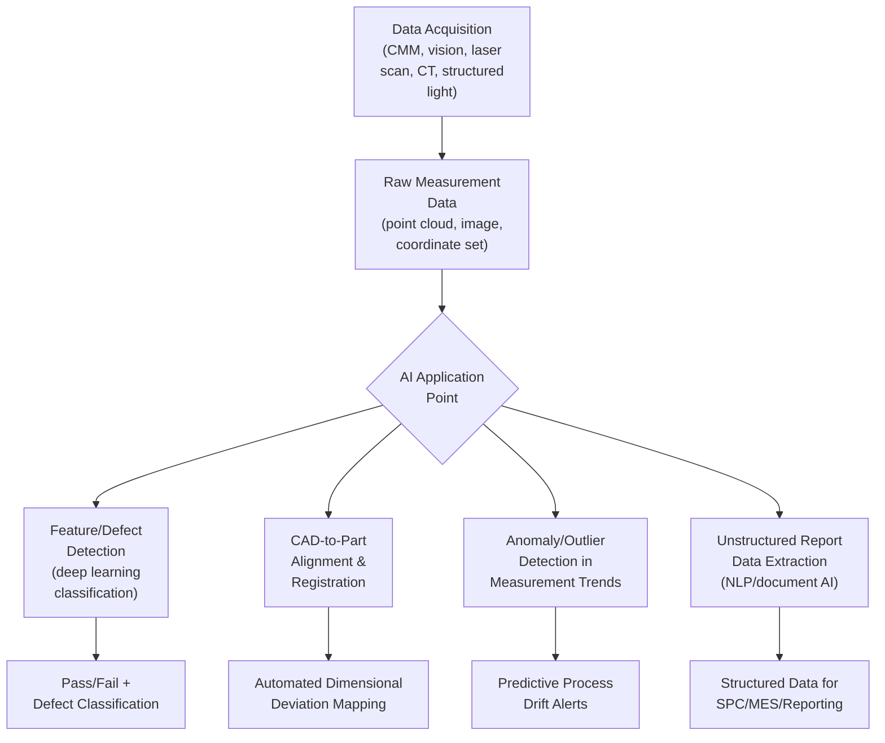
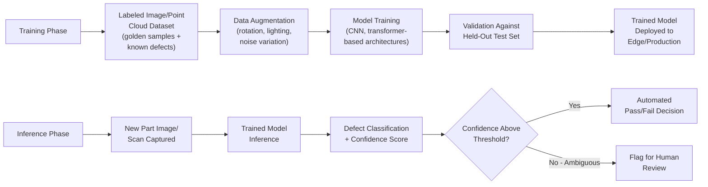

## Artificial Intelligence in Dimensional Inspection

### Definition and Purpose

Artificial intelligence (AI) in dimensional inspection refers to the application of machine learning — particularly deep learning — techniques to the acquisition, interpretation, and analysis of measurement data for verifying part geometry against specification. This spans defect detection in captured images or point clouds, automated feature extraction from CAD-to-part comparisons, predictive analytics on measurement trends, and increasingly, natural-language and generative AI interfaces for processing unstructured metrology reports. AI augments rather than replaces traditional metrology principles (traceability, uncertainty, calibration) — it primarily changes how measurement data is processed, classified, and acted upon at scale and speed beyond practical manual capability.

### Where AI Fits in the Dimensional Inspection Workflow

### Core AI Application Categories

**Deep Learning for Visual Defect Detection**

Convolutional neural networks (CNNs) and related architectures are trained on labeled image datasets to classify surface and dimensional defects (scratches, dents, porosity, warping, flash) that are difficult to define through fixed rule-based image processing due to high visual variability. A data-centric approach — improving the quality, diversity, and labeling accuracy of training data — is frequently emphasized as more impactful to inspection accuracy than model architecture selection alone, since deep learning defect classifiers are highly sensitive to the representativeness of their training set relative to real production variation.

**3D Point Cloud and Surface Defect Quantification**

Beyond simple pass/fail classification, more advanced deep learning pipelines are being developed and metrologically validated for in-line detection and dimensional quantification of three-dimensional surface defects — for example, recent published research (2026) describes a metrologically validated deep learning pipeline for in-line detection and dimensional quantification of 3D surface defects in die-casting applications, combining defect detection with actual measurement of defect geometry (depth, area, volume) rather than binary classification alone. This reflects a broader research direction combining defect detection, deep learning, dimensional measurement, and metrological validation specifically for die-casting surface defects. [euramet](https://www.euramet.org/repository/research-publications-repository-link/publication/cataluccis2026)

**Vision-Guided Robotic Metrology and Autonomous Inspection**

AI-driven systems increasingly combine deep learning-based 2D/3D imaging with intelligent robotic path planning, enabling inspection programs to be generated directly from CAD models or digital twins rather than manually taught point-by-point. Industry demonstrations at trade events in 2026 have showcased systems combining automated lighting, deep learning 2D and 3D imaging, and intelligent robotic planning to move inspection from simple data collection toward autonomous, real-time decision-making on the factory floor. A stated goal of such systems is reducing false rejects that commonly affect traditional fixed-program automation by adapting inspection to natural part-to-part variation. [raceenginetechnology](https://www.raceenginetechnology.com/News/mach-2026)[raceenginetechnology](https://www.raceenginetechnology.com/News/mach-2026)

**AI-Assisted CMM Software and Data Management**

Established metrology software platforms have incorporated AI capabilities into core CMM inspection software. For example, InnovMetric's PolyWorks 2026 release introduced a cloud-based SaaS data management solution alongside an AI assistant designed to provide technical support, intended to help metrology engineers and quality control managers standardize dimensional inspection processes and enable multisite collaboration among metrology teams and external suppliers. [mmsonline](https://www.mmsonline.com/products/innovmetric-software-features-cloud-technology-ai-capabilities-for-metrology)

**Unstructured Metrology Document Processing (Generative AI / NLP)**

A distinct and rapidly growing application addresses the analytical bottleneck created by the sheer volume of unstructured metrology output — CMM PDF reports, 2D scan files, and spreadsheets that traditionally require manual extraction of dimensions, tolerances, and deviations. Industry analysis characterizes this as a significant operational bottleneck in 2026, with engineers spending substantial time manually extracting data from routine CMM reports, and no-code generative AI tools emerging specifically to automate extraction and visualization of this unstructured measurement data. This category represents an AI application layered on top of, rather than replacing, the underlying measurement instrumentation. [energent](https://www.energent.ai/use-cases/en/compare/ai-solution-for-cmm)

[Unverified] Specific vendor performance claims (such as stated accuracy percentages or time-savings figures for particular commercial AI-for-CMM tools) originate from vendor marketing material rather than independently verified benchmark studies; such figures should be treated as vendor-reported claims requiring independent validation before being used as a basis for purchasing or process decisions.

### Technical Architecture — Deep Learning Defect Classification Pipeline

### Metrological Validation of AI-Based Measurement

A critical distinction for practitioners is that AI defect *classification* (is there a defect, and what type) is a different problem than AI-assisted *dimensional measurement* (what is the size/depth/deviation of the defect or feature), and the latter requires formal metrological validation before results can be relied upon for conformance decisions. Recent published research explicitly addresses this gap, applying formal metrological validation methodology to deep learning-based dimensional measurement pipelines rather than treating deep learning output as inherently trustworthy measurement data.

Metrological validation of an AI-based dimensional measurement system typically requires:

- **Traceability establishment:** Correlating AI-derived dimensional outputs against a certified reference measurement method (e.g., reference CMM, calibrated artifact)
- **Uncertainty quantification:** Determining measurement uncertainty for AI-derived dimensional values, which is methodologically more complex than for traditional deterministic measurement algorithms since neural network outputs do not have the same well-characterized error propagation behavior as classical geometric fitting algorithms
- **Repeatability and reproducibility studies:** Applying MSA/Gage R&R-equivalent studies to the AI system's output, accounting for training data variation, model version changes, and environmental/input variation
- **Bias characterization across the measurement range:** Verifying the model does not systematically over- or under-estimate dimensional values at different magnitudes or geometries within its operating range

[Inference] Formal, universally standardized methodologies for AI/deep-learning measurement system uncertainty quantification are still an active area of metrology research rather than a single settled normative framework; practitioners implementing such systems in regulated or safety-critical contexts should consult current published metrological validation literature and their applicable quality system's measurement uncertainty procedures rather than assume a single accepted method exists industry-wide.

### AI Application Comparison Table

| Application | Primary AI Technique | Maturity/Adoption Signal | Key Validation Requirement |
| --- | --- | --- | --- |
| 2D surface defect classification | CNN-based image classification | Well-established, widely deployed | Correlation study vs. reference inspection method |
| 3D defect dimensional quantification | Deep learning + point cloud analysis | Active research/emerging (2026 published validation studies) | Formal metrological validation, traceable uncertainty |
| Vision-guided autonomous robotic inspection | Deep learning + robotic path planning | Emerging commercial deployment | False reject/accept rate characterization |
| CMM software AI assistants | LLM-based support/automation | Commercially available in current release cycles | N/A (support function, not measurement itself) |
| Unstructured report data extraction | NLP/document AI, generative AI | Rapidly growing commercial category | Data extraction accuracy verification against source documents |
| Predictive process drift/anomaly detection | Statistical ML on measurement trends | Established SPC extension, growing sophistication | Correlation with true process capability shifts |

### Example: Die-Casting Surface Defect Pipeline

**Example**

A die-casting manufacturer implements an inline deep learning system for detecting and quantifying surface defects (porosity, cold shuts, flash) on cast aluminum components.

1. **Data collection:** A structured-light or laser scanning system captures the full surface profile of each cast part immediately after ejection from the die.
2. **Model inference:** A trained deep learning model, developed using a labeled dataset of known defect types and severities, analyzes the captured 3D surface data to both detect defect presence and quantify defect dimensions (depth, area).
3. **Metrological cross-check:** As part of the system's validation regime, a sample of AI-flagged defects is periodically cross-verified against a reference measurement method (e.g., a calibrated CMM or reference optical profilometer) to confirm the AI-derived dimensional values remain within an established, documented uncertainty bound.
4. **Disposition:** Parts with defects exceeding specification thresholds are automatically rejected; parts with defects near the threshold (low-confidence classifications) are flagged for manual secondary inspection rather than being autonomously dispositioned.
5. **Continuous improvement:** Newly confirmed defect instances (including manually reviewed edge cases) are added to the training dataset in periodic model retraining cycles, with each retrained model version subject to re-validation before production deployment.

### Advantages of AI-Enabled Dimensional Inspection

- Handles defect types with high visual/geometric variability that are difficult to capture in fixed rule-based inspection logic
- Enables autonomous, real-time inspection decision-making at production line speed, reducing dependence on manual review for routine classification
- Reduces false-reject rates relative to rigid rule-based automation by adapting to natural part-to-part variation, when properly trained and validated
- Automates extraction and structuring of previously unstructured or manually-processed measurement report data, reducing transcription burden on metrology engineers
- Supports predictive/preventive quality strategies by identifying subtle trend patterns in measurement data that may precede a shift to nonconformance

### Limitations and Implementation Challenges

- **Training data dependency:** Model performance is fundamentally bounded by training dataset quality, diversity, and representativeness of real production variation; rare or novel defect modes not represented in training data may be missed or misclassified
- **Explainability/traceability:** Deep learning models are comparatively opaque relative to classical geometric measurement algorithms, complicating root-cause traceability of a specific measurement decision — a consideration of particular importance in regulated industries requiring audit-traceable inspection decisions
- **Uncertainty quantification complexity:** As noted above, characterizing measurement uncertainty for AI-derived dimensional outputs is methodologically less mature than for traditional deterministic measurement algorithms
- **Model drift over time:** Changes in production conditions (new material lots, tooling wear patterns, lighting/environmental shifts) can degrade model performance over time, requiring ongoing monitoring and periodic retraining/revalidation
- **Vendor claim verification:** As with any emerging commercial technology category, marketed performance figures should be independently verified rather than accepted at face value before informing procurement or process-reliance decisions

### Common Pitfalls in Implementation

- Deploying AI-based defect classification for conformance decisions without a formal metrological validation program establishing traceability and uncertainty
- Treating AI classification confidence scores as equivalent to measurement uncertainty, which are conceptually distinct statistical constructs
- Insufficient or non-representative training data leading to poor generalization and undetected escape of novel defect types
- Failing to establish a periodic revalidation and retraining cadence, allowing model performance to silently degrade (model drift) as production conditions evolve
- Over-relying on vendor-reported accuracy claims without independent correlation studies against a reference measurement method

### Related Topics

- Inline and Automated Inspection Systems
- Machine Vision Fundamentals and Deep Learning Defect Classification
- Metrological Validation and Measurement Uncertainty (GUM Framework)
- Measurement Systems Analysis (Gage R&R) for Automated/AI Systems
- Industrial Computed Tomography (CT) for Internal Feature Measurement
- Digital Twin and CAD-Based Inspection Programming
- Closed Loop Quality Feedback to Production
- Point Cloud Processing and 3D Surface Reconstruction
- Statistical Process Control (SPC) and Predictive Analytics
- Data-Centric AI Development Practices in Manufacturing