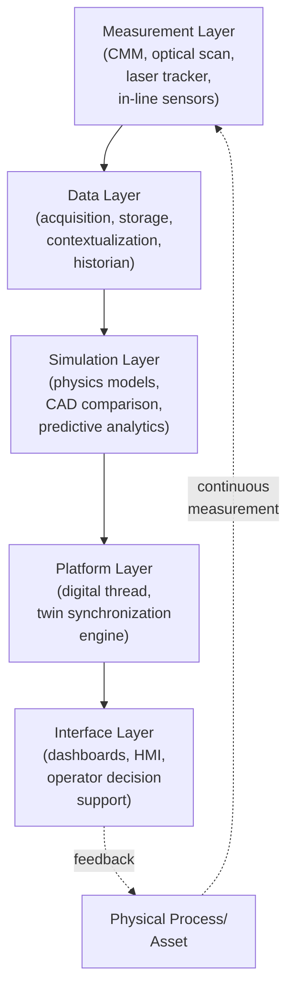
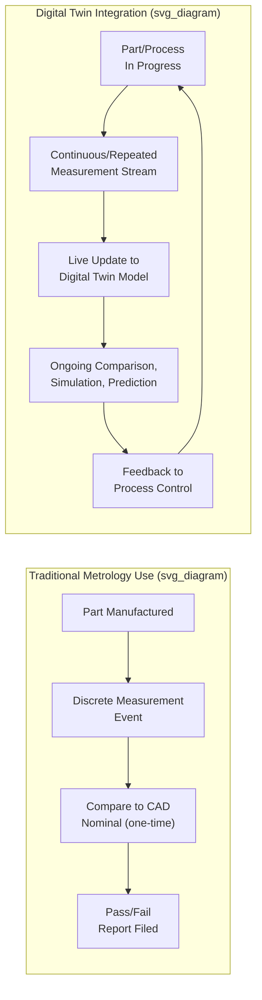
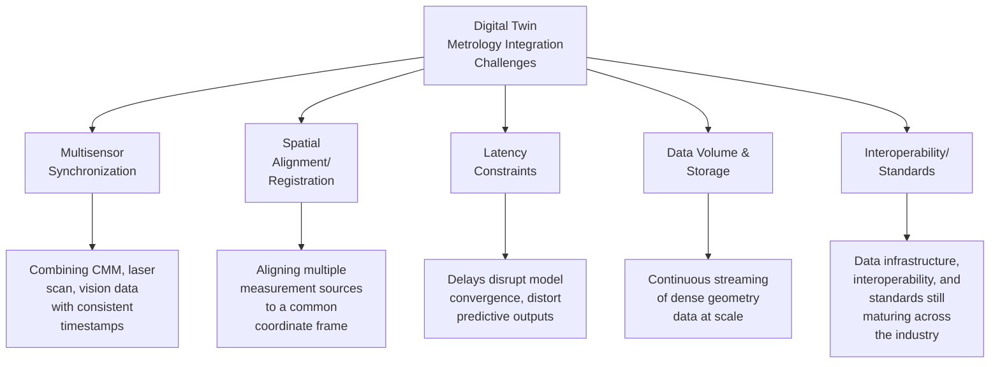

## Digital Twin Integration with Metrology Data

### Definition and Purpose

A digital twin is a virtual representation of a physical asset, process, or system that remains synchronized with its physical counterpart through continuous data exchange, enabling simulation, monitoring, and decision-support that reflects actual real-world conditions rather than static design intent alone. Digital twin integration with metrology data refers specifically to the practice of feeding measurement data — from CMMs, optical scanners, laser trackers, in-line sensors, and other dimensional inspection sources — into a digital twin so that the virtual model reflects the *as-built* or *as-measured* condition of a part, assembly, or process, rather than only the *as-designed* (nominal CAD) condition. This transforms metrology from a discrete, point-in-time verification activity into a continuous data stream that actively drives simulation accuracy, predictive analytics, and closed-loop process control.

### Conceptual Architecture — Metrology's Role in the Digital Twin Stack

Manufacturing digital twins are generally understood to require five interacting layers: measurement, data, simulation, platform, and interface — with metrology occupying the foundational measurement layer that supplies the ground-truth data anchoring the entire virtual model to physical reality.

Without a reliable, continuously updated measurement layer, a digital twin degrades into a static reference model reflecting only design intent — the metrology data stream is what allows the twin to function as what industry commentary describes as an "active decision engine grounded in measurable reality" rather than a retrospective analysis tool.

### From Static CAD Comparison to Continuous Twin Synchronization

The distinction is not merely technical — it reflects a shift in the purpose of the measurement itself. Traditional metrology answers "does this part conform?" as a discrete question; digital twin-integrated metrology continuously answers "what is the current true state of this part/process, and how does that inform the next decision?"

### Core Application Areas

**As-Built to As-Designed Comparison and Feedback**

A primary application, particularly emphasized in aerospace manufacturing, uses metrology data captured during quality control to build a digital twin that enables direct comparison of a manufactured part against the original CAD model, creating a feedback loop intended to make each subsequent part incrementally better and simplify tolerance conformance assessment. This reuses metrology equipment and data already collected for quality control purposes, extracting additional value from existing inspection investment.

**High-Speed Optical Metrology as the Data Acquisition Layer**

3D optical metrology enables real-time, data-driven system models that mirror physical assets as conditions change, with these models depending on continuous, high-quality measurement streams to maintain alignment between virtual and physical states across production and life-cycle stages. High-speed optical systems supply dense geometry and temporal accuracy at scale, capturing fast-changing geometries and transient effects to keep digital twins synchronized under real operating conditions — a capability particularly relevant where process dynamics change faster than traditional discrete-point measurement cycles can capture.

**Virtual Metrology**

In highly controlled, high-volume manufacturing environments (notably semiconductor and MEMS fabrication), **virtual metrology** uses equipment process data (rather than, or in addition to, direct physical measurement) combined with modeling to predict measurement outcomes — for example, predicting a film thickness or critical dimension from process parameters without requiring a dedicated physical measurement step for every unit. This is closely tied to digital twin concepts, with current research exploring automated critical-dimension extraction, virtual metrology using equipment data, and integration of AI methods including agentic approaches for iterative process and design optimization.

**Digital Twin-Driven Robotic Metrology**

Current research direction addresses a recognized gap in robotic/automated metrology: existing robotic metrology methods have relied heavily on simulation and CAD data alone, with real-time and historical metrology data rarely used — illustrating a lack of convergence between the physical metrology process and virtual data. Proposed frameworks aim to establish a real-time connection between the physical metrology process and virtual/digital twin data, integrating metrology control information to minimize setup time, optimize the metrology process, reduce scrap rates, and support operator decision-making through consolidated presentation via human-machine interfaces enabling real-time simulation and control.

**Process Parameter Optimization via Digital Twin**

Digital twins can automate optimization of measurement acquisition parameters themselves — for example, in structured-light metrology systems, digital twins can automate selection of optimal exposure time for repeated scanning, reducing the need for manual intervention while improving reconstruction accuracy. This represents digital twin logic applied recursively to the measurement process itself, not only to the manufactured part.

### Data Integration Challenges

Multisensor synchronization and spatial alignment present significant challenges as digital twins scale across complex factory environments, since different measurement sources (CMM probes, laser trackers, optical scanners) must be reconciled into a single coherent, time- and space-aligned representation. Latency constraints become critical in high-speed production environments where decisions depend on immediate feedback — even minor delays can disrupt model convergence and distort predictive outputs, meaning lower latency and consistent data delivery directly improve prediction accuracy by preserving alignment between the simulation and actual physical behavior.

### Example: Aerospace Digital Twin Feedback Loop

**Example**

An aerospace manufacturer uses laser tracker and structured-light scanning data, originally collected for standard quality control dimensional verification of a machined structural component, to populate a digital twin of the part.

1. **Measurement capture:** As part of normal final inspection, the manufactured part is fully scanned, capturing dense surface geometry data rather than only discrete critical-dimension checkpoints.
2. **CAD comparison and deviation mapping:** The captured as-built geometry is compared against the nominal CAD model within the digital twin platform, generating a full-surface deviation map rather than a simple pass/fail report at isolated points.
3. **Twin population:** This as-built deviation data becomes part of the part's digital twin record, associated with its unique serial number, alongside process parameters recorded during its manufacture.
4. **Trend analysis across the digital twin fleet:** As successive parts are measured and their twins populated, systematic deviation patterns (e.g., a consistent warping tendency in a specific region) become visible across the population in a way that isolated pass/fail records would not reveal.
5. **Process feedback:** Identified systematic deviation patterns inform adjustments to upstream process parameters (fixturing, machining sequence, or heat treatment cycle), intended to make the next manufactured part incrementally closer to nominal — closing the loop between quality data and design/process refinement.
6. **Lifecycle extension:** The same digital twin record can subsequently be referenced during in-service inspection or maintenance, providing a traceable as-built baseline against which future wear or damage assessments can be compared.

### Integration with Broader Smart Manufacturing Infrastructure

Digital twin-metrology integration typically interfaces with:

- **Manufacturing Execution Systems (MES):** Supplying process context (machine parameters, operator, timestamp) that must be time-aligned with measurement data for meaningful twin synchronization
- **Digital thread frameworks:** Maintaining a continuous, traceable data linkage from design through manufacturing to measurement and in-service data, of which metrology data forms one critical strand; current metrology software platforms have introduced digital thread-based inspection lab capabilities intended to support this continuity
- **Cloud-based SaaS metrology data management:** Enabling multisite collaboration among metrology teams and external suppliers by centralizing measurement data accessible to distributed digital twin consumers rather than siloed within individual local software installations
- **AI/machine learning layers:** Increasingly combined with digital twin frameworks for predictive analytics, automated feature extraction, and — in emerging research contexts — agentic AI approaches for iterative process and design optimization

### Value Proposition Summary

| Capability | Traditional Metrology | Digital Twin-Integrated Metrology |
| --- | --- | --- |
| Comparison basis | Static nominal CAD, single snapshot | Continuously updated as-built model |
| Temporal scope | Point-in-time pass/fail | Ongoing trend, lifecycle tracking |
| Feedback loop | Manual, delayed (engineering review cycle) | Faster/near-automated process adjustment |
| Data reuse | Single-purpose (QC record) | Multi-purpose (QC, simulation, lifecycle, predictive maintenance) |
| Cross-part visibility | Individual part results | Population-level pattern detection across twin fleet |

### Limitations and Open Challenges

- **Standards and interoperability maturity:** Data infrastructure, interoperability, and standards for digital twin-metrology integration are actively being shaped by industry and research communities rather than fully settled, particularly in specialized domains like semiconductor/MEMS manufacturing
- **Uncertainty propagation into simulation:** Measurement uncertainty from the metrology layer propagates into the digital twin's simulation and predictive outputs; inadequately characterized measurement uncertainty can undermine confidence in twin-driven decisions
- **Infrastructure and integration cost:** Achieving true real-time, multisensor, spatially-aligned twin synchronization requires substantial data infrastructure investment beyond simply acquiring measurement hardware
- **Vendor landscape fragmentation:** The digital twin manufacturing vendor landscape spans companies specializing in different layers (measurement, data, simulation, platform, interface), meaning most manufacturers arrive with some layers already covered and must identify which specific layer gap a given vendor or integration effort needs to fill, rather than expecting a single end-to-end solution

[Inference] The specific competitive landscape and capability rankings of digital twin vendors for manufacturing are subject to ongoing market evolution and vary by source methodology; such rankings should be treated as a general orientation to the vendor landscape rather than a definitive or exhaustive evaluation, and current vendor capabilities should be verified directly for any procurement decision.

### Common Pitfalls in Implementation

- Treating a one-time CAD-to-part comparison as a "digital twin" without establishing the continuous data synchronization that distinguishes a true twin from a static comparison report
- Underestimating multisensor synchronization and spatial alignment complexity when combining data from multiple measurement modalities into a single coherent twin
- Neglecting measurement uncertainty characterization, allowing unquantified measurement error to silently degrade twin-driven simulation and prediction reliability
- Latency oversights in high-speed production contexts, where delayed data delivery undermines the real-time feedback loops that justify the digital twin investment
- Pursuing digital twin integration without first securing the underlying data infrastructure and interoperability groundwork, resulting in fragmented, non-scalable point solutions

### Related Topics

- Inline and Automated Inspection Systems
- Closed Loop Quality Feedback to Production
- Artificial Intelligence in Dimensional Inspection
- Virtual Metrology in Semiconductor Manufacturing
- Digital Thread Concepts in Manufacturing
- Point Cloud Processing and CAD-to-Part Comparison
- Measurement Uncertainty Propagation (GUM Framework)
- Laser Tracker and Structured-Light Scanning Fundamentals
- Industrial Data Interoperability Standards (OPC-UA, Digital Twin Consortium Frameworks)
- Predictive Maintenance Using As-Built Metrology Data