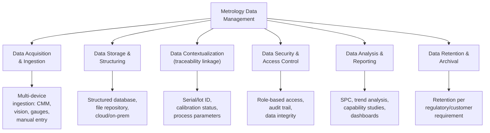
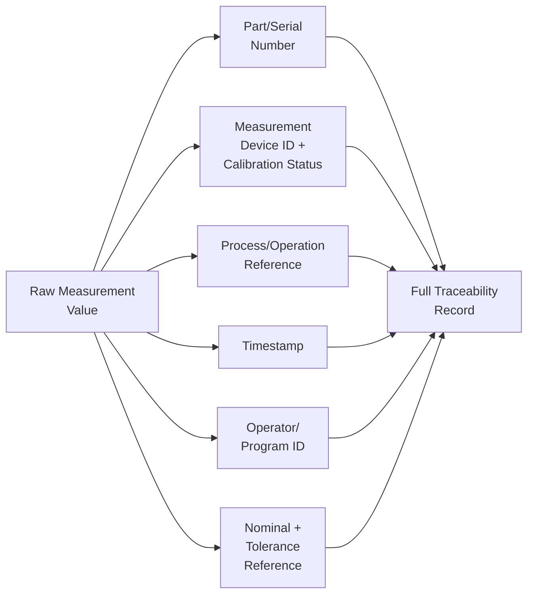
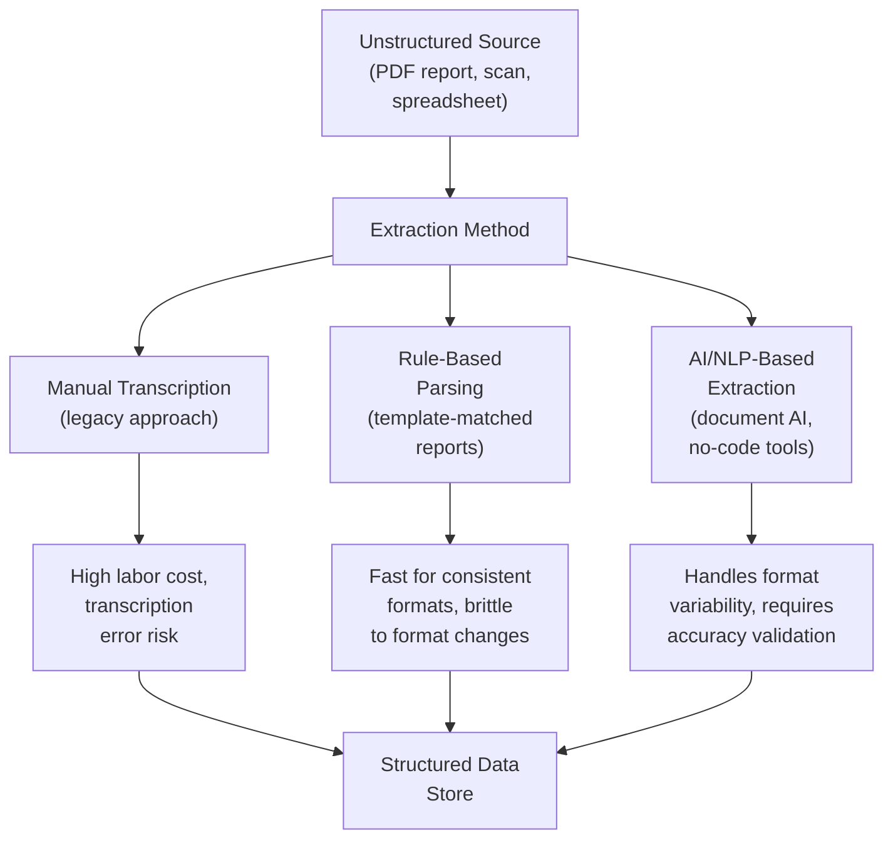

## Metrology Data Management

### Definition and Purpose

Metrology data management encompasses the systems, processes, and governance practices used to capture, store, contextualize, secure, analyze, and make accessible measurement data generated across an organization's inspection and quality control activities. As measurement sources proliferate — CMMs, optical scanners, laser trackers, in-line sensors, hand gauges — and inspection volume grows, the discipline shifts from simply "recording results" to actively managing measurement data as a durable, traceable, and analyzable organizational asset. Effective metrology data management underpins traceability (linking measurement results to specific parts, processes, and calibration status), statistical process control, regulatory compliance, and increasingly, digital twin and AI-driven analytics initiatives.

### Core Functions of a Metrology Data Management System

### Data Sources and Heterogeneity Challenge

A defining characteristic of modern metrology data management is the diversity of source systems that must be reconciled:

| Source Type | Data Format Characteristics | Typical Challenge |
| --- | --- | --- |
| CMM software (touch-probe) | Structured coordinate data, PDF/proprietary reports | Vendor-specific formats, limited interoperability |
| Optical/laser scanners | Dense point cloud data (large file sizes) | Storage volume, processing overhead |
| Vision inspection systems | Image data + extracted measurements | Image archival vs. extracted-value-only decisions |
| Hand gauges (calipers, micrometers) | Manual entry or simple digital output | Transcription error risk, data entry burden |
| In-line/automated sensors | High-frequency streaming data | Volume management, real-time vs. batch processing |
| Legacy/paper records | Unstructured, scanned documents | Digitization and structured extraction burden |

A significant operational bottleneck widely recognized in the current environment is the sheer volume of unstructured metrology data generated during routine quality control — traditional CMM workflows in particular produce large numbers of complex PDF reports, 2D scans, and spreadsheets, with engineers historically spending substantial time manually extracting dimensions, tolerances, and deviations from this unstructured output before it can be aggregated or analyzed at scale.

### Data Model — Linking Measurement to Traceability Context

For metrology data to be useful beyond the immediate pass/fail decision, it must be structurally linked to sufficient context to answer downstream questions (which parts were affected by a given gauge's calibration drift, which process parameters correlate with a dimensional trend, etc.):

Without this contextual linkage, a measurement value is analytically inert — it cannot support impact assessment following a calibration failure, cannot feed meaningful SPC trending by process or machine, and cannot support the traceability requirements of standards such as ISO 9001, ISO 13485, IATF 16949, or AS9100.

### Storage Architecture Approaches

**Centralized Database/Repository**

Structured measurement data (dimensional values, pass/fail status, associated metadata) stored in a relational or purpose-built metrology database, enabling structured querying, SPC integration, and cross-process trend analysis. This is the foundation for most enterprise quality management software (eQMS) and dedicated metrology software platforms.

**Cloud-Based SaaS Data Management**

Increasingly, metrology software vendors offer cloud-based data management as a core capability rather than an add-on, intended to facilitate multisite collaboration among metrology teams as well as with external suppliers, alongside improved device compatibility supporting a broader range of measurement devices within a single unified data environment. This addresses a common limitation of on-premises, single-site metrology software deployments — namely, difficulty aggregating and comparing data across multiple facilities or supply chain partners.

**Digital Thread-Based Inspection Lab Frameworks**

Some current metrology platforms are structured around a digital thread framework specifically to create a connected "inspection lab" — linking measurement data continuously across the design-to-manufacture-to-inspection lifecycle rather than treating each inspection event as an isolated record, supporting the kind of continuous data linkage required for digital twin integration and lifecycle traceability.

**Hybrid/Federated Approaches**

Many organizations, particularly those with legacy equipment fleets, operate hybrid architectures where raw high-volume data (e.g., dense point clouds) remains at the edge or in device-specific storage, while extracted, structured summary data (dimensional results, pass/fail status) is centralized into an enterprise database — balancing storage cost against analytical accessibility.

### Data Extraction and Structuring from Unstructured Sources

A rapidly growing category of tooling addresses the specific problem of converting unstructured metrology outputs (PDF inspection reports, scanned documents, proprietary CMM report formats) into structured, analyzable data:

No-code, AI-driven data extraction tools have emerged specifically targeting this bottleneck, aiming to eliminate the analytical friction of manual data extraction by converting unstructured CMM reports and related documents into structured, visualizable data with claimed efficiency and accuracy improvements. As with any vendor-reported performance claim in an emerging tooling category, such figures should be independently verified against an organization's own document formats and accuracy requirements before being relied upon for quality decisions.

### Data Governance and Integrity Requirements

Metrology data, particularly where it supports regulatory compliance or contractual conformance claims, is subject to data integrity expectations commonly summarized by frameworks such as **ALCOA+** (Attributable, Legible, Contemporaneous, Original, Accurate, plus Complete, Consistent, Enduring, Available):

- **Attributable:** Data is traceable to the specific device, operator/program, and time of capture
- **Legible/Original:** Raw data is preserved in its original or a faithful, auditable representation, not only a derived summary
- **Contemporaneous:** Data is captured and recorded at the time of measurement, not reconstructed later
- **Accurate:** Data reflects a properly calibrated, validated measurement process
- **Complete:** All relevant measurement data, including out-of-tolerance and rejected results, is retained rather than selectively recorded
- **Consistent:** Data formats and units are standardized to support cross-system aggregation and comparison
- **Enduring/Available:** Data is retained per applicable regulatory/customer retention requirements and remains accessible/retrievable throughout that period

[Inference] Formal ALCOA+ terminology originates predominantly from pharmaceutical/life sciences data integrity guidance; while the underlying principles are broadly applicable and increasingly referenced across regulated manufacturing sectors, the specific framework name and its detailed regulatory application should be confirmed against the applicable industry's own governing data integrity expectations (e.g., FDA, EU MDR, aerospace customer-specific requirements) rather than assumed to be a universal cross-industry mandate.

### Data Retention Requirements by Standard

| Standard/Context | Typical Retention Expectation |
| --- | --- |
| ISO 9001:2015 | Records retained per organization's own documented retention policy, consistent with contractual/legal requirements |
| ISO 13485:2016 | Minimum of device's defined lifetime, or at least two years from release (whichever is longer), or per applicable regulation |
| AS9100D | Per customer/regulatory requirements; often extended for aerospace (e.g., life of the aircraft program) |
| IATF 16949 | Per customer-specific requirements (CSRs), often significantly extended relative to baseline ISO 9001 |

[Inference] Exact retention periods are governed by the specific applicable standard revision, customer contract terms, and jurisdictional regulation in force at the time; practitioners should verify current retention requirements against their specific certification scheme and customer contracts rather than rely on generalized figures.

### Access Control and Security Considerations

- **Role-based access control (RBAC):** Restricting who can view, edit, or approve measurement records based on organizational role (e.g., quality engineer, auditor, production operator)
- **Audit trail/change history:** Recording who made changes to measurement data or its associated metadata, when, and why, supporting both internal investigation and external audit requirements
- **Data integrity protection:** Preventing unauthorized alteration of raw measurement data after capture, often through write-once storage patterns or cryptographic verification for critical records
- **External/supplier access management:** Where multisite or supply-chain data sharing is enabled (e.g., cloud-based collaborative metrology platforms), access controls must extend appropriately to external parties without compromising internal data security or intellectual property

### Analysis and Reporting Capabilities Enabled by Structured Data

Once metrology data is properly structured and contextualized, it becomes the foundation for a range of downstream quality analytics:

- **Statistical Process Control (SPC):** Real-time or near-real-time control charting requires structured, time-stamped, process-linked measurement data streams
- **Process capability studies ($C_p$, $C_{pk}$):** Require sufficiently large, properly contextualized datasets segmented by process/machine/time period
- **Calibration impact assessment:** Rapidly identifying all parts measured by a specific gauge within a specific date range depends entirely on device-ID-linked measurement records
- **Supplier/customer quality trend reporting:** Aggregating measurement data across production runs, suppliers, or product lines for scorecard and trend reporting
- **Digital twin and AI model training:** Structured, well-contextualized historical measurement data is the essential input for both digital twin population and any predictive/AI model training built on measurement history

### Example: Data Management Workflow for a Calibration-Driven Impact Assessment

**Example**

A CMM used for final inspection of a family of precision components is found out-of-tolerance during scheduled calibration.

1. **Query by device ID:** The metrology data management system is queried for all measurement records associated with that specific CMM's device ID, filtered to the date range since its last known-good calibration.
2. **Cross-reference to part/serial records:** Because each measurement record is linked to a specific part serial number or lot ID (not just a device and timestamp), the affected population of parts can be precisely identified rather than requiring a broad, conservative quarantine of all production in the affected period.
3. **Retrieve original measurement values:** Because the system retains original, attributable measurement data (not only a summary pass/fail flag), engineering can re-evaluate whether specific parts remain within tolerance even accounting for the confirmed measurement error magnitude, rather than requiring full re-inspection of every affected part.
4. **Generate impact report:** A structured report is produced identifying affected part quantities, disposition status, and any already-shipped units requiring downstream notification — a task that would be prohibitively slow if performed by manually searching individual PDF inspection reports.
5. **Update retention/audit trail:** The investigation itself, and any resulting corrective action, is logged within the same governed data environment, preserving a complete, auditable record of the event.

This scenario illustrates why data management architecture — not just measurement device capability — directly determines an organization's practical ability to respond to a quality event with speed and precision.

### Common Pitfalls in Metrology Data Management

- Treating measurement data as disposable once a pass/fail decision is recorded, discarding underlying raw values needed for future impact assessment or trend analysis
- Allowing device-specific, siloed data formats to persist without a structured extraction/normalization strategy, creating an unstructured data backlog that becomes increasingly costly to resolve over time
- Insufficient contextual linkage (missing device ID, process reference, or serial number association) that prevents meaningful traceability or root-cause investigation later
- Inadequate access control and audit trail governance, undermining data integrity credibility during regulatory or customer audits
- Underestimating storage and infrastructure requirements for high-volume data sources (dense point clouds, high-frequency in-line sensor streams) leading to either excessive cost or premature data deletion
- Pursuing digital twin, AI, or advanced analytics initiatives without first establishing the underlying structured, governed data management foundation those initiatives depend on

### Related Topics

- Digital Twin Integration with Metrology Data
- Artificial Intelligence in Dimensional Inspection
- Statistical Process Control (SPC) and Control Charting
- Traceability Requirements Across ISO 9001/13485/IATF 16949/AS9100
- Calibration Program Management and Out-of-Tolerance Investigation
- Data Integrity Principles (ALCOA+)
- Cloud-Based Quality Management Software (eQMS)
- Digital Thread Concepts in Manufacturing
- Record Retention Policy Development
- Process Capability Analysis ($C_p$, $C_{pk}$)