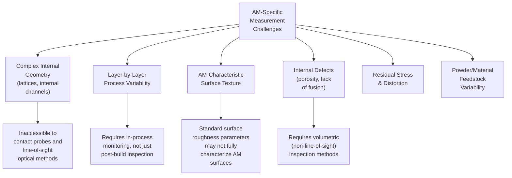
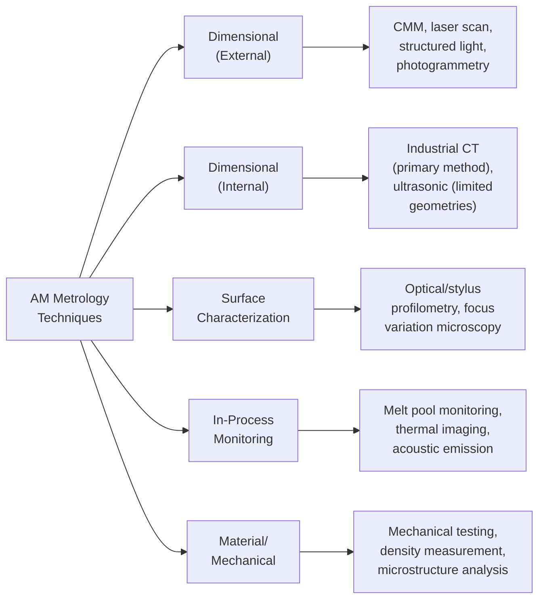
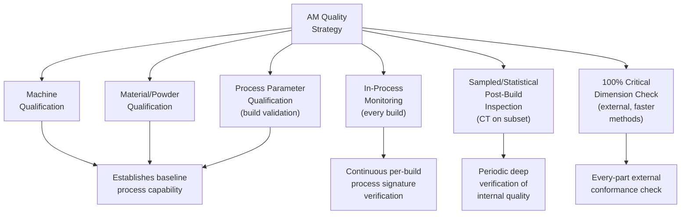

## Metrology for Additive Manufacturing

### Definition and Purpose

Metrology for additive manufacturing (AM) encompasses the specialized measurement techniques, quality control strategies, and standards required to verify dimensional accuracy, internal integrity, and material properties of parts produced through layer-by-layer fabrication processes (3D printing). AM introduces measurement challenges fundamentally different from those of conventional subtractive or formative manufacturing — complex internal geometries (lattices, conformal cooling channels) inaccessible to line-of-sight or contact methods, layer-by-layer process variability, unique surface texture characteristics arising from the build process itself, and process-inherent defect modes (porosity, incomplete fusion, residual stress) that have no direct analog in machined or cast parts.

### Why Additive Manufacturing Demands Distinct Metrology Approaches

### Measurement Techniques by Application

**External Dimensional Verification**

Conventional dimensional metrology methods — CMM, laser scanning, structured-light scanning, and photogrammetry — remain applicable for external geometry verification of AM parts, though part complexity (organic, freeform, topology-optimized shapes typical of AM design) often favors full-surface optical/laser scanning over discrete-point contact probing, since AM's design freedom frequently produces geometries without the flat reference datums that contact CMM programming traditionally relies upon.

**Internal Geometry and Defect Detection — Industrial Computed Tomography (CT)**

Industrial CT scanning is the primary metrology method capable of both verifying internal geometric features (internal lattice structures, conformal cooling channels, internal cavities) inaccessible to any contact or line-of-sight optical method, and simultaneously detecting internal defects (porosity, voids, lack-of-fusion regions, inclusions) that are common failure modes specific to powder-bed and directed-energy-deposition AM processes. CT's ability to capture both full 3D external and internal dimensional metrology from a single scan makes it disproportionately valuable for AM relative to conventional manufacturing, where internal features are comparatively rare.

**Surface Texture Characterization**

AM-produced surfaces — particularly as-built (non-post-processed) surfaces — exhibit characteristic texture arising from the layer-wise build process, partially melted/sintered powder particle adhesion, and staircase effects on angled/curved surfaces. Standard 2D roughness parameters (Ra, Rz) developed primarily for machined surfaces may not fully capture the areal (3D) and directionally-dependent nature of AM surface texture, motivating growing use of areal surface texture parameters (Sa, Sz, and related ISO 25178 areal parameters) for more complete characterization.

**In-Process Monitoring**

Because AM builds parts incrementally over potentially many hours, in-process monitoring techniques — melt pool monitoring (optical/thermal sensors tracking melt pool geometry and temperature during laser/electron beam fusion), thermal imaging of each layer, and acoustic emission monitoring — provide an opportunity to detect process anomalies (porosity-forming conditions, incomplete fusion, spatter) as they occur, layer by layer, rather than only discovering resulting defects after build completion via post-process CT scanning. This connects directly to the broader inline/automated inspection and closed-loop feedback concepts applied to a fundamentally different process architecture than conventional subtractive manufacturing.

### Comparison: AM Metrology vs. Conventional Manufacturing Metrology

| Aspect | Conventional (Machined/Cast) | Additive Manufacturing |
| --- | --- | --- |
| Internal feature inspection need | Rare (mostly solid or simple internal features) | Common and often design-critical (lattices, channels) |
| Primary internal inspection method | Ultrasonic, limited X-ray | Industrial CT (dominant method) |
| Surface texture origin | Tool marks, cast surface finish | Layer lines, partially-melted powder adhesion |
| Process monitoring opportunity | Limited (discrete operations) | Continuous, layer-by-layer (melt pool, thermal) |
| Geometric complexity typical of design | Constrained by tooling/machining access | Organic, topology-optimized, often unconstrained |
| Datum/fixturing for contact CMM | Generally straightforward (flat references) | Often difficult (freeform geometry, few flat datums) |

### Example: CT-Based Internal Lattice Verification Workflow

**Example**

A titanium AM bracket incorporates an internal lattice structure designed to reduce weight while maintaining structural stiffness, a geometry impossible to inspect via any contact or line-of-sight optical method.

1. **Scan setup:** The part is mounted in the CT system and scanned at a resolution sufficient to resolve the lattice strut dimensions (strut diameter, node geometry) against the design tolerance.
2. **Reconstruction:** Raw X-ray projection data is reconstructed into a 3D voxel dataset representing the full part volume, including internal lattice geometry and any internal defects.
3. **Segmentation and CAD comparison:** The reconstructed volume is segmented (distinguishing solid material from void/air) and registered against the nominal CAD model, generating a full-volume deviation map covering both external surfaces and internal lattice features simultaneously.
4. **Defect analysis:** The same reconstructed dataset is analyzed for porosity — voids within the solid lattice struts or surrounding shell — with defect size, location, and, where required by the applicable specification, proximity to critical stress regions evaluated against acceptance criteria.
5. **Dimensional reporting:** Strut diameters, node positions, and overall lattice density are extracted and compared against design intent, verifying the lattice was fabricated as designed rather than only confirming the external envelope geometry.
6. **Disposition:** Any detected porosity or dimensional deviation exceeding acceptance criteria is evaluated per the applicable nonconformance and disposition process (potentially involving fracture-critical assessment given AM's use in aerospace and safety-critical structural applications).

### Qualification and Standards Landscape

AM metrology and quality practices are supported by an evolving standards landscape, reflecting the technology's relative immaturity compared to conventional manufacturing:

- **ASTM/ISO joint AM standards (ISO/ASTM 52900 series):** Provide foundational terminology and general principles for additive manufacturing, including process categorization
- **ASTM F42 / ISO TC 261 committees:** Active standards development bodies specifically addressing AM process qualification, material properties, and test methods
- **ISO 25178 (areal surface texture):** Increasingly referenced for AM surface characterization given the limitations of traditional 2D roughness parameters for AM-characteristic textures
- **Industry/sector-specific AM qualification frameworks:** Aerospace (e.g., NADCAP AM accreditation activity) and medical device sectors have developed or are developing sector-specific AM process and part qualification requirements layered on top of general AM standards

[Inference] The AM standards landscape continues to evolve actively, with new and revised standards being published as the technology matures; practitioners should verify the current status and applicability of specific standards directly against the relevant standards body (ASTM, ISO) rather than relying on a fixed standards inventory, given the pace of change in this domain.

### Process Qualification vs. Part Inspection

A distinguishing feature of AM quality strategy relative to conventional manufacturing is heavier reliance on **process qualification** — establishing and locking a validated combination of machine, material, and parameter set through extensive testing (mechanical property characterization, defect population statistics) — because 100% internal inspection (e.g., CT scanning every production part) is often cost- and time-prohibitive at production volume, particularly for larger parts. This creates a layered quality strategy:

This layered approach — combining upfront process qualification, continuous in-process monitoring, statistically sampled destructive/CT verification, and full external dimensional checks — allows organizations to manage AM's internal defect risk without requiring prohibitively expensive 100% CT inspection of every produced part, while still maintaining traceable confidence in overall population quality.

### Powder and Feedstock Metrology

For powder-bed fusion processes specifically, feedstock material characterization is itself a metrology discipline supporting downstream part quality:

- **Particle size distribution (PSD):** Measured via laser diffraction or similar methods, directly affecting powder bed density and melt behavior
- **Powder morphology:** Sphericity and surface characteristics affecting flowability, measured via optical/SEM imaging analysis
- **Chemical composition verification:** Ensuring feedstock composition remains within specification, particularly important given powder reuse practices common in production AM operations
- **Flowability testing:** Assessing powder spreading behavior critical to consistent, defect-free layer deposition

### Common Pitfalls in AM Metrology Implementation

- Applying conventional 2D surface roughness parameters (Ra alone) to AM surfaces without considering areal (3D) characterization, potentially missing texture characteristics relevant to fatigue performance or functional fit
- Relying solely on external dimensional verification (CMM/scan) without internal inspection (CT) for parts containing internal lattice or channel features, missing internal defects entirely invisible to external-only methods
- Underestimating CT scan time and cost requirements at production volume, leading to inadequate sampling strategy or an unsustainable 100%-inspection commitment
- Insufficient process qualification rigor, relying on post-build inspection alone to catch defects rather than building statistical confidence in the underlying process's defect rate
- Neglecting powder/feedstock metrology, allowing feedstock degradation (through reuse cycles) to silently affect part quality despite adequate part-level inspection
- Treating AM standards as a fixed, settled framework rather than an actively evolving landscape requiring periodic reconfirmation of current applicable requirements

### Related Topics

- Industrial Computed Tomography (CT) for Dimensional Metrology
- ISO 25178 Areal Surface Texture Parameters
- Inline and Automated Inspection Systems
- Closed Loop Quality Feedback to Production
- Process Qualification and Validation (IQ/OQ/PQ Concepts Applied to AM)
- Powder Characterization Methods (Particle Size, Morphology, Flowability)
- Non-Destructive Testing (NDT) Methods Overview
- ISO/ASTM 52900 Series — Additive Manufacturing Terminology and Principles
- Melt Pool Monitoring and In-Process AM Sensing
- Fracture-Critical Part Qualification in Aerospace AM