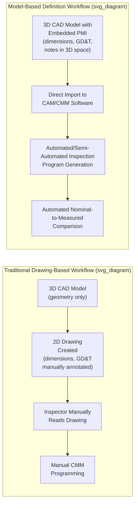
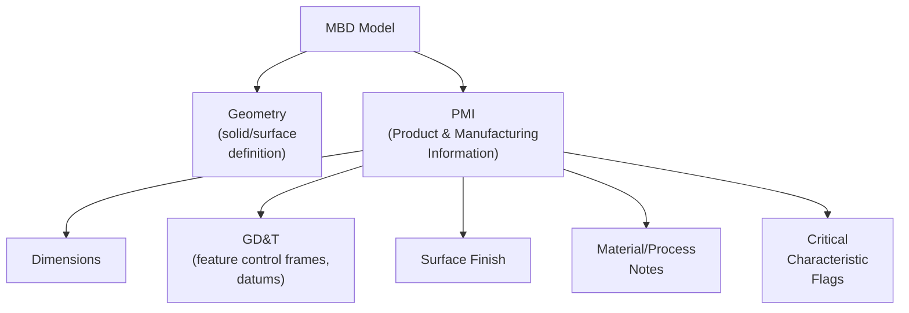
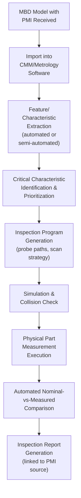

## CAD-Based Inspection and Model-Based Definition

### Definition and Purpose

**Model-Based Definition (MBD)** is a practice in which the 3D CAD model itself — annotated with dimensions, tolerances (GD&T), and manufacturing/inspection notes directly within the 3D environment — serves as the single authoritative source of product definition, replacing or supplementing traditional 2D engineering drawings. **CAD-based inspection** refers to the metrology practice of using this 3D model (rather than, or in addition to, a 2D drawing) as the direct reference for programming, executing, and evaluating dimensional measurement, enabling automated comparison between measured data and nominal geometry without manual re-entry of dimensional callouts. Together, these practices form the foundation of the modern **digital thread** connecting design intent directly to inspection execution and results, reducing transcription error and enabling substantially greater inspection automation than drawing-based workflows.

### From 2D Drawings to Model-Based Definition

The core distinction is the elimination of the manual re-interpretation step between design intent and inspection execution. In a traditional workflow, dimensional and tolerance information is authored once in 3D CAD, manually re-expressed on a 2D drawing, and then manually re-interpreted again by an inspector or CMM programmer — each transcription step introducing opportunity for error or ambiguity. MBD closes this gap by carrying dimensional and tolerance information as structured, machine-readable data directly within the 3D model.

### Product and Manufacturing Information (PMI)

The dimensional, tolerance, and manufacturing annotation data embedded within an MBD model is collectively referred to as **Product and Manufacturing Information (PMI)**. PMI typically includes:

- **Dimensions:** Linear, angular, and radial dimensions associated with specific 3D geometric features
- **Geometric Dimensioning and Tolerancing (GD&T):** Feature control frames, datums, and datum reference frames expressed per ASME Y14.5 or ISO 1101 conventions, attached directly to relevant 3D features
- **Surface finish requirements:** Surface texture callouts associated with specific faces
- **Material and process notes:** Material specification, heat treatment, coating requirements
- **Inspection notes:** Critical characteristic flags, sampling requirements, or specific inspection method callouts

### Governing Standards

| Standard | Scope |
| --- | --- |
| **ASME Y14.41** | Digital Product Definition Data Practices — U.S. standard governing MBD practices, PMI representation, and 3D model annotation conventions |
| **ISO 16792** | Technical product documentation — Digital product definition data practices (ISO equivalent/aligned standard) |
| **ASME Y14.5 / ISO 1101** | Underlying GD&T symbology and interpretation rules referenced by the PMI itself, regardless of 2D or 3D representation |
| **QIF (Quality Information Framework)** | ANSI/DMSC standard for representing and exchanging quality/metrology data — including model-based characteristics, measurement plans, and results — in a standardized, vendor-neutral XML-based format |

### CAD-Based Inspection Programming Workflow

Modern metrology software (CMM programming environments, portable measurement software) can directly import MBD-native CAD formats (or neutral formats like STEP AP242, which specifically supports PMI transfer), automatically extracting dimensional and GD&T callouts as measurable characteristics rather than requiring a programmer to manually identify and re-enter each dimension from a drawing. This dramatically reduces inspection program development time and eliminates a significant source of transcription-based measurement error.

### STEP AP242 — The Interoperability Backbone

A critical enabler of cross-platform CAD-based inspection is **STEP AP242** (ISO 10303-242), a neutral CAD file format specifically extended to carry PMI data (unlike earlier STEP application protocols, which primarily transferred geometry alone). AP242 enables MBD models authored in one CAD system to be exchanged with metrology software from a different vendor while preserving the semantic PMI data (which dimensions apply to which features, complete GD&T feature control frame content) rather than only the visual/geometric representation — critical for supply chains where design and inspection occur on different software platforms.

[Inference] The degree of full semantic PMI fidelity achieved in practice during AP242 exchange between specific CAD and metrology software vendor pairs can vary based on each vendor's implementation completeness; practitioners should verify PMI translation fidelity for their specific software combination through validation testing rather than assuming universal, lossless interoperability across all vendor pairs.

### Automated Nominal-to-Measured Comparison

A central value proposition of CAD-based inspection is direct, automated comparison between measured data and the MBD model's nominal geometry and tolerance definitions:

- **Dimensional comparison:** Measured feature values (hole diameter, distance between features) are automatically compared against the PMI-defined nominal and tolerance, without manual lookup or re-entry
- **GD&T evaluation:** Measured datum features and controlled features are evaluated against the model's defined feature control frames, with software calculating actual geometric tolerance zone conformance (e.g., true position deviation) directly from measured point data
- **Full-surface deviation mapping:** For scanned (point cloud) data, the entire measured surface can be compared against the nominal CAD surface simultaneously, generating a color-coded deviation map showing conformance across the full part geometry rather than only at discrete pre-defined dimension callouts

### Example: MBD-Driven CMM Inspection of a Machined Housing

**Example**

An aerospace supplier receives an MBD-only model package (no accompanying 2D drawing) for a machined aluminum housing, per ASME Y14.41 practice.

1. **Model import:** The STEP AP242 file is imported into the CMM programming software, which automatically parses the embedded PMI, identifying dimensional callouts, GD&T feature control frames, and associated datum reference frames.
2. **Critical characteristic review:** The metrology engineer reviews automatically flagged critical/key characteristics (identified within the PMI itself, or cross-referenced against a separate characteristic accountability matrix) to prioritize inspection program coverage.
3. **Inspection program generation:** Using the automatically extracted feature list, the software generates a proposed CMM measurement routine — probe touch points, scan paths for surfaces requiring form evaluation — which the programmer reviews and refines rather than building from scratch.
4. **Program simulation:** Before physical execution, the generated program is simulated against the CAD model to verify probe access, collision avoidance, and appropriate approach vectors.
5. **Physical measurement:** The CMM executes the program on the physical part, capturing coordinate data for each programmed feature.
6. **Automated evaluation:** Measured results are automatically compared against the PMI-derived nominal and tolerance values, with GD&T characteristics (e.g., a true position callout on a bolt-hole pattern) evaluated using the actual datum reference frame defined in the model.
7. **Report generation:** An inspection report is generated showing each measured characteristic alongside its nominal, tolerance, actual value, and pass/fail status, traceable directly back to the specific PMI annotation in the source model — supporting both internal quality records and, where required, customer-facing First Article Inspection (FAI) documentation (e.g., AS9102 format).

### Benefits Relative to Drawing-Based Inspection

- **Reduced transcription error:** Eliminates the manual re-interpretation step between CAD-defined dimensions and inspection program dimensions, removing a documented common source of inspection discrepancy
- **Faster inspection program development:** Automated feature/PMI extraction substantially reduces manual programming time relative to reading dimensions off a 2D drawing one by one
- **Single source of truth:** Reduces risk of drawing-model mismatch (a known quality issue in traditional workflows where the 2D drawing and 3D model can drift out of sync after design changes if not rigorously configuration-controlled)
- **Improved traceability:** Direct linkage between specific measured results and the specific PMI annotation that generated the requirement supports clearer nonconformance root-cause investigation and audit traceability
- **Enables broader automation:** Serves as a foundational enabler for automated/inline inspection systems and digital twin integration, since automated systems require machine-readable nominal/tolerance data rather than human-readable drawings

### Implementation Challenges

- **Software interoperability maturity:** While STEP AP242 substantially improves cross-vendor PMI exchange, full semantic fidelity across all CAD and metrology software vendor combinations is not universally guaranteed and requires validation for specific vendor pairings
- **Organizational transition cost:** Moving from a mature 2D-drawing-based quality system (including established FAI, inspection, and customer approval processes built around drawings) to a fully model-based environment requires significant process, training, and (in regulated/contractual environments) customer/contract flow-down alignment
- **Legacy data and supply chain fragmentation:** Supply chains frequently include a mix of MBD-capable and drawing-dependent partners, requiring dual-format support (MBD models plus derived 2D drawings) during extended transition periods
- **Critical characteristic identification:** Automated PMI extraction identifies *what* is dimensioned, but appropriately flagging which characteristics are truly critical (safety, function, fit) for inspection prioritization still typically requires engineering judgment layered onto the automated extraction
- **Software/tool validation:** As with any automated measurement evaluation tool, software performing automated GD&T evaluation from measured data requires validation to confirm correct implementation of tolerancing calculation logic (per Clause 7.1.5.2/7.6-type software validation requirements common across quality management standards)

### Common Pitfalls in Implementation

- Treating MBD adoption as a purely CAD-authoring initiative without corresponding investment in inspection software capable of consuming and acting on the embedded PMI
- Assuming full PMI fidelity across all CAD-to-metrology software transfers without validating specific vendor pairings, risking silent loss or misinterpretation of GD&T data
- Maintaining an unofficial, uncontrolled 2D drawing "for reference" alongside an official MBD model, recreating the drawing-model mismatch risk MBD is intended to eliminate
- Relying entirely on automated feature extraction for critical characteristic identification without engineering review, potentially missing function-critical features not distinctly flagged within the PMI
- Insufficient software validation for automated GD&T evaluation logic, particularly for complex composite or compound tolerance conditions

### Related Topics

- ASME Y14.5 / ISO 1101 — Geometric Dimensioning and Tolerancing Fundamentals
- ASME Y14.41 / ISO 16792 — Digital Product Definition Data Practices
- STEP AP242 and CAD Data Interoperability
- Quality Information Framework (QIF) Standard
- First Article Inspection (FAI) and AS9102 Reporting
- Digital Thread Concepts in Manufacturing
- Inline and Automated Inspection Systems
- CMM Programming and Measurement Routine Development
- Critical Characteristic Identification and Control Plans
- Software Validation for Measurement and Monitoring Equipment