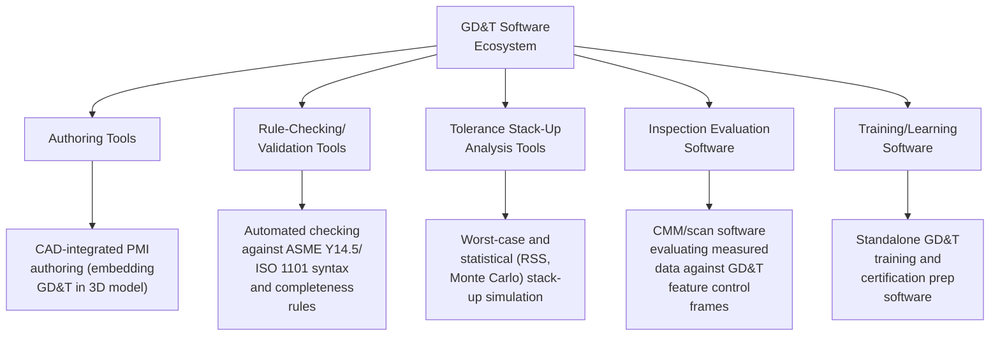
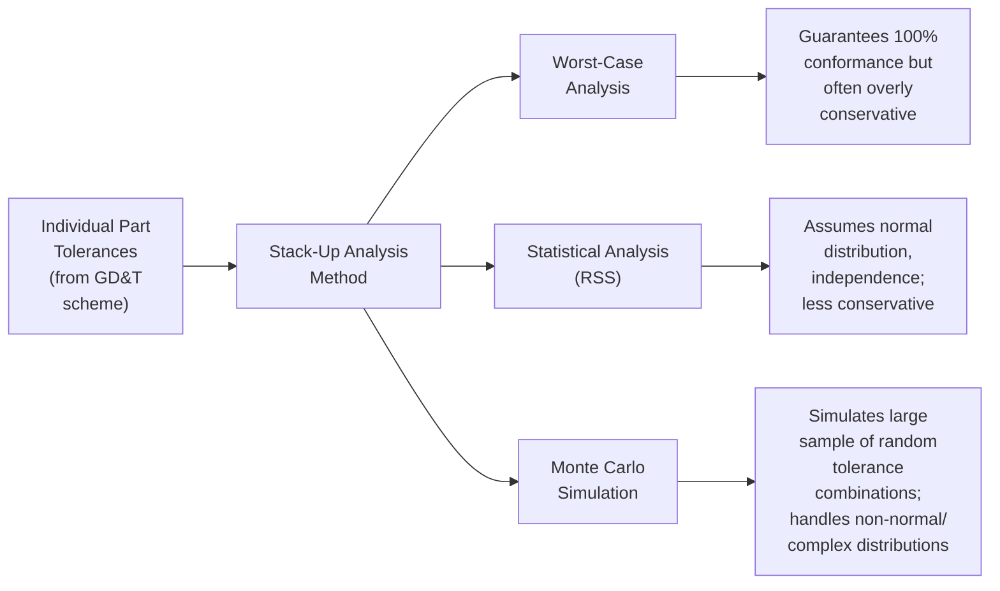
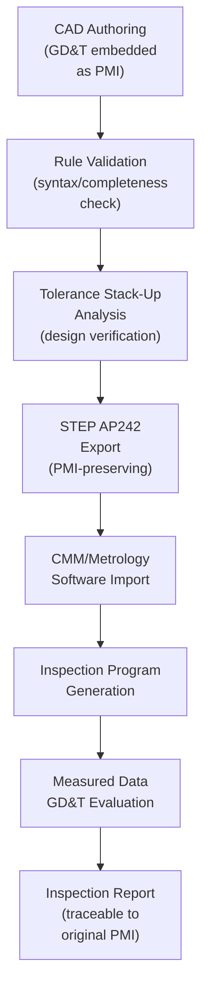

## GD&T Authoring and Analysis Software

### Definition and Purpose

GD&T authoring and analysis software refers to the category of digital tools used to create, validate, and analyze Geometric Dimensioning and Tolerancing (GD&T) schemes applied to part designs — spanning software that embeds GD&T annotations directly into 3D CAD models (authoring), software that mathematically validates GD&T rule compliance and tolerance stack-up behavior (analysis), and software that evaluates measured inspection data against defined GD&T requirements (evaluation). These tools collectively bridge the gap between design intent (expressed through GD&T symbology per ASME Y14.5 or ISO 1101) and manufacturable, verifiable, and functionally sound part conformance, reducing both design ambiguity and downstream inspection interpretation error.

### Functional Categories

### Authoring Tools

GD&T authoring software is most commonly integrated directly within mainstream 3D CAD platforms (e.g., CATIA, NX, Creo, SolidWorks, Autodesk Inventor), enabling designers to attach feature control frames, datum features, and datum reference frames directly to 3D geometry as part of the Model-Based Definition (MBD) workflow. Authoring functionality typically includes:

- Feature control frame construction (geometric characteristic symbol, tolerance zone shape/value, material condition modifiers, datum references)
- Datum feature symbol placement and datum reference frame (DRF) definition
- Composite and multiple single-segment feature control frame support for complex tolerancing scenarios
- Basic dimension and general tolerance note management
- Export to neutral, PMI-preserving formats (notably STEP AP242) for downstream consumption by CAM and metrology software

### Rule-Checking and Validation Software

A distinct and increasingly important category automatically checks authored GD&T schemes for syntactic correctness and completeness against the governing standard (ASME Y14.5 or ISO 1101), catching common authoring errors before they propagate downstream:

- **Syntax validation:** Confirming feature control frames are constructed per standard symbology rules (correct symbol combinations, valid modifier usage)
- **Datum reference frame completeness:** Verifying that referenced datums exist, are properly defined, and that the DRF adequately constrains the required degrees of freedom for the toleranced feature
- **Over-constraint/under-constraint detection:** Flagging tolerancing schemes that leave a feature's location or orientation ambiguous (under-constrained) or apply conflicting/redundant requirements (over-constrained)
- **Standard compliance mode checking:** Confirming consistent application of a single governing standard/revision throughout a model, since ASME Y14.5 and ISO 1101 have some differing conventions and mixing them inconsistently within one dataset creates interpretation ambiguity

### Tolerance Stack-Up Analysis Software

Tolerance stack-up (also called tolerance analysis) software mathematically evaluates how individual part and assembly tolerances combine to affect a functional assembly requirement (e.g., a gap, an interference fit, an alignment condition), supporting design decisions about where tighter or looser tolerances can be allocated without compromising function.

**Worst-Case (Arithmetic) Analysis:** Sums the maximum possible contribution of every toleranced dimension in a stack-up chain, guaranteeing the assembly will conform even under the least favorable combination of individual part tolerances — but often results in unnecessarily tight (and costly) individual part tolerances since the probability of every dimension simultaneously landing at its worst-case extreme is typically very low in real production.

**Statistical (Root-Sum-Square, RSS) Analysis:** Combines individual tolerance contributions using the square root of the sum of squares, based on the statistical assumption that individual dimensions vary independently and approximately normally around their nominal values — allowing looser individual part tolerances while still achieving high statistical confidence (though not an absolute 100% guarantee) of assembly conformance.

**Monte Carlo Simulation:** Uses computational simulation, randomly sampling from defined (potentially non-normal) distributions for each contributing dimension across a large number of simulated assemblies, to estimate the resulting assembly characteristic's distribution and predicted defect rate — particularly valuable for complex, nonlinear stack-up relationships or where contributing dimensions do not follow simple normal distributions.

| Method | Conservatism | Typical Use Case |
| --- | --- | --- |
| Worst-Case | Highest (100% guarantee) | Safety-critical, low-volume, high-consequence assemblies |
| RSS (Statistical) | Moderate | High-volume production where statistical confidence is acceptable |
| Monte Carlo | Flexible/tunable | Complex nonlinear stack-ups, non-normal distributions, sensitivity analysis |

### 1D, 2D, and 3D Tolerance Analysis

GD&T-aware stack-up software is further distinguished by analysis dimensionality:

- **1D (Linear) Stack-Up:** Analyzes a simple linear chain of dimensions along a single axis, the traditional and simplest form of tolerance stack-up
- **2D/3D Vector-Based Analysis:** Accounts for tolerance contributions across multiple axes and rotational degrees of freedom simultaneously, essential for accurately modeling true GD&T tolerance zones (which are inherently geometric/spatial, such as a cylindrical position tolerance zone) rather than simplified linear approximations
- **Kinematic/Assembly Simulation Software:** The most sophisticated category, modeling actual part-to-part mating conditions, contact constraints, and assembly sequence effects, providing the most physically realistic prediction of assembly variation but requiring the most detailed model setup

[Inference] Selection between 1D, 2D/3D, and full kinematic analysis approaches involves a tradeoff between model setup effort/cost and analysis fidelity that is application-specific; the appropriate method depends on assembly complexity, criticality, and available engineering resources, and should be determined per organizational tolerance analysis procedure rather than assumed to require the most sophisticated method in every case.

### Inspection Evaluation Software (GD&T-Aware Measurement Analysis)

CMM and portable metrology software (e.g., CMM programming/evaluation platforms) incorporate GD&T-specific evaluation algorithms that calculate actual geometric conformance from measured point data — distinct from simple linear dimensional pass/fail checking:

- **Datum reference frame construction from measured data:** Establishing the actual measured datum reference frame per the specified datum precedence and material condition modifiers, since the DRF itself must be derived from measurement before any dependent tolerance can be evaluated
- **True position calculation:** Computing actual positional deviation of a feature's derived median point/axis from its theoretically exact location, relative to the established DRF
- **Form tolerance evaluation:** Algorithms for flatness, circularity, cylindricity, and profile tolerances requiring minimum-zone or least-squares fitting calculations across many measured points
- **Material condition modifier application:** Correctly applying bonus tolerance calculations when Maximum Material Condition (MMC) or Least Material Condition (LMC) modifiers are specified, since actual feature size affects the allowable positional/geometric tolerance under these modifiers

### Example: Software-Assisted Stack-Up Analysis for a Bearing Assembly

**Example**

An engineering team is designing a shaft-and-housing assembly with a bearing fit, requiring the resulting radial clearance between shaft and bearing bore to remain within a functional range across the full production population.

1. **Model definition:** The relevant dimensions and GD&T tolerances (shaft diameter tolerance, bearing bore tolerance, housing bore position tolerance, relevant form tolerances) are defined within the stack-up software, either manually entered or imported directly from the MBD-authored CAD model's PMI.
2. **Stack-up chain construction:** The software constructs the geometric chain of contributing dimensions and tolerances that combine to determine the resulting clearance.
3. **Analysis method selection:** Given the assembly is high-volume production (not safety-critical to the same degree as, for example, a flight-critical fastener), the team selects RSS statistical analysis rather than worst-case, to avoid unnecessarily tight and costly individual part tolerances.
4. **Sensitivity analysis:** The software identifies which individual contributing tolerances have the greatest influence on the resulting clearance variation, allowing engineering to focus tolerance tightening (and associated manufacturing cost) only where it most effectively improves assembly conformance.
5. **Predicted defect rate:** The analysis outputs an estimated statistical distribution of the resulting clearance and an associated predicted out-of-specification rate, informing whether the current tolerance allocation is acceptable or requires adjustment before release to production.
6. **Iteration:** Engineering adjusts individual tolerances (tightening high-sensitivity contributors, loosening low-sensitivity ones) and re-runs the analysis until an acceptable balance of function, statistical conformance confidence, and manufacturing cost is achieved.

### Integration with the Broader Digital Thread

GD&T authoring and analysis software functions most effectively as an integrated component of the broader model-based digital thread, rather than as an isolated tool:

This integration is what enables the broader CAD-based inspection and Model-Based Definition workflow — GD&T authoring software is the point of origin for the PMI data that downstream inspection evaluation software ultimately consumes and evaluates against.

### Common Pitfalls in Implementation

- Authoring GD&T schemes without automated rule-checking, allowing syntactically invalid or under/over-constrained tolerancing to propagate downstream, where it creates ambiguity for both manufacturing and inspection
- Defaulting to worst-case tolerance stack-up analysis universally without considering statistical methods, resulting in unnecessarily tight and costly individual part tolerances for non-safety-critical applications
- Applying RSS statistical analysis without validating the underlying independence and normality assumptions for the specific contributing dimensions, risking an overly optimistic conformance prediction
- Inconsistent mixing of ASME Y14.5 and ISO 1101 conventions within a single dataset or organization, creating interpretation ambiguity across a global supply chain
- Treating inspection evaluation software's GD&T calculations as inherently correct without validating the software's implementation of complex tolerancing rules (composite tolerancing, material condition modifiers) against known reference cases
- Failing to maintain PMI fidelity through the CAD-to-analysis-to-inspection software chain, losing semantic GD&T meaning at translation points between different vendor tools

### Related Topics

- ASME Y14.5 / ISO 1101 — GD&T Fundamentals and Symbology
- CAD-Based Inspection and Model-Based Definition
- STEP AP242 and CAD Data Interoperability
- Datum Reference Frames and Material Condition Modifiers (MMC/LMC)
- Statistical Process Control and Process Capability Analysis
- Quality Information Framework (QIF) Standard
- Monte Carlo Simulation Methods in Engineering Analysis
- CMM Programming and GD&T-Aware Measurement Evaluation
- Design for Manufacturability (DFM) and Tolerance Allocation Strategy
- Software Validation for Measurement and Monitoring Equipment