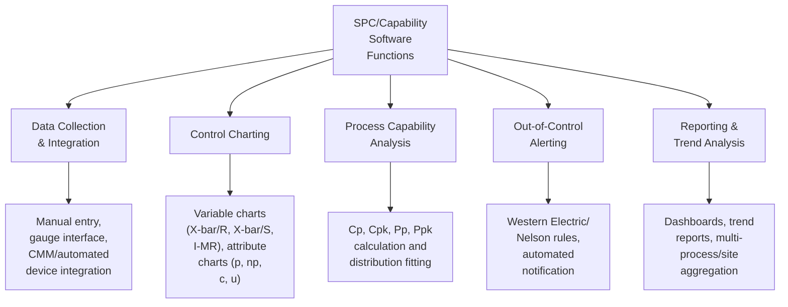
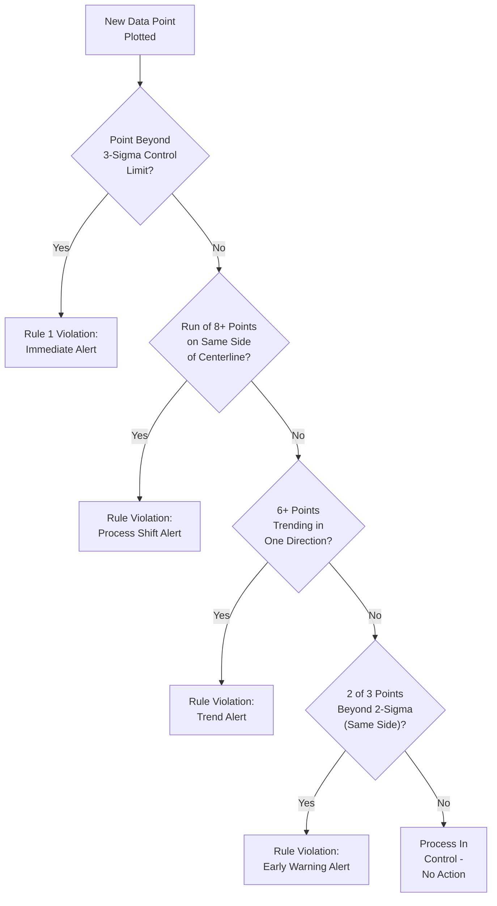
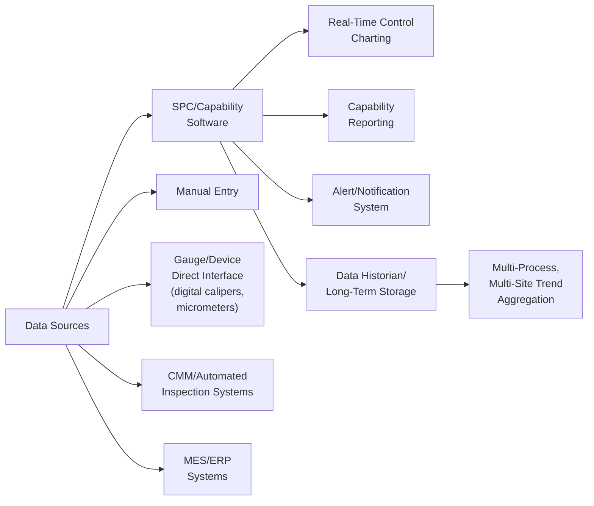

## Statistical Software for SPC and Capability Analysis

### Definition and Purpose

Statistical software for SPC (Statistical Process Control) and capability analysis refers to the dedicated applications and platforms used to collect, chart, analyze, and report on process and product measurement data for the purposes of monitoring process stability, detecting special-cause variation, and quantifying a process's ability to consistently produce output within specification limits. These tools translate the statistical methodology underlying SPC and process capability theory into practical, usable systems that connect directly to measurement data sources — ranging from manual data entry to fully automated inline gauge and CMM integration — and generate the control charts, capability indices, and reports that quality engineers and operators use to make real-time and longer-term process decisions.

### Core Functional Categories

### Control Chart Types Supported

Statistical software must support the appropriate control chart type based on data type (variable/continuous vs. attribute/discrete) and subgroup structure:

| Chart Type | Data Type | Application |
| --- | --- | --- |
| X-bar/R | Variable, subgroups (typically n=2-10) | Monitoring process mean and range for subgrouped continuous data |
| X-bar/S | Variable, larger subgroups (n>10) | Similar to X-bar/R but using standard deviation, more statistically efficient for larger subgroups |
| Individuals-Moving Range (I-MR) | Variable, individual measurements (n=1) | Low-volume production, destructive testing, or where subgrouping is impractical |
| p-chart | Attribute, proportion nonconforming, variable sample size | Fraction defective monitoring |
| np-chart | Attribute, count nonconforming, fixed sample size | Count of defective units per fixed sample |
| c-chart | Attribute, count of defects, fixed sample size/area | Number of defects per unit/area (fixed opportunity) |
| u-chart | Attribute, defects per unit, variable sample size | Defects per unit where opportunity size varies |
| CUSUM (Cumulative Sum) | Variable or attribute | Detecting small, sustained shifts more sensitively than standard Shewhart charts |
| EWMA (Exponentially Weighted Moving Average) | Variable or attribute | Similarly sensitive to small sustained shifts, weights recent data more heavily |

### Out-of-Control Detection Logic

Software-based SPC systems automate the application of statistical rules for detecting special-cause (non-random) variation, most commonly based on the **Western Electric Rules** or **Nelson Rules** (a related, widely codified rule set), applied automatically to each incoming data point rather than requiring manual visual chart inspection:

Software implementations vary in which specific rule subsets are enabled by default and typically allow configuration of which rules apply to which characteristics, since applying all possible rules simultaneously to every characteristic can generate an excessive false-alarm rate, particularly for high-frequency data streams.

### Process Capability Indices

Capability analysis functionality calculates standardized indices quantifying how well a process's output distribution fits within specification limits:

$$C_p = \frac{USL - LSL}{6\sigma}$$

$$C_{pk} = \min\left(\frac{USL - \bar{X}}{3\sigma}, \frac{\bar{X} - LSL}{3\sigma}\right)$$

Where $USL$ and $LSL$ are the upper and lower specification limits, $\bar{X}$ is the process mean, and $\sigma$ is the process standard deviation.

**$C_p$ (Process Capability)** measures the potential capability of a process assuming it is perfectly centered between specification limits — it reflects only the spread of the process relative to the tolerance width, not whether the process is actually centered.

**$C_{pk}$ (Process Capability Index)** accounts for both spread and centering, reflecting the actual capability of the process as it currently performs, and will always be less than or equal to $C_p$.

**$P_p$ and $P_{pk}$ (Process Performance indices)** use identical formulas but calculate $\sigma$ from the overall/long-term standard deviation of the entire dataset rather than the within-subgroup (short-term) standard deviation used for $C_p$/$C_{pk}$ — the practical distinction being that $P_p$/$P_{pk}$ reflect actual overall process performance including both common-cause and any accumulated special-cause/shift variation over the study period, while $C_p$/$C_{pk}$ reflect the process's inherent short-term potential.

| Index | Standard Deviation Basis | Reflects |
| --- | --- | --- |
| $C_p$ | Within-subgroup (short-term) | Potential capability, spread only |
| $C_{pk}$ | Within-subgroup (short-term) | Potential capability, spread and centering |
| $P_p$ | Overall (long-term) | Actual performance, spread only |
| $P_{pk}$ | Overall (long-term) | Actual performance, spread and centering |

### Distribution Fitting and Non-Normal Data Handling

Standard $C_p$/$C_{pk}$ calculation assumes the underlying process data follows a normal distribution. Statistical software typically includes:

- **Normality testing:** Automated statistical tests (e.g., Anderson-Darling, Shapiro-Wilk) to verify whether the normality assumption is reasonable for a given dataset before reporting standard capability indices
- **Distribution fitting for non-normal data:** For characteristics that do not follow a normal distribution (common for certain form/position characteristics, or data with a natural boundary such as flatness or roundness, which cannot be negative), software can fit alternative distributions (Weibull, lognormal, and others) and calculate distribution-appropriate capability metrics rather than misapplying normal-distribution-based indices
- **Box-Cox and other transformation methods:** Applying mathematical transformations to non-normal data to approximate normality before standard capability calculation, as an alternative to direct non-normal distribution fitting

[Inference] The specific choice between distribution-fitting and data-transformation approaches for non-normal capability analysis is a matter of statistical methodology preference and software capability, and the most appropriate approach can depend on the specific characteristic's underlying physical behavior; practitioners should apply their organization's documented statistical procedure or consult applicable AIAG SPC manual guidance rather than assume one universal correct method.

### Data Integration Architecture

Modern SPC software increasingly connects directly to gauges and automated inspection equipment (eliminating manual transcription), integrates with MES/ERP systems for process context (linking measurements to specific machines, operators, shifts, and lots), and supports multi-site data aggregation for organizations monitoring capability performance across distributed manufacturing facilities.

### Example: Software-Driven SPC Implementation for a Machined Bore Diameter

**Example**

A manufacturer monitors a critical bore diameter characteristic on a CNC-machined component using SPC software connected directly to an in-process gauge.

1. **Data collection setup:** The SPC software is configured to receive measurement data automatically from an inline air gauge measuring bore diameter after each machining cycle, eliminating manual data entry.
2. **Chart configuration:** Given the continuous, subgrouped nature of the data (parts naturally grouped by machining batch), an X-bar/R chart is configured, with subgroup size and sampling frequency defined per the process control plan.
3. **Real-time monitoring:** As parts are produced, measurements automatically populate the control chart in real time, with the software continuously evaluating incoming data against configured out-of-control rules.
4. **Alert triggered:** A run of 8 consecutive points above the centerline triggers an automated alert (e.g., visual indicator on a shop-floor dashboard, email/notification to the process owner), consistent with a detected process mean shift requiring investigation.
5. **Root cause investigation:** The alert prompts investigation, revealing gradual tool wear as the cause; a corrective adjustment (tool offset compensation) is made, and the chart continues monitoring to confirm the process returns to statistical control.
6. **Capability reporting:** At the end of a defined production period, the software generates a $C_{pk}$ report for the characteristic, including a normality check confirming the appropriateness of the standard capability formula, supporting both internal process review and customer-required capability documentation (e.g., for PPAP submission in automotive contexts).

### Reporting and Enterprise Integration

Beyond individual chart generation, enterprise-grade statistical software typically provides:

- **Automated periodic capability reports:** Scheduled generation of capability summaries across defined characteristic sets, supporting recurring management review and customer reporting requirements
- **Multi-characteristic/multi-process dashboards:** Aggregated views allowing quality engineers to quickly identify which characteristics or processes are trending toward marginal capability across an entire product line or facility
- **PPAP/FAI documentation support:** Direct generation of capability study documentation in formats aligned with automotive (PPAP) or aerospace (AS9102) submission requirements
- **Audit trail and data integrity features:** Recording of data entry source, timestamp, and any manual data exclusions/annotations (with documented justification) to support both internal quality system audit and customer/regulatory audit requirements

### Common Pitfalls in Implementation

- Applying standard normal-distribution-based $C_p$/$C_{pk}$ formulas to non-normal data without verification, producing misleading capability figures
- Confusing $C_p$/$C_{pk}$ (short-term/within-subgroup) with $P_p$/$P_{pk}$ (long-term/overall) and reporting the wrong index for the intended purpose (e.g., reporting only $C_{pk}$ when a customer requires $P_{pk}$ for an ongoing production capability claim)
- Enabling an excessive number of out-of-control detection rules simultaneously, generating alert fatigue from false positives that erodes operator trust in the alerting system
- Manual data entry workflows that persist despite available automated gauge integration, reintroducing transcription error risk the software was intended to eliminate
- Insufficient subgroup rationality (subgroups spanning conditions that should be treated as separate sources of variation), distorting the within-subgroup vs. between-subgroup variation split fundamental to correct control limit calculation
- Treating a single capability snapshot as permanently valid without periodic recalculation, missing genuine process capability drift over time

### Related Topics

- Statistical Process Control (SPC) Fundamentals and Control Chart Theory
- Process Capability Analysis ($C_p$, $C_{pk}$, $P_p$, $P_{pk}$)
- Western Electric Rules and Nelson Rules for Out-of-Control Detection
- Closed Loop Quality Feedback to Production
- Measurement Systems Analysis (Gage R&R)
- PPAP (Production Part Approval Process) Documentation Requirements
- Non-Normal Distribution Analysis and Transformation Methods
- Metrology Data Management
- Inline and Automated Inspection Systems
- Six Sigma DMAIC Methodology and Statistical Tools