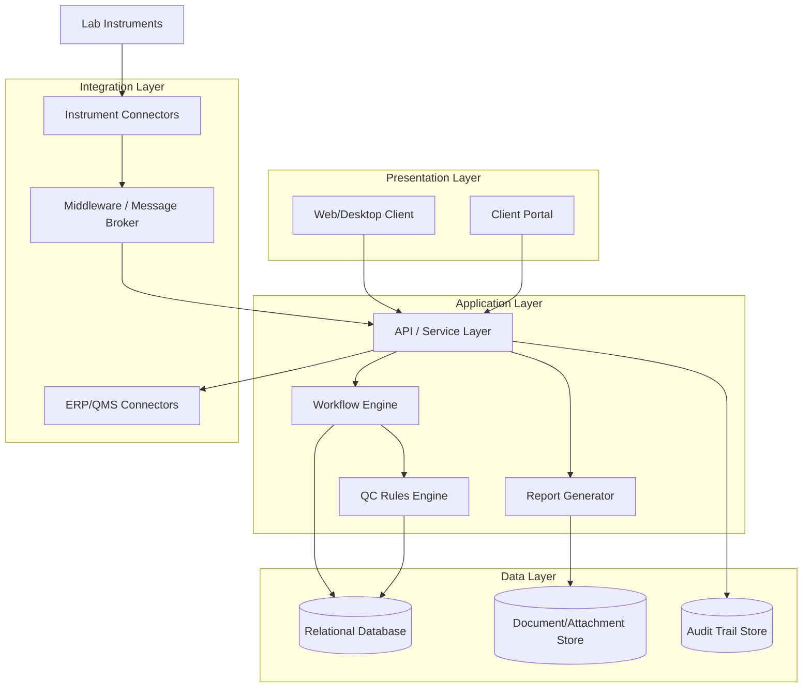
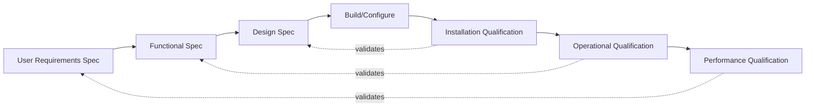

## Laboratory Information Management Systems


### Definition and Scope

A Laboratory Information Management System (LIMS) is software that manages samples, associated data, workflows, instruments, and personnel activities within a laboratory environment. In the context of precision metrology and quality control, a LIMS serves as the digital backbone connecting sample receipt, measurement execution, calibration status, data review, and certificate/report issuance.

A LIMS is distinct from adjacent systems:

- **LIMS** — sample-centric; tracks a physical/virtual sample through its lifecycle (login → testing → results → disposal)
- **ELN (Electronic Lab Notebook)** — experiment-centric; documents free-form research narrative and reasoning
- **LES (Laboratory Execution System)** — procedure-centric; enforces step-by-step SOP execution with in-line data capture
- **QMS (Quality Management System)** — organization-centric; manages CAPA, document control, audits, non-conformances
- **CMMS (Computerized Maintenance Management System)** — asset-centric; manages equipment maintenance/calibration scheduling

Many modern platforms blend LIMS+LES+QMS capabilities into a single suite, but the core architectural distinctions remain useful for requirements analysis.

### Core Functional Modules

**Sample Management**

- Sample login/accessioning with unique identifiers (barcode/QR/RFID)
- Chain of custody tracking
- Sample status lifecycle (received → in-progress → complete → archived/disposed)
- Sample hierarchy (parent/child, aliquots, composites)

**Test/Analysis Management**

- Test method assignment and specification limits
- Worksheet/work order generation
- Result entry (manual, semi-automated via instrument parsing, fully automated via bidirectional interface)
- Reflex/conditional testing rules (auto-trigger secondary tests based on primary results)

**Instrument Integration**

- Unidirectional interfaces (instrument → LIMS, read-only result capture)
- Bidirectional interfaces (LIMS sends work list to instrument, receives results back)
- Standards: SiLA 2, ASTM E1394/E1381 (legacy), OPC UA (increasingly common in metrology/manufacturing contexts), proprietary vendor APIs

**Calibration and Equipment Tracking**

- Equipment master records with calibration due dates
- Automatic test-blocking when equipment calibration is overdue
- Traceability to reference standards (linking to national metrology institute certificates, e.g., NIST, NPL, PTB)
- Measurement uncertainty budget association per instrument/method

**Quality Control**

- Control chart management (Levey-Jennings, Shewhart)
- Westgard rules or equivalent statistical rule engines for QC acceptance/rejection
- Proficiency testing (PT)/interlaboratory comparison result logging
- Out-of-specification (OOS) and out-of-trend (OOT) investigation workflows

**Reporting and Certification**

- Certificate of Analysis (CoA) / Calibration Certificate generation
- Electronic signatures (21 CFR Part 11 / EU Annex 11 compliant where required)
- Report templating with dynamic data binding
- Digital delivery/portal access for clients

**Audit Trail and Data Integrity**

- ALCOA+ principles enforcement (Attributable, Legible, Contemporaneous, Original, Accurate, plus Complete, Consistent, Enduring, Available)
- Immutable audit logs of all record creation, modification, deletion
- User role-based access control (RBAC)

### Architecture Patterns

**Typical Layered Architecture**



**Deployment Models**

- **On-premises** — full institutional control; common in government/regulated metrology labs with data-sovereignty requirements
- **Cloud/SaaS** — vendor-hosted (e.g., LabWare, Thermo Fisher SampleManager, LabVantage); lower IT overhead, subscription-based
- **Hybrid** — core data on-prem, reporting/portal in cloud

### Data Model Fundamentals

A minimal relational schema for a metrology-oriented LIMS typically includes:

| Entity | Key Attributes |
| --- | --- |
| Sample | sample_id, received_date, client_id, matrix_type, status |
| Test | test_id, sample_id, method_id, instrument_id, analyst_id, result, unit, uncertainty |
| Method | method_id, name, spec_limits, reference_standard |
| Instrument | instrument_id, calibration_due_date, last_cal_cert_id, location |
| Calibration_Cert | cert_id, instrument_id, issuing_lab, traceability_chain, expanded_uncertainty |
| User | user_id, role, e_signature_hash |
| Audit_Log | log_id, table_ref, record_ref, action, timestamp, user_id, old_value, new_value |

The Test-to-Instrument-to-Calibration_Cert relationship is the critical traceability chain that connects a reported measurement result back to a national/international standard — this is the essence of metrological traceability in software form.

### Standards and Regulatory Frameworks

- **ISO/IEC 17025** — General requirements for competence of testing and calibration laboratories; drives most LIMS functional requirements (traceability, uncertainty reporting, equipment records, records retention)
- **ISO 9001** — Quality management system requirements, often integrated with LIMS-adjacent QMS modules
- **21 CFR Part 11** (FDA, US) — Electronic records/electronic signatures requirements for regulated (e.g., pharma) labs
- **GAMP 5** — Risk-based approach to computerized system validation, frequently applied to LIMS validation projects
- **HL7/ASTM** — Interoperability standards, more prevalent in clinical LIMS than industrial metrology LIMS

[Inference] The specific compliance modules a metrology lab needs (Part 11 vs. ISO 17025 alone) depend heavily on the lab's accreditation scope and client industry (pharma vs. general industrial calibration), which varies by organization and is not a fixed universal requirement.

### Validation and Qualification (Computerized System Validation)

For regulated environments, LIMS deployment follows a V-model validation lifecycle:



- **IQ** — verifies correct installation of hardware/software per specification
- **OQ** — verifies the system operates according to functional specifications across its operating range
- **PQ** — verifies the system performs reliably under actual production/routine use conditions

### Example: Calibration-Blocking Rule Logic

A common metrology-specific LIMS business rule prevents test execution on instruments with expired calibration:

```python
from datetime import date

def can_run_test(instrument, test_date=None):
    """
    Determine if a test can proceed on the given instrument.
    Returns (allowed: bool, reason: str)
    """
    test_date = test_date or date.today()
    
    if instrument.calibration_due_date is None:
        return False, "No calibration record on file"
    
    if test_date > instrument.calibration_due_date:
        return False, f"Calibration expired on {instrument.calibration_due_date}"
    
    if instrument.status == "quarantined":
        return False, "Instrument is quarantined pending investigation"
    
    return True, "OK"

# Example usage
result, reason = can_run_test(instrument_A)
if not result:
    raise TestBlockedException(reason)
```

This kind of hard-block logic is standard in ISO/IEC 17025-compliant LIMS implementations and directly enforces measurement traceability at the point of data capture.

### Westgard Rules Example (QC Rule Engine Logic)

Multi-rule QC evaluation commonly implemented in LIMS QC modules:

```python
def evaluate_westgard(values, mean, sd):
    """
    values: list of recent QC results (most recent last)
    Returns list of violated rule names
    """
    violations = []
    z = [(v - mean) / sd for v in values]
    
    if abs(z[-1]) > 3:
        violations.append("1_3s")           # single point beyond 3 SD
    if abs(z[-1]) > 2 and abs(z[-2]) > 2 and (z[-1] * z[-2] > 0):
        violations.append("2_2s")           # two consecutive points same side beyond 2 SD
    if abs(z[-1] - z[-2]) > 4:
        violations.append("R_4s")           # range between two points exceeds 4 SD
    if all(v > 0 for v in z[-4:]) or all(v < 0 for v in z[-4:]):
        violations.append("4_1s")           # four consecutive points beyond 1 SD, same side
    
    return violations
```

[Unverified] Exact Westgard rule thresholds and combinations vary by laboratory SOP and discipline (clinical vs. industrial metrology); the above reflects the standard textbook formulation, not a universal regulatory mandate.

### Instrument Interface Example (SiLA 2 Concept)

SiLA 2 (Standardization in Lab Automation) defines gRPC/Protobuf-based service contracts for instrument communication:

```protobuf
service BalanceService {
  rpc GetWeight (WeightRequest) returns (WeightResponse);
  rpc Tare (TareRequest) returns (TareResponse);
  rpc GetCalibrationStatus (StatusRequest) returns (CalibrationStatusResponse);
}

message WeightResponse {
  double value = 1;
  string unit = 2;
  string timestamp = 3;
  double uncertainty = 4;
}
```

This standardized service-contract approach reduces the custom-driver burden historically associated with LIMS-instrument integration, though [Inference] adoption of SiLA 2 specifically (versus proprietary or OPC UA interfaces) varies significantly by instrument vendor and lab sector, with heavier uptake in pharma/biotech automation than in general dimensional/mechanical metrology labs.

### Measurement Uncertainty Handling in LIMS

A metrology-focused LIMS should associate an uncertainty budget with each reported result, not just a single value:

$$U = k \cdot u_c(y) = k \cdot \sqrt{\sum_{i=1}^{n} \left( \frac{\partial f}{\partial x_i} \right)^2 u^2(x_i)}$$

Where $u_c(y)$ is the combined standard uncertainty, $k$ is the coverage factor (typically $k=2$ for ~95% confidence), and $u(x_i)$ are the standard uncertainties of input quantities $x_i$.

The LIMS data model should store, per result:

- Reported value
- Expanded uncertainty $U$
- Coverage factor $k$
- Reference to the uncertainty budget/method used to derive it

[Inference] Few commercial off-the-shelf LIMS products compute uncertainty budgets natively end-to-end; most store a pre-calculated uncertainty value entered by the analyst or imported from a separate uncertainty calculation tool, with true in-LIMS GUM-compliant budget computation being a more specialized/configured capability rather than a default feature across the product category.

### Common Commercial and Open-Source Platforms

| Platform | Type | Notable Focus |
| --- | --- | --- |
| LabWare LIMS | Commercial | Broad industry, highly configurable |
| Thermo Fisher SampleManager | Commercial | Pharma/biotech/manufacturing |
| LabVantage | Commercial | Enterprise, multi-site |
| STARLIMS | Commercial | Regulatory-heavy industries |
| Bika/SENAITE | Open-source | General lab, budget-conscious deployments |
| CGM LABDAQ | Commercial | Clinical labs |

[Unverified] Feature sets, pricing tiers, and current vendor market positioning change frequently; the above reflects general category positioning rather than a real-time competitive assessment.

### Implementation Considerations

- **Data migration** — legacy paper/Excel-based records require structured migration and validation before go-live
- **Change control** — post-validation configuration changes require formal change control per GAMP 5 practices
- **User training** — role-based training records often need to be tracked within or alongside the LIMS itself
- **Disaster recovery** — backup/restore procedures must preserve audit trail integrity, not just raw data
- **Multi-site/multi-lab** — data isolation vs. shared reference data (methods, equipment master) design decisions affect long-term maintainability

### SVG Diagram: Sample Lifecycle State Machine (svg_diagram)

<svg xmlns="http://www.w3.org/2000/svg" viewBox="0 0 900 320" font-family="Arial, sans-serif">
<text x="450" y="25" font-size="18" font-weight="bold" text-anchor="middle">Sample Lifecycle State Machine (svg_diagram)</text>
<rect x="20" y="60" width="130" height="50" rx="8" fill="#e3f2fd" stroke="#1565c0" />
<text x="85" y="90" font-size="13" text-anchor="middle">Received</text>
<rect x="200" y="60" width="130" height="50" rx="8" fill="#e8f5e9" stroke="#2e7d32" />
<text x="265" y="90" font-size="13" text-anchor="middle">Logged In</text>
<rect x="380" y="60" width="130" height="50" rx="8" fill="#fff3e0" stroke="#ef6c00" />
<text x="445" y="85" font-size="13" text-anchor="middle">In Testing /</text>
<text x="445" y="100" font-size="13" text-anchor="middle">Analysis</text>
<rect x="560" y="60" width="130" height="50" rx="8" fill="#fce4ec" stroke="#ad1457" />
<text x="625" y="85" font-size="13" text-anchor="middle">Results Under</text>
<text x="625" y="100" font-size="13" text-anchor="middle">Review</text>
<rect x="740" y="60" width="130" height="50" rx="8" fill="#ede7f6" stroke="#4527a0" />
<text x="805" y="90" font-size="13" text-anchor="middle">Approved</text>
<rect x="560" y="180" width="130" height="50" rx="8" fill="#ffebee" stroke="#c62828" />
<text x="625" y="205" font-size="13" text-anchor="middle">OOS / OOT</text>
<text x="625" y="220" font-size="13" text-anchor="middle">Investigation</text>
<rect x="740" y="180" width="130" height="50" rx="8" fill="#eceff1" stroke="#37474f" />
<text x="805" y="205" font-size="13" text-anchor="middle">Archived /</text>
<text x="805" y="220" font-size="13" text-anchor="middle">Disposed</text>
<line x1="150" y1="85" x2="198" y2="85" stroke="#333" stroke-width="2" marker-end="url(#arrow)" />
<line x1="330" y1="85" x2="378" y2="85" stroke="#333" stroke-width="2" marker-end="url(#arrow)" />
<line x1="510" y1="85" x2="558" y2="85" stroke="#333" stroke-width="2" marker-end="url(#arrow)" />
<line x1="690" y1="85" x2="738" y2="85" stroke="#333" stroke-width="2" marker-end="url(#arrow)" />
<line x1="625" y1="110" x2="625" y2="178" stroke="#c62828" stroke-width="2" marker-end="url(#arrow)" />
<text x="635" y="145" font-size="11" fill="#c62828">fails QC</text>
<line x1="690" y1="205" x2="738" y2="205" stroke="#333" stroke-width="2" marker-end="url(#arrow)" stroke-dasharray="4,3" />
<line x1="805" y1="110" x2="805" y2="178" stroke="#333" stroke-width="2" marker-end="url(#arrow)" />
<path d="M 625 180 C 500 150, 500 100, 443 112" stroke="#c62828" stroke-width="2" fill="none" marker-end="url(#arrow)" stroke-dasharray="4,3" />
<text x="480" y="145" font-size="11" fill="#c62828">retest</text>
</svg>

### Related Topics

- ISO/IEC 17025 requirements and accreditation processes
- Measurement uncertainty (GUM framework) computation methods
- Statistical process control and control charting in metrology
- 21 CFR Part 11 / Annex 11 electronic records compliance
- SiLA 2 and OPC UA instrument connectivity standards
- Calibration management systems and traceability chains
- Computerized System Validation (CSV) / GAMP 5 methodology
- Enterprise Quality Management System (eQMS) integration with LIMS