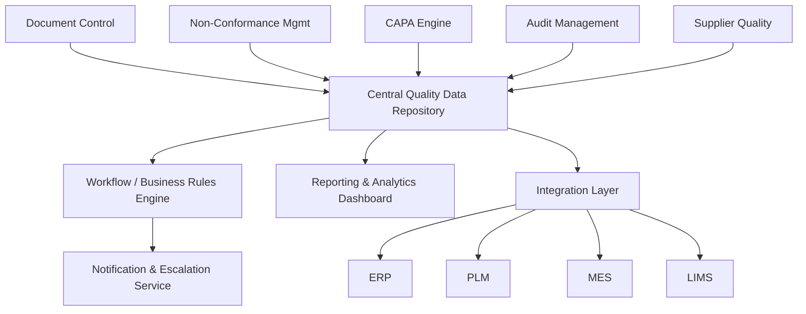
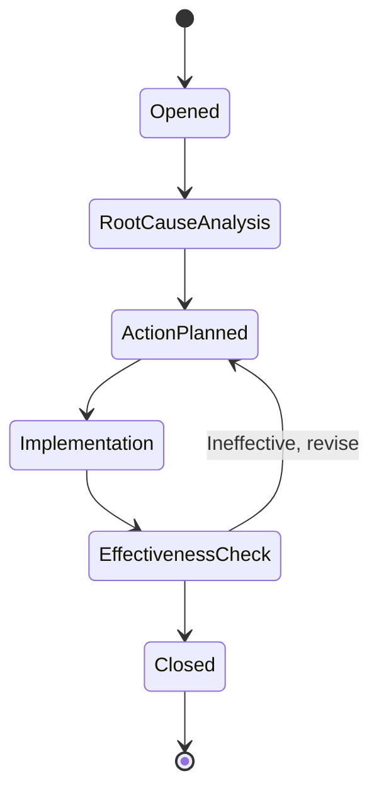

## Enterprise Quality Management Software

### Definition and Scope

Enterprise Quality Management Software (EQMS) is a class of integrated software systems that manage quality-related processes organization-wide — spanning document control, non-conformance handling, corrective/preventive action, audits, training, and supplier quality — rather than serving a single department or lab. "Enterprise" distinguishes it from point solutions by emphasizing cross-functional workflows, centralized data governance, and integration with other enterprise systems (ERP, PLM, MES).

EQMS differs from adjacent systems:

- **EQMS vs. LIMS**: EQMS governs organizational quality processes and records; LIMS manages sample-level laboratory data. A metrology lab may feed calibration non-conformances from its LIMS into an EQMS for CAPA handling.
- **EQMS vs. PLM (Product Lifecycle Management)**: PLM manages product design data across its lifecycle; EQMS manages the quality processes applied to that product.
- **EQMS vs. MES (Manufacturing Execution System)**: MES manages shop-floor production execution; EQMS may consume MES-generated defect data as input to quality workflows.

### Core Functional Modules

**Document Control**

Manages controlled documents (SOPs, work instructions, quality manuals) with versioning, approval workflows, and controlled distribution. Typically enforces that only the current approved revision is accessible for use, with full revision history retained.

**Non-Conformance Management (NCM)**

Captures and tracks non-conforming products, materials, or processes from identification through disposition (use-as-is, rework, scrap, return-to-vendor).

**Corrective and Preventive Action (CAPA)**

Structured workflow for root cause analysis and corrective action following a non-conformance or audit finding. Commonly implements methodologies such as:

- 5 Whys
- Fishbone/Ishikawa diagrams
- 8D (Eight Disciplines) problem solving

**Audit Management**

Schedules, executes, and tracks internal and external audits, including finding capture, evidence attachment, and linkage to CAPA records for closure.

**Supplier Quality Management (SQM)**

Tracks supplier quality performance, incoming inspection results, supplier corrective action requests (SCARs), and supplier scorecards/ratings.

**Training Management**

Links quality records (e.g., SOP revisions) to required training, tracking completion and competency records — often required to demonstrate personnel are trained on current procedures.

**Risk Management**

Supports risk assessment methodologies such as FMEA (Failure Mode and Effects Analysis), calculating Risk Priority Number (RPN):

$$RPN = S \times O \times D$$

Where $S$ is severity, $O$ is occurrence, and $D$ is detection rating (each typically scored 1–10).

**Change Management**

Manages engineering/process change requests (ECR/ECO) with impact assessment and approval routing before implementation.

**Complaint Handling**

Captures and processes customer complaints, often linked to CAPA when complaints indicate systemic issues.

**Statistical Process Control (SPC) / Quality Data Analytics**

Some EQMS platforms embed or integrate SPC charting for monitoring process stability using control limits:

$$UCL = \bar{X} + 3\sigma, \quad LCL = \bar{X} - 3\sigma$$

### Architecture Patterns

**Typical modular architecture:**

**Deployment models:**

- **Cloud/SaaS (multi-tenant)**: dominant model for modern EQMS platforms; rapid deployment, vendor-managed upgrades
- **Single-tenant cloud**: dedicated instance per customer, often chosen for stricter data isolation requirements
- **On-premise**: declining but still present in regulated/defense sectors requiring full data control

**Data model core entities** (simplified):

| Entity | Key Attributes |
| --- | --- |
| `Document` | doc_id, revision, status, approval_chain, effective_date |
| `NonConformance` | nc_id, product_ref, description, severity, disposition |
| `CAPA` | capa_id, source_ref (NC/audit/complaint), root_cause, action_plan, status |
| `AuditRecord` | audit_id, type, scope, findings[], closure_date |
| `Supplier` | supplier_id, scorecard_rating, scar_history |
| `TrainingRecord` | user_id, document_ref, completion_date, competency_status |

### Regulatory and Standards Context

- **ISO 9001**: General QMS requirements; most EQMS platforms are structured to support its process approach, risk-based thinking, and documented information requirements.
- **ISO 13485**: Medical device QMS requirements; EQMS platforms serving medical device manufacturers typically add device-specific traceability and complaint-handling features (e.g., MDR/vigilance reporting linkage).
- **IATF 16949**: Automotive sector QMS; commonly requires APQP, PPAP, and FMEA workflow support within the EQMS.
- **AS9100**: Aerospace sector QMS; adds counterfeit parts prevention and configuration management requirements.
- **21 CFR Part 820 / Part 11**: U.S. FDA requirements for medical device quality systems and electronic records, relevant where EQMS is used in FDA-regulated environments.

[Inference] Sector-specific standards (IATF 16949, AS9100, ISO 13485) generally build on ISO 9001's core structure with added clauses; an EQMS marketed as "multi-industry" typically implements ISO 9001 as a baseline and offers configurable modules for sector-specific requirements rather than having them universally built in.

### Example: CAPA Workflow State Machine

### Example: FMEA Risk Scoring Table

| Failure Mode | Severity (S) | Occurrence (O) | Detection (D) | RPN |
| --- | --- | --- | --- | --- |
| Gauge drift undetected | 8 | 3 | 4 | 96 |
| Calibration overdue, instrument used | 9 | 2 | 6 | 108 |
| Incorrect tolerance entered in spec | 7 | 2 | 3 | 42 |

Higher RPN values typically trigger mandatory CAPA initiation in configured EQMS workflows, though [Unverified] the specific RPN threshold for mandatory action is organization-defined, not a universal standard value.

### Integration Diagram: EQMS in the Enterprise Landscape (svg_diagram)

<svg xmlns="http://www.w3.org/2000/svg" viewBox="0 0 760 320">
<text x="380" y="24" text-anchor="middle" font-size="16" font-weight="bold" fill="#1a1a1a">EQMS Enterprise Integration Landscape (svg_diagram)</text>
<rect x="300" y="120" width="160" height="70" rx="8" fill="#f3e8fd" stroke="#7b3fa0" stroke-width="2" />
<text x="380" y="150" text-anchor="middle" font-size="13" font-weight="bold" fill="#1a1a1a">EQMS</text>
<text x="380" y="168" text-anchor="middle" font-size="11" fill="#1a1a1a">Core Platform</text>
<rect x="40" y="40" width="130" height="55" rx="6" fill="#e8f0fe" stroke="#4a6fa5" stroke-width="1.5" />
<text x="105" y="72" text-anchor="middle" font-size="12" fill="#1a1a1a">ERP</text>
<rect x="40" y="220" width="130" height="55" rx="6" fill="#e6f4ea" stroke="#2e7d4f" stroke-width="1.5" />
<text x="105" y="252" text-anchor="middle" font-size="12" fill="#1a1a1a">LIMS</text>
<rect x="590" y="40" width="130" height="55" rx="6" fill="#fef3e0" stroke="#c98a1c" stroke-width="1.5" />
<text x="655" y="72" text-anchor="middle" font-size="12" fill="#1a1a1a">PLM</text>
<rect x="590" y="220" width="130" height="55" rx="6" fill="#fde8e8" stroke="#a53c3c" stroke-width="1.5" />
<text x="655" y="252" text-anchor="middle" font-size="12" fill="#1a1a1a">MES</text>
<line x1="170" y1="67" x2="300" y2="135" stroke="#555" stroke-width="1.5" />
<line x1="170" y1="247" x2="300" y2="175" stroke="#555" stroke-width="1.5" />
<line x1="590" y1="67" x2="460" y2="135" stroke="#555" stroke-width="1.5" />
<line x1="590" y1="247" x2="460" y2="175" stroke="#555" stroke-width="1.5" />

<text x="380" y="290" text-anchor="middle" font-size="11" fill="#555">Bidirectional data exchange: NC records, supplier data, spec references, defect data</text>

</svg>

### Selection Criteria for EQMS

| Criterion | Consideration |
| --- | --- |
| Industry-specific compliance | Pre-built templates for IATF 16949, AS9100, ISO 13485 vs. generic configuration |
| Integration depth | Native connectors vs. custom API integration effort with ERP/PLM/MES |
| Configurability | No-code/low-code workflow design vs. vendor-dependent customization |
| Scalability across sites | Multi-site, multi-language, multi-currency support for global operations |
| Validation support | Availability of validation documentation packages for regulated industries |
| User adoption | Usability for non-quality-specialist users (e.g., shop floor NC entry) |
| Analytics/reporting | Built-in dashboards vs. reliance on data export to BI tools |

### Common Implementation Pitfalls

- Configuring workflows that mirror an outdated paper-based process rather than redesigning for digital efficiency
- Insufficient master data governance, leading to inconsistent product/supplier references across NC and CAPA records
- Underestimating training rollout effort for a system touching most of the organization, not just the quality department
- Failing to define clear ownership for cross-module data (e.g., who owns a supplier record referenced by both SQM and NCM)
- Treating CAPA effectiveness checks as a formality rather than validating actual root cause elimination

### Related Topics

- ISO 9001 / ISO 13485 / IATF 16949 / AS9100 quality management standards
- Failure Mode and Effects Analysis (FMEA) methodology
- 8D problem-solving and root cause analysis techniques
- Statistical process control (SPC) and control chart theory
- Supplier quality management and SCAR processes
- Document control and controlled-copy distribution practices
- Integration architecture between EQMS, LIMS, ERP, and MES systems
- Risk-based thinking in quality management systems