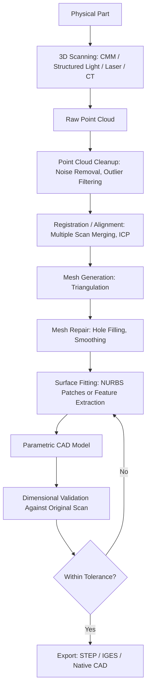

## Reverse Engineering from Scan Data

### Definition and Scope

Reverse engineering from scan data is the process of reconstructing a digital design model — typically a CAD-compatible surface or solid model — from 3D measurement data acquired by scanning a physical part. In precision metrology contexts, this workflow bridges physical measurement (via CMM, laser scanner, or structured-light scanner) and digital design/manufacturing systems, enabling replication, modification, or comparison of parts lacking original CAD data.

This differs from **inspection-based scanning**, which compares scan data against an existing CAD model to report deviations, rather than generating a new model from scratch. Reverse engineering is generative; inspection is comparative — though both often use the same acquisition hardware and point-cloud data.

### Scanning Technologies Used as Input

| Technology | Principle | Typical Accuracy | Best Suited For |
| --- | --- | --- | --- |
| Contact CMM probing | Physical touch-trigger or scanning probe | Sub-micron to a few µm | Discrete features, prismatic parts |
| Laser triangulation scanner | Projected laser line, triangulated via camera | ~10–50 µm | Freeform surfaces, medium-size parts |
| Structured-light scanner | Projected fringe patterns, stereo camera capture | ~5–30 µm | Freeform surfaces, fast full-field capture |
| Laser line scanner on CMM/arm | Line laser mounted on articulated arm or CMM | ~15–40 µm | Combining discrete + freeform on one part |
| Industrial CT scanning | X-ray computed tomography | Voxel-dependent, ~5–50 µm | Internal geometry, assemblies, hidden features |

[Inference] Accuracy figures vary substantially by specific instrument model, calibration state, part material/finish, and environmental conditions; the ranges above reflect typical published specifications rather than guaranteed performance for any given setup.

### Reverse Engineering Pipeline

### Stage-by-Stage Technical Detail

**Point Cloud Acquisition and Cleanup**

Raw scan output typically contains millions of points with noise from sensor limitations, surface reflectivity issues, or occlusion gaps. Cleanup steps include:

- Statistical outlier removal (points beyond a threshold standard deviation from local neighborhood mean)
- Noise reduction via local surface fitting (e.g., moving least squares)
- Decimation to reduce point density where over-sampled, while preserving high-curvature regions

**Registration/Alignment**

Multiple scans from different orientations must be merged into a single coordinate frame. The dominant algorithm is **Iterative Closest Point (ICP)**, which iteratively minimizes the distance between corresponding points across scan datasets:

$$E(R, t) = \sum_{i=1}^{n} \| (R p_i + t) - q_i \|^2$$

Where $R$ is the rotation matrix, $t$ is the translation vector, $p_i$ are source points, and $q_i$ are corresponding target points. ICP is typically seeded with a coarse alignment (via reference features, targets, or manual point-pair selection) before fine registration.

**Mesh Generation**

Point clouds are triangulated into a polygon mesh, commonly via algorithms such as:

- **Ball-pivoting algorithm**: rolls a virtual ball of defined radius over the point cloud to form triangles
- **Poisson surface reconstruction**: fits an implicit surface function to point cloud data with normals, producing watertight meshes robust to noise

**Mesh Repair**

Addresses gaps from occlusion (areas the scanner couldn't see, e.g., undercuts, deep bores) through hole-filling algorithms, and reduces mesh artifacts (spikes, self-intersections) via smoothing operations — balanced against the risk of over-smoothing that erodes true geometric features like sharp edges.

**Surface Fitting / Feature Extraction**

Two general approaches:

1. **Freeform surface fitting**: Fits NURBS (Non-Uniform Rational B-Spline) patches across the mesh to create smooth, editable surfaces — used for organic/freeform geometry (e.g., turbine blades, automotive body panels)
2. **Feature-based reconstruction**: Detects primitive geometric features (planes, cylinders, cones, spheres) via segmentation algorithms (e.g., RANSAC-based plane/cylinder fitting) and reconstructs them as parametric CAD features — used for prismatic/mechanical parts where design intent involves discrete features (holes, bosses, fillets)

**Dimensional Validation**

The reconstructed CAD model is compared back against the original scan data using color-mapped deviation analysis, verifying reconstruction fidelity before the model is used downstream.

### Example: RANSAC-Based Primitive Fitting (Conceptual)

For extracting a cylindrical feature (e.g., a bore) from a point cloud subset:

1. Randomly sample a minimal point set defining a cylinder hypothesis (typically requires points plus normal vectors)
2. Compute the candidate cylinder's axis, radius $r$
3. Count inliers: points within threshold distance $\epsilon$ of the candidate surface
4. Repeat across iterations; retain hypothesis with maximum inlier count
5. Refine via least-squares fit using all inliers

$$d_i = \left| \sqrt{(x_i - x_0)^2 + (y_i - y_0)^2} - r \right| < \epsilon$$

Where $(x_0, y_0)$ is the axis projection point and $r$ is the fitted radius (simplified for axis-aligned case).

### Software Categories

| Category | Function | Example Tool Types |
| --- | --- | --- |
| Point cloud processing | Cleanup, registration, meshing | Point cloud preprocessing suites |
| Reverse engineering CAD | Surface/feature fitting from mesh | Dedicated reverse-engineering CAD modules |
| General CAD with RE modules | Native CAD with import/fitting add-ins | Mainstream MCAD packages with scan-to-CAD add-ons |
| Metrology/inspection software | Deviation analysis, GD&T reporting | Inspection-focused analysis suites |

[Unverified] Specific product names and feature sets change frequently across vendor release cycles; evaluating current capability requires checking vendor documentation directly rather than relying on static feature comparisons.

### Deviation Map Diagram (svg_diagram)

<svg xmlns="http://www.w3.org/2000/svg" viewBox="0 0 700 300">
<text x="350" y="24" text-anchor="middle" font-size="16" font-weight="bold" fill="#1a1a1a">Scan-to-CAD Deviation Analysis (svg_diagram)</text>
<ellipse cx="220" cy="160" rx="140" ry="90" fill="none" stroke="#333" stroke-width="1.5" />
<text x="220" y="270" text-anchor="middle" font-size="12" fill="#1a1a1a">Original Scan Point Cloud</text>
<ellipse cx="220" cy="160" rx="140" ry="90" fill="url(#devGradient)" opacity="0.6" />
<rect x="480" y="70" width="20" height="180" fill="url(#legendGradient)" stroke="#333" />
<text x="510" y="76" font-size="11" fill="#1a1a1a">+0.10 mm</text>
<text x="510" y="162" font-size="11" fill="#1a1a1a">0.00 mm</text>
<text x="510" y="254" font-size="11" fill="#1a1a1a">-0.10 mm</text>

<text x="220" y="160" text-anchor="middle" font-size="11" fill="`#1a1a1a`" dy="4">Fitted CAD Surface (reference)</text>

</svg>

### Applications in Precision Metrology and QC

- **Legacy part replication**: Reconstructing CAD for parts with no surviving digital design (e.g., older equipment replacement parts)
- **Competitive benchmarking**: Digitizing and analyzing competitor products
- **As-built vs. as-designed comparison**: Validating manufactured parts against original CAD intent, often producing full-field deviation reports rather than discrete point checks
- **Tooling and fixture reconstruction**: Rebuilding worn or damaged tooling geometry
- **Custom/biomedical fitting**: Reconstructing patient-specific or ergonomic geometry from body scans

### Common Implementation Pitfalls

- Insufficient scan coverage of occluded features (undercuts, internal bores), producing incomplete or extrapolated mesh regions that misrepresent true geometry
- Over-relying on automated surface fitting without applying engineering judgment on design intent (e.g., a slightly non-planar surface may be intended as flat)
- Neglecting to validate the final CAD model dimensionally against the original scan before downstream use
- Using single-scan data for parts requiring internal geometry, where CT scanning would be necessary instead of surface-only methods
- Under-specifying resolution/accuracy requirements before scanning, leading to re-scans when reconstructed model fidelity proves inadequate

### Related Topics

- Iterative Closest Point (ICP) and point cloud registration algorithms
- NURBS surface modeling fundamentals
- GD&T-based deviation analysis and first-article inspection
- Industrial computed tomography (CT) metrology
- Point cloud segmentation and RANSAC-based feature extraction
- STEP/IGES CAD interoperability formats
- Structured-light vs. laser triangulation scanning trade-offs
- Mesh processing algorithms (Poisson reconstruction, ball-pivoting)