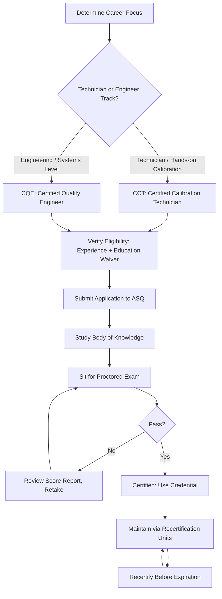

## Quality and Metrology Certification Paths

### Definition and Scope

Quality and metrology certification paths are structured professional credentialing programs that validate an individual's competency in quality engineering, quality management, calibration, and measurement science. These certifications are issued by accredited professional bodies following a standardized process — typically requiring a combination of education/experience eligibility, a proctored examination, and periodic recertification through continuing education.

For professionals in precision metrology and quality control, certification serves as third-party verification of competency, often required or preferred for roles in regulated industries (aerospace, medical device, automotive) and frequently referenced in ISO/IEC 17025 personnel competency requirements.

### Primary Certifying Bodies

| Body | Full Name | Primary Focus |
| --- | --- | --- |
| ASQ | American Society for Quality | Quality engineering, quality auditing, calibration, reliability |
| ASQ (ANAB-accredited) | — | ASQ certification programs are accredited by ANAB under ISO/IEC 17024 |
| NCSLI | NCSL International | Metrology-specific professional development (training-focused, less exam-certification-centric than ASQ) |
| IEST | Institute of Environmental Sciences and Technology | Environmental testing, cleanroom/contamination control certification |
| ASNT | American Society for Nondestructive Testing | NDT-specific certifications (relevant to inspection-heavy metrology roles) |

ASQ's Certified Quality Engineer program is accredited by the ANSI National Accreditation Board (ANAB) under the ISO 17024 standard, which provides third-party validation of the certification program's development, implementation, and maintenance against recognized international standards — a relevant detail for organizations requiring accredited personnel competency evidence under ISO/IEC 17025 clause 6.2. [asq](https://asq.org/cert/quality-engineer)

### Key ASQ Certifications Relevant to Metrology and QC

**Certified Calibration Technician (CCT)**

A Certified Calibration Technician tests, calibrates, maintains, and repairs electrical, mechanical, electromechanical, analytical, and electronic measuring, recording and indicating instruments and equipment for conformance to established standards. [asq](https://asq.org/cert/calibration-technician)

Eligibility: Candidates must have worked in a full-time, paid role, and must have five years of on-the-job experience in one or more of the areas of the Certified Calibration Technician Body of Knowledge. Individuals who hold a diploma or degree from a technical school, college, or university may be eligible for up to two years of experience waiver. [asq](https://asq.org/cert/resource/pdf/certification/2025-ASQ-Certification-Candidate-Handbook.pdf)[asq](https://asq.org/cert/calibration-technician)

Exam format: When taken digitally, the CCT exam consists of 135 questions, with four hours and eighteen minutes to complete it. The pencil and paper version is a 125-question, four-hour exam. [ag5](https://www.ag5.com/?p=34078)

Recertification: CCT certifications are valid for three years, during which certification holders must earn 18 recertification units through ASQ-recognized professional development. [ag5](https://www.ag5.com/?p=34078)

[Unverified] Some secondary sources report differing experience minimums (e.g., two years) and differing recertification unit counts (e.g., 30 RUs) for CCT — these figures could not be corroborated against ASQ's own current published requirements and should be treated with caution; the figures cited above are drawn from ASQ's official page and the 2025 ASQ Certification Candidate Handbook.

**Certified Quality Engineer (CQE)**

Eligibility: 8 years of on-the-job experience in one or more of the areas of the Certified Quality Engineer Body of Knowledge, with at least 3 years of that experience in a "decision-making" position, defined as the authority to define, execute, or control projects/processes and to be responsible for the outcome, which may or may not include management or supervisory positions. [asq](https://asq.org/cert/quality-engineer)[asq](https://asq.org/cert/quality-engineer)

Education waivers: a technical diploma waives 1 year, an associate's degree waives 2 years, a bachelor's degree waives 4 years, and a master's or doctorate waives 5 years of the 8-year requirement (only one waiver may be claimed). [ascm](https://www.mty.ascm.org/cqe-eligibility-requirements)

Cross-credentialing: candidates who hold ASQ certifications such as CQA, CRE, CSQE, CMQ/OE, or CSQP may apply that experience toward CQE certification. [ascm](https://www.mty.ascm.org/cqe-eligibility-requirements)

**Certified Quality Technician (CQT)** and **Certified Quality Auditor (CQA)** are adjacent ASQ credentials commonly pursued alongside or before CQE/CCT, targeting technician-level and audit-focused competencies respectively; [Unverified] their specific current eligibility figures were not directly verified in this session and should be checked against ASQ's official pages before being cited as authoritative.

### Certification Pathway Structure

### Body of Knowledge Domains (Representative)

**CCT Body of Knowledge** typically spans: measurement uncertainty, instrument calibration procedures, metrology principles, traceability, quality management systems basics, and calibration documentation.

**CQE Body of Knowledge** (per ASQ's published pillar structure) spans:

- Management and Leadership
- The Quality System
- Product and Process Design
- Product and Process Control
- Continuous Improvement
- Quantitative Methods and Tools
- Risk Management

The Certified Quality Engineer body of knowledge and applied technologies include development and operation of quality control systems, application and analysis of testing and inspection procedures, the ability to use metrology and statistical methods to diagnose and correct improper quality control practices, familiarity with quality cost concepts, and the knowledge to audit quality systems for deficiency identification and correction. [asq](https://asq.org.in/certification/certified-quality-engineer-cqe/)

### Comparison: CCT vs. CQE

| Dimension | CCT | CQE |
| --- | --- | --- |
| Target role level | Hands-on calibration technician | Quality engineer / systems-level role |
| Minimum experience | 5 years (education waivers up to 2 years) | 8 years (education waivers up to 5 years) |
| Decision-making requirement | Not specified as a distinct sub-requirement | 3 of the 8 years must be in a decision-making role |
| Focus areas | Instrument calibration, measurement uncertainty, traceability | Broader quality systems, statistical methods, risk management, auditing |
| Typical career stage | Entry-to-mid career technical roles | Mid-to-senior engineering/quality roles |

### Exam Logistics (as of verified sources)

- CCT exam fee: $460 for the certification exam, with retakes at $260, and ASQ members save $100 on the initial examination fee. [asq](https://asq.org/cert/calibration-technician)
- CQE exam fee: $550 for the exam, with retakes at $350, and ASQ members save $100 on the initial examination fee. [asq](https://asq.org/cert/quality-engineer)
- Both CCT and CQE share the same next computer-based testing (CBT) window of August 1–31, 2026, with an application deadline of July 13, 2026, per ASQ's official certification pages current as of this search. [asq](https://asq.org/cert/quality-engineer)[asq](https://asq.org/cert/calibration-technician)

[Inference] Exam fees and testing windows are subject to periodic ASQ revision; the figures above reflect what was published on ASQ's official site at time of verification and should be reconfirmed directly on asq.org before an applicant commits to a testing cycle, since pricing and schedules are administrative details that change independently of the underlying body of knowledge.

### Recertification and Maintenance

ASQ certifications are not permanent; they require periodic renewal to remain valid. This typically involves:

- Accumulating a specified number of Recertification Units (RUs) through activities such as continuing education, conference attendance, publishing, or professional service
- Submitting renewal documentation before the certification's expiration date
- Optionally retaking the exam if RU accumulation is not pursued (policy-dependent)

CCT certifications are valid for three years, during which certification holders must earn 18 recertification units through the ASQ. [Unverified] Whether this RU count applies identically to CQE recertification was not independently confirmed in this session; RU requirements can differ by certification level and should be checked against the specific certification's current handbook. [ag5](https://www.ag5.com/?p=34078)

### Adjacent and Complementary Credentials

Beyond ASQ's core quality/calibration certifications, professionals in precision metrology commonly pursue:

- **Six Sigma Green Belt / Black Belt** (offered by ASQ and other bodies): statistical process improvement methodology certification, complementary to but distinct from CQE
- **ISO/IEC 17025 internal auditor training**: not a personal "certification" in the ASQ sense but often a required competency record for lab personnel under accreditation
- **Manufacturer-specific instrument certification**: training/certification on specific CMM, scanning, or calibration equipment platforms, issued by equipment vendors rather than professional bodies
- **NIST-affiliated or national metrology institute training programs**: specialized courses in measurement uncertainty and traceability, often non-certifying but professionally valuable

[Inference] The relative career value of pursuing ASQ certification versus vendor-specific or Six Sigma credentials depends heavily on target industry and employer expectations; no universal ranking of "best" certification exists independent of the specific role and sector.

### Common Pitfalls in Certification Planning

- Underestimating the experience-verification documentation burden — ASQ requires detailed job role descriptions, not just years of tenure
- Assuming education alone substitutes for the full experience requirement rather than partially waiving it
- Neglecting to track recertification units proactively, leading to lapsed certification status
- Choosing a certification track (CCT vs. CQE) that doesn't align with actual job responsibilities, reducing its practical signaling value to employers
- Relying on outdated fee/schedule information from secondary sources rather than the certifying body's current official page

### Related Topics

- ISO/IEC 17025 personnel competency requirements (clause 6.2)
- Six Sigma Green Belt / Black Belt certification frameworks
- Measurement uncertainty analysis (GUM) as a certification exam domain
- Calibration traceability chains and national metrology institutes
- Continuing education and recertification unit (RU) tracking practices
- Career progression from calibration technician to quality engineer roles
- ASQ Body of Knowledge study resources and exam preparation strategies