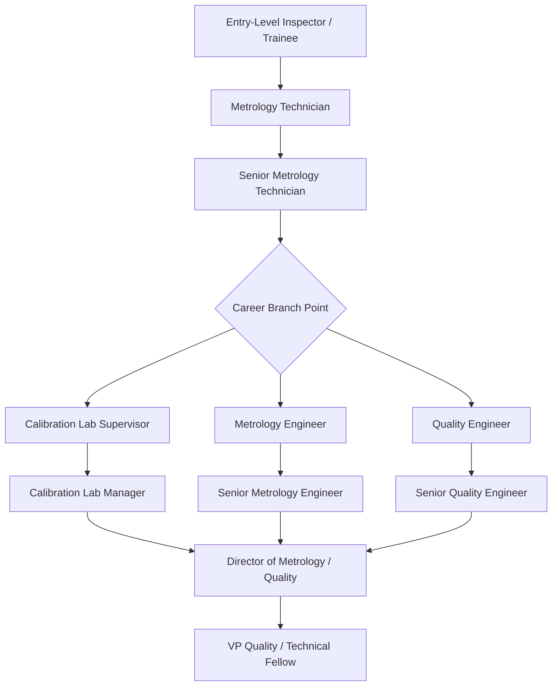

## Metrology Technician Career Progression

### Definition and Scope

Metrology technician career progression describes the typical trajectory of roles, responsibilities, and skill accumulation for professionals working in dimensional and physical measurement — from entry-level inspection work through senior technical and engineering leadership positions. Progression is shaped by a combination of hands-on measurement experience, formal education, professional certification, and increasing scope of decision-making authority.

This differs from a generic "quality career path" in that metrology progression is anchored specifically in measurement competency — instrument operation, calibration, uncertainty analysis, and traceability — rather than broader quality system management, though the two paths frequently converge at senior levels.

### Typical Career Progression Stages

### Stage-by-Stage Role Description

**Entry-Level Inspector / Trainee**

Typical responsibilities: operating basic hand tools (calipers, micrometers, gauges) under supervision, recording measurement data, following documented procedures without deviation authority.

Typical education: high school diploma or equivalent, often paired with on-the-job training or a technical certificate program.

Skill focus: basic measurement technique, reading engineering drawings, understanding tolerance specifications.

**Metrology Technician**

Typical responsibilities: independently operating CMMs, optical comparators, and precision gauges; performing routine calibration of shop-floor instruments; documenting results per SOPs; recognizing out-of-tolerance conditions and escalating appropriately.

Typical education: associate degree in metrology, manufacturing technology, or equivalent experience-based progression.

Skill focus: instrument programming (basic CMM part programs), understanding of measurement uncertainty concepts, GD&T interpretation.

**Senior Metrology Technician**

Typical responsibilities: complex CMM programming (including multi-axis and free-form scanning routines), leading calibration of critical/complex instruments, training junior technicians, participating in root-cause investigations for measurement discrepancies.

Skill focus: advanced GD&T, uncertainty budget construction, first-article inspection reporting, cross-referencing multiple measurement methods for verification.

**Branch Point: Technical Track vs. Management Track**

At the senior technician level, career paths typically diverge:

*Calibration Lab Supervisor/Manager track*: emphasizes personnel management, lab scheduling, accreditation maintenance (e.g., ISO/IEC 17025 scope management), budget responsibility for calibration equipment and standards.

*Metrology Engineer track*: emphasizes deeper technical specialization — measurement system design, uncertainty analysis methodology, new equipment evaluation/qualification, advanced statistical analysis (e.g., Gauge R&R studies, measurement system analysis).

*Quality Engineer track*: broadens scope beyond measurement into quality systems, CAPA, supplier quality, and process control — often the path chosen by technicians seeking broader organizational influence over deep measurement specialization.

**Metrology Engineer**

Typical responsibilities: designing measurement plans for new products, specifying gauge/fixture requirements, conducting Measurement System Analysis (MSA) studies, evaluating and qualifying new metrology equipment, developing uncertainty budgets for critical measurements.

Typical education: bachelor's degree in mechanical/manufacturing engineering or related field, often combined with substantial technician-level experience.

**Calibration Lab Manager / Director of Metrology**

Typical responsibilities: overall accreditation compliance (ISO/IEC 17025), strategic equipment investment decisions, cross-departmental coordination between metrology, quality, and manufacturing engineering, personnel development and succession planning.

### Skill Progression Matrix

| Career Stage | Instrument Complexity | Autonomy Level | Analytical Depth | Typical Certification Target |
| --- | --- | --- | --- | --- |
| Entry-Level Inspector | Manual hand tools | Supervised, follows fixed procedure | Basic pass/fail reading | None required; on-the-job training |
| Metrology Technician | CMM, optical comparators, basic calibration | Independent within defined scope | Tolerance interpretation, basic statistics | ASQ CCT (entry-level pathway) |
| Senior Metrology Technician | Multi-axis CMM, scanning systems | Escalation authority, trains others | Uncertainty budgets, MSA basics | ASQ CCT (full eligibility) |
| Metrology Engineer | Full equipment portfolio, new equipment evaluation | Defines procedures for others | Full uncertainty analysis, GR&R design | ASQ CQE |
| Calibration Lab Manager | Oversees full lab portfolio | Organizational decision authority | Strategic/accreditation-level analysis | ASQ CQE, CMQ/OE |

[Inference] The certification alignment shown above reflects typical eligibility fit based on the experience/education thresholds for ASQ credentials (verified in a prior session) rather than a mandatory requirement — many technicians and engineers progress successfully without formal certification, particularly in organizations that rely on internal qualification programs instead of third-party credentials.

### Compensation Progression Considerations

[Speculation] Compensation figures vary significantly by geographic region, industry sector (aerospace/defense typically commands a premium over general manufacturing), and whether a role sits in a union or non-union environment; citing specific salary figures here would risk presenting stale or regionally inapplicable data as general fact. Professionals researching compensation benchmarks for their specific region and sector should consult current labor market data (e.g., national labor statistics agencies or industry salary surveys) rather than relying on generalized figures.

### Key Competency Areas Across the Career Arc

**Measurement Fundamentals** (all stages): Understanding of accuracy, precision, resolution, repeatability, and reproducibility; correct use of measurement tools within their designed application range.

**Statistical Competency** (increasing with seniority):

- Entry: basic mean/range calculations for control charting
- Mid-career: Gauge R&R (Repeatability and Reproducibility) studies:

$$\%GRR = \left( \frac{\sigma_{GRR}}{\sigma_{Total}} \right) \times 100$$

Where $\sigma_{GRR}$ is the combined repeatability and reproducibility variation and $\sigma_{Total}$ is total observed variation. A %GRR below 10% is commonly considered an acceptable measurement system, 10–30% marginal (acceptable depending on application criticality), and above 30% unacceptable — though [Unverified] the specific acceptance thresholds an organization applies are frequently customer- or industry-standard-driven (e.g., AIAG MSA reference manual guidance) rather than universal.

- Senior/engineering level: full measurement uncertainty budget construction combining Type A (statistical) and Type B (non-statistical, e.g., from calibration certificates) uncertainty components per the GUM (Guide to the Expression of Uncertainty in Measurement) framework.

**GD&T Proficiency** (increasing with seniority): from reading basic tolerance callouts at entry level to interpreting complex datum reference frames, composite tolerancing, and true position calculations at senior/engineering levels.

**Software/Programming Competency**: CMM part programming (offline and on-machine), increasingly including scripting/automation skills for measurement data pipelines as labs digitize workflows (see LIMS integration).

### Example: Gauge R&R Study Progression Illustration

A technician progressing in analytical capability might move from:

1. **Entry-level**: reading a single measurement against a go/no-go gauge, recording pass/fail
2. **Technician-level**: taking repeated measurements of the same part with the same instrument and calculating basic repeatability (standard deviation of repeated readings)
3. **Senior/Engineer-level**: designing and executing a full crossed Gauge R&R study with multiple operators, multiple parts, and multiple trials, then partitioning variance into part-to-part, repeatability, and reproducibility components to certify a measurement system for production use

### Common Career Progression Obstacles

- Plateauing at the technician level due to lack of access to statistical/analytical training beyond basic tool operation
- Organizations lacking a defined technical (non-management) career ladder, forcing technically-inclined staff into management roles to advance compensation, even when their strengths lie in hands-on measurement work
- Insufficient exposure to uncertainty analysis and GUM methodology, which becomes a limiting factor when pursuing engineer-level or accreditation-related roles
- Certification pursued without aligned job scope, reducing the credential's practical career impact
- Narrow specialization in a single measurement technology (e.g., only contact CMM) without exposure to complementary methods (optical, CT scanning), limiting versatility as measurement technology evolves

### Related Topics

- ASQ Certified Calibration Technician (CCT) and Certified Quality Engineer (CQE) certification paths
- Measurement System Analysis (MSA) and Gauge R&R methodology
- Measurement uncertainty analysis and the GUM framework
- ISO/IEC 17025 personnel competency and accreditation requirements
- GD&T (Geometric Dimensioning and Tolerancing) proficiency development
- CMM programming and multi-sensor metrology skill development
- Transition pathways from metrology technician to quality engineering roles