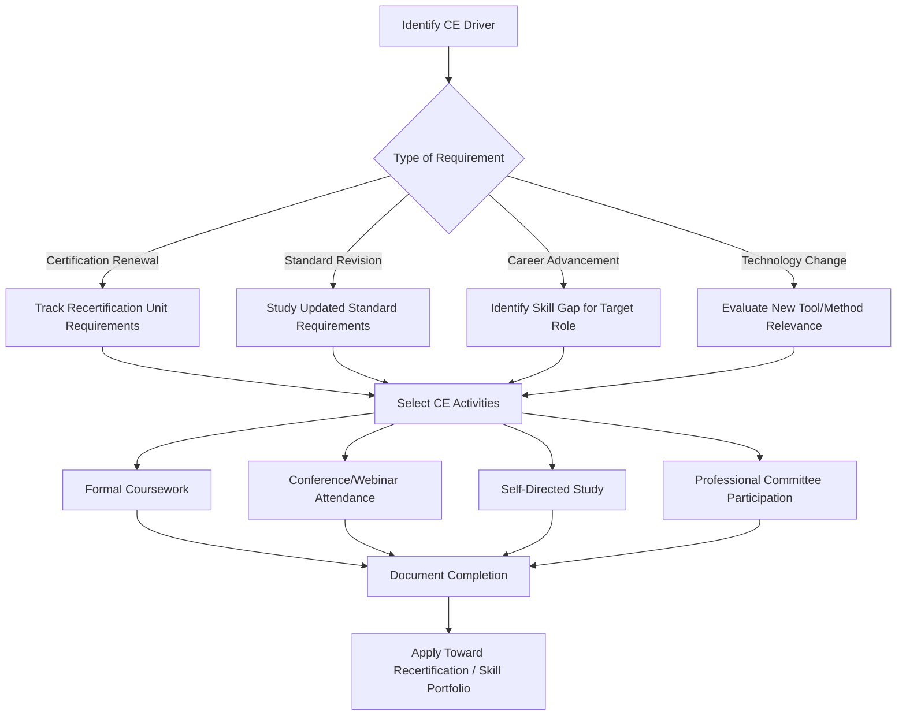

## Continuing Education in Quality Engineering

### Definition and Scope

Continuing education in quality engineering refers to the ongoing acquisition of knowledge, skills, and credentials by quality professionals after initial formal education or certification, undertaken to maintain competency, meet certification renewal requirements, and adapt to evolving standards, tools, and methodologies. It spans formal coursework, professional certifications, conference participation, self-directed study, and employer-sponsored training.

This is distinct from initial certification (covered under certification paths) in that continuing education is an ongoing, often mandatory, process tied to maintaining — not first obtaining — professional standing, and it also encompasses learning that has no formal credentialing component at all (e.g., staying current on a new statistical technique or software tool).

### Drivers of Continuing Education Requirements

**Certification Recertification Mandates**

Professional certifications from bodies such as ASQ require periodic renewal through accumulation of Recertification Units (RUs), earned via documented professional development activities. This creates a structural, time-bound requirement rather than a purely voluntary pursuit.

**Standards and Regulatory Evolution**

Quality standards (ISO 9001, ISO/IEC 17025, IATF 16949, AS9100) undergo periodic revision cycles. Practitioners must update their knowledge when a standard's requirements change to remain effective in audit, compliance, and system-design roles.

**Technology and Methodology Evolution**

New measurement technologies (e.g., advances in optical metrology, expanded use of machine learning in defect detection), evolving software platforms (LIMS, EQMS), and refined statistical methodologies require ongoing skill updates beyond what initial education provided.

**Career Progression Requirements**

Advancement into engineering, management, or specialized technical roles (as outlined in metrology technician career progression) often requires acquiring new competencies — statistical methods, leadership skills, or domain-specific knowledge — not covered in a professional's original training.

### Continuing Education Pathway Structure

### Categories of Continuing Education Activities

**Formal Coursework**

University extension courses, technical college programs, or vendor-delivered training on specific tools/methods (e.g., a course on Measurement System Analysis, a Six Sigma Green Belt program, or software-specific LIMS/EQMS administrator training).

**Conference and Webinar Participation**

Attendance at industry conferences (e.g., ASQ World Conference on Quality and Improvement, NCSL International Workshop and Symposium) provides exposure to emerging practices and networking, and typically qualifies for recertification credit when documented.

**Self-Directed Study**

Reading current editions of standards, technical papers, and reference texts (e.g., the GUM, AIAG MSA reference manual, ISO/IEC 17025 revisions). [Inference] Self-directed study is generally the least verifiable form of continuing education for recertification purposes, since certifying bodies typically require documented evidence of structured activity (attendance records, completion certificates) rather than accepting general reading as sufficient on its own.

**Professional Committee and Standards Body Participation**

Serving on standards-development committees (e.g., ASQ technical committees, ASTM or ISO working groups) provides deep exposure to the reasoning behind standards changes and often counts significantly toward recertification requirements.

**Internal/Employer-Sponsored Training**

Company-provided training on internal procedures, new equipment, or software systems. While valuable for job performance, [Unverified] the extent to which internal-only training qualifies for external certification recertification units depends on the specific certifying body's documentation requirements and is not universally creditable without proper record-keeping.

**Mentorship and Peer Learning**

Structured mentorship relationships or communities of practice, increasingly recognized by some professional bodies as a valid continuing education activity when formally documented.

### Recertification Unit (RU) Accumulation Example

Based on verified ASQ certification structures (see certification paths content), a Certified Calibration Technician must earn a defined number of recertification units within a three-year certification cycle. A representative RU accumulation plan might allocate credit across multiple activity types:

| Activity | Approximate RU Value (illustrative) | Frequency |
| --- | --- | --- |
| Attend industry conference | Moderate | 1x per cycle |
| Complete vendor training course | Moderate | 1-2x per cycle |
| Publish technical article | Higher | Opportunistic |
| Serve on standards committee | Higher (ongoing) | Continuous |
| Complete online CE modules | Lower per module | Multiple as needed |

[Unverified] Exact RU point values per activity type are specific to each certifying body's current recertification handbook and change between publication cycles; a professional planning recertification should consult the certifying body's current official recertification guide rather than relying on generalized point estimates, since misjudging accumulated RUs risks certification lapse.

### Standards Revision Tracking as a Continuing Education Discipline

A structured approach to staying current with standards revisions:

1. **Monitor announcement channels**: subscribe to updates from relevant standards bodies (ISO, ASQ, AIAG) for draft/revision announcements
2. **Perform gap analysis**: upon a new revision's publication, compare prior vs. current clause requirements to identify what changed
3. **Update internal procedures**: translate standard changes into updated SOPs, forms, or software configuration (e.g., updated EQMS workflow templates)
4. **Retrain affected personnel**: ensure staff whose work is governed by the revised clauses receive updated training, with records retained as both a compliance and continuing-education artifact

### Illustration: Individual CE Tracking Record (svg_diagram)

<svg xmlns="http://www.w3.org/2000/svg" viewBox="0 0 700 320">
<text x="350" y="24" text-anchor="middle" font-size="16" font-weight="bold" fill="#1a1a1a">Continuing Education Tracking Timeline (svg_diagram)</text>
<line x1="60" y1="160" x2="660" y2="160" stroke="#333" stroke-width="2" />
<circle cx="100" cy="160" r="8" fill="#4a6fa5" />
<text x="100" y="140" text-anchor="middle" font-size="11" fill="#1a1a1a">Cert Issued</text>
<text x="100" y="185" text-anchor="middle" font-size="10" fill="#555">Year 0</text>
<circle cx="240" cy="160" r="8" fill="#c98a1c" />
<text x="240" y="140" text-anchor="middle" font-size="11" fill="#1a1a1a">Conference</text>
<text x="240" y="185" text-anchor="middle" font-size="10" fill="#555">Year 1</text>
<circle cx="380" cy="160" r="8" fill="#2e7d4f" />
<text x="380" y="140" text-anchor="middle" font-size="11" fill="#1a1a1a">Standard Revision Training</text>
<text x="380" y="185" text-anchor="middle" font-size="10" fill="#555">Year 1.5</text>
<circle cx="500" cy="160" r="8" fill="#7b3fa0" />
<text x="500" y="140" text-anchor="middle" font-size="11" fill="#1a1a1a">Vendor Course</text>
<text x="500" y="185" text-anchor="middle" font-size="10" fill="#555">Year 2</text>
<circle cx="620" cy="160" r="8" fill="#a53c3c" />
<text x="620" y="140" text-anchor="middle" font-size="11" fill="#1a1a1a">Recert Submission</text>
<text x="620" y="185" text-anchor="middle" font-size="10" fill="#555">Year 3</text>

<text x="350" y="230" text-anchor="middle" font-size="12" fill="#555">RU accumulation must be documented continuously across the cycle,</text>

<text x="350" y="248" text-anchor="middle" font-size="12" fill="#555">not compiled retroactively before submission deadline</text>

</svg>

### Emerging Areas Warranting Continuing Education Attention

- **Digitalization of quality data**: shift from paper-based to integrated LIMS/EQMS platforms requiring new software competency
- **Data analytics and statistical software**: growing use of statistical software packages and scripting (e.g., Python/R-based analysis) alongside traditional SPC tools
- **Risk-based thinking**: increased emphasis in ISO 9001:2015 and subsequent guidance on risk-based approaches to quality management, requiring updated risk assessment skills beyond traditional FMEA
- **Automated inspection and machine vision**: increasing integration of automated optical/vision-based inspection in QC workflows, relevant to metrology professionals whose roles increasingly intersect with automation

[Inference] These emerging areas represent generally recognized industry trends toward digitalization and automation in quality/metrology functions; the pace and specific technologies adopted vary considerably by industry sector and organization size, so a continuing education plan should be tailored to the professional's specific sector rather than assuming uniform relevance of every emerging trend.

### Common Continuing Education Pitfalls

- Deferring CE activity accumulation until close to a recertification deadline, risking insufficient documented RUs
- Pursuing CE activities disconnected from actual job responsibilities or career goals, reducing practical skill value despite satisfying credit requirements
- Failing to retain documentation (certificates, attendance records, activity logs) needed to substantiate RU claims during recertification audit
- Relying solely on employer-provided training without supplementing with external professional development, narrowing exposure to only one organization's practices
- Ignoring standards revision cycles until an audit finding forces reactive catch-up learning, rather than proactive tracking

### Related Topics

- ASQ recertification unit (RU) requirements and documentation practices
- ISO 9001 / ISO/IEC 17025 revision cycles and transition planning
- Six Sigma and statistical methodology training progression
- Professional conference and standards-committee participation as career development
- Digital transformation in quality systems (LIMS, EQMS adoption)
- Measurement System Analysis (MSA) and evolving statistical technique adoption
- Mentorship structures in quality engineering career development