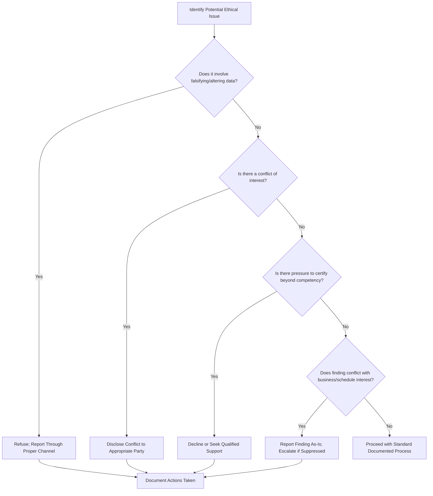

## Professional Ethics in Inspection and Quality Work

### Definition and Scope

Professional ethics in inspection and quality work concerns the principles and standards of conduct governing how quality professionals, inspectors, and metrologists perform their duties — particularly where their findings directly affect product safety, regulatory compliance, financial outcomes, and public trust. Because inspectors and quality engineers often serve as an independent check on production or business pressures, their ethical conduct has outsized consequences: falsified or pressured results can propagate defective or unsafe products into the field.

This differs from general workplace ethics in that quality/inspection roles carry a specific structural tension: the professional is frequently evaluated or employed by the same organization whose output they are meant to objectively assess, creating potential conflicts between organizational pressure (schedule, cost, customer relationships) and professional obligation (accurate, unbiased reporting).

### Core Ethical Principles in Quality and Inspection Work

**Integrity of Data and Reporting**

Reporting measurement results, test outcomes, and inspection findings exactly as observed, without alteration, omission, or selective reporting to achieve a desired outcome. This is the foundational ethical obligation of the field — the entire value of an inspection or quality function collapses if its output cannot be trusted as accurate.

**Independence and Objectivity**

Maintaining professional judgment free from undue influence by production schedules, sales pressure, management directives, or personal relationships with those being inspected/audited. ISO/IEC 17025 explicitly requires laboratories to identify risks to impartiality and take action to minimize or eliminate them.

**Confidentiality**

Protecting proprietary information encountered during inspection, audit, or testing work — particularly relevant when a quality professional works across multiple client organizations (e.g., third-party inspection/certification bodies) or has access to competitor-sensitive data during supplier audits.

**Competency Boundaries**

Only performing or certifying work within one's actual demonstrated competency, and disclosing limitations rather than overstating capability — directly tied to the personnel competency requirements found in accreditation standards like ISO/IEC 17025.

**Public Safety Priority**

Recognizing that in many quality/inspection contexts (aerospace, medical devices, food safety, structural engineering-adjacent metrology), the professional's findings have direct public safety implications that must take priority over organizational or personal convenience.

**Non-Retaliation Awareness**

Understanding organizational and, in some jurisdictions, legal protections for professionals who report non-conformances, safety concerns, or ethical violations without fear of professional retaliation — often formalized as whistleblower protections in regulated industries.

### Formal Codes of Ethics

Professional bodies in the quality field typically publish formal codes of ethics that certified members agree to uphold. Common thematic elements across such codes generally include:

- Acting with honesty and integrity in professional and business relationships
- Avoiding conflicts of interest, or disclosing them when unavoidable
- Not accepting compensation or benefits that could compromise objectivity
- Maintaining and improving professional competence
- Reporting violations of law or professional standards through appropriate channels
- Treating colleagues, clients, and the public with fairness and respect

[Inference] The specific wording and enforcement mechanisms of ethics codes vary between professional bodies (e.g., ASQ's Code of Ethics versus a corporate internal ethics policy versus a national engineering licensure board's code), and a professional should reference the exact code applicable to their specific certification or licensure rather than assuming universal identical wording across bodies.

### Ethical Decision-Making Framework

### Common Ethical Dilemma Scenarios in Inspection/QC Work

**Schedule Pressure vs. Accurate Reporting**

An inspector is pressured to pass a batch that failed inspection because a shipment deadline is imminent. Ethical obligation requires reporting the true result regardless of schedule consequence; the resolution mechanism (rework, deviation/concession process, customer notification) is a separate business decision that must follow the accurate finding, not precede or override it.

**Conflict of Interest in Supplier Audits**

An auditor has a personal or financial relationship with a supplier being audited. Ethical practice requires disclosure of the relationship and, typically, recusal or reassignment rather than proceeding while the conflict is undisclosed.

**Calibration/Traceability Shortcuts**

Pressure to use an instrument past its calibration due date, or to accept a calibration certificate without verifying its traceability, to avoid production downtime. This directly undermines the metrological validity of all downstream measurements and reports.

**Statistical Manipulation**

Selectively excluding "outlier" data points without documented, defensible justification (as opposed to legitimate statistical outlier analysis) to make a process appear more capable than it is — a subtle form of data integrity violation that can be harder to detect than outright falsification.

**Whistleblowing on Systemic Issues**

Discovering that management is aware of and tolerating a systemic quality issue (e.g., routinely overriding failed inspection results) rather than an isolated incident. This escalates the ethical obligation from individual reporting to potentially engaging external regulatory or accreditation bodies if internal channels fail to act.

### Regulatory and Standards Linkage

- **ISO/IEC 17025 (clause 4/8, impartiality and confidentiality)**: Requires laboratories to have policies and procedures for identifying and managing threats to impartiality and to ensure confidentiality of information obtained in the course of laboratory activities.
- **ISO 9001**: While not framed explicitly as an "ethics" clause, its emphasis on documented objective evidence and internal audit independence indirectly supports ethical data integrity practices.
- **21 CFR Part 11 / Part 820** (FDA-regulated environments): Electronic record integrity requirements (audit trails, access controls) are partly designed to structurally prevent and detect data falsification, reflecting a regulatory response to data integrity risk.
- **Data Integrity Frameworks (e.g., ALCOA/ALCOA+ principles)**: Widely referenced in regulated industries, requiring data to be Attributable, Legible, Contemporaneous, Original, and Accurate (plus Complete, Consistent, Enduring, and Available in the "+" extension). [Unverified] The specific ALCOA+ framework originates predominantly from pharmaceutical/FDA regulatory guidance; its application terminology in non-pharma metrology/QC contexts may vary and should be checked against the specific industry's governing regulatory guidance.

### Organizational Structures That Support Ethical Practice

| Structure | Function |
| --- | --- |
| Independent quality reporting line | Quality/inspection function reports to a chain not solely controlled by production management, reducing pressure to suppress unfavorable findings |
| Anonymous reporting mechanisms | Allows staff to report suspected data integrity or ethics violations without immediate identification |
| Documented deviation/concession process | Provides a formal, traceable path for accepting non-conforming results when justified, rather than informally overriding inspection findings |
| Audit trail requirements in LIMS/EQMS | Technical control that makes unauthorized data alteration detectable after the fact |
| Periodic ethics training | Reinforces awareness of codes of conduct and provides scenario-based practice in ethical decision-making |

### Illustration: Impartiality Risk Map (svg_diagram)

<svg xmlns="http://www.w3.org/2000/svg" viewBox="0 0 700 300">
<text x="350" y="24" text-anchor="middle" font-size="16" font-weight="bold" fill="#1a1a1a">Impartiality Risk Sources in Inspection Work (svg_diagram)</text>
<circle cx="350" cy="160" r="70" fill="#f3e8fd" stroke="#7b3fa0" stroke-width="2" />
<text x="350" y="155" text-anchor="middle" font-size="12" font-weight="bold" fill="#1a1a1a">Inspector /</text>
<text x="350" y="172" text-anchor="middle" font-size="12" font-weight="bold" fill="#1a1a1a">Quality Role</text>
<rect x="40" y="50" width="140" height="50" rx="6" fill="#fde8e8" stroke="#a53c3c" stroke-width="1.5" />
<text x="110" y="72" text-anchor="middle" font-size="11" fill="#1a1a1a">Schedule /</text>
<text x="110" y="88" text-anchor="middle" font-size="11" fill="#1a1a1a">Delivery Pressure</text>
<line x1="180" y1="90" x2="290" y2="130" stroke="#a53c3c" stroke-width="1.5" />
<rect x="520" y="50" width="140" height="50" rx="6" fill="#fde8e8" stroke="#a53c3c" stroke-width="1.5" />
<text x="590" y="72" text-anchor="middle" font-size="11" fill="#1a1a1a">Financial /</text>
<text x="590" y="88" text-anchor="middle" font-size="11" fill="#1a1a1a">Compensation Ties</text>
<line x1="520" y1="90" x2="410" y2="130" stroke="#a53c3c" stroke-width="1.5" />
<rect x="40" y="220" width="140" height="50" rx="6" fill="#fde8e8" stroke="#a53c3c" stroke-width="1.5" />
<text x="110" y="242" text-anchor="middle" font-size="11" fill="#1a1a1a">Personal</text>
<text x="110" y="258" text-anchor="middle" font-size="11" fill="#1a1a1a">Relationships</text>
<line x1="180" y1="230" x2="290" y2="190" stroke="#a53c3c" stroke-width="1.5" />
<rect x="520" y="220" width="140" height="50" rx="6" fill="#fde8e8" stroke="#a53c3c" stroke-width="1.5" />
<text x="590" y="242" text-anchor="middle" font-size="11" fill="#1a1a1a">Reporting Line</text>
<text x="590" y="258" text-anchor="middle" font-size="11" fill="#1a1a1a">to Production Mgmt</text>
<line x1="520" y1="230" x2="410" y2="190" stroke="#a53c3c" stroke-width="1.5" />
</svg>

### Practical Guidance for Navigating Ethical Situations

1. **Document contemporaneously**: record findings and any pressure encountered at the time it occurs, not retrospectively
2. **Escalate through defined channels first**: use internal quality management or ethics reporting structures before external escalation, unless immediate safety risk or internal channel failure warrants otherwise
3. **Separate the finding from the business decision**: report the true result; let the deviation/concession/MRB (Material Review Board) process handle disposition
4. **Know applicable whistleblower protections**: understand what legal protections, if any, apply in the relevant jurisdiction and industry before escalating externally
5. **Consult the specific professional code of ethics**: refer to the exact code governing one's certification/licensure rather than relying on general ethical intuition alone when a situation is ambiguous

### Common Ethical Failure Patterns in Industry

- Gradual normalization of minor data adjustments ("just this once") that erode into systemic practice over time
- Quality personnel reporting to production management, structurally incentivizing suppression of unfavorable findings
- Absence of a clear, trusted internal reporting mechanism, forcing staff to choose between silence and risky external escalation
- Overreliance on a single inspector's judgment without independent verification for high-consequence measurements
- Certification bodies or auditors with undisclosed financial relationships to the organizations they assess

### Related Topics

- ISO/IEC 17025 impartiality and confidentiality requirements (clause 4)
- ALCOA/ALCOA+ data integrity principles in regulated industries
- ASQ Code of Ethics and professional conduct standards
- Material Review Board (MRB) and deviation/concession processes
- Whistleblower protection frameworks in regulated manufacturing sectors
- Audit trail and electronic record integrity controls (21 CFR Part 11)
- Organizational structures for independent quality reporting lines