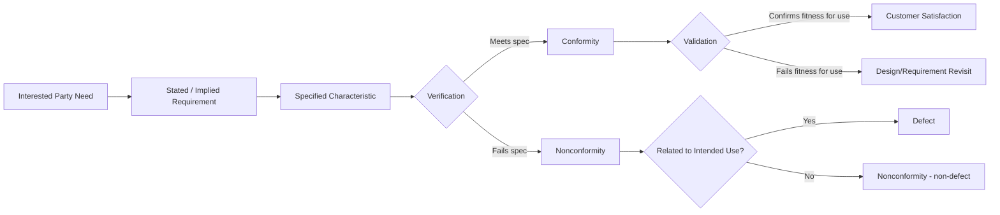

## Defining Quality Concepts and Terminology

### Overview

Quality management rests on a shared vocabulary. Before an organization can design, implement, or audit a Quality Management System (QMS), its people must use terms consistently — otherwise "quality," "verification," and "conformity" mean different things to different departments, auditors, and customers. ISO 9000:2015 (*Quality management systems — Fundamentals and vocabulary*) is the normative source for this vocabulary and underpins ISO 9001, ISO 14001, ISO 45001, and most other management system standards.

### Core Definition of Quality

**Key Points**

- ISO 9000:2015 defines quality as the *"degree to which a set of inherent characteristics of an object fulfils requirements."*
- Quality is not absolute; it is measured relative to stated or implied **requirements**.
- Quality can be graded — a product can have "high quality" or "low quality" relative to its class or intended use, while still fulfilling requirements for that class.
- Quality applies to any **object**: a product, service, process, organization, system, resource, or even a person or combination thereof.

This definition deliberately separates quality from cost or luxury. A no-frills product that consistently meets its stated requirements has high quality within that context; a premium product that fails to meet its specifications does not.

### Foundational Terminology

#### Requirement

A *need or expectation that is stated, generally implied, or obligatory*. Requirements can originate from:

- Customers (contractual or expressed needs)
- Interested parties (regulators, shareholders, employees)
- The organization itself (internal policy)
- Statutory and regulatory bodies (legal obligations)

"Generally implied" requirements are those considered customary or common practice even when not explicitly stated — for example, a packaged food product is implicitly expected to be safe to eat.

#### Characteristic

A *distinguishing feature*. Characteristics may be:

- **Inherent** — existing in the object itself (e.g., the tensile strength of a bolt), as opposed to *assigned* characteristics (e.g., the price of the bolt, which is not intrinsic to it).
- Qualitative or quantitative, and may relate to physical, sensory, behavioral, temporal, ergonomic, or functional properties.

#### Conformity vs. Nonconformity

- **Conformity**: fulfilment of a requirement.
- **Nonconformity**: non-fulfilment of a requirement.
- **Defect**: nonconformity related to an *intended or specified use*, which carries legal connotations (e.g., product liability), distinguishing it from ordinary nonconformity.

#### Grade

A *category or rank given to different quality requirements for objects having the same functional use*. Grade explains why a "five-star" hotel and a "budget" hotel can both have high quality if each fulfils the requirements defined for its grade.

#### Capability

The *ability of an object to realize an output that will fulfil the requirements* for that output — often discussed at the process level (process capability, $C_{pk}$).

### The Management System Vocabulary Cluster

| Term | ISO 9000:2015 Definition (paraphrased) | Distinguishing Note |
| --- | --- | --- |
| Management system | Set of interrelated elements to establish policy, objectives, and processes to achieve those objectives | The umbrella term |
| Quality management system (QMS) | The part of a management system concerned with quality | Subset of the broader management system |
| Top management | Person or group that directs and controls an organization at the highest level | Accountable for QMS effectiveness |
| Policy | Intentions and direction formally expressed by top management | Sets the "why" |
| Objective | Result to be achieved | Measurable, tied to policy |
| Process | Set of interrelated activities that use inputs to deliver an intended result | Building block of the QMS |
| Procedure | Specified way to carry out an activity or process | The "how" |

### Activities That Establish Confidence in Quality

**Key Points**

- **Verification**: confirmation, through objective evidence, that specified requirements have been fulfilled — answers *"Are we building the thing right?"*
- **Validation**: confirmation, through objective evidence, that requirements for a specific intended use have been fulfilled — answers *"Are we building the right thing?"*
- **Inspection**: determination of conformity to specified requirements, typically by measuring, examining, testing, or gauging.
- **Audit**: systematic, independent, and documented process for obtaining objective evidence and evaluating it objectively to determine the extent to which audit criteria are fulfilled.
- **Review**: activity undertaken to determine the suitability, adequacy, or effectiveness of an object to achieve established objectives (e.g., management review).

The verification/validation distinction is one of the most frequently misapplied pairs in practice. A design can be **verified** against its specification (dimensions, tolerances match the drawing) yet fail **validation** if the specification itself was wrong for the customer's actual use case.

### Objective Evidence and Records

- **Objective evidence**: data supporting the existence or verity of something; obtained through observation, measurement, testing, or other means.
- **Record**: document stating results achieved or providing evidence of activities performed — records are typically immutable once created (as opposed to documented information that may be revised, such as a procedure).
- **Documented information**: the umbrella term in ISO 9000:2015 replacing the older separate concepts of "document" and "record"; it must be controlled and maintained or retained.

### Interested Party (Stakeholder) Concepts

- **Interested party (stakeholder)**: person or organization that can affect, be affected by, or perceive itself to be affected by a decision or activity.
- **Customer**: person or organization that could or does receive a product or service intended for, or required by, that person or organization.
- **Customer satisfaction**: customer's perception of the degree to which their expectations have been fulfilled — explicitly noted in ISO 9000:2015 as being achievable even when a customer's expectations are not known, or when they are unrealistic.

### Risk-Based Thinking Terminology

Since the 2015 revision family, ISO management-system standards embed risk concepts directly into core vocabulary:

- **Risk**: effect of uncertainty on an objective — a deviation from the expected, which can be positive or negative.
- **Risk-based thinking**: the qualitative approach used across the standard to determine the factors that could cause processes and the QMS to deviate from planned results.

### Relationship Diagram (svg_diagram)

<svg xmlns="http://www.w3.org/2000/svg" viewBox="0 0 760 420" font-family="Arial, sans-serif">
<text x="380" y="28" font-size="18" font-weight="bold" text-anchor="middle">Core Quality Terminology Relationships (svg_diagram)</text>
<rect x="290" y="50" width="180" height="50" rx="8" fill="#e8f0fe" stroke="#3b5bdb" stroke-width="2" />
<text x="380" y="80" font-size="14" text-anchor="middle">Requirement</text>
<rect x="60" y="150" width="180" height="50" rx="8" fill="#fff3bf" stroke="#e8590c" stroke-width="2" />
<text x="150" y="180" font-size="14" text-anchor="middle">Characteristic</text>
<rect x="530" y="150" width="180" height="50" rx="8" fill="#d3f9d8" stroke="#2f9e44" stroke-width="2" />
<text x="620" y="180" font-size="14" text-anchor="middle">Quality (degree)</text>
<rect x="60" y="260" width="180" height="50" rx="8" fill="#ffe3e3" stroke="#c92a2a" stroke-width="2" />
<text x="150" y="285" font-size="14" text-anchor="middle">Conformity</text>
<text x="150" y="300" font-size="12" text-anchor="middle">fulfils requirement</text>
<rect x="290" y="260" width="180" height="50" rx="8" fill="#ffe3e3" stroke="#c92a2a" stroke-width="2" />
<text x="380" y="285" font-size="14" text-anchor="middle">Nonconformity</text>
<text x="380" y="300" font-size="12" text-anchor="middle">fails requirement</text>
<rect x="530" y="260" width="180" height="50" rx="8" fill="#ffe3e3" stroke="#c92a2a" stroke-width="2" />
<text x="620" y="285" font-size="14" text-anchor="middle">Defect</text>
<text x="620" y="300" font-size="12" text-anchor="middle">nonconformity re: intended use</text>
<rect x="200" y="350" width="180" height="50" rx="8" fill="#e5dbff" stroke="#6741d9" stroke-width="2" />
<text x="290" y="375" font-size="14" text-anchor="middle">Verification</text>
<text x="290" y="390" font-size="11" text-anchor="middle">built it right?</text>
<rect x="400" y="350" width="180" height="50" rx="8" fill="#e5dbff" stroke="#6741d9" stroke-width="2" />
<text x="490" y="375" font-size="14" text-anchor="middle">Validation</text>
<text x="490" y="390" font-size="11" text-anchor="middle">built the right thing?</text>
<line x1="380" y1="100" x2="150" y2="150" stroke="#495057" stroke-width="1.5" marker-end="url(#arrow)" />
<line x1="380" y1="100" x2="620" y2="150" stroke="#495057" stroke-width="1.5" marker-end="url(#arrow)" />
<line x1="150" y1="200" x2="150" y2="260" stroke="#495057" stroke-width="1.5" marker-end="url(#arrow)" />
<line x1="380" y1="100" x2="380" y2="260" stroke="#495057" stroke-width="1.5" marker-end="url(#arrow)" />
<line x1="620" y1="200" x2="620" y2="260" stroke="#495057" stroke-width="1.5" marker-end="url(#arrow)" />
<line x1="380" y1="310" x2="290" y2="350" stroke="#495057" stroke-width="1.5" marker-end="url(#arrow)" />
<line x1="380" y1="310" x2="490" y2="350" stroke="#495057" stroke-width="1.5" marker-end="url(#arrow)" />
</svg>

### Terminology Lifecycle in a QMS Document

### Practical Example

**Example**

A manufacturer produces plastic containers with a specified wall thickness of $2.0\ mm \pm 0.1\ mm$.

- **Requirement**: wall thickness within $1.9$–$2.1\ mm$.
- **Characteristic**: wall thickness (a measurable, inherent property).
- **Inspection**: a technician measures a sample container at $2.15\ mm$.
- **Nonconformity**: the measured value falls outside tolerance.
- **Defect**: if the thin wall causes the container to crack during normal use (its intended use), the nonconformity is now classified as a defect, with potential liability implications.
- **Verification**: confirming the container matches the drawing's dimensional specification.
- **Validation**: confirming the container actually holds liquid without leaking or cracking under real-world handling — even a dimensionally "verified" container could fail validation if the original specification under-estimated drop-impact forces.

### Common Terminology Pitfalls

**Key Points**

- Treating "quality" as a synonym for "excellence" or "luxury" rather than "degree of requirement fulfilment."
- Using "verification" and "validation" interchangeably in procedures and audit checklists.
- Confusing "nonconformity" (a broader term) with "defect" (a narrower, legally-loaded term tied to intended use).
- Referring to any retained document as a "record," when ISO 9000:2015 reserves "record" for documented information that provides evidence of results achieved and is not intended to be revised.
- Assuming grade differences imply quality differences — a lower grade product can still be fully conformant and therefore fully "quality."

**Next Steps**

- Explore ISO 9000:2015 clause structure and how it interrelates with ISO 9001:2015 Annex SL high-level structure.
- Study the seven Quality Management Principles (customer focus, leadership, engagement of people, process approach, improvement, evidence-based decision making, relationship management).
- Examine process approach terminology (input, output, process owner, process interaction).
- Review risk-based thinking terminology in depth, including opportunity, risk appetite, and risk treatment.
- Study documented information control requirements (creation, update, control per ISO 9001:2015 Clause 7.5).