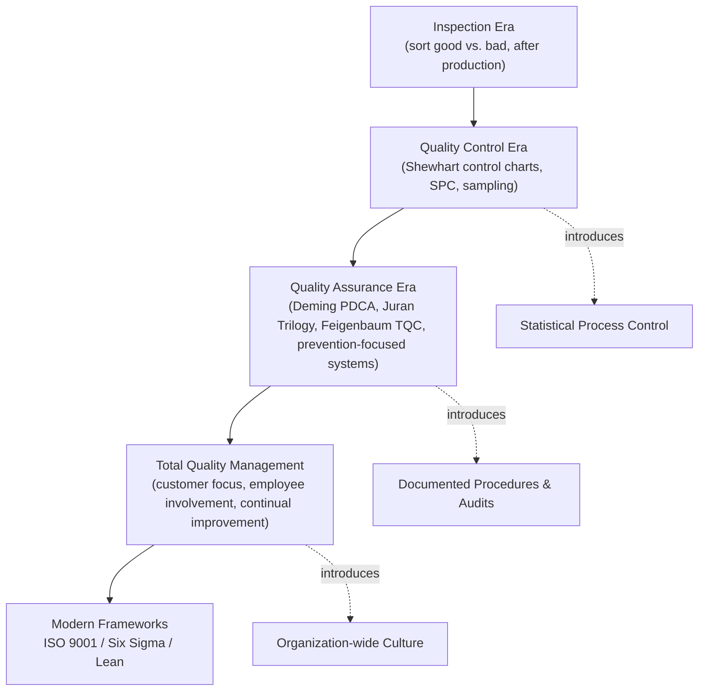

## Evolution of Quality Management from Inspection to Total Quality

### Overview

Quality management did not emerge as a single discipline; it evolved through four broadly recognized eras, each building on and correcting the limitations of the one before it: **Inspection**, **Quality Control (QC)**, **Quality Assurance (QA)**, and **Total Quality Management (TQM)**. Understanding this progression explains why modern QMS frameworks like ISO 9001 emphasize prevention, process ownership, and organization-wide culture rather than end-of-line sorting.

### Era 1: Quality by Inspection (Pre-1920s–1920s)

**Key Points**

- Quality was managed by **detecting** defects after production, not preventing them.
- Dedicated inspectors examined finished goods against a specification and sorted them into "accept" or "reject" piles.
- Rooted in craft-guild traditions and early mass-production factories (notably the Ford assembly line era).
- Entirely **reactive**: defects were found, not avoided, and rework/scrap costs were absorbed after the fact.

**Limitations**

- 100% inspection is costly, slow, and itself imperfect (inspector fatigue, subjective judgment, sampling error).
- No feedback loop into the production process — the same defect could recur indefinitely.
- No statistical basis for deciding how much inspection was "enough."

### Era 2: Statistical Quality Control (1920s–1950s)

**Key Points**

- Catalyzed by **Walter A. Shewhart** at Bell Telephone Laboratories, who in 1924 introduced the **control chart**, distinguishing *common cause* (random, inherent) variation from *special cause* (assignable, correctable) variation.
- Shifted the question from *"Is this unit defective?"* to *"Is this process behaving predictably?"*
- **Statistical Process Control (SPC)** allowed sampling-based monitoring instead of exhaustive inspection.
- **Harold Dodge** and **Harry Romig** developed acceptance sampling plans, formalizing statistically justified sample sizes and rejection criteria.
- World War II accelerated adoption: the U.S. military mandated statistical quality standards (e.g., MIL-STD-105) for wartime production at scale.

**Advancement over Inspection**

Quality control introduced **process monitoring** — the first shift from purely reactive detection toward proactive control, though it remained largely confined to the manufacturing floor and the QC department.

### Era 3: Quality Assurance (1950s–1970s)

**Key Points**

- Quality became a **system-wide, planned discipline** rather than a department's task.
- **W. Edwards Deming**, invited to Japan in 1950, taught statistical methods and — critically — the idea that management, not just workers, was responsible for quality. His **Plan-Do-Check-Act (PDCA)** cycle (building on Shewhart's earlier work) became foundational.
- **Joseph M. Juran** introduced the **Juran Trilogy** (quality planning, quality control, quality improvement) and emphasized quality as fitness for use, driven by management commitment.
- **Armand Feigenbaum** coined **Total Quality Control (TQC)** in 1951, arguing quality must be engineered in at every stage — design, procurement, production, and service — not inspected in afterward.
- **Philip Crosby** later popularized "zero defects" and "quality is free" (cost of poor quality exceeds the cost of prevention).
- Japanese industry, notably **Toyota**, integrated these ideas into what became **Kaizen** (continuous improvement) and the roots of the Toyota Production System.

**Advancement over QC**

QA formalized **prevention over detection**: documented procedures, planned audits, and defined responsibilities aimed to prevent defects from being created, not merely catch them.

### Era 4: Total Quality Management (1980s–present)

**Key Points**

- TQM emerged as Western industry, facing intense competition from Japanese manufacturers, adopted and formalized the QA-era philosophies into a comprehensive management approach.
- Core tenets:
  - **Customer focus** — quality defined by customer requirements and satisfaction.
  - **Total employee involvement** — quality is everyone's responsibility, not a single department's.
  - **Process-centered thinking** — consistent processes produce consistent outputs.
  - **Integrated system** — quality linked across functions (design, marketing, production, service).
  - **Strategic and systematic approach** — quality tied to strategic planning and organizational objectives.
  - **Continual improvement** — Kaizen-style incremental, ongoing enhancement.
  - **Fact-based decision making** — reliance on data and analysis, not opinion.
  - **Communication** — open, organization-wide sharing of quality information.
- **Kaoru Ishikawa** contributed quality circles and the cause-and-effect (fishbone) diagram, emphasizing grassroots employee participation.
- **Genichi Taguchi** contributed robust design methods and the Taguchi Loss Function, quantifying quality loss even within specification limits.
- This era directly informs modern standards: **ISO 9001** codifies TQM principles into an auditable, certifiable management system; **Six Sigma** (Motorola, 1980s) and **Lean** (Toyota Production System) emerged as complementary methodologies focused on variation reduction and waste elimination, respectively.

### Comparative Summary

| Era | Approx. Period | Primary Focus | Responsibility | Orientation |
| --- | --- | --- | --- | --- |
| Inspection | Pre-1920s–1920s | Detect defects in finished goods | Inspectors | Reactive |
| Quality Control | 1920s–1950s | Monitor process variation statistically | QC department | Reactive → early proactive |
| Quality Assurance | 1950s–1970s | Prevent defects via planned systems | Quality function + management | Proactive |
| Total Quality Management | 1980s–present | Organization-wide culture of quality | Every employee | Proactive, strategic, continuous |

### Evolutionary Flow Diagram

### Timeline Visualization (svg_diagram)

<svg xmlns="http://www.w3.org/2000/svg" viewBox="0 0 760 260" font-family="Arial, sans-serif">
<text x="380" y="26" font-size="18" font-weight="bold" text-anchor="middle">Evolution of Quality Management (svg_diagram)</text>
<line x1="60" y1="140" x2="700" y2="140" stroke="#495057" stroke-width="3" />
<circle cx="120" cy="140" r="8" fill="#c92a2a" />
<text x="120" y="120" font-size="13" text-anchor="middle" font-weight="bold">Inspection</text>
<text x="120" y="165" font-size="11" text-anchor="middle">Pre-1920s</text>
<text x="120" y="180" font-size="11" text-anchor="middle">Sort defects</text>
<circle cx="280" cy="140" r="8" fill="#e8590c" />
<text x="280" y="120" font-size="13" text-anchor="middle" font-weight="bold">Quality Control</text>
<text x="280" y="165" font-size="11" text-anchor="middle">1920s–1950s</text>
<text x="280" y="180" font-size="11" text-anchor="middle">Shewhart, SPC</text>
<circle cx="460" cy="140" r="8" fill="#2f9e44" />
<text x="460" y="120" font-size="13" text-anchor="middle" font-weight="bold">Quality Assurance</text>
<text x="460" y="165" font-size="11" text-anchor="middle">1950s–1970s</text>
<text x="460" y="180" font-size="11" text-anchor="middle">Deming, Juran, Feigenbaum</text>
<circle cx="640" cy="140" r="8" fill="#3b5bdb" />
<text x="640" y="120" font-size="13" text-anchor="middle" font-weight="bold">TQM</text>
<text x="640" y="165" font-size="11" text-anchor="middle">1980s–present</text>
<text x="640" y="180" font-size="11" text-anchor="middle">Culture-wide, ISO 9001</text>

<text x="380" y="230" font-size="12" text-anchor="middle" fill="`#495057`">Reactive detection → Statistical monitoring → Systemic prevention → Organization-wide continuous improvement</text>

</svg>

### Practical Example

**Example**

A furniture manufacturer producing wooden chairs:

- **Inspection-era approach**: Every finished chair is checked for wobble; wobbly chairs are scrapped or reworked.
- **QC-era approach**: A control chart tracks leg-joint tolerance across the production line; when data shows drift toward the upper control limit, the operator adjusts the machine before defective chairs are produced.
- **QA-era approach**: Documented work instructions specify joint tolerances, approved suppliers for wood stock, and scheduled internal audits verify the process is followed — defects are prevented by design, not caught after.
- **TQM-era approach**: Frontline assembly workers participate in quality circles to suggest joint-design improvements, customer complaint data feeds back into product design, and continuous improvement targets are tied to company strategy — quality becomes a shared, ongoing organizational goal rather than a department's checkpoint.

### Conclusion

Each era did not fully replace its predecessor — inspection, statistical control, and assurance activities all persist within a modern TQM-influenced QMS, but their **role shifted from primary strategy to supporting tool**. ISO 9001's process approach, risk-based thinking, and requirement for top management engagement are direct descendants of this evolutionary path, particularly the QA and TQM eras.

**Next Steps**

- Study the Deming PDCA (Plan-Do-Check-Act) cycle in detail as a standalone methodology.
- Explore the Juran Trilogy and its application to modern quality planning.
- Examine Statistical Process Control (SPC) tools: control charts, $C_p$/$C_{pk}$ process capability indices.
- Study Six Sigma DMAIC methodology and its relationship to TQM principles.
- Review the Toyota Production System and Lean principles as the operational counterpart to TQM philosophy.
- Explore how ISO 9001:2015's high-level structure (Annex SL) operationalizes TQM principles into auditable clauses.