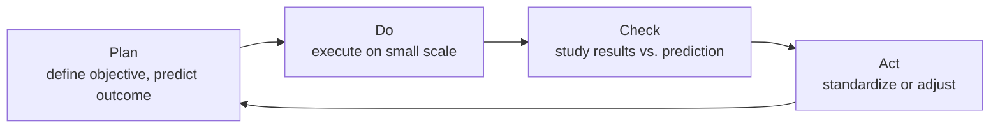
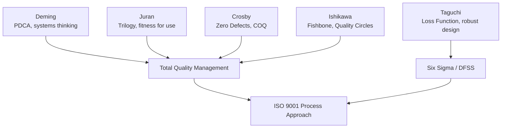

## Quality Gurus Deming Juran Crosby Ishikawa and Taguchi

### Overview

Five individuals are most commonly credited with shaping modern quality management theory. Each approached quality from a distinct angle — statistical, managerial, cultural, or engineering — and together their combined frameworks underpin TQM, Six Sigma, Lean, and ISO 9001's process approach. This section documents each guru's core philosophy, signature tools, and lasting influence on QMS practice.

### W. Edwards Deming

**Key Points**

- American statistician and management consultant; most influential in transforming post-WWII Japanese manufacturing (1950 onward), later "rediscovered" in the U.S. in the 1980s.
- Central thesis: **most quality problems (estimated ~85–94%) originate in management-controlled systems and processes, not in worker error.**
- Developed/popularized the **Plan-Do-Check-Act (PDCA) cycle**, often called the "Deming Cycle" or "Shewhart Cycle" (building on Walter Shewhart's earlier work).
- Authored **Deming's 14 Points for Management**, a management philosophy for transforming organizational culture. Representative points include:
  - Create constancy of purpose toward improvement.
  - Cease dependence on mass inspection; build quality into the product.
  - End the practice of awarding business on price alone.
  - Break down barriers between departments.
  - Drive out fear so people can work effectively.
  - Institute training and self-improvement for everyone.
- Identified the **Seven Deadly Diseases** of management (e.g., lack of constancy of purpose, emphasis on short-term profits, excessive job-hopping by management, running a company on visible figures alone).
- Introduced the concept of **profound knowledge**, comprising four interrelated components: appreciation for a system, knowledge of variation, theory of knowledge, and psychology.

#### PDCA Cycle Diagram

### Joseph M. Juran

**Key Points**

- Romanian-American engineer and management consultant; also central to Japan's post-war quality transformation, working alongside Deming.
- Defined quality as **"fitness for use"** — a user-centered definition distinct from mere conformance to specification.
- Developed the **Juran Trilogy**, three interrelated managerial processes:
  - **Quality Planning** — identifying customers and their needs, developing products/processes to meet those needs.
  - **Quality Control** — evaluating actual performance, comparing to goals, acting on the difference.
  - **Quality Improvement** — establishing infrastructure and projects to achieve breakthrough improvement.
- Applied the **Pareto Principle** ("80/20 rule") to quality management, arguing that a small number of causes ("the vital few") account for most quality problems, distinguishing them from the "trivial many."
- Emphasized that quality management requires **both** top-down strategic planning and bottom-up project-based improvement — quality is a management responsibility, not solely a technical one.

### Philip B. Crosby

**Key Points**

- American businessman; author of *Quality Is Free* (1979), which argued that the cost of achieving good quality is always less than the cost of poor quality (rework, scrap, warranty, lost customers).
- Best known for the **"Zero Defects" (ZD)** philosophy: the performance standard for quality should be zero defects, not an "acceptable quality level" (AQL) that tolerates a statistically planned defect rate.
- Defined quality as **"conformance to requirements"** — a more absolute, specification-driven definition than Juran's "fitness for use."
- Introduced the **Four Absolutes of Quality Management**:
  1. Quality is conformance to requirements, not "goodness."
  2. The system for causing quality is prevention, not appraisal (inspection).
  3. The performance standard is zero defects, not "close enough."
  4. The measurement of quality is the price of nonconformance, not indices.
- Developed the **14 Steps to Quality Improvement**, a management-commitment-driven implementation roadmap (management commitment, quality improvement teams, measurement, cost of quality, zero defects day, corrective action, etc.).
- Popularized **Cost of Quality (COQ)** as an actionable financial metric, categorized into prevention costs, appraisal costs, internal failure costs, and external failure costs.

### Kaoru Ishikawa

**Key Points**

- Japanese organizational theorist and chemist; key figure in Japan's Union of Scientists and Engineers (JUSE) quality movement.
- Invented the **cause-and-effect diagram** (also called the **Ishikawa diagram** or **fishbone diagram**), a visual root-cause analysis tool organizing potential causes into categories (commonly the "6 Ms": Machine, Method, Material, Manpower, Measurement, Mother Nature/Environment).
- Pioneered **Quality Circles** — small, voluntary groups of employees who meet regularly to identify, analyze, and solve work-related quality problems, embodying the principle that frontline workers hold valuable process knowledge.
- Advocated **"quality is everyone's responsibility,"** extending quality thinking beyond the QC department to the entire organization — a direct precursor to TQM's total-involvement principle.
- Was instrumental in popularizing (though not solely inventing) the **Seven Basic Tools of Quality**: cause-and-effect diagram, check sheet, control chart, histogram, Pareto chart, scatter diagram, and stratification/flowchart — a toolkit intended to be usable by non-specialists across the organization.
- Emphasized **company-wide quality control (CWQC)**, the Japanese adaptation of Feigenbaum's Total Quality Control concept.

#### Fishbone (Ishikawa) Diagram (svg_diagram)

<svg xmlns="http://www.w3.org/2000/svg" viewBox="0 0 760 340" font-family="Arial, sans-serif">
<text x="380" y="24" font-size="17" font-weight="bold" text-anchor="middle">Ishikawa Cause-and-Effect Diagram (svg_diagram)</text>
<line x1="80" y1="180" x2="620" y2="180" stroke="#495057" stroke-width="3" />
<polygon points="620,170 650,180 620,190" fill="#495057" />
<rect x="650" y="160" width="100" height="40" rx="6" fill="#ffe3e3" stroke="#c92a2a" stroke-width="2" />
<text x="700" y="185" font-size="12" text-anchor="middle">Effect</text>
<line x1="180" y1="60" x2="260" y2="180" stroke="#3b5bdb" stroke-width="2" />
<text x="150" y="55" font-size="12" text-anchor="middle" font-weight="bold">Machine</text>
<line x1="320" y1="60" x2="380" y2="180" stroke="#3b5bdb" stroke-width="2" />
<text x="320" y="55" font-size="12" text-anchor="middle" font-weight="bold">Method</text>
<line x1="460" y1="60" x2="480" y2="180" stroke="#3b5bdb" stroke-width="2" />
<text x="470" y="55" font-size="12" text-anchor="middle" font-weight="bold">Material</text>
<line x1="180" y1="300" x2="260" y2="180" stroke="#2f9e44" stroke-width="2" />
<text x="150" y="320" font-size="12" text-anchor="middle" font-weight="bold">Manpower</text>
<line x1="320" y1="300" x2="380" y2="180" stroke="#2f9e44" stroke-width="2" />
<text x="320" y="320" font-size="12" text-anchor="middle" font-weight="bold">Measurement</text>
<line x1="460" y1="300" x2="480" y2="180" stroke="#2f9e44" stroke-width="2" />
<text x="475" y="320" font-size="12" text-anchor="middle" font-weight="bold">Environment</text>
</svg>

### Genichi Taguchi

**Key Points**

- Japanese engineer and statistician; focused quality thinking on **robust design** — designing products and processes to be insensitive ("robust") to variation in manufacturing and usage conditions, rather than relying solely on tight tolerance control.
- Introduced the **Taguchi Loss Function**, which quantifies quality loss as a continuous function of deviation from a target value — **even when a measurement falls within specification limits, quality loss is incurred if it deviates from the ideal target.** This directly challenges the traditional binary "pass/fail" conformance view.

$$L(y) = k(y - T)^2$$

where $L(y)$ is the loss, $y$ is the measured characteristic, $T$ is the target value, and $k$ is a proportionality constant.

- Distinguished three quality-loss scenarios: nominal-is-best, smaller-is-better, and larger-is-better, each with an adapted loss function form.
- Developed **Design of Experiments (DOE)** methods adapted for industrial robustness testing, including the use of **orthogonal arrays** to efficiently test multiple factors with fewer experimental runs than full factorial designs.
- Introduced the **Signal-to-Noise (S/N) ratio** as an optimization metric, balancing desired performance ("signal") against variation caused by uncontrollable factors ("noise").
- Categorized product/process factors into **control factors** (adjustable by the designer) and **noise factors** (environmental, manufacturing, or usage variation, generally not economically controllable) — robust design seeks control-factor settings that minimize sensitivity to noise factors.

#### Taguchi Loss Function vs. Traditional Conformance (svg_diagram)

<svg xmlns="http://www.w3.org/2000/svg" viewBox="0 0 700 320" font-family="Arial, sans-serif">
<text x="350" y="24" font-size="16" font-weight="bold" text-anchor="middle">Traditional vs. Taguchi Loss (svg_diagram)</text>
<line x1="60" y1="280" x2="640" y2="280" stroke="#495057" stroke-width="2" />
<line x1="60" y1="280" x2="60" y2="50" stroke="#495057" stroke-width="2" />
<text x="30" y="60" font-size="11">Loss</text>
<text x="600" y="300" font-size="11">Value</text>
<line x1="180" y1="280" x2="180" y2="60" stroke="#c92a2a" stroke-width="2" stroke-dasharray="4" />
<line x1="180" y1="60" x2="180" y2="280" stroke="#c92a2a" stroke-width="2" />
<line x1="180" y1="60" x2="180" y2="60" stroke="#c92a2a" />
<path d="M 60 280 L 180 280 L 180 60 L 180 280 L 520 280" fill="none" stroke="#c92a2a" stroke-width="3" />
<text x="350" y="270" font-size="11" fill="#c92a2a">Traditional: loss = 0 anywhere inside spec limits (step function)</text>
<path d="M 60 60 Q 350 280 640 60" fill="none" stroke="#3b5bdb" stroke-width="3" />
<text x="350" y="90" font-size="11" fill="#3b5bdb">Taguchi: loss grows continuously away from target T</text>
<line x1="350" y1="280" x2="350" y2="60" stroke="#2f9e44" stroke-width="1.5" stroke-dasharray="3" />
<text x="350" y="300" font-size="12" font-weight="bold" text-anchor="middle">T (target)</text>
</svg>

### Comparative Summary

| Guru | Core Definition of Quality | Signature Contribution | Primary Orientation |
| --- | --- | --- | --- |
| Deming | Predictable, low-variation output driven by management systems | PDCA cycle, 14 Points, Profound Knowledge | Management/statistical |
| Juran | Fitness for use | Juran Trilogy, Pareto application to quality | Managerial/strategic |
| Crosby | Conformance to requirements | Zero Defects, Cost of Quality, 4 Absolutes | Behavioral/motivational |
| Ishikawa | Company-wide responsibility | Fishbone diagram, Quality Circles, 7 QC Tools | Cultural/participative |
| Taguchi | Minimizing loss to society from variation | Loss Function, robust design, DOE/orthogonal arrays | Engineering/statistical |

### Integrated Influence Diagram

### Practical Example

**Example**

An automotive parts supplier producing brake pads applies all five philosophies together:

- **Deming**: Management studies process variation data (PDCA) rather than blaming line workers for defect spikes.
- **Juran**: Quality planning identifies the customer's real need — pads that perform reliably in wet conditions — not merely pads that pass a dry-condition spec test ("fitness for use").
- **Crosby**: The plant targets zero defects on friction-coefficient testing and tracks the cost of scrapped pads as a management metric.
- **Ishikawa**: A quality circle of assembly-line workers uses a fishbone diagram to trace inconsistent friction coefficients to a specific mixing-time variable.
- **Taguchi**: Engineers run a DOE with orthogonal arrays to find a friction-material formulation that stays consistent (robust) across summer heat and winter cold, minimizing loss even for pads that technically pass spec.

### Conclusion

While each guru is associated with a signature framework, their philosophies are complementary rather than competing: Deming and Juran supplied the managerial and statistical foundation, Crosby supplied the behavioral/motivational push toward zero defects, Ishikawa democratized quality tools across the workforce, and Taguchi extended quality thinking into engineering design itself. Modern QMS frameworks — ISO 9001, Six Sigma, and Lean — synthesize elements from all five.

**Next Steps**

- Study Deming's 14 Points for Management in full detail with implementation case studies.
- Deep-dive into the Juran Trilogy and Pareto-based quality prioritization.
- Explore Crosby's Cost of Quality (COQ) model and its four cost categories in depth.
- Practice constructing Ishikawa (fishbone) diagrams and applying the Seven Basic Quality Tools.
- Study Taguchi's Design of Experiments (DOE) and orthogonal array methodology with worked examples.
- Examine how ISO 9001:2015's seven Quality Management Principles map back to these five gurus' contributions.