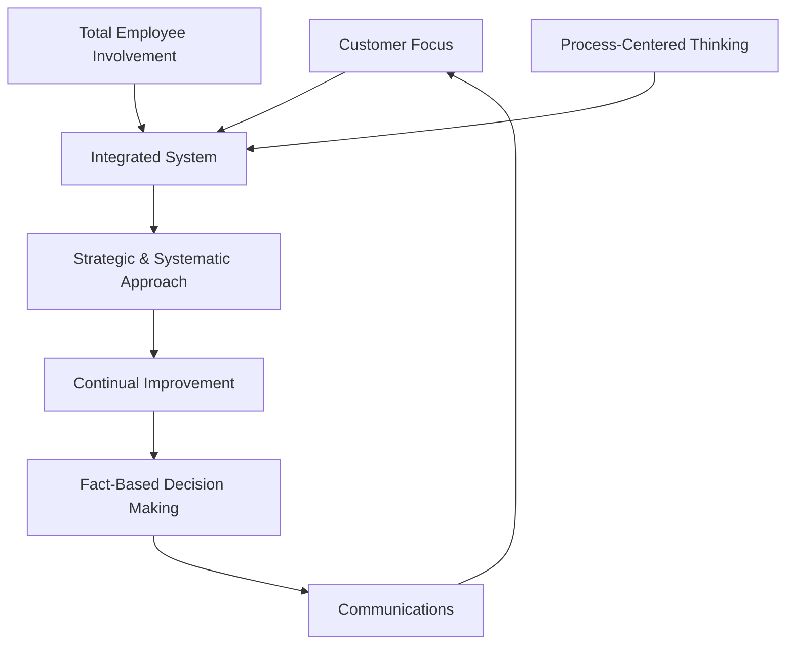

## Total Quality Management Principles

### Overview

Total Quality Management (TQM) is a holistic, organization-wide management philosophy that treats quality as a strategic objective achieved through the sustained participation of every employee, continuous process improvement, and unwavering focus on customer needs. Unlike earlier quality eras that confined quality responsibility to a single department, TQM distributes it across the entire organizational structure. The principles below synthesize the contributions of Deming, Juran, Crosby, Ishikawa, and Feigenbaum into a coherent operating philosophy that directly underpins the seven Quality Management Principles later codified in ISO 9000:2015.

### Principle 1: Customer Focus

**Key Points**

- Quality is ultimately defined by the customer, not the producer — the organization exists to meet customer requirements and exceed customer expectations.
- Encompasses both **external customers** (end users, purchasers) and **internal customers** (the next process or department downstream in a workflow).
- Requires continuous mechanisms for capturing the *Voice of the Customer (VOC)*: surveys, complaint analysis, warranty data, and direct engagement.
- Customer satisfaction is treated as a leading indicator of long-term business viability, not a soft or secondary metric.

### Principle 2: Total Employee Involvement

**Key Points**

- Every employee, from frontline operators to executives, is considered accountable for quality outcomes within their sphere of work.
- Builds on Ishikawa's **Quality Circles** concept: small, voluntary employee groups that identify and solve work-related problems.
- Requires empowerment — employees need authority, training, and psychological safety (Deming's "drive out fear") to raise issues and stop defective work without retribution.
- Cross-functional collaboration breaks down departmental silos that obstruct end-to-end quality.

### Principle 3: Process-Centered Thinking

**Key Points**

- A **process approach** views work as a sequence of interrelated activities that transform inputs into outputs, each with defined owners, inputs, outputs, and performance measures.
- Consistent, well-controlled processes produce consistent, predictable outputs — variation in output is traced back to variation in the process, not blamed on individual workers.
- This principle directly foreshadows the "Process Approach" later formalized as one of ISO 9001's foundational structural elements.

### Principle 4: Integrated System

**Key Points**

- Quality cannot be optimized in isolated departmental silos; it requires a horizontally and vertically integrated management system linking strategy, design, procurement, production, and service.
- Feigenbaum's original **Total Quality Control (TQC)** concept is the direct ancestor of this principle — quality must be engineered into every function, not audited in at the end.
- An integrated system aligns a documented **quality policy** with measurable, cascading **quality objectives** at each organizational level.

### Principle 5: Strategic and Systematic Approach

**Key Points**

- Quality improvement is treated as a strategic business objective, formally planned and resourced — not an ad hoc, isolated activity.
- Mirrors Juran's **Quality Planning** leg of the Juran Trilogy: identifying customers, translating their needs into specifications, and designing processes capable of delivering them.
- Requires leadership commitment: top management sets the strategic direction, allocates resources, and models quality behaviors (a direct descendant of Deming's management-accountability thesis).

### Principle 6: Continual Improvement

**Key Points**

- Also known by the Japanese term **Kaizen** — the philosophy that improvement is incremental, ongoing, and never considered "finished."
- Operationalized through the **Plan-Do-Check-Act (PDCA)** cycle: plan a change, implement it on a small scale, check results against predictions, and act to standardize or adjust.
- Applies equally to products, services, and the processes that create them — improvement targets defects, cycle time, cost, and customer satisfaction simultaneously.

$$\text{PDCA: } Plan \rightarrow Do \rightarrow Check \rightarrow Act \rightarrow (\text{repeat})$$

### Principle 7: Fact-Based Decision Making

**Key Points**

- Decisions are grounded in the analysis of data and objective evidence, not intuition, opinion, or hierarchy-driven authority alone.
- Relies on the **Seven Basic Tools of Quality** popularized by Ishikawa: cause-and-effect (fishbone) diagram, check sheet, control chart, histogram, Pareto chart, scatter diagram, and flowchart/stratification.
- Statistical Process Control (SPC), rooted in Shewhart's control-chart methodology, distinguishes common-cause variation (inherent to the process) from special-cause variation (assignable and correctable).

### Principle 8: Communications

**Key Points**

- Timely, accurate, and organization-wide communication of quality data, strategy, and results sustains motivation and enables coordinated action.
- Includes communication of quality strategy top-down (from leadership), quality performance bottom-up (from operations), and cross-functional sharing horizontally.
- Poor communication is frequently identified as a root cause of quality failures that originate not from technical error but from misalignment between departments or shifts.

### TQM Principles Interaction Diagram

The circular flow reflects TQM's cyclical nature: customer focus drives strategic planning, which drives continual improvement fed by data, which is communicated back to reinforce customer focus — closing the loop.

### The TQM House Model (svg_diagram)

<svg xmlns="http://www.w3.org/2000/svg" viewBox="0 0 760 380" font-family="Arial, sans-serif">
<text x="380" y="24" font-size="17" font-weight="bold" text-anchor="middle">TQM Structural Model (svg_diagram)</text>
<polygon points="380,50 680,140 80,140" fill="#ffe3e3" stroke="#c92a2a" stroke-width="2" />
<text x="380" y="115" font-size="14" font-weight="bold" text-anchor="middle">Customer Satisfaction</text>
<rect x="80" y="140" width="600" height="60" fill="#e8f0fe" stroke="#3b5bdb" stroke-width="2" />
<text x="380" y="175" font-size="13" font-weight="bold" text-anchor="middle">Continual Improvement (Kaizen / PDCA)</text>
<rect x="100" y="215" width="130" height="90" fill="#d3f9d8" stroke="#2f9e44" stroke-width="2" />
<text x="165" y="245" font-size="12" font-weight="bold" text-anchor="middle">Total Employee</text>
<text x="165" y="260" font-size="12" font-weight="bold" text-anchor="middle">Involvement</text>
<rect x="245" y="215" width="130" height="90" fill="#d3f9d8" stroke="#2f9e44" stroke-width="2" />
<text x="310" y="245" font-size="12" font-weight="bold" text-anchor="middle">Process-Centered</text>
<text x="310" y="260" font-size="12" font-weight="bold" text-anchor="middle">Thinking</text>
<rect x="390" y="215" width="130" height="90" fill="#d3f9d8" stroke="#2f9e44" stroke-width="2" />
<text x="455" y="245" font-size="12" font-weight="bold" text-anchor="middle">Fact-Based</text>
<text x="455" y="260" font-size="12" font-weight="bold" text-anchor="middle">Decisions</text>
<rect x="535" y="215" width="130" height="90" fill="#d3f9d8" stroke="#2f9e44" stroke-width="2" />
<text x="600" y="245" font-size="12" font-weight="bold" text-anchor="middle">Integrated</text>
<text x="600" y="260" font-size="12" font-weight="bold" text-anchor="middle">System</text>
<rect x="80" y="320" width="600" height="45" fill="#fff3bf" stroke="#e8590c" stroke-width="2" />
<text x="380" y="347" font-size="13" font-weight="bold" text-anchor="middle">Foundation: Leadership Commitment &amp; Communications</text>
</svg>

### Comparative Table: TQM Principle vs. Originating Guru vs. ISO 9001 Linkage

| TQM Principle | Primary Originating Influence | Corresponding ISO 9001 QMP |
| --- | --- | --- |
| Customer Focus | Juran (fitness for use) | Customer Focus |
| Total Employee Involvement | Ishikawa (Quality Circles) | Engagement of People |
| Process-Centered Thinking | Feigenbaum (TQC) | Process Approach |
| Integrated System | Feigenbaum | (Structural — Annex SL) |
| Strategic & Systematic Approach | Juran, Deming | Leadership |
| Continual Improvement | Deming (PDCA) | Improvement |
| Fact-Based Decision Making | Ishikawa (7 QC Tools), Shewhart | Evidence-Based Decision Making |
| Communications | Deming (systems/psychology) | Relationship Management (partial) |

### Practical Example

**Example**

A hospital implementing TQM to reduce patient-readmission rates:

- **Customer focus**: Patient and family feedback surveys identify discharge instructions as a recurring source of confusion.
- **Total employee involvement**: Nurses, discharge planners, and pharmacists form a cross-functional improvement team.
- **Process-centered thinking**: The discharge process is mapped end-to-end to identify where instructions are inconsistently delivered.
- **Integrated system**: Electronic health records are updated to standardize discharge documentation across all departments.
- **Strategic approach**: Hospital leadership sets a formal readmission-reduction target tied to the annual quality plan.
- **Continual improvement**: A PDCA cycle tests a revised discharge checklist on one ward before hospital-wide rollout.
- **Fact-based decisions**: Readmission data is tracked via control charts to distinguish genuine improvement from normal statistical variation.
- **Communications**: Results are shared hospital-wide in staff briefings, reinforcing the link between the new checklist and improved patient outcomes.

### Common Implementation Pitfalls

**Key Points**

- Treating TQM as a one-time program with a defined "end date" rather than a permanent cultural shift.
- Leadership issuing a quality policy statement without visibly modeling the behaviors it describes (undermines Deming's emphasis on management accountability).
- Collecting data without a clear decision-making pathway for acting on it (violates fact-based decision making in practice, even while claiming to follow it).
- Confining "employee involvement" to suggestion boxes rather than genuine authority to influence process changes.
- Pursuing continual improvement initiatives that are disconnected from actual customer requirements.

### Conclusion

TQM's eight principles function as an interdependent system rather than a checklist — removing any one (e.g., pursuing continual improvement without fact-based decision making, or process focus without employee involvement) weakens the whole. These principles form the direct conceptual ancestry of ISO 9001:2015's seven Quality Management Principles, making TQM essential foundational knowledge before studying formal QMS certification standards.

**Next Steps**

- Study the seven Quality Management Principles of ISO 9001:2015 and their formal clause-level requirements.
- Explore the PDCA cycle as an operational tool with worked improvement-project examples.
- Practice applying the Seven Basic Tools of Quality (fishbone, Pareto, control chart, etc.) to a sample process.
- Examine Kaizen implementation methodology, including Kaizen events/blitzes.
- Study organizational change management techniques for sustaining a TQM culture long-term.
- Review how TQM principles map to Six Sigma's DMAIC framework and Lean's waste-elimination focus.