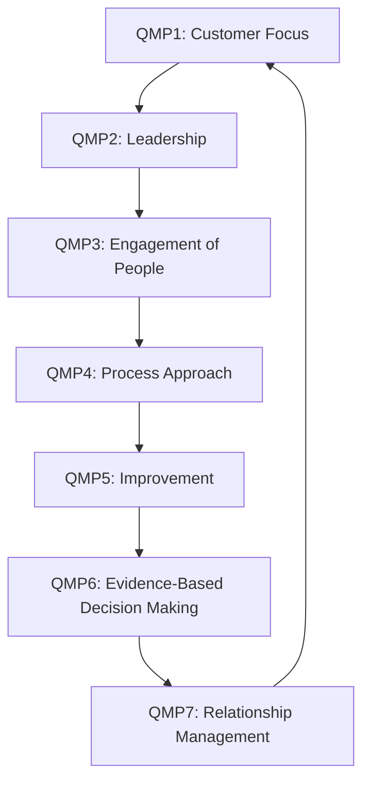

## The Seven Quality Management Principles of ISO 9000


### Overview

ISO 9000:2015 formally codifies **seven Quality Management Principles (QMPs)** — a distillation of the collective experience and knowledge of international experts participating in ISO/TC 176, the technical committee responsible for QMS standards. These principles are not directly auditable clauses themselves, but they form the conceptual foundation upon which ISO 9001's certifiable requirements are built. Understanding them is prerequisite to correctly interpreting *why* ISO 9001 clauses are structured the way they are.

### QMP 1: Customer Focus

**Key Points**

- **Statement**: The primary focus of quality management is to meet customer requirements and to strive to exceed customer expectations.
- **Rationale**: Sustained organizational success is achieved by attracting and retaining the confidence of customers and other interested parties; every aspect of customer interaction provides an opportunity to create more value.
- **Key benefits**: increased customer value, increased customer satisfaction, improved customer loyalty, enhanced repeat business, enhanced reputation, expanded customer base, increased revenue and market share.
- **Actions organizations typically take**: recognize direct and indirect customers, understand current and future customer needs and expectations, link organizational objectives to customer needs, communicate customer needs across the organization, measure and monitor customer satisfaction, manage customer relationships proactively.
- Maps directly to ISO 9001:2015 Clause 5.1.2 (Customer focus) and Clause 9.1.2 (Customer satisfaction monitoring).

### QMP 2: Leadership

**Key Points**

- **Statement**: Leaders at all levels establish unity of purpose and direction and create conditions in which people are engaged in achieving the organization's quality objectives.
- **Rationale**: Alignment of purpose, direction, and internal engagement enables an organization to coordinate its strategies, policies, processes, and resources to achieve its objectives.
- **Key benefits**: increased effectiveness and efficiency in meeting objectives, better coordination of processes, improved communication between levels/functions, developed capability to deliver results.
- **Actions**: communicating the organization's mission, vision, strategy, policies, and processes; creating and sustaining shared values and ethical role models; establishing a culture of trust and integrity; encouraging organization-wide commitment to quality; ensuring leaders receive necessary resources, training, and authority.
- Maps to ISO 9001:2015 Clause 5 (Leadership) in its entirety, including top management's demonstrated commitment.

### QMP 3: Engagement of People

**Key Points**

- **Statement**: Competent, empowered, and engaged people at all levels are essential to enhance the organization's capability to create and deliver value.
- **Rationale**: To manage an organization effectively and efficiently, it is important to respect and involve all people at all levels, and to recognize their contributions, empowerment, and competence development.
- **Key benefits**: improved understanding of quality objectives by personnel, increased engagement in improvement activities, enhanced personal development, initiative, and creativity, increased employee satisfaction, increased trust and collaboration, increased attention to shared values and culture organization-wide.
- **Actions**: communicating with people to promote understanding of the importance of their individual contribution; promoting collaboration; facilitating open discussion and sharing of knowledge; empowering people to identify constraints and take initiative without fear; recognizing and acknowledging people's contribution.
- Directly descended from Ishikawa's Quality Circles and TQM's "Total Employee Involvement" principle.

### QMP 4: Process Approach

**Key Points**

- **Statement**: Consistent and predictable results are achieved more effectively and efficiently when activities are understood and managed as interrelated processes that function as a coherent system.
- **Rationale**: The QMS consists of interrelated processes; understanding how results are produced by this system enables an organization to optimize the system and its performance.
- **Key benefits**: enhanced ability to focus effort on key processes and opportunities for improvement, consistent and predictable outcomes through a system of aligned processes, optimized performance through effective process management, efficient use of resources, and reduced cross-functional barriers.
- **Actions**: defining objectives of the system and processes needed to achieve them; establishing authority, responsibility, and accountability for managing processes; understanding organizational capabilities and determining resource constraints prior to action; determining process interdependencies and analyzing the effect of modifications; managing processes and their interrelations as a system to achieve objectives effectively and efficiently; ensuring necessary information is available to operate and improve processes; managing risks that can affect outputs of processes and overall outcomes.
- This principle is so structurally central that ISO 9001:2015 requires organizations to explicitly determine and document the processes needed for the QMS (Clause 4.4).

#### PDCA and the Process Approach

$$\text{Process Approach} \equiv \text{Plan} \rightarrow \text{Do} \rightarrow \text{Check} \rightarrow \text{Act (applied to each process and to the QMS as a system)}$$

### QMP 5: Improvement

**Key Points**

- **Statement**: Successful organizations have an ongoing focus on improvement.
- **Rationale**: Improvement is essential for an organization to maintain current levels of performance, react to changes in internal and external conditions, and create new opportunities.
- **Key benefits**: improved process performance, organizational capability, and customer satisfaction; enhanced focus on root-cause investigation and determination, followed by prevention and corrective action; enhanced ability to anticipate and react to internal/external risks and opportunities; enhanced consideration of both incremental and breakthrough improvement; improved use of learning for improvement; enhanced drive for innovation.
- **Actions**: promoting establishment of improvement objectives at all levels; educating and training people at all levels on methods and tools for improvement; ensuring people are competent to promote and complete improvement projects; developing and deploying processes to implement improvement projects; tracking, reviewing, and auditing planning, implementation, completion, and results of improvement projects; integrating improvement considerations into new/modified goods, services, and processes; recognizing and acknowledging improvement.
- Direct descendant of Kaizen (continual improvement) and Deming's PDCA cycle.

### QMP 6: Evidence-Based Decision Making

**Key Points**

- **Statement**: Decisions based on the analysis and evaluation of data and information are more likely to produce desired results.
- **Rationale**: Decision-making is a complex process involving uncertainty; it often involves multiple types and sources of input and their interpretation, which can be subjective — understanding cause-and-effect relationships and potential unintended consequences is important. Facts, evidence, and data analysis lead to greater objectivity and confidence.
- **Key benefits**: improved decision-making processes, improved assessment of process performance and ability to achieve objectives, improved operational effectiveness and efficiency, increased ability to review, challenge, and change opinions and decisions, increased ability to demonstrate effectiveness of past decisions.
- **Actions**: determining, measuring, and monitoring key indicators to demonstrate organizational performance; making all data needed available to relevant people; ensuring data and information are sufficiently accurate, reliable, and secure; analyzing and evaluating data and information using suitable methods; ensuring people are competent to analyze and evaluate data as needed; balancing data analysis with experience and intuition in decision making.
- Grounded in Ishikawa's Seven Basic Tools of Quality and Shewhart/Deming's statistical control philosophy.

### QMP 7: Relationship Management

**Key Points**

- **Statement**: For sustained success, organizations manage their relationships with interested parties, such as suppliers.
- **Rationale**: Interested parties influence organizational performance; sustained success is more likely achieved when relevant relationships, particularly with supply network partners, are managed to optimize impact on performance.
- **Key benefits**: enhanced performance of the organization and its interested parties through responding to opportunities and constraints related to each interested party; common understanding of goals and values among interested parties; increased capability to create value for interested parties by sharing resources and competence and managing quality-related risks; a well-managed supply chain that provides a stable flow of goods and services.
- **Actions**: determining relevant interested parties (such as suppliers, partners, customers, investors, employees) and their relationship with the organization; determining and prioritizing relationships that need to be managed; establishing relationships balancing short-term gains with long-term considerations; pooling and sharing information, expertise, and resources with relevant interested parties; measuring performance and providing performance feedback to interested parties as appropriate to drive improvement initiatives.
- Maps to ISO 9001:2015 Clause 8.4 (Control of externally provided processes, products, and services).

### QMP Interrelationship Diagram



### Summary Table

| # | Principle | Core Statement | Primary ISO 9001 Clause Linkage |
| --- | --- | --- | --- |
| 1 | Customer Focus | Meet and strive to exceed customer requirements | 5.1.2, 9.1.2 |
| 2 | Leadership | Unity of purpose and direction | Clause 5 |
| 3 | Engagement of People | Competent, empowered, engaged people | 7.1.2, 7.2, 7.3 |
| 4 | Process Approach | Manage activities as interrelated processes | 4.4 |
| 5 | Improvement | Ongoing focus on improvement | Clause 10 |
| 6 | Evidence-Based Decision Making | Decisions grounded in data analysis | 9.1, 9.3 |
| 7 | Relationship Management | Manage relationships with interested parties | 8.4 |

### QMP Structural Map (svg_diagram)

<svg xmlns="http://www.w3.org/2000/svg" viewBox="0 0 760 420" font-family="Arial, sans-serif">
<text x="380" y="24" font-size="17" font-weight="bold" text-anchor="middle">Seven Quality Management Principles (svg_diagram)</text>
<circle cx="380" cy="220" r="70" fill="#e8f0fe" stroke="#3b5bdb" stroke-width="2" />
<text x="380" y="215" font-size="13" font-weight="bold" text-anchor="middle">QMS</text>
<text x="380" y="232" font-size="11" text-anchor="middle">Core</text>
<g font-size="12" font-weight="bold" text-anchor="middle">
<circle cx="380" cy="70" r="55" fill="#ffe3e3" stroke="#c92a2a" stroke-width="2" />
<text x="380" y="65">Customer</text>
<text x="380" y="80">Focus</text>



```
<circle cx="560" cy="120" r="55" fill="#fff3bf" stroke="#e8590c" stroke-width="2" />
<text x="560" y="115">Leadership</text>

<circle cx="620" cy="280" r="55" fill="#d3f9d8" stroke="#2f9e44" stroke-width="2" />
<text x="620" y="275">Engagement</text>
<text x="620" y="290">of People</text>

<circle cx="500" cy="400" r="55" fill="#e5dbff" stroke="#6741d9" stroke-width="2" />
<text x="500" y="395">Process</text>
<text x="500" y="410">Approach</text>

<circle cx="260" cy="400" r="55" fill="#ffd8a8" stroke="#e8590c" stroke-width="2" />
<text x="260" y="400">Improvement</text>

<circle cx="140" cy="280" r="55" fill="#a5d8ff" stroke="#1971c2" stroke-width="2" />
<text x="140" y="270">Evidence-Based</text>
<text x="140" y="285">Decisions</text>

<circle cx="200" cy="120" r="55" fill="#f8d7da" stroke="#c2255c" stroke-width="2" />
<text x="200" y="115">Relationship</text>
<text x="200" y="130">Mgmt</text>
```

</g>
</svg>

### Practical Example

**Example**

A software company implementing all seven QMPs during a product-release cycle:

- **Customer focus**: Release priorities are set from aggregated user-support tickets and beta-tester feedback.
- **Leadership**: The CTO communicates the quarterly quality objective (reduce critical-bug escape rate by 30%) at an all-hands meeting.
- **Engagement of people**: QA engineers are empowered to block a release without needing executive sign-off if critical defects are found.
- **Process approach**: The release pipeline is mapped as a defined process — code review, automated testing, staging validation, production rollout — each stage with an owner.
- **Improvement**: A retrospective after each release identifies root causes of escaped defects and feeds corrective actions into the next sprint.
- **Evidence-based decision making**: Release go/no-go decisions are based on automated test pass rates and defect-density trend data, not solely on schedule pressure.
- **Relationship management**: A shared dashboard is provided to a key enterprise customer to maintain transparency on defect resolution timelines.

### Conclusion

The seven QMPs are explicitly *not* independent — ISO 9000:2015 presents them as an interconnected set, and ISO 9001:2015's clause structure operationalizes them into auditable requirements. Understanding each principle's rationale and typical implementing actions is essential before proceeding to the certifiable requirements of ISO 9001, since auditors and quality professionals routinely trace specific clause requirements back to the underlying QMP they operationalize.

**Related Topics**

- ISO 9001:2015 clause-by-clause structure and Annex SL high-level structure.
- The process approach in depth: process mapping, process owners, and process interaction diagrams.
- Risk-based thinking as it interacts with the seven QMPs.
- PDCA cycle applied at the QMS-system level versus the individual-process level.
- Interested party (stakeholder) analysis methodology under Clause 4.2.
- Management review requirements (Clause 9.3) as the formal evidence-based decision-making mechanism.