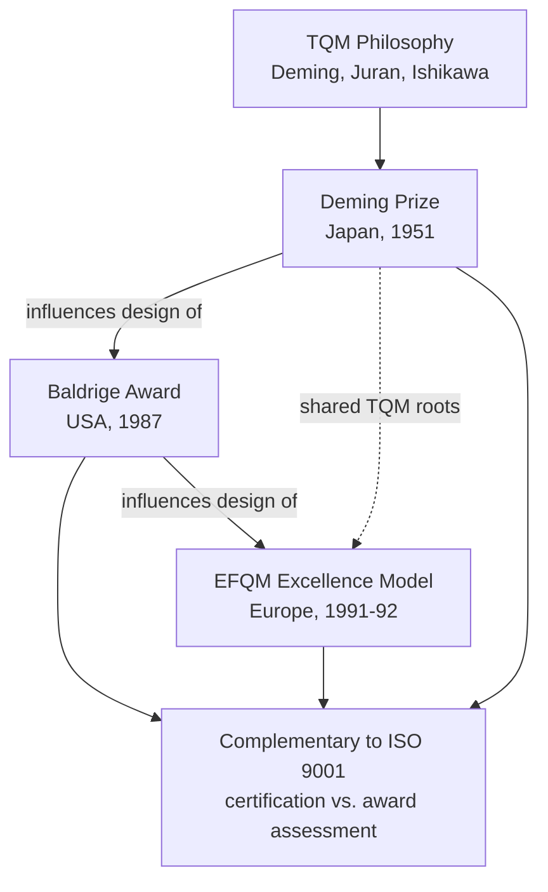

## Quality Award Frameworks Including Baldrige EFQM and the Deming Prize

### Overview

Quality award frameworks are structured, criteria-based self-assessment and recognition systems that evaluate organizational excellence holistically — spanning leadership, strategy, customer focus, workforce, operations, and results. The three most globally influential frameworks are the **Deming Prize** (Japan, est. 1951), the **Malcolm Baldrige National Quality Award** (United States, est. 1987), and the **EFQM Excellence Model** (Europe, est. 1991/1992). Each emerged from a distinct national context and reflects differing philosophical emphases, though all three share the common lineage of TQM principles and have converged significantly over successive revisions.

### The Deming Prize

**Key Points**

- Established in **1951** by the **Union of Japanese Scientists and Engineers (JUSE)**, named in honor of W. Edwards Deming in recognition of his contribution to Japan's post-war quality movement.
- The **oldest** of the three major quality awards and the first to formalize organization-wide quality assessment.
- Awarded in several categories, most notably the **Deming Prize for Individuals**, the **Deming Distinguished Service Award**, and the **Deming Prize for Organizations** (open to companies worldwide, not only Japanese firms, since the 1980s).
- Assessment centers on the effective implementation of **Total Quality Management (TQM)**, evaluated through an examination viewpoint rather than a single fixed checklist — assessors examine whether TQM activities match the organization's own stated management vision and objectives.
- Core examination viewpoints historically include: management policies and their deployment, new product/service development and work process innovation, maintenance/improvement of product and operational quality, quality assurance systems, management systems for business elements (safety, environment), human resource development, and effective utilization of information.
- Historically rigorous and demanding — early Japanese applicant companies frequently spent multiple years preparing before achieving the award, and it is regarded as heavily process- and philosophy-oriented rather than purely results-scored.

### The Malcolm Baldrige National Quality Award (MBNQA)

**Key Points**

- Established by the **U.S. Congress in 1987** via the Malcolm Baldrige National Quality Improvement Act, named after the U.S. Secretary of Commerce who championed quality management before his death.
- Administered by the **National Institute of Standards and Technology (NIST)** in partnership with the private sector (Baldrige Performance Excellence Program).
- Created explicitly to help U.S. organizations compete against the perceived superior quality practices of Japanese manufacturers in the 1980s.
- Structured around the **Baldrige Criteria for Performance Excellence**, organized into **seven categories**:
  1. **Leadership**
  2. **Strategy**
  3. **Customers**
  4. **Measurement, Analysis, and Knowledge Management**
  5. **Workforce**
  6. **Operations**
  7. **Results**
- Applicable across sectors: manufacturing, service, small business, education, healthcare, and nonprofit/government organizations each have tailored criteria versions.
- Distinctive feature: heavily **results-weighted** scoring — Results (Category 7) typically carries the largest proportion of total points, reflecting an American emphasis on demonstrated business outcomes alongside process maturity.
- Applicants undergo rigorous examiner review; feedback reports are provided to all applicants regardless of award outcome, making the framework valuable as a diagnostic/self-assessment tool independent of winning.

### The EFQM Excellence Model

**Key Points**

- Developed by the **European Foundation for Quality Management (EFQM)**, founded in 1989 by 14 major European companies; the model was launched around **1991–1992** as the basis for the **European Quality Award** (later renamed the EFQM Excellence Award).
- Structured around interconnected criteria historically grouped into **Enablers** (what an organization does — leadership, strategy, people, partnerships/resources, processes/products/services) and **Results** (what an organization achieves — customer results, people results, society results, business/key results).
- The model has undergone several major revisions (notably updated versions in 1999, 2003, 2010, 2013, and a significantly restructured 2020 version), reflecting evolving concepts such as stakeholder value, innovation, and sustainability.
- Emphasizes a **logic** called **RADAR** (Results, Approach, Deploy, Assess, Refine) as its underlying scoring/assessment methodology — organizations are assessed on the soundness of their approach, how well it's deployed, and how it's assessed and refined over time, alongside the results achieved.
- Broader adoption base than the other two: widely used across Europe (and adapted internationally) not only for award competition but as a **self-assessment and organizational-development tool**, independent of pursuing formal recognition.

### Comparative Analysis

| Dimension | Deming Prize | Baldrige (MBNQA) | EFQM Excellence Model |
| --- | --- | --- | --- |
| Origin | Japan, 1951 | USA, 1987 | Europe, ~1991–92 |
| Administering Body | JUSE | NIST / Baldrige Program | EFQM |
| Core Philosophy | TQM implementation fidelity | Performance excellence, results-driven | Enablers-and-Results, stakeholder value |
| Structure | Examination viewpoints (qualitative) | 7 weighted categories | Enabler/Results criteria + RADAR logic |
| Primary Orientation | Process & philosophy depth | Business results emphasis | Holistic stakeholder balance |
| Typical Use | Award pursuit (rigorous, multi-year) | Award pursuit + diagnostic feedback | Award pursuit + ongoing self-assessment |
| Sector Scope | Originally manufacturing, now broader | Manufacturing, service, healthcare, education, nonprofit, government | Broad, cross-sector, cross-national |

### Framework Relationship and Influence Diagram

### Structural Comparison Diagram (svg_diagram)

<svg xmlns="http://www.w3.org/2000/svg" viewBox="0 0 760 380" font-family="Arial, sans-serif">
<text x="380" y="24" font-size="17" font-weight="bold" text-anchor="middle">Quality Award Frameworks Compared (svg_diagram)</text>
<rect x="30" y="60" width="210" height="290" rx="8" fill="#ffe3e3" stroke="#c92a2a" stroke-width="2" />
<text x="135" y="85" font-size="14" font-weight="bold" text-anchor="middle">Deming Prize</text>
<text x="135" y="105" font-size="11" text-anchor="middle">Japan · 1951</text>
<line x1="45" y1="115" x2="225" y2="115" stroke="#c92a2a" />
<text x="135" y="140" font-size="11" text-anchor="middle">Examination</text>
<text x="135" y="155" font-size="11" text-anchor="middle">viewpoints</text>
<text x="135" y="180" font-size="11" text-anchor="middle">TQM fidelity</text>
<text x="135" y="205" font-size="11" text-anchor="middle">to own vision</text>
<text x="135" y="240" font-size="11" font-weight="bold" text-anchor="middle">Deepest process</text>
<text x="135" y="255" font-size="11" font-weight="bold" text-anchor="middle">orientation</text>
<rect x="275" y="60" width="210" height="290" rx="8" fill="#e8f0fe" stroke="#3b5bdb" stroke-width="2" />
<text x="380" y="85" font-size="14" font-weight="bold" text-anchor="middle">Baldrige (MBNQA)</text>
<text x="380" y="105" font-size="11" text-anchor="middle">USA · 1987</text>
<line x1="290" y1="115" x2="470" y2="115" stroke="#3b5bdb" />
<text x="380" y="140" font-size="11" text-anchor="middle">7 weighted</text>
<text x="380" y="155" font-size="11" text-anchor="middle">categories</text>
<text x="380" y="180" font-size="11" text-anchor="middle">Results-heaviest</text>
<text x="380" y="205" font-size="11" text-anchor="middle">weighting</text>
<text x="380" y="240" font-size="11" font-weight="bold" text-anchor="middle">Strongest results</text>
<text x="380" y="255" font-size="11" font-weight="bold" text-anchor="middle">emphasis</text>
<rect x="520" y="60" width="210" height="290" rx="8" fill="#d3f9d8" stroke="#2f9e44" stroke-width="2" />
<text x="625" y="85" font-size="14" font-weight="bold" text-anchor="middle">EFQM Model</text>
<text x="625" y="105" font-size="11" text-anchor="middle">Europe · 1991-92</text>
<line x1="535" y1="115" x2="715" y2="115" stroke="#2f9e44" />
<text x="625" y="140" font-size="11" text-anchor="middle">Enablers +</text>
<text x="625" y="155" font-size="11" text-anchor="middle">Results / RADAR</text>
<text x="625" y="180" font-size="11" text-anchor="middle">Stakeholder</text>
<text x="625" y="205" font-size="11" text-anchor="middle">balance</text>
<text x="625" y="240" font-size="11" font-weight="bold" text-anchor="middle">Broadest self-</text>
<text x="625" y="255" font-size="11" font-weight="bold" text-anchor="middle">assessment use</text>
</svg>

### Relationship to ISO 9001 Certification

**Key Points**

- Quality award frameworks are **assessment/recognition** systems, not certification standards — there is no equivalent to an ISO-accredited third-party certificate; recognition is typically a one-time award or periodic re-application.
- ISO 9001 certification confirms a QMS meets **minimum, auditable, pass/fail requirements**; award frameworks assess **degree of excellence** on a graduated maturity scale, often used by organizations that have already achieved ISO 9001 certification as a next-level improvement benchmark.
- All three frameworks and ISO 9001 draw on the same underlying TQM/QMP philosophical base, but ISO 9001 alone results in a recognized certificate suitable for supply-chain and contractual requirements.
- Many organizations pursue award-framework self-assessment (Baldrige or EFQM) as an internal diagnostic tool without ever formally applying for the award itself, using the criteria purely as a maturity-benchmarking instrument.

### Practical Example

**Example**

A mid-sized electronics manufacturer already ISO 9001-certified decides to pursue further excellence:

- It uses the **EFQM RADAR logic** internally each year to self-assess its leadership, strategy, and results maturity, without formally entering the EFQM Excellence Award competition.
- After several years of measurable improvement, it applies for the **Baldrige Award** in the manufacturing sector category, using the seven-category criteria as a structured application framework and receiving detailed examiner feedback regardless of outcome.
- Its Japan-based subsidiary, influenced by the plant's TQM culture, separately pursues the **Deming Prize for Organizations**, requiring several years of documented, deeply embedded TQM practice before applying.

### Conclusion

While the Deming Prize, Baldrige Award, and EFQM Excellence Model differ in origin, structure, and relative emphasis (process-depth vs. results-weighting vs. stakeholder-balance), they share a common ancestry in TQM philosophy and collectively represent the highest tier of voluntary organizational quality recognition — distinct from, and complementary to, ISO 9001's certifiable baseline requirements.

**Next Steps**

- Study the Baldrige Criteria for Performance Excellence category-by-category with scoring weightings.
- Explore the EFQM RADAR logic (Results, Approach, Deploy, Assess, Refine) as an assessment methodology in depth.
- Examine the Deming Prize examination viewpoints and historical winning organizations' TQM practices.
- Compare award-framework self-assessment scoring against ISO 9001 audit/certification scoring approaches.
- Study organizational excellence maturity models more broadly (e.g., CMMI) as complementary assessment tools.
- Review how award-framework participation is sometimes integrated into an organization's broader strategic planning cycle (Clause 6 of ISO 9001).