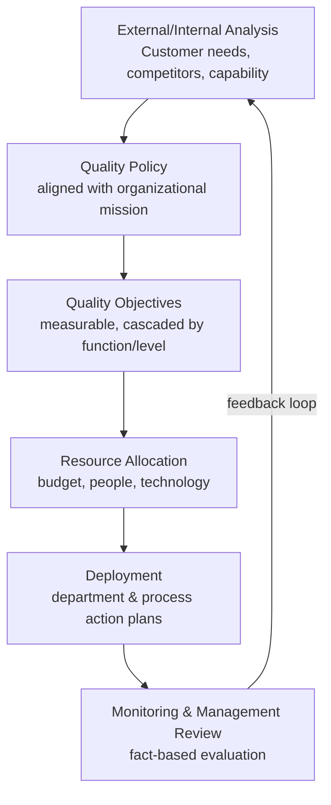

## Quality as a Strategic Business Function

### Overview

Historically, quality was treated as an operational or compliance concern — a cost center focused on inspection and defect containment, positioned downstream of strategic decision-making. Modern management theory repositions quality as a **strategic business function**: a driver of competitive advantage, financial performance, and long-term organizational viability, integrated directly into strategic planning rather than bolted on afterward. This shift is embedded in ISO 9001:2015's requirement (Clause 6) that quality objectives be planned at relevant functions, levels, and processes, and be consistent with the organization's strategic direction.

### From Cost Center to Value Driver

**Key Points**

- Traditional view: quality is a **cost of compliance** — inspection, testing, and rework are overhead expenses that reduce profitability.
- Strategic view: quality is a **value driver** — reduced defects lower the cost of poor quality (COPQ), while consistent quality builds customer loyalty, brand reputation, and pricing power.
- Crosby's *"Quality Is Free"* thesis underpins this shift: the cost of achieving good quality is consistently lower than the cumulative cost of poor quality (rework, scrap, warranty claims, litigation, lost customers).
- Strategic quality management treats quality investment as **capital allocation**, evaluated for return on investment (ROI) alongside other business investments, not merely as a regulatory obligation.

### Linking Quality to Competitive Strategy

**Key Points**

- Michael Porter's generic competitive strategies (**cost leadership**, **differentiation**, **focus**) each have distinct quality implications:
  - **Cost leadership**: quality reduces waste, rework, and scrap — directly lowering unit cost while maintaining acceptable conformance.
  - **Differentiation**: quality becomes a distinguishing brand attribute (reliability, durability, premium experience) that commands price premiums and customer loyalty.
  - **Focus**: quality is tailored precisely to a narrow market segment's specific requirements, often exceeding what broader competitors offer in that niche.
- Quality strategy must therefore be explicitly aligned with the organization's chosen competitive positioning — a "zero defects, premium cost" quality strategy may be misaligned with a low-cost commodity business model, and vice versa.

### Strategic Quality Planning Process

**Key Points**

- Strategic quality planning translates high-level organizational strategy into specific, measurable **quality objectives** cascading through functions and levels (directly mirrored in ISO 9001:2015 Clause 6.2).
- Typical strategic quality planning sequence:
  1. Analyze the external environment (customer needs, competitor benchmarks, regulatory landscape) and internal capability (process maturity, resource constraints).
  2. Define the organization's quality policy, aligned with its overall mission and strategic direction.
  3. Establish measurable quality objectives at relevant functions and levels (e.g., defect rate targets, on-time delivery rates, customer satisfaction scores).
  4. Allocate resources (budget, personnel, technology) to achieve the objectives.
  5. Deploy objectives through department- and process-level action plans.
  6. Monitor performance via management review and adjust strategy based on evidence (fact-based decision making).
- This process directly operationalizes Juran's **Quality Planning** leg of the Juran Trilogy at an enterprise-strategic level, rather than only a project level.

#### Strategic Quality Planning Flow

### Quality's Link to Financial Performance

**Key Points**

- The **Cost of Quality (COQ)** model, formalized by Crosby and Feigenbaum, provides the financial vocabulary connecting quality activity directly to the P&L:
  - **Prevention costs** — investment in preventing defects (training, process design, quality planning).
  - **Appraisal costs** — cost of evaluating conformance (inspection, testing, audits).
  - **Internal failure costs** — costs from defects found before delivery (scrap, rework, downtime).
  - **External failure costs** — costs from defects found after delivery (warranty claims, returns, litigation, reputational damage) — typically the most expensive category by a wide margin.
- Studies across industries consistently find that investment in prevention costs yields disproportionately large reductions in internal and external failure costs — the strategic argument for treating quality investment as a profit lever rather than pure overhead.
- Strategic quality management links COQ data directly into executive-level financial reporting and capital-allocation decisions, rather than confining it to a quality department's internal metrics.

$$\text{Total Cost of Quality} = \text{Prevention} + \text{Appraisal} + \text{Internal Failure} + \text{External Failure}$$

### Governance: Quality at the Board and Executive Level

**Key Points**

- Strategic positioning of quality requires visible **top management commitment**, formally required under ISO 9001:2015 Clause 5.1 (Leadership and commitment) — top management must demonstrate leadership by ensuring the quality policy and objectives are established and compatible with strategic direction.
- Many organizations elevate quality reporting to board or C-suite level (e.g., a Chief Quality Officer, or quality metrics as a standing agenda item in executive reviews), signaling that quality performance is treated with the same governance rigor as financial performance.
- **Management review** (ISO 9001:2015 Clause 9.3) functions as the formal governance mechanism connecting quality performance data to strategic decision-making, requiring inputs such as customer satisfaction, process performance, nonconformities, audit results, and external/internal issue changes — and outputs including decisions on improvement opportunities, resource needs, and strategic direction changes.

### Quality and Risk-Based Strategic Thinking

**Key Points**

- ISO 9001:2015 embeds **risk-based thinking** as a strategic discipline (Clause 6.1), requiring organizations to determine risks and opportunities affecting the QMS's ability to achieve intended results and to plan actions addressing them.
- Strategic quality management treats quality risk not as a narrow operational hazard, but as a **business risk category** alongside financial, market, and operational risk — supply chain quality failures, for instance, are evaluated for their potential impact on brand equity and shareholder value, not solely on unit-level nonconformity rates.
- Opportunity-side thinking is equally strategic: quality capability can be leveraged to enter new markets, win regulated contracts requiring certification, or command premium positioning — treating quality maturity itself as a strategic asset.

### Comparative Table: Operational vs. Strategic Quality Orientation

| Dimension | Operational Quality (traditional) | Strategic Quality (modern) |
| --- | --- | --- |
| Primary focus | Defect detection/correction | Value creation and competitive advantage |
| Ownership | Quality department | Top management, cascaded organization-wide |
| Time horizon | Short-term, transactional | Long-term, aligned with strategic planning cycles |
| Metrics | Defect rates, inspection pass rates | COQ, customer lifetime value, market share, brand equity |
| Investment framing | Overhead/cost of compliance | Capital investment with measurable ROI |
| Governance | Departmental reporting | Board/executive-level review (management review) |
| Risk view | Process-level nonconformity | Enterprise business risk and opportunity |

### Strategic Quality Governance Diagram (svg_diagram)

<svg xmlns="http://www.w3.org/2000/svg" viewBox="0 0 760 340" font-family="Arial, sans-serif">
<text x="380" y="24" font-size="17" font-weight="bold" text-anchor="middle">Quality Integrated into Strategic Governance (svg_diagram)</text>
<rect x="280" y="50" width="200" height="55" rx="8" fill="#ffe3e3" stroke="#c92a2a" stroke-width="2" />
<text x="380" y="82" font-size="13" font-weight="bold" text-anchor="middle">Board / Top Management</text>
<rect x="60" y="150" width="180" height="55" rx="8" fill="#e8f0fe" stroke="#3b5bdb" stroke-width="2" />
<text x="150" y="175" font-size="12" font-weight="bold" text-anchor="middle">Strategic Direction</text>
<text x="150" y="192" font-size="11" text-anchor="middle">Mission, market positioning</text>
<rect x="290" y="150" width="180" height="55" rx="8" fill="#d3f9d8" stroke="#2f9e44" stroke-width="2" />
<text x="380" y="175" font-size="12" font-weight="bold" text-anchor="middle">Quality Policy &amp; Objectives</text>
<text x="380" y="192" font-size="11" text-anchor="middle">Clause 5.2 / 6.2</text>
<rect x="520" y="150" width="180" height="55" rx="8" fill="#fff3bf" stroke="#e8590c" stroke-width="2" />
<text x="610" y="175" font-size="12" font-weight="bold" text-anchor="middle">Cost of Quality</text>
<text x="610" y="192" font-size="11" text-anchor="middle">Financial reporting link</text>
<rect x="200" y="250" width="360" height="55" rx="8" fill="#e5dbff" stroke="#6741d9" stroke-width="2" />
<text x="380" y="275" font-size="12" font-weight="bold" text-anchor="middle">Management Review (Clause 9.3)</text>
<text x="380" y="292" font-size="11" text-anchor="middle">Evidence-based strategic adjustment</text>
<line x1="380" y1="105" x2="150" y2="150" stroke="#495057" stroke-width="1.5" />
<line x1="380" y1="105" x2="380" y2="150" stroke="#495057" stroke-width="1.5" />
<line x1="380" y1="105" x2="610" y2="150" stroke="#495057" stroke-width="1.5" />
<line x1="150" y1="205" x2="300" y2="250" stroke="#495057" stroke-width="1.5" />
<line x1="380" y1="205" x2="380" y2="250" stroke="#495057" stroke-width="1.5" />
<line x1="610" y1="205" x2="460" y2="250" stroke="#495057" stroke-width="1.5" />
<line x1="380" y1="250" x2="380" y2="105" stroke="#c92a2a" stroke-width="1.5" stroke-dasharray="5,4" />
</svg>

### Practical Example

**Example**

A global apparel manufacturer repositions quality strategically:

- **Prior state**: Quality is a plant-level inspection function reporting to operations managers; metrics stop at defect-rate reports.
- **Strategic shift**: A Chief Quality Officer is appointed, reporting to the CEO; quality objectives (return-rate reduction, supplier defect-rate targets) are formally written into the company's three-year strategic plan.
- **Financial linkage**: COQ analysis reveals external failure costs (customer returns, brand-damage estimates) far exceed prevention investment — leading the board to approve increased spending on supplier quality audits, projected to reduce external failure costs disproportionately.
- **Competitive positioning**: The company markets its ISO 9001 certification and low return rate as a differentiator against low-cost competitors, directly supporting a premium pricing strategy.
- **Governance**: Quality metrics become a standing quarterly board agenda item, reviewed alongside revenue and margin performance, with management review outputs feeding directly into the next strategic planning cycle.

### Conclusion

Positioning quality as a strategic business function requires moving quality data and quality objectives out of departmental silos and into the organization's core strategic-planning and financial-governance processes. This is not merely a philosophical stance — ISO 9001:2015 structurally mandates it through Clause 5 (Leadership), Clause 6 (Planning, including quality objectives aligned with strategic direction), and Clause 9.3 (Management review), making strategic quality integration a certifiable, auditable requirement rather than an optional best practice.

**Related Topics**

- Cost of Quality (COQ) modeling and calculation methodology in depth.
- ISO 9001:2015 Clause 6 (Planning) requirements for quality objectives and risk-based thinking.
- Management review (Clause 9.3) input/output requirements and governance cadence.
- Balanced Scorecard and other strategic performance-measurement frameworks as applied to quality.
- Quality's role in mergers, acquisitions, and supply-chain strategic decisions.
- Chief Quality Officer role design and reporting-structure best practices.