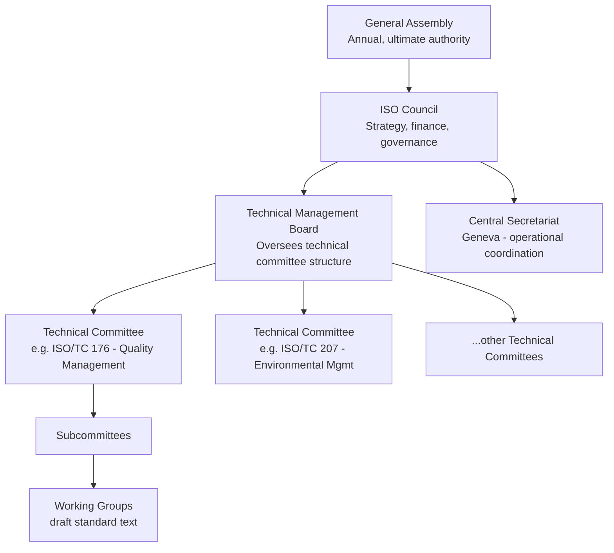
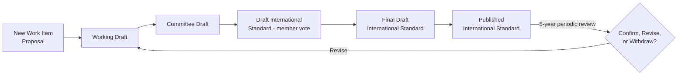

## History and Structure of the International Organization for Standardization

### Overview

The International Organization for Standardization (ISO) is the world's largest developer and publisher of voluntary international standards. Understanding its history, governance structure, and standards-development process provides essential context for interpreting the authority, consensus basis, and revision lifecycle of standards such as ISO 9001, which are referenced throughout QMS practice.

### Historical Origins

**Key Points**

- ISO was founded in **1947**, headquartered in **Geneva, Switzerland**, formed through the merger of two predecessor bodies: the **International Federation of the National Standardizing Associations (ISA)**, active from 1926, and the **United Nations Standards Coordinating Committee (UNSC)**, established during WWII.
- Delegates from **25 countries** met in London in October 1946 to create a new international organization "to facilitate the international coordination and unification of industrial standards," with ISO formally beginning operations on **23 February 1947**.
- The name "ISO" is **not an acronym** — it derives from the Greek word *isos*, meaning "equal," chosen deliberately so the organization's short name would be consistent across all languages and member countries (avoiding the different acronym orders that would result from translating "International Organization for Standardization" literally in each language).
- ISO's founding mandate — international standardization "to facilitate the international exchange of goods and services" — set an initial industrial/manufacturing focus that later expanded into management systems, services, and information technology.

### Organizational Structure and Governance

**Key Points**

- ISO is a **non-governmental international organization** structured as a network of the national standards bodies of its member countries — it is not a treaty-based intergovernmental body, though many member bodies are government-affiliated or government-mandated in their home countries.
- **Membership categories**:
  - **Member bodies** — the national standards body most representative of standardization in its country (one per country); full voting rights on ISO technical work and General Assembly matters.
  - **Correspondent members** — countries without a fully developed national standards activity; observer status, informed of ISO's work but without voting rights.
  - **Subscriber members** — very small economies; pay reduced membership fees and maintain minimal engagement.
- **Governance bodies**:
  - **General Assembly** — the ultimate authority, meeting annually, composed of principal officers and delegates from member bodies.
  - **ISO Council** — smaller governing body overseeing strategy, finance, and governance between General Assembly meetings, including elected member bodies and standing committees.
  - **Technical Management Board (TMB)** — responsible for the overall management of the technical committee structure, approving the creation/dissolution of technical committees, and ensuring consistent development methodology across all technical work.
  - **Central Secretariat** — the Geneva-based operational body coordinating the standards-development system, publishing standards, and supporting technical committees administratively.

#### Governance Structure Diagram

### Technical Committee Structure

**Key Points**

- ISO standards are developed by **Technical Committees (TCs)**, each responsible for a defined subject area, further divided into **Subcommittees (SCs)** and **Working Groups (WGs)** for specific standard-drafting tasks.
- Technical committees are staffed by **experts nominated by member national bodies** — ISO itself does not employ the technical experts who write standards; the work is fundamentally consensus-driven and voluntary.
- **ISO/TC 176 — Quality management and quality assurance** is the technical committee responsible for the ISO 9000 family (ISO 9000, 9001, 9004, and related guidance documents), organized into subcommittees including SC 1 (Concepts and terminology), SC 2 (Quality systems), and SC 3 (Supporting technologies).
- Other relevant technical committees referenced across QMS-adjacent standards include **ISO/TC 207** (Environmental management, responsible for ISO 14001) and **ISO/PC 283** (responsible for ISO 45001, occupational health and safety).

### Standards Development Process

**Key Points**

- ISO standards follow a formal, staged development process requiring **consensus** among participating national bodies, generally comprising these stages:
  1. **Proposal stage** — a new work item proposal (NWIP) is submitted and voted on by the relevant TC/SC.
  2. **Preparatory stage** — a working group drafts a **Working Draft (WD)**.
  3. **Committee stage** — the draft becomes a **Committee Draft (CD)**, circulated to the committee for comment and consensus-building.
  4. **Enquiry stage** — the **Draft International Standard (DIS)** is circulated to all ISO member bodies for a formal vote and comment period.
  5. **Approval stage** — the **Final Draft International Standard (FDIS)** is submitted for a final yes/no vote.
  6. **Publication stage** — upon approval, the standard is published as an **International Standard (IS)**.
- Approval at each stage generally requires a qualified majority (commonly a two-thirds majority of participating members voting in favor, with limits on negative votes), reflecting ISO's foundational principle of **consensus-based, not majority-imposed, standardization**.
- Published standards undergo **periodic systematic review**, typically every five years, to confirm, revise, or withdraw the standard based on continued relevance and technological/practice changes — this is why standards such as ISO 9001 carry a year designation (e.g., ISO 9001:2015) reflecting their most recent substantive revision.

#### Standards Development Lifecycle

### ISO's Relationship to Certification

**Key Points**

- A critical structural distinction: **ISO itself does not certify organizations.** ISO develops and publishes standards; conformity assessment (certification/auditing organizations against a standard) is carried out by independent, third-party **certification bodies**, which are in turn typically accredited by national **accreditation bodies**.
- This separation of standard-development (ISO) from conformity assessment (certification bodies) and oversight of certifiers (accreditation bodies) is a deliberate structural safeguard against conflicts of interest — the body writing the standard is not the body profiting from certifying compliance to it.
- The **International Accreditation Forum (IAF)** coordinates accreditation body recognition globally, providing a further layer of international consistency to the ISO 9001 certification ecosystem.

#### Standards-to-Certification Pathway (svg_diagram)

<svg xmlns="http://www.w3.org/2000/svg" viewBox="0 0 760 260" font-family="Arial, sans-serif">
<text x="380" y="24" font-size="17" font-weight="bold" text-anchor="middle">From Standard to Certification (svg_diagram)</text>
<rect x="30" y="80" width="180" height="80" rx="8" fill="#e8f0fe" stroke="#3b5bdb" stroke-width="2" />
<text x="120" y="115" font-size="13" font-weight="bold" text-anchor="middle">ISO</text>
<text x="120" y="133" font-size="11" text-anchor="middle">Develops &amp; publishes</text>
<text x="120" y="148" font-size="11" text-anchor="middle">the standard (e.g. 9001)</text>
<rect x="290" y="80" width="180" height="80" rx="8" fill="#fff3bf" stroke="#e8590c" stroke-width="2" />
<text x="380" y="115" font-size="13" font-weight="bold" text-anchor="middle">Accreditation Body</text>
<text x="380" y="133" font-size="11" text-anchor="middle">Oversees and accredits</text>
<text x="380" y="148" font-size="11" text-anchor="middle">certification bodies</text>
<rect x="550" y="80" width="180" height="80" rx="8" fill="#d3f9d8" stroke="#2f9e44" stroke-width="2" />
<text x="640" y="115" font-size="13" font-weight="bold" text-anchor="middle">Certification Body</text>
<text x="640" y="133" font-size="11" text-anchor="middle">Audits &amp; certifies</text>
<text x="640" y="148" font-size="11" text-anchor="middle">organizations</text>
<line x1="210" y1="120" x2="290" y2="120" stroke="#495057" stroke-width="2" marker-end="url(#arr2)" />
<line x1="470" y1="120" x2="550" y2="120" stroke="#495057" stroke-width="2" marker-end="url(#arr2)" />
<text x="380" y="200" font-size="12" text-anchor="middle" fill="`#495057`">ISO does not certify organizations directly — conformity assessment is independent</text>

</svg>

### Scale and Scope

**Key Points**

- ISO membership comprises the national standards bodies of over 160 countries (member, correspondent, and subscriber categories combined), collectively representing the vast majority of world GDP and population.
- ISO has published tens of thousands of International Standards spanning virtually every industrial, technological, and service sector, ranging from screw threads and photographic film speeds (its early industrial roots) to information security, occupational health and safety, and climate-related management systems.
- The **ISO 9000 family** (quality management) and **ISO 14000 family** (environmental management) are among ISO's most widely implemented and certified standard families worldwide, forming the backbone of most integrated management system implementations.

### Practical Example

**Example**

Tracing the path of ISO 9001:2015 through this structure:

- **Originating committee**: Drafted and maintained by **ISO/TC 176/SC 2**, the subcommittee responsible for quality systems.
- **Development process**: The 2015 revision passed through Working Draft, Committee Draft, DIS, and FDIS stages, incorporating the Annex SL high-level structure mandated by the Technical Management Board for consistency across all management system standards.
- **Publication**: Formally published by ISO's Central Secretariat as an International Standard, dated to reflect its most recent substantive revision year.
- **Certification pathway**: A manufacturing company seeking certification does not apply to ISO directly — it engages an independent certification body (e.g., a firm accredited by a national accreditation body that is itself a member of the IAF) to conduct a third-party audit against the ISO 9001:2015 requirements.

### Conclusion

ISO's structure — a consensus-driven network of national standards bodies, governed through a General Assembly, Council, and Technical Management Board, with technical work delegated to expert-staffed committees — explains both the international credibility of standards like ISO 9001 and the deliberate separation between standard authorship (ISO) and conformity certification (independent accredited bodies). This structural understanding is essential before studying the ISO 9000 family's specific content and certification requirements.

**Next Steps**

- Study the ISO 9000 family of standards (9000, 9001, 9004) and their distinct purposes.
- Explore ISO/TC 176's specific subcommittee structure and current work program.
- Examine the Annex SL high-level structure mandated across all ISO management system standards.
- Study the role of accreditation bodies and the International Accreditation Forum (IAF) in the certification ecosystem.
- Review the ISO standards periodic review and revision cycle with historical examples (e.g., ISO 9001:2000 to 2008 to 2015 transitions).
- Explore national standards body structures (e.g., ANSI, BSI, DIN) and their relationship to ISO membership.