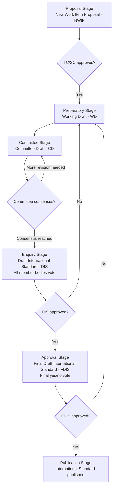

## How ISO Standards Are Developed and Revised

### Overview

ISO standards are not issued by decree — they are produced through a formal, multi-stage, consensus-based process involving national delegations of technical experts. This process is designed to balance broad international representation, technical rigor, and market relevance, while ensuring that a published International Standard reflects genuine agreement rather than the imposition of a single country's or interest group's preferences. Understanding this lifecycle explains why standards carry version years (e.g., ISO 9001:2015), why revisions take years to complete, and how technical disagreements are resolved before publication.

### Core Principles Governing Standards Development

**Key Points**

- **Consensus**: standards are developed through agreement among a broad base of stakeholders (national bodies, industry, consumer groups, regulators) — not simple majority vote alone; formal ballot thresholds exist, but the underlying philosophy is negotiated agreement.
- **Industry-wide participation**: national delegations typically include representatives from industry, government regulators, consumer associations, academia, and non-governmental organizations, aiming for balanced input rather than dominance by any single sector.
- **Voluntary application**: ISO standards themselves are voluntary; they gain mandatory force only when referenced in law/regulation or required contractually (e.g., by a customer or supply-chain requirement).
- **Global relevance**: standards are drafted with the intent of being applicable and implementable across varying national regulatory environments, economic development levels, and industry contexts.

### The Six-Stage Development Process

**Key Points**

**1. Proposal Stage**

- A **New Work Item Proposal (NWIP)** is submitted by a national member body, technical committee, or liaison organization, identifying a market need for a new standard or major revision.
- The proposal is circulated to the relevant Technical Committee (TC) or Subcommittee (SC) for a formal vote; approval requires a specified majority of participating (P-member) national bodies, plus a minimum number of members committing to actively participate in drafting.

**2. Preparatory Stage**

- A **Working Group (WG)** of nominated technical experts is formed (or an existing WG is tasked) to draft the technical content, producing a **Working Draft (WD)**.
- Multiple WD iterations may circulate within the working group before the draft is considered mature enough to progress; this stage often involves the most substantive technical debate.

**3. Committee Stage**

- The WD is registered as a **Committee Draft (CD)** and circulated to the full committee (all P-members of the relevant TC/SC) for review and comment.
- Comments are collated and discussed, often requiring several CD iterations, until the committee reaches consensus that the draft is technically sound and ready for wider review.

**4. Enquiry Stage**

- The approved CD becomes a **Draft International Standard (DIS)**, circulated to **all ISO member bodies** (not just the originating committee) for a formal five-month vote and comment period.
- This stage broadens scrutiny beyond the drafting committee to the entire ISO membership, surfacing conflicts with national regulations, translation issues, or implementation concerns not previously identified.
- Approval typically requires a two-thirds majority of P-members of the TC/SC voting in favor, and no more than one-quarter of all votes cast being negative.

**5. Approval Stage**

- A **Final Draft International Standard (FDIS)** incorporating enquiry-stage comments is circulated for a final, shorter (typically two-month) yes/no vote, with no further technical comments permitted — only approval or rejection.
- The same voting thresholds as the enquiry stage generally apply.

**6. Publication Stage**

- Upon FDIS approval, the ISO Central Secretariat formally publishes the **International Standard (IS)**, assigning it its official designation and publication year (e.g., "2015" in ISO 9001:2015).

#### Development Lifecycle Diagram

### Voting Thresholds and Consensus Mechanics

**Key Points**

- At the **enquiry (DIS)** and **approval (FDIS)** stages, approval generally requires:
  - At least a **two-thirds majority** of P-members (participating members) of the relevant technical committee/subcommittee voting in favor.
  - No more than **one-quarter of total votes cast** (from all voting member bodies) being negative.
- This dual threshold prevents both (a) a small drafting committee from imposing a standard opposed by the broader membership, and (b) a large bloc of largely uninvolved member bodies from blocking a standard the technical experts consider sound.
- Negative votes at the DIS/FDIS stage typically must be accompanied by technical justification; purely political or unsubstantiated objections carry less weight in consensus-resolution discussions.

### Systematic (Periodic) Review and Revision

**Key Points**

- Once published, every ISO standard is subject to **systematic review**, typically conducted **every five years**, to determine whether the standard should be:
  - **Confirmed** — remains valid and relevant without change.
  - **Revised (amended)** — updated to reflect technological change, market needs, or lessons from implementation experience.
  - **Withdrawn** — no longer relevant or superseded by another standard.
- A revision effectively restarts a scoped version of the same development lifecycle (often re-entering at the committee or working-draft stage rather than from a fresh proposal, since the standard's core scope is already established).
- Major revisions can also be triggered **before** the scheduled five-year review if significant market, technological, or regulatory change warrants it, or if accumulated implementation feedback identifies substantial deficiencies.
- The **version year appended to a standard's designation** (e.g., ISO 9001:2008 → ISO 9001:2015) marks the year of the most recent substantive revision's publication — it is the definitive indicator of which requirement set currently applies.

#### Standard Lifecycle Over Time (svg_diagram)

<svg xmlns="http://www.w3.org/2000/svg" viewBox="0 0 760 240" font-family="Arial, sans-serif">
<text x="380" y="24" font-size="17" font-weight="bold" text-anchor="middle">Standard Lifecycle Over Time (svg_diagram)</text>
<line x1="60" y1="140" x2="700" y2="140" stroke="#495057" stroke-width="3" />
<circle cx="140" cy="140" r="7" fill="#3b5bdb" />
<text x="140" y="120" font-size="12" font-weight="bold" text-anchor="middle">Published</text>
<text x="140" y="165" font-size="11" text-anchor="middle">Year 0</text>
<circle cx="340" cy="140" r="7" fill="#2f9e44" />
<text x="340" y="120" font-size="12" font-weight="bold" text-anchor="middle">Systematic Review</text>
<text x="340" y="165" font-size="11" text-anchor="middle">Year 5</text>
<text x="340" y="180" font-size="10" text-anchor="middle">Confirm / Revise / Withdraw</text>
<circle cx="540" cy="140" r="7" fill="#e8590c" />
<text x="540" y="120" font-size="12" font-weight="bold" text-anchor="middle">Revision Published</text>
<text x="540" y="165" font-size="11" text-anchor="middle">e.g. Year 8-10</text>
<text x="540" y="180" font-size="10" text-anchor="middle">(if revision path chosen)</text>
<circle cx="680" cy="140" r="7" fill="#6741d9" />
<text x="680" y="120" font-size="11" font-weight="bold" text-anchor="middle">Next Review</text>
<text x="680" y="165" font-size="10" text-anchor="middle">+5 yrs</text>
</svg>

### Historical Example: ISO 9001 Revision Timeline

**Example**

- **ISO 9001:1987** — first edition, heavily influenced by military and defense procurement quality standards (e.g., MIL-Q-9858), procedure-document-focused.
- **ISO 9001:1994** — minor revision emphasizing preventive action and continued procedural documentation emphasis.
- **ISO 9001:2000** — major revision introducing the **process approach** as a structural requirement, shifting away from a purely procedure-clause structure toward process-based management.
- **ISO 9001:2008** — largely a clarification revision, with minimal new requirements relative to 2000.
- **ISO 9001:2015** — major revision introducing the **Annex SL high-level structure** (common structure across all ISO management system standards), **risk-based thinking** as an explicit requirement, and removal of the mandatory Quality Manual and most mandatory documented procedures, replaced by broader "documented information" requirements.
- [Inference] Based on ISO's standard five-year systematic review cycle, ISO 9001:2015 has been subject to ongoing systematic review consideration; any confirmed next major revision date should be verified against ISO's current published work program, as timelines are subject to committee decisions not fixed in advance.

### Stakeholder Participation Pathways

**Key Points**

- Individual experts do not participate in ISO standards development directly; participation occurs through **national mirror committees** organized by each country's national standards body (e.g., ANSI in the U.S., BSI in the U.K., DIN in Germany), which nominate delegates to the relevant international technical committee.
- This structure means influencing an ISO standard's content requires engagement at the national level first — through a country's national standards body — rather than direct application to ISO's Central Secretariat.
- **Liaison organizations** (other international bodies, industry associations) may also participate in ISO technical committee work with defined, typically non-voting, liaison status, contributing technical input without formal national-body voting rights.

### Comparative Summary: Development Stages

| Stage | Draft Designation | Who Reviews | Typical Outcome |
| --- | --- | --- | --- |
| Proposal | NWIP | TC/SC members | Vote to initiate work |
| Preparatory | WD (Working Draft) | Working Group experts | Technical drafting |
| Committee | CD (Committee Draft) | Full TC/SC membership | Consensus-building, iteration |
| Enquiry | DIS (Draft International Standard) | All ISO member bodies | Formal 5-month vote + comment |
| Approval | FDIS (Final Draft International Standard) | All ISO member bodies | Formal 2-month yes/no vote |
| Publication | IS (International Standard) | Central Secretariat | Official publication |

### Practical Example

**Example**

A hypothetical revision to a quality-management-adjacent standard:

- Market feedback during a five-year systematic review of a fictional "ISO XXXXX" standard reveals that its terminology no longer aligns with emerging digital-manufacturing practices.
- **TC 176/SC 2** votes to initiate a revision; a Working Group drafts updated terminology and requirements (WD stage).
- After several Committee Draft iterations resolving disagreements over scope, the draft becomes a DIS, circulated to all ISO member bodies — several countries raise translation and implementation-timeline concerns during the five-month comment period.
- Revisions address these concerns; the FDIS passes its final vote with the required two-thirds majority and less than one-quarter negative votes.
- The revised standard is published with an updated year designation, triggering a transition period during which certified organizations must migrate from the previous edition.

### Conclusion

The ISO standards development and revision process is deliberately slow, iterative, and consensus-driven by design — favoring broad international legitimacy and technical soundness over speed. This explains both the multi-year gaps between major standard revisions (e.g., roughly 7-15 years between major ISO 9001 revisions) and the formal transition periods organizations are given to migrate their QMS when a standard they are certified against is revised.

**Next Steps**

- Study the specific transition-period requirements organizations face when a standard they hold certification against is revised (e.g., the ISO 9001:2008 to 2015 transition timeline).
- Explore the Annex SL high-level structure and why it was introduced across all ISO management system standards.
- Examine the role of national standards bodies (ANSI, BSI, DIN, etc.) in mirror-committee participation.
- Review ISO/TC 176's current work program and any standards under active revision.
- Study the distinction between International Standards, Technical Specifications (TS), and Technical Reports (TR) as different ISO deliverable types.
- Explore how national/regional standards (e.g., EN ISO adoptions in Europe) relate to the original ISO-published text.