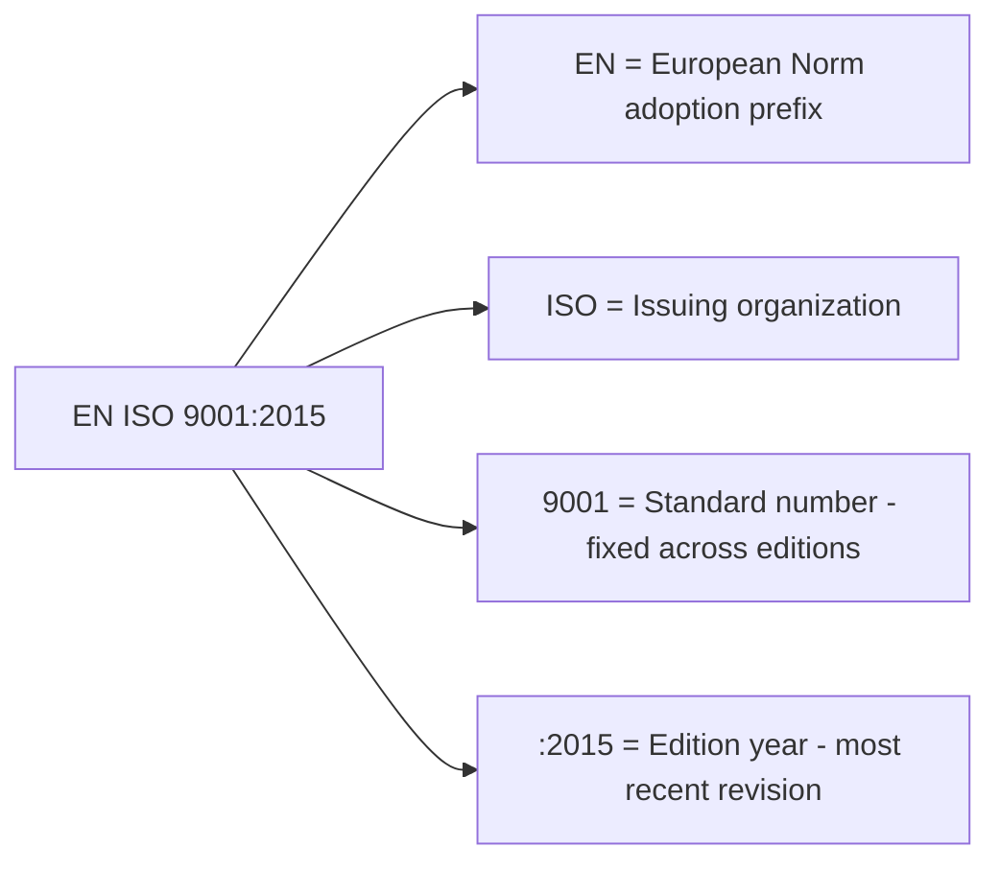

## ISO Standard Numbering Codes and Terminology

### Overview

ISO documents follow a structured naming and numbering convention that encodes essential information: the document type, its unique identifying number, its version year, and — for jointly developed standards — the co-publishing organization. Correctly parsing this notation is a practical necessity for quality professionals, since it determines which requirement set is currently in force, whether a document is a binding standard or an informative guide, and how parts of multi-part standards relate to one another.

### Anatomy of a Standard Designation

**Key Points**

- A typical full designation follows the pattern: **[Organization prefix] [Document type indicator] [Number]-[Part number]:[Year] [Title]**
- Example breakdown of **ISO 9001:2015 — Quality management systems — Requirements**:
  - **ISO** — issuing organization (International Organization for Standardization).
  - **9001** — the unique standard number, permanently assigned to this specific standard.
  - **:2015** — the year of the most recent substantive publication/revision; indicates which edition is currently referenced.
  - **Quality management systems — Requirements** — the official title, typically given as a general subject followed by a colon-separated specific scope.
- The number itself (e.g., 9001) does not change across revisions — only the year suffix changes, distinguishing editions (ISO 9001:2008 vs. ISO 9001:2015 are different editions of the *same* standard).

### Document Type Prefixes and Indicators

**Key Points**

- **IS (International Standard)** — the default, most authoritative document type; typically referenced with no explicit "IS" prefix in casual use (e.g., "ISO 9001" implicitly means the International Standard).
- **TS (Technical Specification)** — a normative document published when full consensus for an International Standard has not yet been reached, or the subject matter is still evolving; carries less formal authority than an IS but follows similar development rigor (e.g., ISO/TS 22163 for railway quality management).
- **TR (Technical Report)** — an informative document containing data, information, or findings different in nature from normative requirements (e.g., survey results, state-of-the-art summaries); explicitly **not** intended to contain requirements and cannot be used for certification purposes.
- **PAS (Publicly Available Specification)** — a document reflecting consensus within a working group but not the full ISO consensus process; often a fast-tracked intermediate step.
- **IWA (International Workshop Agreement)** — developed through an open workshop process outside the standard technical committee structure, used for rapidly emerging market needs.
- **Guide** — provides guidance on ISO-related processes or cross-cutting topics (e.g., ISO/IEC Guide 73 on risk management vocabulary).

### Co-Published and Jointly Developed Standards

**Key Points**

- **ISO/IEC** — standards jointly developed with the **International Electrotechnical Commission (IEC)**, common in information technology and electrotechnical fields (e.g., ISO/IEC 27001 for information security management).
- **ISO/IEC/IEEE** — occasionally jointly published with the **Institute of Electrical and Electronics Engineers** for specific software/systems engineering standards.
- Regional adoption prefixes indicate a standard has been formally adopted into a regional or national system while retaining ISO's core content:
  - **EN ISO** — European Norm adoption (e.g., EN ISO 9001, used across the European Committee for Standardization/CEN member states).
  - **BS EN ISO** — British Standard adoption of the EN ISO version (e.g., BS EN ISO 9001, used in the United Kingdom).
  - **ANSI/ISO** or **ANSI/ASQ ISO** — American National Standards Institute adoption pathways in the United States.
- These regional prefixes typically indicate **identical technical content** to the base ISO standard, with the prefix reflecting the adoption/ratification pathway within that region's standards system rather than a technical difference — though professionals should verify this via the specific national body's adoption notice, as minor national deviations occasionally exist.

#### Designation Anatomy Diagram

### Multi-Part Standards

**Key Points**

- Complex subject areas are often split into multiple parts under a shared root number, each addressing a distinct aspect while sharing the overall standard family's scope.
- Notation: **ISO [number]-[part]:[year]** — for example, ISO 14001 (environmental management systems) is a standalone standard, while other families like ISO/IEC 27000 use explicit multi-part structuring (e.g., ISO/IEC 27001, 27002, 27005 as related-but-distinct standards within a numbered family, rather than a strict Part 1/Part 2/Part 3 structure).
- True multi-part standards use an explicit hyphenated part number, e.g., **ISO 3834-2:2021** (Part 2 of the quality-requirements-for-fusion-welding family), where each part must generally be read in conjunction with the base part for full context.

### The ISO 9000 Family: A Worked Numbering Example

**Key Points**

- **ISO 9000:2015** — *Quality management systems — Fundamentals and vocabulary*: the foundational vocabulary and conceptual document (not certifiable; defines terms used across the family).
- **ISO 9001:2015** — *Quality management systems — Requirements*: the certifiable standard containing auditable "shall" requirements.
- **ISO 9004:2018** — *Quality management — Quality of an organization — Guidance to achieve sustained success*: a guidance document (not certifiable) for organizations seeking to exceed baseline ISO 9001 requirements.
- **ISO 19011:2018** — *Guidelines for auditing management systems*: a guidance document (not certifiable) applicable across all management system standards, not exclusive to quality.
- This family illustrates the important distinction between **certifiable standards** (containing normative "shall" requirements, e.g., ISO 9001) and **guidance documents** (containing informative "should" recommendations, e.g., ISO 9004, ISO 19011) — only certifiable standards can be the basis of third-party certification.

### Normative Language Conventions

**Key Points**

- ISO standards use precise, standardized verbal forms (defined in the ISO/IEC Directives) to indicate the nature of a provision:
  - **"shall"** — indicates a **requirement**; mandatory for conformity/certification claims.
  - **"should"** — indicates a **recommendation**; one possible way to achieve a requirement, among others.
  - **"may"** — indicates a **permission**; something allowed within the standard's scope.
  - **"can"** — indicates a **possibility or capability**; a statement of fact rather than obligation.
- This distinction is critical during certification audits: an auditor can only raise a nonconformity against a "shall" statement, not against unmet "should" recommendations.

### Comparative Table: Document Types

| Prefix/Type | Full Name | Normative? | Certifiable? | Example |
| --- | --- | --- | --- | --- |
| ISO (no suffix) | International Standard | Yes | Yes (if requirements-based) | ISO 9001:2015 |
| ISO/TS | Technical Specification | Yes (limited consensus) | Sometimes (sector-specific schemes) | ISO/TS 22163 |
| ISO/TR | Technical Report | No (informative) | No | Various survey/guidance TRs |
| ISO/PAS | Publicly Available Specification | Partial consensus | Rarely | Various |
| ISO/IWA | International Workshop Agreement | Workshop consensus | No | Various |
| ISO/IEC | Jointly developed with IEC | Yes | Yes (if requirements-based) | ISO/IEC 27001 |

### Numbering and Document-Type Hierarchy (svg_diagram)

<svg xmlns="http://www.w3.org/2000/svg" viewBox="0 0 760 320" font-family="Arial, sans-serif">
<text x="380" y="24" font-size="17" font-weight="bold" text-anchor="middle">ISO Document Type Hierarchy (svg_diagram)</text>
<rect x="290" y="50" width="180" height="50" rx="8" fill="#e8f0fe" stroke="#3b5bdb" stroke-width="2" />
<text x="380" y="80" font-size="13" font-weight="bold" text-anchor="middle">ISO Publications</text>
<rect x="60" y="140" width="180" height="60" rx="8" fill="#ffe3e3" stroke="#c92a2a" stroke-width="2" />
<text x="150" y="165" font-size="12" font-weight="bold" text-anchor="middle">International Standard</text>
<text x="150" y="182" font-size="11" text-anchor="middle">Normative, certifiable</text>
<rect x="290" y="140" width="180" height="60" rx="8" fill="#fff3bf" stroke="#e8590c" stroke-width="2" />
<text x="380" y="165" font-size="12" font-weight="bold" text-anchor="middle">Technical Specification</text>
<text x="380" y="182" font-size="11" text-anchor="middle">Normative, limited consensus</text>
<rect x="520" y="140" width="180" height="60" rx="8" fill="#d3f9d8" stroke="#2f9e44" stroke-width="2" />
<text x="610" y="165" font-size="12" font-weight="bold" text-anchor="middle">Technical Report</text>
<text x="610" y="182" font-size="11" text-anchor="middle">Informative only</text>
<rect x="60" y="240" width="200" height="55" rx="8" fill="#e5dbff" stroke="#6741d9" stroke-width="2" />
<text x="160" y="265" font-size="11" font-weight="bold" text-anchor="middle">e.g. ISO 9001:2015</text>
<text x="160" y="280" font-size="10" text-anchor="middle">certifiable requirements</text>
<line x1="380" y1="100" x2="150" y2="140" stroke="#495057" stroke-width="1.5" />
<line x1="380" y1="100" x2="380" y2="140" stroke="#495057" stroke-width="1.5" />
<line x1="380" y1="100" x2="610" y2="140" stroke="#495057" stroke-width="1.5" />
<line x1="150" y1="200" x2="160" y2="240" stroke="#495057" stroke-width="1.5" />
</svg>

### Practical Example

**Example**

Interpreting a document reference found in a supplier's quality certificate: **"BS EN ISO 9001:2015"**

- **BS** — adopted as a British Standard.
- **EN** — via the European Norm adoption pathway (CEN ratification).
- **ISO** — originating international standard body.
- **9001** — the Quality Management Systems Requirements standard.
- **:2015** — the current, most recent edition; a certificate referencing an older year (e.g., ":2008") would indicate the supplier is certified to a withdrawn edition, a significant red flag in a supplier quality audit.
- A quality auditor reviewing this certificate immediately knows: this is a certifiable, requirements-based standard (not a guidance TR), the current edition is in force, and the certificate should be cross-checked against the supplier's national accreditation body records for validity.

### Common Interpretation Pitfalls

**Key Points**

- Assuming a **Technical Report (TR)** carries the same authority as an International Standard — TRs are explicitly informative and cannot be the basis for a certification claim.
- Overlooking the **year suffix** and assuming an organization's certification reflects the current standard edition, when it may reference a withdrawn or superseded year.
- Confusing a **multi-part standard's part number** (hyphenated, e.g., "-2") with an edition year — they serve entirely different functions.
- Treating **"should" statements** in a standard as mandatory requirements during an internal or supplier audit, when only "shall" statements are legitimately auditable as nonconformities.
- Assuming regional-prefix versions (EN ISO, BS EN ISO) differ technically from the base ISO standard without verification — usually they are identical in substance, differing only in adoption pathway.

### Conclusion

ISO's numbering and terminology conventions are not arbitrary bureaucratic detail — they directly determine a document's legal/contractual weight, certifiability, and currency. Quality professionals who can correctly parse a designation like "ISO/TS 22163:2023" or "EN ISO 9001:2015" can immediately assess a document's normative status, applicable edition, and certification relevance without needing to open the document itself.

**Next Steps**

- Study the ISO/IEC Directives, Part 2, governing normative language ("shall," "should," "may," "can") in full detail.
- Explore the full ISO 9000 family document set and the distinct purpose of each member document.
- Examine national adoption pathways (EN ISO, BS EN ISO, ANSI/ISO) and how to verify certificate currency against accreditation body registers.
- Study multi-part standard families in depth (e.g., ISO 3834 series for welding quality requirements).
- Review the distinction between Technical Specifications (TS) and Publicly Available Specifications (PAS) in practical certification contexts.
- Explore how sector-specific QMS standards (e.g., IATF 16949 for automotive, AS9100 for aerospace) reference and extend the base ISO 9001 numbering convention.