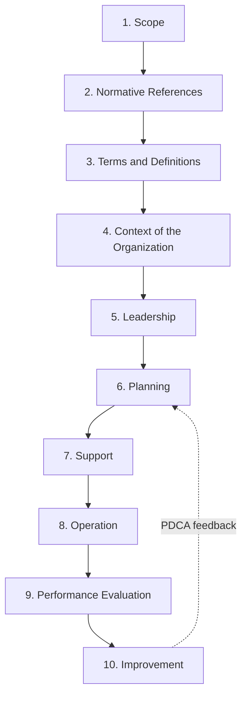

## Overview of the ISO Management System Standards Family

### Overview

ISO publishes dozens of **Management System Standards (MSS)** — standards specifying requirements for how an organization should structure its policies, processes, and controls to achieve a defined objective (quality, environmental performance, information security, safety, etc.). Since 2012, nearly all new and revised MSS follow a mandatory common framework called **Annex SL** (formerly, and still colloquially, called the "High-Level Structure" or HLS), which standardizes clause numbering, core terminology, and structural requirements across otherwise unrelated subject-matter standards. This harmonization is what allows organizations to build **integrated management systems (IMS)** combining multiple MSS with minimal duplicated documentation.

### What Qualifies as a Management System Standard

**Key Points**

- An MSS specifies requirements or guidance to help organizations manage a specific aspect of their operations as part of an overall, systematic management approach — distinguished from product standards (which specify characteristics of a physical good) or process standards (which specify how to perform a specific technical operation).
- Common structural features across all MSS: a defined **scope**, **context of the organization** analysis, **leadership** commitment requirements, **planning** (including risk/opportunity treatment), **support** (resources, competence, documented information), **operation**, **performance evaluation**, and **improvement**.
- MSS are generally either **certifiable** (containing auditable "shall" requirements, allowing third-party certification, e.g., ISO 9001) or **guidance-only** (containing "should" recommendations, not certifiable, e.g., ISO 9004).

### Major ISO Management System Standards

**Key Points**

| Standard | Subject Area | Responsible Committee | Notes |
| --- | --- | --- | --- |
| **ISO 9001** | Quality management | ISO/TC 176/SC 2 | Most widely certified MSS globally |
| **ISO 14001** | Environmental management | ISO/TC 207/SC 1 | Second most widely certified MSS |
| **ISO 45001** | Occupational health and safety | ISO/PC 283 | Replaced OHSAS 18001 |
| **ISO/IEC 27001** | Information security management | ISO/IEC JTC 1/SC 27 | Jointly developed with IEC |
| **ISO 22000** | Food safety management | ISO/TC 34/SC 17 | Incorporates HACCP principles |
| **ISO 50001** | Energy management | ISO/TC 301 | Focus on energy performance improvement |
| **ISO 22301** | Business continuity management | ISO/TC 292 | Organizational resilience focus |
| **ISO 37001** | Anti-bribery management | ISO/PC 278 | Compliance-oriented MSS |
| **ISO 55001** | Asset management | ISO/TC 251 | Physical/infrastructure asset focus |
| **ISO 20000-1** | IT service management | ISO/IEC JTC 1/SC 40 | Aligned with ITIL practices |
| **ISO 27701** | Privacy information management | ISO/IEC JTC 1/SC 27 | Extension to ISO 27001 |

### Annex SL: The Common High-Level Structure

**Key Points**

- Mandated by ISO's **Technical Management Board (TMB)**, Annex SL (of the ISO/IEC Directives, Part 1) requires all new and revised MSS to share:
  - **Identical clause numbering and titles** (10 clauses, with 4-10 containing substantive requirements).
  - **Common core text**, verbatim in many clauses, adapted only with subject-specific insertions.
  - **Common terms and definitions** (harmonized foundational vocabulary, though subject-specific terms are still added per standard).
- The 10-clause structure:
  1. Scope
  2. Normative references
  3. Terms and definitions
  4. Context of the organization
  5. Leadership
  6. Planning
  7. Support
  8. Operation
  9. Performance evaluation
  10. Improvement
- This structural harmonization is the single most significant development in MSS design of the past two decades, directly enabling efficient **integrated management systems**.

#### Annex SL Structure Diagram

### Why Harmonization Matters: Integrated Management Systems

**Key Points**

- Before Annex SL (pre-2012), each MSS had its own unique clause structure and terminology (e.g., ISO 9001:2008 and ISO 14001:2004 used substantially different numbering and language), forcing organizations pursuing multiple certifications to maintain largely separate documentation systems.
- With Annex SL, organizations can build a single **Integrated Management System (IMS)** — one set of policies, one management review process, one internal audit program — that simultaneously satisfies multiple MSS requirements, since clauses like "Leadership," "Context of the organization," and "Management review" are structurally identical across standards.
- Typical integration candidates: **ISO 9001 + ISO 14001 + ISO 45001** (quality, environment, and occupational health/safety), often called a "QEHS" integrated system, is the most common combination pursued by manufacturing organizations.
- Integration reduces audit burden (combined audits are possible), reduces documentation duplication, and reinforces a single organizational management review cadence rather than parallel, disconnected review cycles.

#### Integration Diagram (svg_diagram)

<svg xmlns="http://www.w3.org/2000/svg" viewBox="0 0 760 320" font-family="Arial, sans-serif">
<text x="380" y="24" font-size="17" font-weight="bold" text-anchor="middle">Integrated Management System via Annex SL (svg_diagram)</text>
<circle cx="380" cy="180" r="90" fill="#e8f0fe" stroke="#3b5bdb" stroke-width="2" />
<text x="380" y="170" font-size="13" font-weight="bold" text-anchor="middle">Shared Core</text>
<text x="380" y="188" font-size="11" text-anchor="middle">Leadership, Context,</text>
<text x="380" y="203" font-size="11" text-anchor="middle">Mgmt Review, Improvement</text>
<circle cx="200" cy="80" r="70" fill="#ffe3e3" stroke="#c92a2a" stroke-width="2" fill-opacity="0.85" />
<text x="200" y="75" font-size="12" font-weight="bold" text-anchor="middle">ISO 9001</text>
<text x="200" y="92" font-size="10" text-anchor="middle">Quality</text>
<circle cx="560" cy="80" r="70" fill="#d3f9d8" stroke="#2f9e44" stroke-width="2" fill-opacity="0.85" />
<text x="560" y="75" font-size="12" font-weight="bold" text-anchor="middle">ISO 14001</text>
<text x="560" y="92" font-size="10" text-anchor="middle">Environment</text>
<circle cx="380" cy="290" r="70" fill="#fff3bf" stroke="#e8590c" stroke-width="2" fill-opacity="0.85" />
<text x="380" y="285" font-size="12" font-weight="bold" text-anchor="middle">ISO 45001</text>
<text x="380" y="302" font-size="10" text-anchor="middle">Health &amp; Safety</text>
</svg>

### Differences That Remain Despite Harmonization

**Key Points**

- Annex SL standardizes **structure and generic requirements**, but each MSS retains substantial **subject-specific content** unique to its domain — e.g., ISO 14001's Clause 8 (Operation) addresses environmental aspects/impacts and emergency preparedness, entirely distinct from ISO 9001's Clause 8 content on design, production, and service provision controls.
- Risk concepts differ in emphasis: ISO 31000 (risk management guidance, itself not a certifiable MSS) informs risk-based thinking across MSS, but ISO 45001 requires explicit **hazard identification** or specific OH&S risk assessment methodology beyond ISO 9001's more generic risk-based thinking requirement.
- Terminology overlaps are substantial but not total — each standard's Clause 3 (Terms and definitions) adds domain-specific vocabulary atop the shared Annex SL core terms.
- Organizations integrating multiple MSS must still maintain distinct, subject-specific procedures and records where domain requirements diverge, even while sharing the overarching management framework.

### Certification and Audit Implications

**Key Points**

- Because clause structures align, integrated **combined audits** (a single audit team assessing conformity to multiple MSS in one visit) are common practice among certification bodies, reducing organizational audit fatigue and cost relative to fully separate audit programs.
- Auditors conducting integrated audits must still hold competence specific to each standard's subject matter (e.g., environmental legislation knowledge for ISO 14001, OH&S hazard assessment knowledge for ISO 45001) even while assessing shared structural clauses jointly.
- Certification bodies typically issue **separate certificates** per standard even when audits are combined, since each MSS remains a distinct, independently accredited certification scope.

### Practical Example

**Example**

A chemical processing plant pursuing integrated certification:

- **Context of the organization (Clause 4)**: A single analysis identifies interested parties and their requirements — customers (quality), regulators (environmental permits, worker safety) — feeding into all three standards' Clause 4 requirements simultaneously.
- **Leadership (Clause 5)**: One integrated quality-environment-safety policy statement, signed by top management, satisfies the leadership commitment clause across all three MSS.
- **Planning (Clause 6)**: A single risk register captures quality risks (customer complaint trends), environmental risks (emission compliance), and OH&S risks (chemical exposure hazards) within one integrated risk-planning process, though each risk type still requires standard-specific assessment methodology.
- **Operation (Clause 8)**: Divergence becomes most visible here — production process controls (ISO 9001), waste and emissions management procedures (ISO 14001), and permit-to-work/PPE requirements (ISO 45001) remain largely distinct, domain-specific procedures.
- **Performance evaluation and management review (Clauses 9-10)**: One integrated management review meeting addresses quality metrics, environmental performance data, and safety incident statistics together, producing a single set of improvement actions spanning all three domains.

### Conclusion

The ISO Management System Standards family, unified since 2012 by the Annex SL common structure, allows organizations to treat quality, environmental, safety, security, and other management disciplines as **interconnected facets of one overall management system** rather than isolated compliance silos. This harmonization is foundational context for understanding why ISO 9001's clause numbering (4 through 10) will look structurally familiar to anyone who has studied ISO 14001, ISO 45001, or ISO 27001 — and why integrated management system implementation has become the norm rather than the exception for multi-certified organizations.

**Next Steps**

- Study the Annex SL high-level structure clause-by-clause in full technical detail.
- Deep-dive into ISO 9001:2015's specific requirements, building on this structural foundation.
- Explore ISO 14001:2015 and its environmental-aspect-specific Clause 8 requirements.
- Examine ISO 45001:2018 and its distinct hazard-identification and worker-participation requirements.
- Study integrated management system (IMS) implementation methodology and combined-audit planning.
- Review ISO 31000 (risk management guidelines) as a cross-cutting reference informing risk-based thinking across the MSS family.