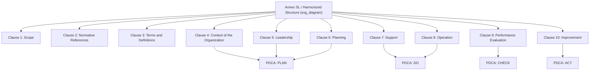

## The Harmonized Structure and Annex SL Framework

### Overview and Purpose

The Harmonized Structure (HS) — historically known as **Annex SL** — is the standardized framework issued by the ISO/IEC Joint Technical Coordination Group that governs how all ISO management system standards (MSS) are architected. It defines a common **clause sequence, core text, terms, and definitions** that every management system standard (ISO 9001, ISO 14001, ISO 45001, ISO 27001, ISO 22301, etc.) must incorporate, allowing individual standards to add discipline-specific requirements only where necessary.

The framework's name derives from its origin: it was published as **Annex SL** to the ISO/IEC Directives, Part 1, Consolidated ISO Supplement. Although ISO now formally refers to it as the "Harmonized Structure" (renamed around 2021 when the annex was updated and relocated), practitioners and even current ISO documentation frequently use "Annex SL" interchangeably with "Harmonized Structure."

**Key Points**

- Mandated for all new and revised management system standards since 2012
- Ensures identical clause numbering, structure, and common text across disciplines
- Enables organizations to integrate multiple MSS (e.g., ISO 9001 + ISO 14001 + ISO 45001) into a single Integrated Management System (IMS) with minimal duplication
- Administered by ISO's Technical Management Board (TMB), specifically the Joint Technical Coordination Group on MSS (JTCG)

### Historical Context

Prior to Annex SL, each ISO management system standard was developed independently by its own technical committee. This produced structural inconsistency: ISO 9001:2008 used one clause sequence, ISO 14001:2004 used a different one, and OHSAS 18001 (not even an ISO standard at the time) used yet another. Organizations pursuing multiple certifications faced:

- Duplicated documentation requirements
- Conflicting terminology (e.g., "management representative" vs. "top management responsibilities")
- Redundant audits and separate management review cycles
- Higher cost and administrative burden for integration

In response, ISO's TMB introduced Annex SL in 2012 as a mandatory template. ISO 9001:2015 and ISO 14001:2015 were among the first major standards revised to comply, and every MSS published or revised since has followed the same skeleton.

### The 10-Clause High-Level Structure (HLS)

The defining feature of Annex SL is the **High-Level Structure (HLS)** — ten clauses that appear in the same order, with the same core (identical) text, in every conforming standard. Clauses 1–3 are largely introductory/foundational; the substantive management system requirements begin at Clause 4.

| Clause | Title | Purpose |
| --- | --- | --- |
| 1 | Scope | Defines the boundaries and applicability of the standard |
| 2 | Normative References | Lists other standards indispensable for application |
| 3 | Terms and Definitions | References ISO's common MSS vocabulary plus discipline-specific terms |
| 4 | Context of the Organization | Establishes internal/external issues, interested parties, and scope of the MS |
| 5 | Leadership | Top management commitment, policy, roles/responsibilities/authorities |
| 6 | Planning | Risk and opportunity actions, objectives, and planning of changes |
| 7 | Support | Resources, competence, awareness, communication, documented information |
| 8 | Operation | Operational planning and control (discipline-specific content concentrates here) |
| 9 | Performance Evaluation | Monitoring, measurement, analysis, internal audit, management review |
| 10 | Improvement | Nonconformity, corrective action, continual improvement |

**Example**

Clause 4.1 ("Understanding the organization and its context") appears with near-identical wording in:

- ISO 9001:2015 §4.1 — context relevant to quality objectives and intended results
- ISO 14001:2015 §4.1 — context relevant to environmental performance
- ISO 45001:2018 §4.1 — context relevant to OH&S outcomes

Only the discipline-specific qualifier changes; the structural logic and much of the sentence construction remain constant.

### Anatomy of the Clause 4–10 Requirements

#### Clause 4: Context of the Organization

Requires the organization to determine external and internal issues (often analyzed via PESTLE or SWOT), identify interested parties and their relevant requirements, and define the scope of the management system, documented as a formal boundary statement.

#### Clause 5: Leadership

Shifts accountability from a delegated "management representative" (as in legacy standards) to **top management** directly. Requires establishing a policy appropriate to the organization's purpose and assigning organizational roles, responsibilities, and authorities.

#### Clause 6: Planning

Introduces **risk-based thinking** as a structural requirement — actions to address risks and opportunities (6.1), measurable objectives and plans to achieve them (6.2), and (in the 2021 HS update) planning of changes (6.3).

#### Clause 7: Support

Covers resources, competence, awareness, communication, and **documented information** — a term that replaces the legacy dual concepts of "documents" and "records," collapsing them into one unified requirement category with control provisions for creation, updating, and control.

#### Clause 8: Operation

The clause with the **least common text** across standards, since operational control is inherently domain-specific — quality's operational planning differs substantively from environmental operational controls or OH&S hazard elimination hierarchies.

#### Clause 9: Performance Evaluation

Requires monitoring, measurement, analysis, and evaluation; internal audit programs; and management review at planned intervals, with defined inputs and outputs.

#### Clause 10: Improvement

Addresses nonconformity and corrective action, and continual improvement of the suitability, adequacy, and effectiveness of the management system. The 2015-era standards de-emphasized mandatory "preventive action" as a discrete clause, since risk-based thinking (Clause 6) now performs that preventive function structurally.

### Core Text, Common Terms, and Identical Definitions

Annex SL mandates not just clause structure but **identical core text (verbatim in English)** and a **common set of terms and definitions**, published as a shared vocabulary that discipline-specific standards must reference and extend. Key harmonized terms include:

- **Management system** — set of interrelated elements to establish policy, objectives, and processes
- **Top management** — person/group who directs and controls the organization at the highest level
- **Risk** — effect of uncertainty
- **Documented information** — information required to be controlled and maintained
- **Conformity** / **Nonconformity** — fulfillment/non-fulfillment of a requirement
- **Continual improvement** — recurring activity to enhance performance

Standards developers may add discipline-specific terms (e.g., "environmental aspect" in ISO 14001, "OH&S hazard" in ISO 45001) but cannot redefine the common core terms.

### Structural Diagram

### Relationship to Plan-Do-Check-Act (PDCA)

The HLS clauses map directly onto the **PDCA cycle**, giving the abstract structure an operational management logic:

$$\text{PDCA} = \{\text{Plan (Cl. 4–6)}, \text{Do (Cl. 7–8)}, \text{Check (Cl. 9)}, \text{Act (Cl. 10)}\}$$

- **Plan**: Context, leadership commitment, risk/objective planning (Clauses 4–6)
- **Do**: Resource support and operational execution (Clauses 7–8)
- **Check**: Performance evaluation, audit, management review (Clause 9)
- **Act**: Nonconformity correction and continual improvement (Clause 10)

This mapping is why organizations already running a PDCA-based quality system find HS-compliant standards intuitive to layer additional disciplines onto.

### Benefits for Integrated Management Systems (IMS)

**Key Points**

- **Single audit cycle**: Internal and external auditors can assess multiple standards against a shared clause framework in one audit program
- **Unified documentation**: A single Quality/Environmental/OH&S manual (or integrated policy) can address Clauses 4–10 once, with discipline-specific annexes only where Clause 8 content diverges
- **Consistent management review**: One meeting cycle covers QMS, EMS, and OH&S performance rather than three
- **Reduced training burden**: Personnel learn one clause logic instead of memorizing multiple competing structures
- **Easier gap analysis**: Organizations can build a single integrated gap-analysis matrix across standards

### Standards Currently Conforming to the Harmonized Structure

| Standard | Domain | HS-Aligned Since |
| --- | --- | --- |
| ISO 9001 | Quality Management | 2015 |
| ISO 14001 | Environmental Management | 2015 |
| ISO 45001 | Occupational Health & Safety | 2018 (native HS design) |
| ISO/IEC 27001 | Information Security | 2013 (pre-empted HS, aligned) |
| ISO 22301 | Business Continuity | 2019 |
| ISO 50001 | Energy Management | 2018 |
| ISO 37001 | Anti-Bribery Management | 2016 |
| ISO 22000 | Food Safety Management | 2018 |

[Inference] Because JTCG periodically revises the core HS text (notably updates finalized around 2021 adding explicit climate-change context requirements to Clause 4.1/4.2 across MSS), organizations should verify which HS version a given standard edition was drafted against, as minor core-text wording can shift between revisions.

### Common Misconceptions

**Key Points**

- **Misconception**: Annex SL makes all management system standards "the same." *Reality*: only the skeletal structure and ~30% of the core text are common; Clause 8 (Operation) and discipline-specific sub-clauses still carry the majority of technical requirements unique to each domain.
- **Misconception**: "Annex SL" and "Harmonized Structure" refer to different frameworks. *Reality*: they are the same governing document; ISO renamed and relocated it within the ISO/IEC Directives around 2021, but "Annex SL" remains in wide informal use.
- **Misconception**: Compliance with the HS clause numbering alone constitutes certification readiness. *Reality*: an organization must still fulfill every discipline-specific requirement nested within each clause.

### Practical Implementation Guidance

1. **Cross-map existing procedures** against the 10-clause skeleton before attempting integration of multiple standards.
2. **Standardize terminology** organization-wide using the common Annex SL vocabulary (e.g., replace legacy terms like "records" and "documents" with "documented information").
3. **Design a single risk register** (Clause 6.1) that captures quality, environmental, and OH&S risks/opportunities in one integrated tool rather than parallel spreadsheets.
4. **Combine management review agendas** (Clause 9.3) using a single template with discipline-specific input/output sections.
5. **Audit against the HS logic first**, then verify discipline-specific Clause 8 operational controls separately.

### Conclusion

The Harmonized Structure (Annex SL) is the architectural backbone that makes modern ISO management system standards interoperable. By enforcing identical clause sequencing, shared core text, and common terminology across disciplines, it transforms what was once a fragmented certification landscape into a coherent, integrable framework — directly enabling the widespread adoption of Integrated Management Systems and substantially reducing the administrative and audit overhead organizations face when pursuing multiple ISO certifications simultaneously.

**Related Topics**

- PDCA Cycle in Management System Standards
- ISO 9001:2015 Clause-by-Clause Requirements
- Risk-Based Thinking (Clause 6.1) Across MSS
- Integrated Management Systems (IMS) Design and Audit Strategy
- Documented Information: Control Requirements Under Clause 7.5
- ISO/IEC Directives, Part 1 — Governance of ISO Standards Development
- Comparative Analysis: ISO 9001 vs. ISO 14001 vs. ISO 45001 Clause 8 Divergence
- Transition Strategies from Legacy Standards (e.g., OHSAS 18001) to HS-Aligned Standards