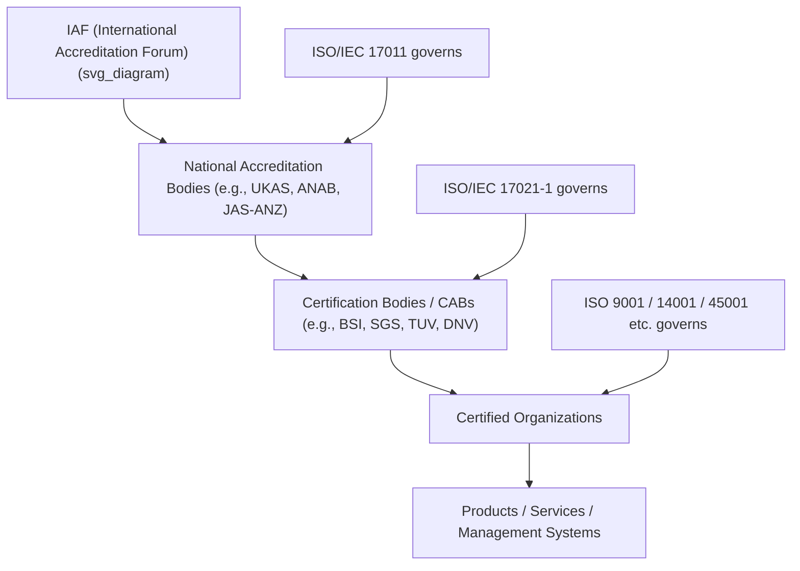

## Certification, Accreditation and Conformity Assessment Explained

### Overview

Conformity assessment is the umbrella discipline covering all activities used to demonstrate that a product, process, system, person, or organization meets specified requirements. **Certification** and **accreditation** are two distinct but interdependent layers within this discipline, operating in a hierarchical trust chain alongside **standardization** and **accreditation oversight**. Understanding the distinction — and the multi-tier pyramid connecting them — is foundational to interpreting the credibility of any ISO-based claim (e.g., "ISO 9001 certified").

**Key Points**

- Conformity assessment = the overall activity of determining whether requirements are fulfilled
- Certification = third-party attestation that a management system, product, or person conforms to a standard
- Accreditation = formal recognition that a certification body is competent to perform certification
- These layers form a **pyramid of trust**, each level overseeing the one below it

### The Conformity Assessment Pyramid

At each tier, a higher-level body audits and oversees the tier below, using a **peer standard** specifically designed for that oversight function:

| Tier | Entity | Governing Standard | Function |
| --- | --- | --- | --- |
| 1 | International Accreditation Forum (IAF) | Multilateral Recognition Arrangement (MLA) | Global consistency among national accreditation bodies |
| 2 | National Accreditation Body (NAB) | ISO/IEC 17011 | Accredits certification bodies within a country/region |
| 3 | Certification Body (CB) / Conformity Assessment Body (CAB) | ISO/IEC 17021-1 (management systems); ISO/IEC 17065 (products) | Audits and certifies organizations |
| 4 | Certified Organization | The MSS itself (e.g., ISO 9001) | Implements and maintains the management system |

### Certification Defined

**Certification** is the procedure by which a third party gives written assurance that a product, process, system, or person conforms to specified requirements. In the ISO management system context, certification specifically means:

- An **independent, accredited Certification Body (CB)** audits an organization's management system against a standard (e.g., ISO 9001:2015)
- If conformity is demonstrated, the CB issues a **certificate** valid for a defined period (typically 3 years, with annual/periodic surveillance audits)
- The certificate attests only that the *management system* conforms — not that individual products are defect-free or that services are guaranteed to a particular quality level

**Example**

A manufacturing company undergoes a two-stage external audit by an accredited CB:

- **Stage 1 audit**: Documentation review, readiness assessment, scope confirmation
- **Stage 2 audit**: On-site verification of implementation and effectiveness

If both stages are passed without major nonconformities, the CB issues an ISO 9001:2015 certificate. Ongoing conformity is verified through annual **surveillance audits**, with full **recertification audits** every three years.

### Types of Certification

| Type | Subject | Example |
| --- | --- | --- |
| Management System Certification | Organizational processes and controls | ISO 9001, ISO 14001, ISO 45001 |
| Product Certification | Physical products against technical specs | CE marking, UL listing, ISO product-specific marks |
| Personnel Certification | Individual competence | ISO/IEC 17024-based certifications (e.g., Certified Lead Auditor) |
| Process Certification | A specific process rather than the whole MS | Welding process qualification |

### Accreditation Defined

**Accreditation** is the formal, independent recognition that a certification body (or testing/inspection/calibration laboratory) is **competent** to carry out specific conformity assessment activities. It answers the question: *"Who certifies the certifiers?"*

- Performed by a **National Accreditation Body (NAB)** — a government-recognized or government-designated entity, typically one per country (e.g., **UKAS** in the UK, **ANAB** in the US, **JAS-ANZ** in Australia/New Zealand, **DAkkS** in Germany)
- NABs assess CBs against **ISO/IEC 17021-1** (for management system certification bodies) using their own auditors and documented competence criteria
- Accreditation is **not mandatory** in most jurisdictions for a CB to issue certificates, but accredited certificates carry significantly greater market credibility and international recognition

**Key Points**

- Accreditation ≠ Certification: a CB is *accredited*; an organization is *certified*
- Not all certificates are accredited — "unaccredited" certification bodies exist and may issue valid-looking certificates without NAB oversight, creating market confusion
- Accreditation bodies themselves are subject to peer evaluation through the **IAF Multilateral Recognition Arrangement (MLA)**, ensuring cross-border equivalence

### The Governing Standards Family (ISO/IEC 17000 Series)

| Standard | Scope |
| --- | --- |
| ISO/IEC 17000 | Vocabulary and general principles of conformity assessment |
| ISO/IEC 17011 | Requirements for accreditation bodies accrediting CABs |
| ISO/IEC 17020 | Requirements for bodies performing inspection |
| ISO/IEC 17021-1 | Requirements for bodies auditing/certifying management systems |
| ISO/IEC 17024 | Requirements for bodies certifying persons |
| ISO/IEC 17025 | General requirements for testing/calibration laboratory competence |
| ISO/IEC 17065 | Requirements for bodies certifying products, processes, services |

[Inference] Because the 17000 series is periodically revised (17021-1 was substantially restructured from the earlier combined 17021/TS documents), practitioners should confirm which edition a CB's accreditation scope currently references, since scope statements are edition-specific.

### Conformity Assessment: The Broader Discipline

Conformity assessment activities extend beyond certification to include:

- **Testing**: Determining product characteristics against specification (governed by ISO/IEC 17025 for labs)
- **Inspection**: Examination of a product design, product, process, or installation (ISO/IEC 17020)
- **Validation and Verification**: Confirming claims are substantiated (common in environmental/GHG reporting, e.g., ISO 14064-3)
- **Certification**: The attestation activity discussed above

$$\text{Conformity Assessment} \supseteq \{\text{Testing}, \text{Inspection}, \text{Validation/Verification}, \text{Certification}\}$$

### First-Party, Second-Party, and Third-Party Assessment

| Party | Who Performs It | Example | Independence |
| --- | --- | --- | --- |
| First-party | The organization itself | Internal audit (ISO 19011-based) | Low |
| Second-party | A customer or interested party | Supplier audit by a buyer | Medium |
| Third-party | An independent, accredited CB | ISO 9001 certification audit | High |

Certification specifically refers to **third-party** conformity assessment — this independence is what gives certification its market credibility, since neither the assessed organization nor its direct customers are performing the evaluation.

### The Accreditation Symbol and Verifying Legitimacy

Accredited certificates typically display:

- The CB's own logo/mark
- The **accreditation body's symbol** (e.g., the UKAS crown mark, ANAB mark)
- A unique certificate/accreditation number, verifiable via the accreditor's public register

**Example**

An organization claiming "ISO 27001 certified" status can be verified by:

1. Checking the certificate number against the issuing CB's public database
2. Confirming the CB itself appears on the relevant NAB's accredited-bodies register
3. Cross-checking the NAB's own signatory status on the IAF MLA signatory list

This three-step chain is how a customer, regulator, or auditor confirms that a certification claim traces back to a legitimate, internationally recognized accreditation chain rather than an unaccredited or fraudulent issuer.

### Common Pitfalls and Misconceptions

**Key Points**

- **Pitfall**: Assuming all certificates carry equal weight. *Reality*: unaccredited certification bodies can legally issue certificates in most jurisdictions, but these lack the NAB oversight and IAF-backed international recognition that accredited certificates carry.
- **Pitfall**: Confusing "ISO certifies companies." *Reality*: ISO does not perform certification or accreditation itself; ISO only develops and publishes standards. Certification is performed exclusively by independent CBs, overseen by NABs.
- **Pitfall**: Treating certification as a guarantee of product quality. *Reality*: management system certification attests to process conformity and consistency — not to zero-defect outcomes.

### Practical Implementation Guidance

1. **Select an accredited CB**: Verify NAB accreditation status and IAF MLA signatory status before engaging a certification body.
2. **Confirm scope alignment**: Ensure the CB's accreditation scope explicitly covers the standard and industry sector in question (accreditation scopes are often sector-specific, per IAF sector codes).
3. **Understand audit cadence**: Plan for Stage 1/Stage 2 initial audits, annual surveillance audits, and 3-year recertification cycles.
4. **Maintain traceability**: Keep certificate numbers and accreditation references documented for customer/regulator verification requests.
5. **Monitor accreditation currency**: Accreditation bodies periodically suspend or withdraw CB accreditation for non-conformity; verify status is current, not merely historical.

### Conclusion

Certification, accreditation, and conformity assessment together form a layered trust architecture that underpins the credibility of every ISO-based claim in the marketplace. Certification bodies assess organizations against standards; accreditation bodies assess certification bodies against ISO/IEC 17021-1 and related standards; and the IAF ties national accreditation systems together through mutual recognition. Understanding this pyramid — and knowing how to verify a certificate's place within it — is essential for any professional evaluating, pursuing, or auditing an ISO-based management system claim.

**Related Topics**

- ISO/IEC 17021-1: Requirements for Management System Certification Bodies
- The IAF Multilateral Recognition Arrangement (MLA) Explained
- Stage 1 vs. Stage 2 Certification Audits: Process Breakdown
- Surveillance Audits and Recertification Cycles
- First-, Second-, and Third-Party Audits in Practice
- Identifying and Avoiding Unaccredited/Fraudulent Certification Bodies
- ISO/IEC 17025: Testing and Calibration Laboratory Accreditation
- Personnel Certification Under ISO/IEC 17024