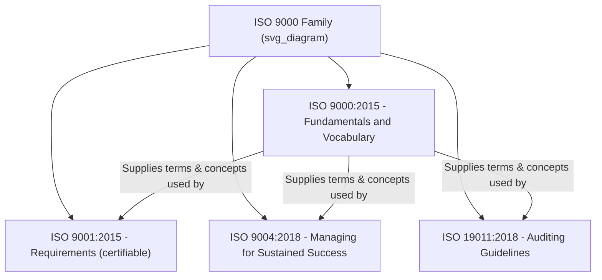
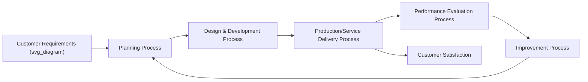

## ISO 9000 Fundamentals and Vocabulary

### Overview and Purpose

ISO 9000:2015, formally titled *Quality management systems — Fundamentals and vocabulary*, is the foundational reference document underpinning the entire ISO 9000 family. Unlike ISO 9001 (which specifies auditable *requirements*), ISO 9000 is **non-certifiable** — it establishes the conceptual foundation, the seven quality management principles (QMPs), and a harmonized vocabulary used consistently across ISO 9001, ISO 9004, ISO 19011, and other quality-related standards.

**Key Points**

- ISO 9000 contains no requirements — it cannot be "certified against"
- Provides the conceptual basis and terminology that ISO 9001 requirements presuppose
- Introduces the seven Quality Management Principles (QMPs)
- Establishes the process approach and PDCA cycle as core organizing logic
- Last major revision: ISO 9000:2015 (aligned with the Harmonized Structure era alongside ISO 9001:2015)

### Structural Position Within the ISO 9000 Family

ISO 9000 functions as the **semantic backbone** of the family: every defined term in ISO 9001 (e.g., "conformity," "process," "top management," "documented information") traces back to a formal definition established in ISO 9000 Clause 3.

### The Seven Quality Management Principles (QMPs)

ISO 9000:2015 Clause 2 articulates seven principles that form the philosophical foundation of ISO 9001's requirements. These principles are not themselves auditable, but every clause of ISO 9001 is traceable to one or more of them.

| # | Principle | Core Idea |
| --- | --- | --- |
| 1 | Customer Focus | Meeting and exceeding customer expectations is the primary purpose of quality management |
| 2 | Leadership | Unity of purpose and direction, created and maintained by top management |
| 3 | Engagement of People | Competent, empowered, engaged people at all levels enhance capability |
| 4 | Process Approach | Consistent, predictable results are achieved more effectively when activities are managed as interrelated processes |
| 5 | Improvement | Successful organizations maintain an ongoing focus on improvement |
| 6 | Evidence-Based Decision Making | Decisions based on analysis and evaluation of data/information are more likely to produce desired results |
| 7 | Relationship Management | Managing relationships with interested parties (suppliers, partners) optimizes performance |

**Example**

The QMP "Process Approach" (Principle 4) directly underlies ISO 9001:2015 Clause 4.4 ("Quality management system and its processes"), which requires organizations to determine the processes needed for the QMS, their sequence, interaction, inputs, outputs, and criteria for effective operation and control.

### The Process Approach and PDCA

ISO 9000 formally defines the **process approach**: the systematic management of activities as processes that transform inputs into outputs, using resources and being managed to achieve consistent, predictable results.

$$\text{Process} = f(\text{Inputs}, \text{Resources}, \text{Controls}) \rightarrow \text{Outputs}$$

This is explicitly linked to the **PDCA cycle** (Plan-Do-Check-Act), which ISO 9000 describes as applicable both to individual processes and to the QMS as a whole:

- **Plan**: Establish objectives, processes, and resources needed to deliver results in accordance with customer requirements and organizational policies
- **Do**: Implement what was planned
- **Check**: Monitor and measure processes/products against policies, objectives, and requirements; report results
- **Act**: Take actions to improve performance, as necessary

ISO 9000 also introduces **risk-based thinking** as a complementary concept, explaining that an organization needs to plan and implement actions to address risks and opportunities to increase the effectiveness of the QMS, achieve improved results, and prevent negative effects.

### Core Vocabulary (Clause 3)

ISO 9000:2015 Clause 3 defines approximately 138 terms organized into conceptual groups. This shared vocabulary is what allows ISO 9001 requirements to be interpreted consistently across industries and geographies. Selected foundational terms:

| Term | ISO 9000:2015 Definition (Paraphrased) |
| --- | --- |
| **Quality** | Degree to which a set of inherent characteristics fulfills requirements |
| **Requirement** | Need or expectation that is stated, generally implied, or obligatory |
| **Management System** | Set of interrelated elements to establish policy, objectives, and processes to achieve those objectives |
| **Top Management** | Person or group of people who directs and controls an organization at the highest level |
| **Process** | Set of interrelated or interacting activities that use inputs to deliver an intended result |
| **Procedure** | Specified way to carry out an activity or process |
| **Conformity** | Fulfillment of a requirement |
| **Nonconformity** | Non-fulfillment of a requirement |
| **Correction** | Action to eliminate a detected nonconformity |
| **Corrective Action** | Action to eliminate the cause(s) of a nonconformity and prevent recurrence |
| **Continual Improvement** | Recurring activity to enhance performance |
| **Effectiveness** | Extent to which planned activities are realized and planned results achieved |
| **Documented Information** | Information required to be controlled and maintained by an organization, and the medium on which it is contained |
| **Risk** | Effect of uncertainty on an expected result |
| **Interested Party (Stakeholder)** | Person or organization that can affect, be affected by, or perceive itself to be affected by a decision or activity |
| **Objective Evidence** | Data supporting the existence or verity of something |
| **Audit** | Systematic, independent, documented process for obtaining objective evidence and evaluating it objectively |

**Key Points**

- Terms are grouped conceptually in ISO 9000:2015 into clusters (e.g., terms related to "person," "activity," "process," "system," "requirement," "result," "data/information," "customer," "characteristic," "determination/action," "organization," "process characteristics," "audit")
- The term **"documented information"** replaced the previously separate concepts of "document" and "record" used in ISO 9001:2008
- The term **"management representative"** was formally removed as a mandatory role; responsibilities were redistributed to "top management" per the Leadership principle

### Concept: The QMS as a "System of Interacting Processes"

ISO 9000 frames a QMS not as a collection of isolated procedures, but as a coherent system where the outputs of one process become the inputs of another. This is often illustrated via a **process interaction map**.

### Fundamental Concepts Beyond the QMPs

ISO 9000:2015 Clause 2 also elaborates several foundational concepts that inform interpretation of ISO 9001:

- **Organizational Context**: The combination of internal and external issues that can affect an organization's approach to achieving its intended results
- **Interested Parties**: Recognition that a QMS must address not only customer needs but relevant requirements of other stakeholders (regulators, employees, suppliers) where they affect the organization's ability to consistently deliver conforming products/services
- **Support and Operation**: The distinction between resources/enabling conditions (Support) and the execution of core business activities (Operation) — directly mirroring HS Clauses 7 and 8
- **Improvement**: Distinguished into reactive improvement (correction, corrective action) and proactive improvement (innovation, reorganization, breakthrough change)

### Relationship to ISO 9001 Requirements

[Inference] Because ISO 9000 explicitly states its vocabulary and concepts are "intended to be used" by all quality-related standards, and ISO 9001:2015's own introduction directs readers to ISO 9000 for foundational terms, exam or audit interpretation questions frequently draw a direct line between a specific ISO 9000 principle and the corresponding ISO 9001 clause — understanding this traceability is considered essential for both certification and auditor training contexts.

**Example**

| ISO 9000 Principle/Concept | Corresponding ISO 9001:2015 Clause |
| --- | --- |
| Customer Focus | 5.1.2, 8.2 (Customer requirements and communication) |
| Leadership | Clause 5 (Leadership) |
| Process Approach | 4.4 (QMS and its processes) |
| Evidence-Based Decision Making | 9.1 (Monitoring, measurement, analysis, evaluation) |
| Improvement | Clause 10 (Improvement) |
| Risk-based thinking | 6.1 (Actions to address risks and opportunities) |

### Common Misconceptions

**Key Points**

- **Misconception**: "We are ISO 9000 certified." *Reality*: ISO 9000 is not a certifiable standard; organizations are certified to ISO 9001. This phrasing is a common but technically incorrect colloquialism, sometimes used loosely to refer to the whole family.
- **Misconception**: ISO 9000's vocabulary is optional guidance. *Reality*: because ISO 9001 Clause 3 explicitly incorporates ISO 9000's terms and definitions by reference, correct interpretation of ISO 9001 requirements depends on the ISO 9000 definitions.
- **Misconception**: The seven QMPs are requirements to be audited individually. *Reality*: they are underlying philosophy; auditors assess conformity to ISO 9001's specific clauses, not directly to the principles themselves.

### Practical Implementation Guidance

1. **Use ISO 9000 as onboarding material**: New QMS personnel should study ISO 9000 before ISO 9001 to build conceptual fluency in the shared vocabulary.
2. **Map principles to practice**: When designing QMS documentation, explicitly reference which QMP(s) a given policy or procedure supports, aiding both employee understanding and auditor traceability.
3. **Standardize terminology organization-wide**: Replace legacy or ad hoc terms (e.g., "problem report" vs. "nonconformity") with ISO 9000-aligned vocabulary to ensure audit clarity.
4. **Reference during document control design**: Use the "documented information" concept to unify document and record control procedures into a single controlled framework.

### Conclusion

ISO 9000:2015 is the conceptual and linguistic foundation of the entire quality management standards family. While it contains no certifiable requirements, its seven Quality Management Principles and harmonized vocabulary directly shape how ISO 9001's requirements are written, interpreted, and audited. A thorough grasp of ISO 9000 fundamentals is a prerequisite for correctly implementing, auditing, or teaching any standard within the ISO 9000 family.

**Related Topics**

- The Seven Quality Management Principles in Depth
- ISO 9001:2015 Clause-by-Clause Requirements
- The Process Approach and Process Interaction Mapping
- Risk-Based Thinking in Quality Management Systems
- Documented Information: Control Requirements
- ISO 9004:2018 — Managing for the Sustained Success of an Organization
- ISO 19011:2018 — Guidelines for Auditing Management Systems