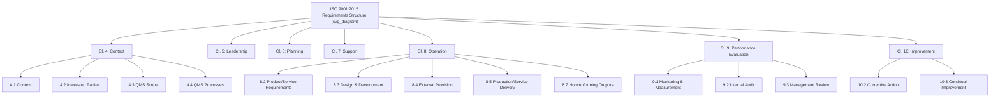

## ISO 9001 Requirements Structure Overview

### Overview and Purpose

ISO 9001:2015, *Quality management systems — Requirements*, is the only **certifiable** standard in the ISO 9000 family. It specifies the auditable requirements an organization must fulfill to demonstrate its ability to consistently provide products and services that meet customer and applicable statutory/regulatory requirements, while aiming to enhance customer satisfaction. Structurally, it fully conforms to the **Harmonized Structure (Annex SL)**, meaning its ten clauses follow the same sequence and core text shared across all modern ISO management system standards.

**Key Points**

- Clauses 1–3 are introductory/foundational (non-auditable in isolation)
- Clauses 4–10 contain the auditable "shall" requirements
- Fully aligned to Harmonized Structure, PDCA, and risk-based thinking
- Applicable to any organization, regardless of size, type, or sector

### The Ten-Clause Skeleton

| Clause | Title | Nature |
| --- | --- | --- |
| 1 | Scope | Introductory |
| 2 | Normative References | Introductory |
| 3 | Terms and Definitions | Introductory (references ISO 9000) |
| 4 | Context of the Organization | Requirements begin |
| 5 | Leadership | Requirements |
| 6 | Planning | Requirements |
| 7 | Support | Requirements |
| 8 | Operation | Requirements |
| 9 | Performance Evaluation | Requirements |
| 10 | Improvement | Requirements |

### Clause 4: Context of the Organization

Establishes the foundational scoping and environmental-awareness requirements before any operational planning begins.

- **4.1** Understanding the organization and its context (external/internal issues)
- **4.2** Understanding the needs and expectations of interested parties
- **4.3** Determining the scope of the QMS
- **4.4** QMS and its processes (the process approach in operational form)

**Example**

A mid-size electronics manufacturer documents Clause 4.1 by analyzing external issues (supply chain volatility, regulatory changes in target export markets) and internal issues (workforce skill gaps, aging equipment), feeding these directly into Clause 6 risk planning.

### Clause 5: Leadership

Shifts quality accountability explicitly to top management rather than a delegated representative.

- **5.1** Leadership and commitment (5.1.1 general; 5.1.2 customer focus)
- **5.2** Policy (5.2.1 establishing; 5.2.2 communicating)
- **5.3** Organizational roles, responsibilities, and authorities

**Key Points**

- The standalone "management representative" role from ISO 9001:2008 is eliminated; responsibilities are distributed among top management and assigned roles
- Top management must demonstrate leadership by integrating QMS requirements into business processes, not merely delegating oversight

### Clause 6: Planning

Introduces risk-based thinking as a structural planning mechanism.

- **6.1** Actions to address risks and opportunities (6.1.1 general; 6.1.2 planning actions)
- **6.2** Quality objectives and planning to achieve them
- **6.3** Planning of changes

$$\text{QMS Effectiveness} = f(\text{Risk Mitigation}, \text{Opportunity Capture}, \text{Objective Attainment})$$

**Example**

An organization identifies a risk (single-source supplier dependency) under 6.1, sets a corresponding objective under 6.2 ("qualify a secondary supplier within 12 months"), and documents the resourcing and timeline required to achieve it.

### Clause 7: Support

Covers the enabling resources and infrastructure required to operate the QMS.

- **7.1** Resources (7.1.1 general; 7.1.2 people; 7.1.3 infrastructure; 7.1.4 environment for process operation; 7.1.5 monitoring/measuring resources; 7.1.6 organizational knowledge)
- **7.2** Competence
- **7.3** Awareness
- **7.4** Communication
- **7.5** Documented information (7.5.1 general; 7.5.2 creating/updating; 7.5.3 control)

**Key Points**

- "Documented information" collapses the legacy dual concepts of documents and records into one unified control requirement
- 7.1.6 (Organizational knowledge) is a new sub-clause introduced in the 2015 revision, requiring organizations to determine knowledge necessary for process operation and to maintain/protect it

### Clause 8: Operation

The largest and most operationally detailed clause, covering the full product/service realization lifecycle. This clause carries the **least amount of shared core text** across HS-based standards, since operational control content is inherently discipline-specific to quality management.

- **8.1** Operational planning and control
- **8.2** Requirements for products and services (8.2.1 customer communication; 8.2.2 determining requirements; 8.2.3 review of requirements; 8.2.4 changes to requirements)
- **8.3** Design and development of products and services (8.3.1–8.3.6, covering planning, inputs, controls, outputs, and changes)
- **8.4** Control of externally provided processes, products, and services (8.4.1 general; 8.4.2 type/extent of control; 8.4.3 information for external providers)
- **8.5** Production and service provision (8.5.1 control of production/service provision; 8.5.2 identification and traceability; 8.5.3 property belonging to customers/external providers; 8.5.4 preservation; 8.5.5 post-delivery activities; 8.5.6 control of changes)
- **8.6** Release of products and services
- **8.7** Control of nonconforming outputs

**Example**

A contract electronics assembler applies 8.4 (Control of externally provided processes) by implementing a supplier qualification scorecard, applies 8.5.2 (Traceability) via lot-number tracking through the SMT line, and applies 8.7 (Nonconforming outputs) through a quarantine-and-disposition workflow for failed in-circuit test boards.

### Clause 9: Performance Evaluation

The "Check" phase of PDCA, formalizing how the organization measures whether the QMS is working.

- **9.1** Monitoring, measurement, analysis, and evaluation (9.1.1 general; 9.1.2 customer satisfaction; 9.1.3 analysis and evaluation)
- **9.2** Internal audit
- **9.3** Management review (9.3.1 general; 9.3.2 inputs; 9.3.3 outputs)

**Key Points**

- Management review inputs (9.3.2) are explicitly prescribed: status of previous actions, changes in context, performance and effectiveness data, resource adequacy, risk/opportunity effectiveness, and improvement opportunities
- Management review outputs (9.3.3) must include decisions on improvement opportunities, QMS change needs, and resource needs

### Clause 10: Improvement

The "Act" phase, closing the PDCA loop.

- **10.1** General
- **10.2** Nonconformity and corrective action
- **10.3** Continual improvement

**Key Points**

- Unlike ISO 9001:2008, there is no standalone "preventive action" clause — this function is structurally absorbed into Clause 6's risk-based thinking, since addressing risk proactively serves the preventive purpose

### Full Clause Architecture Diagram

### PDCA Mapping of the Full Structure

| PDCA Phase | Clauses | Function |
| --- | --- | --- |
| **Plan** | 4, 5, 6 | Context definition, leadership commitment, risk/objective planning |
| **Do** | 7, 8 | Resourcing and operational execution |
| **Check** | 9 | Monitoring, internal audit, management review |
| **Act** | 10 | Correction and continual improvement |

### Documented Information Requirements Across Clauses

ISO 9001:2015 does not mandate a fixed list of procedures (unlike the 2008 version's six mandatory documented procedures). Instead, "documented information" is required only where explicitly specified or where the organization determines it necessary for QMS effectiveness. Commonly retained documented information includes:

| Clause Reference | Documented Information Typically Required |
| --- | --- |
| 4.3 | QMS scope statement |
| 5.2 | Quality policy |
| 6.2 | Quality objectives |
| 7.1.5 | Calibration/verification records for monitoring equipment |
| 7.2 | Evidence of competence |
| 8.1 | Evidence that operational processes are carried out as planned |
| 8.2.3 | Results of requirements review; new requirements for products/services |
| 8.3.2–8.3.6 | Design and development records |
| 8.5.2 | Traceability records where applicable |
| 8.6 | Evidence of conformity and release authorization |
| 8.7 | Records of nonconformities and actions taken |
| 9.1 | Results of monitoring, measurement, analysis, and evaluation |
| 9.2 | Internal audit program evidence and audit results |
| 9.3 | Management review outputs |
| 10.2 | Nonconformity and corrective action records |

[Inference] Because Clause 7.5's documented information requirements are deliberately non-prescriptive about format (paper, electronic, or otherwise), auditors typically assess adequacy based on whether the retained information provides sufficient objective evidence of conformity — organizations therefore have latitude in choosing their documentation medium and depth.

### Applicability and Scope Flexibility

ISO 9001:2015 permits **exclusions** only within Clause 8 (Operation), and only where a requirement does not apply due to the nature of the organization's products/services (e.g., a service-only organization may exclude 8.3 Design and Development if it does not design its own offerings). Exclusions must not affect the organization's ability or responsibility to ensure conformity.

**Key Points**

- No exclusions are permitted in Clauses 4–7, 9, or 10 — these apply universally regardless of organization type
- Exclusion justification must be documented and defensible during certification audits

### Common Misconceptions

**Key Points**

- **Misconception**: ISO 9001 requires six mandatory documented procedures. *Reality*: this was a 2008-version requirement; the 2015 version replaced fixed procedural mandates with outcome-based "documented information" requirements.
- **Misconception**: Clause 8 exclusions can be applied broadly. *Reality*: exclusions are narrowly scoped to specific sub-clauses where genuinely inapplicable, not a general opt-out mechanism.
- **Misconception**: Clause order implies sequential implementation. *Reality*: while numbered sequentially, Clauses 4–10 function as an interdependent system (e.g., Clause 6 risk planning continuously informs Clause 8 operational control, not merely as a one-time upstream step).

### Practical Implementation Guidance

1. **Build a clause-to-process cross-reference matrix**: Map each of the 4–10 clauses to specific organizational processes and documented information artifacts to streamline audit readiness.
2. **Treat Clause 8 as the operational core**: Since this clause diverges most from shared HS text, invest the most implementation detail here relative to organizational specifics.
3. **Integrate 6.1/6.2 with 9.3**: Use management review as the formal loop that revisits risk/opportunity actions and objective progress, closing the PDCA cycle.
4. **Justify exclusions explicitly**: Document the rationale for any Clause 8 exclusions in the QMS scope statement (4.3) for auditor reference.
5. **Avoid over-documentation**: Since 7.5 is outcome-based rather than prescriptive, calibrate documented information volume to organizational complexity rather than defaulting to legacy 2008-style procedure manuals.

### Conclusion

ISO 9001:2015's requirements structure — fully aligned to the Harmonized Structure — organizes quality management into a coherent PDCA-driven system spanning context, leadership, planning, support, operation, performance evaluation, and improvement. Its shift from prescriptive documentation mandates to outcome-based, risk-informed requirements gives organizations flexibility in implementation while preserving auditable rigor, making Clause 8 (Operation) the primary locus of discipline-specific technical content within an otherwise harmonized framework.

**Related Topics**

- Clause 8 Deep Dive: Operational Planning and Control
- Risk-Based Thinking and the Elimination of Preventive Action (Clause 6.1)
- Documented Information: Creation, Control, and Retention Requirements
- Management Review Inputs and Outputs (Clause 9.3)
- Permissible Scope Exclusions Under Clause 4.3
- Internal Audit Program Design per ISO 19011
- Transitioning from ISO 9001:2008 to ISO 9001:2015