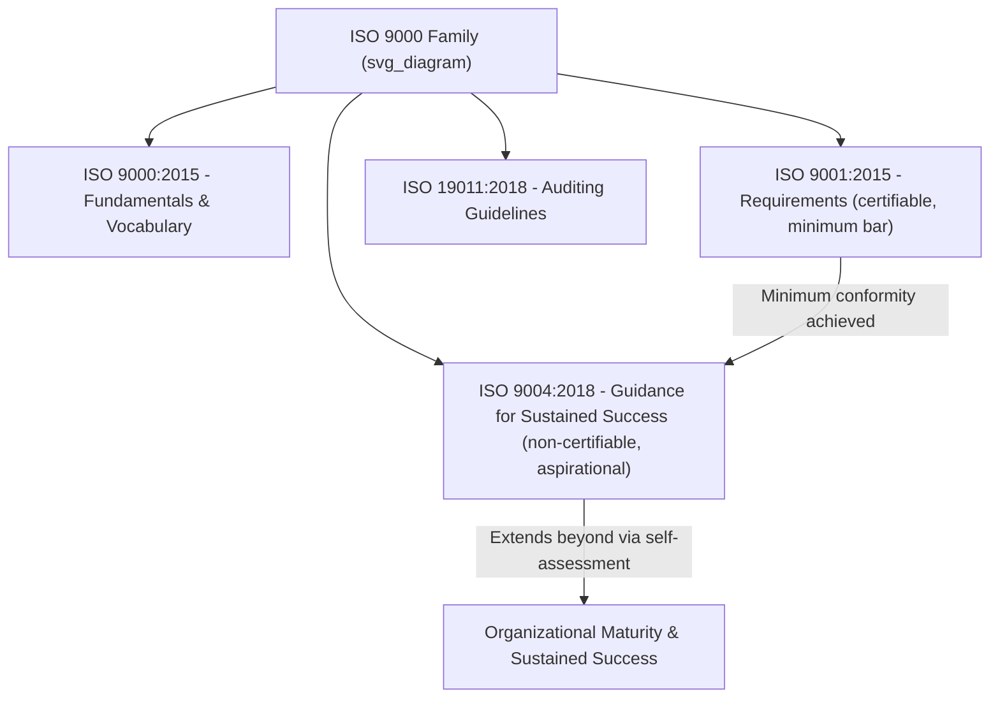
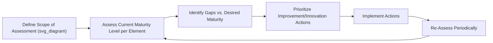

## ISO 9004 Guidance for Sustained Organizational Success

### Overview and Purpose

ISO 9004:2018, *Quality management — Quality of an organization — Guidance to achieve sustained success*, is a **non-certifiable guidance standard** within the ISO 9000 family. Where ISO 9001 specifies the minimum requirements for a certifiable QMS, ISO 9004 goes further — offering guidance for organizations seeking to move beyond basic conformity toward **sustained, long-term success** through a broader self-assessment and organizational maturity framework. It is explicitly designed as a companion to, not a replacement for, ISO 9001.

**Key Points**

- Non-certifiable — purely advisory guidance, never audited for compliance
- Targets organizations that have already achieved (or are pursuing) ISO 9001 conformity and want to go further
- Introduces a **self-assessment tool** for evaluating organizational maturity
- Broadens focus beyond customer satisfaction to encompass all relevant interested parties
- Latest edition: ISO 9004:2018 (third edition, retitled from earlier "Managing for the sustained success of an organization — A quality management approach")

### Position Within the ISO 9000 Family

**Example**

An organization certified to ISO 9001:2015 for five consecutive years, having stabilized its core QMS processes, uses ISO 9004:2018's self-assessment tool to identify that while its "Operation" processes are mature, its "Relationship Management" and "Innovation" capabilities remain at a lower maturity level — prompting a deliberate initiative to formalize supplier partnership programs.

### Relationship to ISO 9001: Requirements vs. Guidance

| Dimension | ISO 9001:2015 | ISO 9004:2018 |
| --- | --- | --- |
| Nature | Requirements ("shall") | Guidance ("should"/recommendations) |
| Certifiable | Yes | No |
| Primary focus | Customer satisfaction, conformity | Sustained success across all interested parties |
| Audience | Any organization seeking certification | Organizations pursuing organizational excellence beyond minimum compliance |
| Structural basis | Harmonized Structure (10 clauses) | Related structure, but with added self-assessment and maturity emphasis |
| Typical use | External certification audits | Internal strategic self-evaluation |

[Inference] Because ISO 9004 is explicitly non-normative and contains no auditable "shall" statements, organizations typically use it as an internal strategic planning and benchmarking tool rather than as audit preparation material — though its concepts often inform how mature organizations interpret and exceed ISO 9001's baseline requirements.

### Core Concept: Sustained Success

ISO 9004:2018 defines **sustained success** as an organization's ability to achieve and maintain its objectives over the long term, in a balanced and continual manner, in a complex, demanding, and often changing environment. This concept extends the quality management scope from "meeting customer requirements" to **holistic organizational performance and resilience**.

$$\text{Sustained Success} = f(\text{Context Awareness}, \text{Stakeholder Balance}, \text{Adaptive Capacity}, \text{Continual Improvement})$$

### Key Thematic Areas

ISO 9004:2018 is organized around several thematic pillars that extend the ISO 9000 QMPs into a strategic management context:

- **Quality of an organization**: The extent to which the inherent characteristics of an organization fulfill the needs and expectations of its customers and other relevant interested parties, to achieve sustained success
- **Organizational context and identity**: Understanding mission, vision, values, and culture as strategic inputs
- **Strategy and policy**: Aligning quality management with overall organizational strategy, not treating it as a siloed function
- **Resource management for sustained success**: Broader than ISO 9001's 7.1 resources — includes knowledge management, technology, and organizational infrastructure at a strategic level
- **Processes**: Managing processes for organizational agility and adaptability, not merely conformity
- **Monitoring, measurement, analysis, and review**: Extended self-assessment beyond audit-based verification
- **Improvement, learning, and innovation**: Explicit emphasis on innovation as a distinct capability, beyond incremental continual improvement

**Key Points**

- ISO 9004 broadens "interested parties" consideration significantly beyond ISO 9001's customer-centric lens — including employees, owners/shareholders, suppliers, partners, and society
- Innovation is treated as a distinct organizational capability requiring deliberate management, not an incidental byproduct of continual improvement

### The Self-Assessment Tool

A defining feature of ISO 9004:2018 is its **structured self-assessment methodology**, allowing organizations to evaluate their maturity level across key elements of the standard using a defined maturity scale.

| Maturity Level | General Description |
| --- | --- |
| Level 1 | No formal approach; reactive |
| Level 2 | Basic/reactive approach with some systematic elements |
| Level 3 | Stable, formal, systematic approach |
| Level 4 | Emphasis on continual improvement |
| Level 5 | Best-in-class/benchmark performance |

**Example**

An organization conducts a self-assessment against ISO 9004's process management element and rates itself at Level 3 (stable, systematic approach) — identifying a gap toward Level 4 (continual improvement) in how process performance data feeds back into strategic planning cycles, then sets an internal roadmap to close that gap.

### Self-Assessment Process Flow

### Interested Parties: Expanded Scope

While ISO 9001 requires organizations to consider interested parties primarily insofar as they affect QMS conformity (Clause 4.2), ISO 9004 encourages a more expansive, strategic balancing of interested-party needs as a driver of sustained success:

| Interested Party | Typical Needs/Expectations Addressed |
| --- | --- |
| Customers | Value, quality, reliability |
| Employees | Development, engagement, safe/fair working conditions |
| Owners/Investors | Sustained financial performance, transparency |
| Suppliers/Partners | Mutually beneficial relationships, stability |
| Society | Legal compliance, environmental/social responsibility |

**Key Points**

- ISO 9004 explicitly frames stakeholder balance as a strategic risk-management issue: overemphasizing one interested party (e.g., short-term shareholder returns) at the expense of others (e.g., employee wellbeing, supplier relationships) can undermine long-term sustained success

### Common Use Cases

- **Post-certification maturity roadmap**: Organizations newly certified to ISO 9001 use ISO 9004 to plan multi-year QMS maturation beyond minimum compliance
- **Business excellence framework alignment**: Organizations pursuing frameworks like the Baldrige Excellence Framework or EFQM Model often use ISO 9004 as a complementary, ISO-aligned self-assessment layer
- **Strategic planning input**: Quality managers use ISO 9004's thematic structure to brief executive leadership on organizational maturity gaps in language aligned with broader business strategy

### Common Misconceptions

**Key Points**

- **Misconception**: "We are ISO 9004 certified." *Reality*: ISO 9004 is not certifiable under any circumstances — no accredited certification body issues certificates against it, as it contains no "shall" requirements.
- **Misconception**: ISO 9004 is a prerequisite for ISO 9001 certification. *Reality*: the two are independent; an organization can pursue ISO 9001 certification without ever consulting ISO 9004.
- **Misconception**: ISO 9004 duplicates ISO 9001 content. *Reality*: while thematically related and cross-referencing shared ISO 9000 vocabulary, ISO 9004 addresses a broader strategic and stakeholder scope that ISO 9001 does not cover, particularly around innovation management and multi-stakeholder balance.

### Practical Implementation Guidance

1. **Use only after QMS stabilization**: Organizations typically derive the most value from ISO 9004 after their ISO 9001 QMS has matured past initial implementation and certification cycles.
2. **Conduct self-assessment periodically**: Treat the maturity self-assessment as a recurring strategic exercise (e.g., annually), feeding results into management review (ISO 9001 Clause 9.3) as supplementary strategic input.
3. **Engage executive leadership**: Because ISO 9004 addresses organizational strategy and multi-stakeholder balance, effective use requires participation beyond the quality function alone — typically involving senior leadership.
4. **Avoid conflating with audit preparation**: Do not present ISO 9004 self-assessment results as evidence during ISO 9001 certification audits; the two serve different, non-overlapping purposes.
5. **Integrate innovation management deliberately**: Use ISO 9004's innovation guidance to formalize what may otherwise be an ad hoc innovation process within the organization.

### Conclusion

ISO 9004:2018 serves as the aspirational, non-certifiable counterpart to ISO 9001's certifiable minimum requirements — guiding organizations that have already achieved basic QMS conformity toward broader organizational maturity, multi-stakeholder balance, and sustained long-term success. Its structured self-assessment methodology provides a practical mechanism for organizations to benchmark their quality management maturity and strategically plan improvement and innovation beyond the scope of certification audits.

**Related Topics**

- ISO 9000 Fundamentals and the Seven Quality Management Principles
- ISO 9001:2015 Requirements Structure Overview
- Organizational Maturity Models and Self-Assessment Frameworks
- The Baldrige Excellence Framework and EFQM Model (Comparative Context)
- Innovation Management Systems (ISO 56000 Series)
- Stakeholder/Interested Party Analysis in Quality Management
- Management Review as a Strategic Planning Mechanism