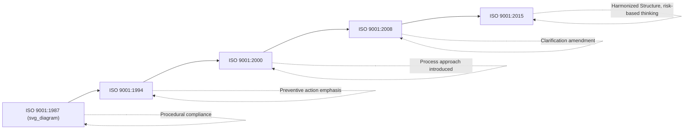

## Evolution of ISO 9001 Editions from 1987 to 2015

### Overview and Purpose

ISO 9001 has undergone five major editions since its original publication, each reflecting shifts in quality management philosophy — from rigid procedural compliance toward process-based, risk-informed, and leadership-driven management systems. Understanding this evolutionary trajectory clarifies *why* the current 2015 structure looks the way it does, and helps practitioners interpret legacy documentation, transition requirements, and audit expectations across organizations at different points in their certification history.

**Key Points**

- Five editions: 1987, 1994, 2000, 2008, 2015
- Trajectory: procedural compliance → process approach → risk-based thinking → strategic integration
- The 2000 revision was the most structurally transformative; the 2015 revision was the most philosophically transformative (Harmonized Structure adoption)
- Each revision cycle has historically followed a ~7-8 year interval, with periodic "amendment" or minor releases in between major editions

### Timeline Overview

### ISO 9001:1987 — The Founding Edition

The original ISO 9001 was published in 1987, derived heavily from the British Standard **BS 5750**, itself rooted in military and defense procurement quality standards (notably US MIL-Q-9858 and NATO AQAP series). This edition established the foundational concept of third-party certifiable quality assurance.

**Key Points**

- Based on a 20-element structure, organized around a manufacturing/production lifecycle model
- Three related standards existed in parallel: ISO 9001 (design, development, production, installation, servicing), ISO 9002 (production and installation only), ISO 9003 (final inspection and testing only) — organizations selected the standard matching their scope of activity
- Heavy emphasis on **documented procedures** and **conformance to specification**, with limited attention to customer satisfaction or continual improvement as explicit concepts
- Structure was organized by *function* (e.g., design control, purchasing, process control) rather than by management system logic

**Example**

Under ISO 9001:1987, a components distributor with no design or manufacturing function would typically certify to **ISO 9002** rather than ISO 9001, since ISO 9001's design-control elements were inapplicable to their scope — a structural distinction that no longer exists in post-2000 editions.

### ISO 9001:1994 — The First Revision

The 1994 revision was a relatively conservative update, retaining the same 20-element structure but increasing emphasis on **preventive action** and clarifying **quality planning** requirements. It did not fundamentally restructure the standard.

**Key Points**

- Retained the three-tier ISO 9001/9002/9003 model
- Strengthened requirements for preventive action (distinct from corrective action) as a proactive quality mechanism
- Increased documentation burden was a widely noted criticism — organizations often produced extensive procedure manuals with limited demonstrable impact on actual quality outcomes
- [Inference] Because this edition is widely regarded in quality management literature as having produced excessive bureaucratic documentation without proportionate performance benefit, it is frequently cited as the primary catalyst for the more radical restructuring that followed in 2000.

### ISO 9001:2000 — The Process Approach Revolution

The 2000 revision represented the most significant structural transformation in ISO 9001's history, fundamentally reconceiving the standard around the **process approach** rather than a checklist of functional elements.

**Key Points**

- Unified ISO 9001, 9002, and 9003 into a **single standard** with permissible exclusions (introducing the exclusion mechanism still used today), eliminating the need for separate standard selection based on organizational scope
- Restructured around **four major clause groups**: Management Responsibility, Resource Management, Product Realization, Measurement/Analysis/Improvement — an early precursor to today's Harmonized Structure logic
- Formally introduced **"customer satisfaction"** as a measurable requirement, not merely an implied goal
- Introduced **continual improvement** as an explicit, ongoing requirement rather than an incidental outcome
- Adopted **PDCA (Plan-Do-Check-Act)** explicitly as the standard's organizing model
- Reduced prescriptive documentation requirements relative to 1994, shifting toward "process effectiveness" as the measure of conformity

**Example**

Where ISO 9001:1994 might have required a standalone "Purchasing Procedure" document as one of many discrete functional procedures, ISO 9001:2000 reframed purchasing as part of the broader **Product Realization** process group, requiring organizations to demonstrate how purchasing integrated with and supported the overall process-based QMS.

### ISO 9001:2008 — The Clarification Edition

The 2008 revision was explicitly designated a "clarification" amendment rather than a substantive revision. ISO's own guidance at the time confirmed no new requirements were introduced.

**Key Points**

- No new requirements added; purpose was to clarify existing 2000-edition requirements and improve compatibility with ISO 14001:2004
- Minor wording adjustments to reduce ambiguity in interpretation across different industries and languages
- Retained the same four-clause-group structure as the 2000 edition
- Because it introduced no new requirements, many certified organizations transitioned to the 2008 edition with minimal QMS modification — primarily documentation relabeling rather than substantive process change

### ISO 9001:2015 — The Harmonized Structure Edition

The 2015 revision represents the most philosophically significant change since 2000, driven primarily by ISO's mandate that all management system standards adopt the **Harmonized Structure (Annex SL)**.

**Key Points**

- Adopted the 10-clause Harmonized Structure, enabling structural alignment with ISO 14001, ISO 45001, and other MSS for integrated management system implementation
- Introduced **risk-based thinking** (Clause 6.1) as an explicit requirement, formally absorbing and superseding the standalone "preventive action" clause that had existed since 1994
- Eliminated the mandatory **"management representative"** role, redistributing responsibility to top management directly (Clause 5)
- Replaced the dual concepts of "documents" and "records" with the unified **"documented information"** (Clause 7.5)
- Removed the fixed list of six mandatory documented procedures that had become customary under the 2008 edition, in favor of outcome-based documentation requirements
- Introduced **"context of the organization"** (Clause 4.1, 4.2) as a new foundational requirement, requiring analysis of external/internal issues and interested-party needs before QMS planning begins
- Formally reduced applicability of the term "product" alone, adopting **"products and services"** throughout to better reflect service-sector applicability

### Comparative Structural Evolution

| Edition | Structural Model | Element/Clause Count | Key Innovation |
| --- | --- | --- | --- |
| 1987 | 20-element functional list | 20 elements | Foundational certifiable QMS; 3-tier model (9001/9002/9003) |
| 1994 | 20-element functional list (retained) | 20 elements | Preventive action emphasis |
| 2000 | 4 process-based clause groups | ~5 major clauses | Process approach; unified single standard; customer satisfaction |
| 2008 | 4 process-based clause groups (retained) | ~5 major clauses | Clarification only; no new requirements |
| 2015 | 10-clause Harmonized Structure | 10 clauses (4–10 auditable) | Risk-based thinking; context of organization; HS alignment |

### Conceptual Evolution: Compliance to Integration

$$\text{1987: Conformance to Spec} \rightarrow \text{2000: Process Effectiveness} \rightarrow \text{2015: Risk-Informed, Context-Aware Integration}$$

This progression reflects a broader shift in quality management philosophy industry-wide: from viewing quality as a **downstream inspection/documentation function** (1987–1994) to viewing it as a **cross-organizational, process-integrated management discipline** (2000 onward), culminating in the 2015 edition's positioning of quality management as inseparable from overall organizational risk management and strategic context.

### Transition Requirements Between Editions

[Inference] Based on standard ISO/IAF transition practice for major revisions, organizations certified to a prior edition are typically given a defined transition period (historically around three years) to migrate to a newly published edition before the prior edition's certificates are withdrawn; the 2008-to-2015 transition followed this pattern, with a September 2018 deadline for organizations to complete migration to ISO 9001:2015 certification.

### Common Misconceptions

**Key Points**

- **Misconception**: ISO 9001:2008 introduced significant new requirements. *Reality*: it was explicitly a clarification-only amendment with no new substantive requirements versus the 2000 edition.
- **Misconception**: The three-tier 9001/9002/9003 model still exists. *Reality*: this was eliminated in the 2000 revision; ISO 9001 has been a single unified standard with permissible exclusions since 2000.
- **Misconception**: "Preventive action" simply disappeared in 2015 without replacement. *Reality*: its proactive function was structurally absorbed into and expanded upon by Clause 6.1's risk-based thinking requirements.

### Practical Implementation Guidance

1. **Understand legacy documentation context**: When reviewing older QMS documentation (pre-2015), recognize that references to "management representative," "preventive action procedures," or 9001/9002/9003 scope selection reflect prior editions and require reinterpretation under current structure.
2. **Use the evolutionary trajectory for training**: Presenting the 1987→2015 progression helps new quality professionals understand *why* current requirements exist (e.g., why risk-based thinking replaced preventive action) rather than treating current clauses as arbitrary.
3. **Anticipate future revisions**: Given the historical ~7-8 year revision cadence, organizations should monitor ISO Technical Committee 176 (TC 176) activity for signals of the next major ISO 9001 revision cycle.

### Conclusion

The evolution of ISO 9001 from 1987 to 2015 traces a clear trajectory from rigid, documentation-heavy procedural compliance toward a flexible, process-based, risk-informed management system fully integrated with organizational strategy and context. Each edition responded to accumulated practitioner feedback and broader shifts in management philosophy — the 2000 edition's process approach and the 2015 edition's Harmonized Structure adoption stand as the two most consequential turning points, together defining the conceptual DNA of the standard as it exists today.

**Related Topics**

- ISO 9001:2015 Requirements Structure Overview
- The Harmonized Structure and Annex SL Framework
- Risk-Based Thinking vs. Legacy Preventive Action Requirements
- Transition Management Between ISO Standard Editions
- ISO Technical Committee 176 (TC 176) and the Standards Revision Process
- History of BS 5750 and Its Influence on ISO 9001
- Comparative Analysis of the 2000 vs. 2015 Clause Structures