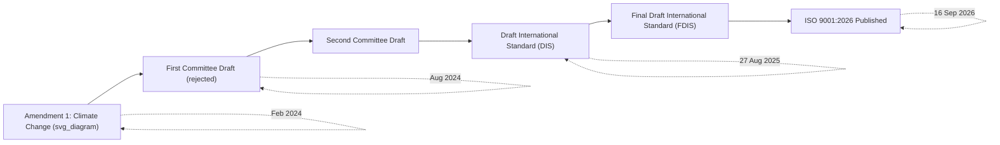
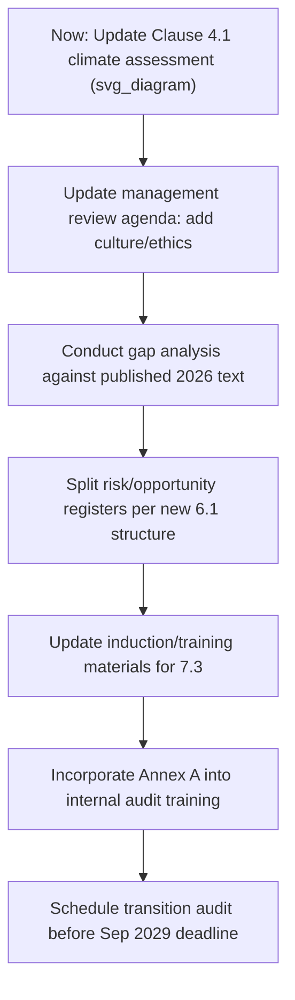

## Key Changes Introduced in the ISO 9001 2026 Revision

### Overview and Publication Status

ISO 9001:2026 was formally published on **September 16, 2026**, replacing ISO 9001:2015 as the current edition of the world's most widely used quality management system standard. This is the **sixth edition** of ISO 9001 since its 1987 debut. Unlike the transformative 2015 revision (which introduced the Harmonized Structure), the 2026 revision is explicitly characterized by ISO's own technical committee and major certification bodies as **evolutionary rather than revolutionary** — the ten-clause Harmonized Structure, the process approach, and PDCA framework all remain fully intact.

**Key Points**

- Published September 16, 2026; sixth edition of ISO 9001
- Developed by ISO/TC 176/SC 2
- Draft International Standard (DIS) published August 27, 2025; first Committee Draft had been rejected in August 2024, requiring a second draft cycle
- Core clause structure (Harmonized Structure, Clauses 4–10) is **unchanged**
- Companion standards revised in parallel: **ISO 9000:2026** (published May 2026, with updated terminology) and **ISO 19011:2026-05** (auditing guidelines, updated for remote/integrated audits)
- ISO 9004:2018 remains current, with no revision currently scheduled

### Revision Timeline

| Milestone | Date |
| --- | --- |
| Amendment 1:2024 (Climate Change) published | February 2024 |
| First Committee Draft rejected | August 2024 |
| Draft International Standard (DIS) published | 27 August 2025 |
| Final Draft International Standard (FDIS) | Early–mid 2026 |
| **ISO 9001:2026 published** | **September 16, 2026** |
| First ISO 9001:2026 certificates realistically available | Approx. Q3 2027 (CBs need 9–12 months post-publication for accreditation) |
| ISO 9001:2015 transition deadline | September 2029 (typical 3-year transition window) |

### The Four Confirmed Clause-Level Changes

**Key Points**

Four clauses received substantive confirmed changes; Clause 8 (Operation) saw only minor terminology adjustments, and the overall process approach/PDCA framework is unchanged.

#### 1. Clause 4.1 / 4.2 — Climate Change Formalized

This change technically predates the full 2026 publication, having entered into force via **ISO 9001:2015/Amd 1:2024** (published February 2024) and now folded formally into the 2026 edition text.

- **Clause 4.1**: Organizations must determine whether climate change is a relevant issue within their organizational context
- **Clause 4.2**: A new note clarifies that interested parties may hold climate-related requirements relevant to the QMS

**Example**

An organization's Clause 4.1 context analysis must include a documented climate-change relevance assessment — even where the conclusion is "not relevant to our scope." Auditors treat an absent assessment (rather than a negative conclusion) as the nonconformance trigger, since the requirement is to *demonstrate consideration*, not to mandate a particular outcome.

#### 2. Clause 5.1.1 — Quality Culture and Ethical Behaviour Become Explicit Requirements

Top management must now **promote and demonstrate a quality culture and ethical behaviour** as part of leadership and commitment — previously an implied expectation, now a documented, auditable requirement.

- A new explanatory note states that culture and ethics can be demonstrated through shared values, beliefs, history, attitudes, and observed behaviours
- Evidence expectations are described by certification bodies as a "light evidence trail" rather than requiring a standalone ethics program: culture references in leadership communications, ethics content within the quality policy/manual, and management review discussions that extend beyond metrics alone

[Inference] Because the requirement is framed around demonstrable evidence rather than a prescribed program structure, organizations across sectors — particularly services, government, and healthcare, which several certification bodies flag as needing the most practical attention here — are expected to satisfy it through incremental documentation additions rather than new organizational initiatives.

#### 3. Clause 6.1 — Risk and Opportunity Management Restructured into Subclauses

Clause 6.1 is split into **6.1.1, 6.1.2, and 6.1.3**, creating explicit documented separation between:

- How the organization identifies and treats **risks**
- How the organization identifies and pursues **opportunities**, formalized under the new framing of **Opportunity-Based Thinking**, positioned alongside the existing Risk-Based Thinking approach introduced in 2015

**Example**

An organization whose current QMS maintains a single combined "risks and opportunities register" must restructure this into two distinct, traceable documentation sections aligned to the new subclause numbering. Certification bodies characterize this as primarily a **documentation restructuring**, not a change to the underlying risk-management methodology itself.

#### 4. Clause 7.3 — Awareness Extended to Quality Culture and Ethics

The awareness requirement now extends beyond the quality policy and individual contribution to objectives (the 2015 baseline) to require that **all personnel** are aware of the organization's quality culture and ethical behaviour expectations.

- Typically satisfied via updated induction materials and training records rather than new standalone training programs

### Clause Change Summary Table

| Clause | 2015 Baseline | 2026 Change | Implementation Impact |
| --- | --- | --- | --- |
| 4.1 / 4.2 | No explicit climate mention | Mandatory climate-relevance assessment (already in force via 2024 amendment) | Documentation update to context analysis |
| 5.1.1 | Implied leadership commitment | Explicit quality culture and ethics promotion required | Evidence trail in communications, policy, management review |
| 6.1 | Combined risk/opportunity clause | Split into 6.1.1/6.1.2/6.1.3; Opportunity-Based Thinking formalized | Register/documentation restructuring |
| 7.3 | Awareness of policy and objectives | Extended to quality culture and ethics awareness | Induction/training material update |
| 8 (all) | — | Minor terminology adjustments only | Negligible |

### New Structural Element: Annex A (Informative Guidance)

For the first time in ISO 9001's history, the standard includes a **guidance Annex** — approximately 15 pages covering interpretive guidance across Clauses 4 through 10.

**Key Points**

- Annex A is **informative, not normative** — it creates no new mandatory requirements and cannot be cited by a certification body as the basis for a nonconformance finding
- It is expected to strongly shape **auditor training and interpretation practice**, meaning audit conversations will likely reflect its language and framing even though its content is non-binding
- Annex A specifically expands guidance on **Risk-Based Thinking and Opportunity-Based Thinking**, intended to reduce interpretive inconsistency that has existed across different auditors and certification bodies since risk-based thinking's 2015 introduction
- Annex A.5.1 is described as the interpretive anchor for the new Clause 5.1.1 requirement, explicitly stating that ethical behaviour is part of the culture of quality

$$\text{Annex A} \subset \text{Informative Content} \quad \not\subset \quad \text{Normative Requirements (Clauses 4–10)}$$

### What Is Explicitly Not Changing

Despite considerable pre-publication speculation, several anticipated additions did **not** materialize in the final standard:

- No AI governance requirements
- No ESG reporting mandates
- No supply-chain resilience clause
- No remote-audit protocol requirements
- No digital-documentation-system mandates

The standard remains **deliberately technology-neutral**, and Clause 8 (Operation) — historically the least harmonized clause across MSS due to its discipline-specific nature — received only minor terminology adjustments in this cycle.

### Transition Planning Guidance

**Key Points**

- The climate-change requirement (Clause 4.1/4.2) is **already mandatory** via the 2024 amendment, independent of full 2026 publication — this is the most time-urgent action item for any organization whose context analysis has not been updated since 2024
- Certification bodies (SGS, BSI, DNV, TÜV and others) are offering gap-analysis services against the DIS/published text
- Certification bodies require roughly 9–12 months post-publication to secure their own accreditation to issue ISO 9001:2026 certificates, meaning practical certificate availability lags publication significantly
- Organizations are cautioned against treating the revision as grounds for a full QMS rebuild — the changes are targeted and documentation-focused rather than structurally transformative

### Downstream Impact on Sector-Specific Standards

[Inference] Because several major sector-specific standards are built directly on the ISO 9001 core structure, their own revision cycles are expected to follow ISO 9001:2026's publication on a lagged timeline, based on patterns reported by certification bodies tracking these dependent standards:

| Sector Standard | Expected Status |
| --- | --- |
| IATF 16949 (Automotive) | Revision underway; expected as IATF 16949:2027, approx. 12–18 months after ISO 9001:2026 |
| AS9100 series (Aerospace/Defence) | Being rebranded to the IA series (IA9100, IA9110, IA9120); expected 2026–2027 |
| EN 15224 (Healthcare) | Expected to align to ISO 9001:2026 post-publication |
| ISO 13485 (Medical Devices) | On independent revision cycle; under review for alignment |

### Common Misconceptions

**Key Points**

- **Misconception**: ISO 9001:2026 represents a Harmonized-Structure-level overhaul comparable to 2015. *Reality*: certification bodies and ISO/TC 176 characterize this revision as evolutionary, with the clause structure, process approach, and PDCA framework fully retained.
- **Misconception**: The climate change requirement is new to the 2026 edition. *Reality*: it entered into force via Amendment 1 in February 2024 and has already been auditable for over two years prior to the 2026 edition's formal publication.
- **Misconception**: Annex A introduces binding new requirements. *Reality*: Annex A is explicitly informative; it cannot be the sole basis for a certification nonconformance, though it will materially influence how auditors interpret existing clauses.
- **Misconception**: Certificates under ISO 9001:2026 are available immediately at publication. *Reality*: certification bodies require their own accreditation lead time (approximately 9–12 months) before they can issue certificates against the new edition.

### Conclusion

ISO 9001:2026 refines rather than restructures the quality management landscape established by the 2015 Harmonized Structure edition. Its four confirmed clause-level changes — climate-context formalization, explicit quality-culture and ethics leadership requirements, risk/opportunity subclause separation, and expanded ethics awareness — are targeted, documentation-focused updates rather than a conceptual overhaul, reinforced by the standard's first-ever informative Annex A. Organizations with well-maintained ISO 9001:2015 systems face a manageable transition within the three-year window extending to September 2029, with the climate-change requirement already mandatory and demanding the most immediate attention.

**Related Topics**

- ISO 9001:2015/Amd 1:2024 Climate Change Amendment Deep Dive
- Risk-Based Thinking vs. Opportunity-Based Thinking Under Revised Clause 6.1
- Building a Quality Culture and Ethics Evidence Trail for Clause 5.1.1
- Understanding Annex A: Informative Guidance vs. Normative Requirements
- ISO 9000:2026 Terminology and Vocabulary Updates
- ISO 19011:2026 Changes for Remote and Integrated Audits
- Transition Planning: Migrating from ISO 9001:2015 to ISO 9001:2026
- Downstream Impacts on IATF 16949, AS9100/IA Series, and ISO 13485