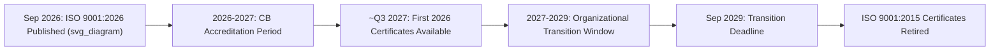
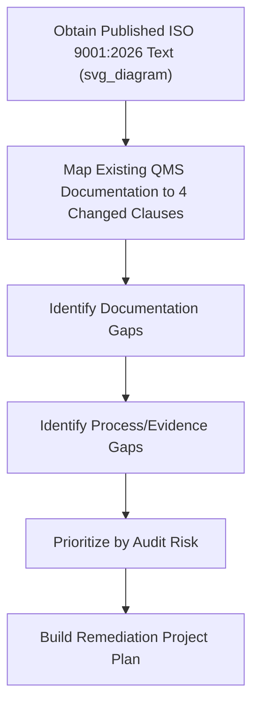

## Planning the Transition from ISO 9001 2015 to ISO 9001 2026

### Overview and Purpose

With **ISO 9001:2026** formally published on September 16, 2026, certified organizations now face a defined transition window to migrate their quality management systems from the 2015 edition to the current standard. Transition planning is a structured, risk-managed project — not a one-time documentation swap — spanning gap analysis, documentation restructuring, personnel training, internal audit updates, and certification body scheduling across a multi-year timeline.

**Key Points**

- Transition period: typically **3 years** from publication, giving organizations until approximately **September 2029**
- ISO 9001:2015 certificates will be **withdrawn/retired** at the transition deadline
- First ISO 9001:2026 certificates realistically available around **Q3 2027**, since certification bodies require 9–12 months post-publication to secure their own accreditation to audit against the new edition
- The revision is characterized as evolutionary, not revolutionary — the Harmonized Structure and core clause numbering are unchanged, which significantly reduces transition complexity relative to the 2008-to-2015 migration

### Transition Timeline Architecture

| Phase | Timeframe | Key Activity |
| --- | --- | --- |
| Pre-publication (already actionable) | Now | Climate-change context assessment (already mandatory via 2024 amendment) |
| CB accreditation lag | Sep 2026 – ~Q3 2027 | Certification bodies obtain their own accreditation to audit the new edition |
| Early transition window | 2027–2028 | Gap analysis, documentation restructuring, training rollout |
| Late transition window | 2028–2029 | Transition audits scheduled; capacity pressure increases as deadline nears |
| Deadline | September 2029 | ISO 9001:2015 certificates fully retired |

### What Changed: Recap of the Four Confirmed Clause Updates

Transition planning must be scoped against the actual confirmed changes, not speculative ones. The 2026 revision made targeted changes to four areas, leaving the ten-clause Harmonized Structure and Clause 8 (Operation) essentially intact.

| Clause | Change | Transition Action Required |
| --- | --- | --- |
| 4.1 / 4.2 | Explicit climate-change relevance assessment (already in force via 2024 amendment) | Update context analysis documentation |
| 5.1.1 | Explicit quality culture and ethical behaviour leadership requirement | Build evidence trail: leadership communications, policy language, management review minutes |
| 6.1 | Split into 6.1.1 / 6.1.2 / 6.1.3; Opportunity-Based Thinking formalized | Separate combined risk/opportunity registers into distinct documented sections |
| 7.3 | Awareness extended to quality culture and ethics | Update induction materials and training records |

**Key Points**

- No changes to Clause 8 (Operation) beyond minor terminology
- No AI governance, ESG reporting, supply-chain resilience, or remote-audit mandates were introduced, despite pre-publication speculation
- A new **informative Annex A** (~15 pages) was added covering Clauses 4–10, which — while non-normative and not citable in nonconformance findings — will shape auditor interpretation and should inform internal audit training

### Phase 1: Immediate Actions (Already Actionable, Pre-Transition-Audit)

**Key Points**

Some 2026-edition requirements are already mandatory independent of the full standard's publication, because they entered force via **ISO 9001:2015/Amd 1:2024** (February 2024).

1. **Audit your Clause 4.1 context analysis** for a documented climate-change relevance assessment. Absence of an assessment — not merely a "not relevant" conclusion — is the nonconformance trigger auditors will look for.
2. **Review Clause 4.2** documentation for a note addressing potential climate-related interested-party requirements.
3. **Flag this as the single most time-urgent item**, since certification bodies have already been auditing against this requirement for over two years by the time the 2026 edition itself was published.

**Example**

An organization whose last context-analysis update predates 2024 should treat this as an immediate corrective action item, independent of any broader 2026 transition project timeline — this gap is auditable today, not just after full 2026 transition.

### Phase 2: Gap Analysis

Most major certification bodies (SGS, BSI, DNV, TÜV, among others) offer structured gap-analysis services against the DIS/published text. A gap analysis should specifically assess:

- **Clause 4.1/4.2**: Is climate-change relevance documented and current?
- **Clause 5.1.1**: Does existing leadership communication, policy language, or management review content reference quality culture and ethics — even implicitly — that can be formalized into explicit evidence?
- **Clause 6.1**: Is the current risk/opportunity register structured as a single combined document, requiring restructuring into distinct subclause-aligned sections?
- **Clause 7.3**: Do induction and training materials currently address only policy/objectives awareness, requiring extension to culture/ethics awareness?

**Key Points**

- Certification bodies explicitly caution against using the revision as grounds for a full QMS rebuild — the confirmed changes are documentation-focused and targeted, not structurally transformative
- [Inference] Because the changes are described industry-wide as requiring "light evidence trails" rather than new organizational programs, gap-analysis findings for most well-maintained 2015-compliant QMSs are expected to be modest in scope relative to the 2008-to-2015 transition, though the true burden will vary by organizational maturity and sector.

### Phase 3: Documentation Restructuring

#### Clause 6.1 Risk/Opportunity Register Split

**Example**

An organization currently maintaining a single table titled "Risks and Opportunities Register" with mixed rows must restructure this into:

- A **6.1.1/6.1.2**-aligned risk treatment section (existing Risk-Based Thinking content)
- A **6.1.3**-aligned opportunity section reflecting the newly formalized Opportunity-Based Thinking approach

This is characterized by certification bodies as primarily a **documentation restructuring exercise** — the underlying risk-management methodology itself does not need to change, only its documented organization and traceability.

#### Clause 5.1.1 Evidence Trail Construction

Rather than building a new "ethics program," organizations typically satisfy this requirement through:

- Explicit culture/ethics language woven into the quality policy or quality manual
- Leadership communications (town halls, newsletters, onboarding materials) that reference quality culture and ethical behaviour
- Management review agenda items and minutes that discuss culture/ethics topics beyond quantitative metrics alone

### Phase 4: Training and Awareness Rollout

**Key Points**

- Update **induction materials** to incorporate quality culture and ethics awareness (Clause 7.3) for all personnel, not just quality-function staff
- Brief **internal audit teams** using the new **Annex A** guidance content as an interpretive reference, since it will shape how external auditors approach the standard even though it carries no normative weight
- Extend **management review training** so review participants understand the new discussion inputs expected under Clause 5.1.1

### Phase 5: Internal Audit Program Update

Internal audit checklists and programs (governed by ISO 19011, itself revised to **ISO 19011:2026-05** with updated guidance on remote and integrated audits) should be updated to explicitly assess:

1. Currency of the Clause 4.1/4.2 climate-change assessment
2. Evidence of quality culture and ethics promotion under 5.1.1
3. Correct subclause separation of risk vs. opportunity content under 6.1
4. Presence of culture/ethics content in training and induction records under 7.3

### Phase 6: Certification Body Coordination and Scheduling

**Key Points**

- Certification bodies require approximately **9–12 months post-publication** to obtain their own accreditation to issue ISO 9001:2026 certificates — meaning organizations cannot expect a transition audit immediately following publication
- First ISO 9001:2026 certificates are realistically available around **Q3 2027**
- Organizations should **schedule transition audits at least 12 months before the September 2029 deadline**, since capacity pressure across certification bodies is expected to intensify as the deadline approaches — a pattern consistent with prior major ISO revision transitions
- Organizations holding sector-specific certifications built on ISO 9001 (IATF 16949, AS9100/IA series, EN 15224, ISO 13485) should coordinate transition planning across both standards, since these sector standards are expected to follow with their own lagged revision cycles

### Transition Planning Checklist by Phase

$$\text{Transition Success} = f(\text{Early Gap Analysis}, \text{Targeted Documentation Updates}, \text{Timely CB Scheduling})$$

| # | Action | Recommended Timing |
| --- | --- | --- |
| 1 | Verify Clause 4.1/4.2 climate assessment is documented | Immediately (already mandatory) |
| 2 | Update management review agenda to include culture/ethics discussion | Before next scheduled review |
| 3 | Conduct formal gap analysis against published 2026 text | 2026–early 2027 |
| 4 | Split risk/opportunity documentation per new 6.1 structure | 2027 |
| 5 | Update induction/training materials for 7.3 awareness | 2027 |
| 6 | Incorporate Annex A into internal audit team training | 2027 |
| 7 | Conduct internal audits against updated criteria | 2027–2028 |
| 8 | Schedule external transition audit | At least 12 months before Sep 2029 |
| 9 | Complete transition audit and certificate issuance | By September 2029 |

### Common Pitfalls in Transition Planning

**Key Points**

- **Pitfall**: Waiting until close to the 2029 deadline to schedule a transition audit. *Risk*: certification body capacity constraints intensify as the deadline approaches, mirroring patterns observed in prior major standard transitions; early scheduling preserves flexibility.
- **Pitfall**: Treating the revision as justification for a full QMS rebuild. *Reality*: certification bodies explicitly caution against this — the confirmed changes are targeted, and vendors/consultants proposing comprehensive overhauls should be scrutinized against the actual scope of change.
- **Pitfall**: Overlooking that the climate-change requirement is already auditable. *Risk*: organizations that assume all 2026 requirements only become relevant after "full" transition may face nonconformances now, since Amendment 1:2024 has been in force independently since February 2024.
- **Pitfall**: Misreading Annex A as introducing binding new requirements. *Reality*: Annex A is informative only and cannot be the sole basis for a nonconformance finding, though it should still inform internal interpretation and training.

### Conclusion

Transitioning from ISO 9001:2015 to ISO 9001:2026 is a manageable, phased project rather than a system overhaul, reflecting the revision's evolutionary character. Organizations with well-maintained 2015-compliant QMSs face four targeted areas of change — climate-context documentation (already mandatory), quality-culture and ethics evidence, risk/opportunity subclause restructuring, and expanded awareness training — set against a generous three-year transition window extending to September 2029. Early gap analysis, prompt correction of the already-mandatory climate-assessment gap, and proactive certification body scheduling are the highest-leverage actions for a smooth transition.

**Related Topics**

- Key Changes Introduced in the ISO 9001 2026 Revision
- ISO 9001:2015/Amd 1:2024 Climate Change Amendment Deep Dive
- Risk-Based Thinking vs. Opportunity-Based Thinking Under Revised Clause 6.1
- Building a Quality Culture and Ethics Evidence Trail for Clause 5.1.1
- ISO 19011:2026 Updates for Remote and Integrated Audits
- Certification Body Accreditation Timelines for New Standard Editions
- Downstream Impacts on IATF 16949, AS9100/IA Series, and ISO 13485
- Lessons from the ISO 9001:2008-to-2015 Transition Cycle