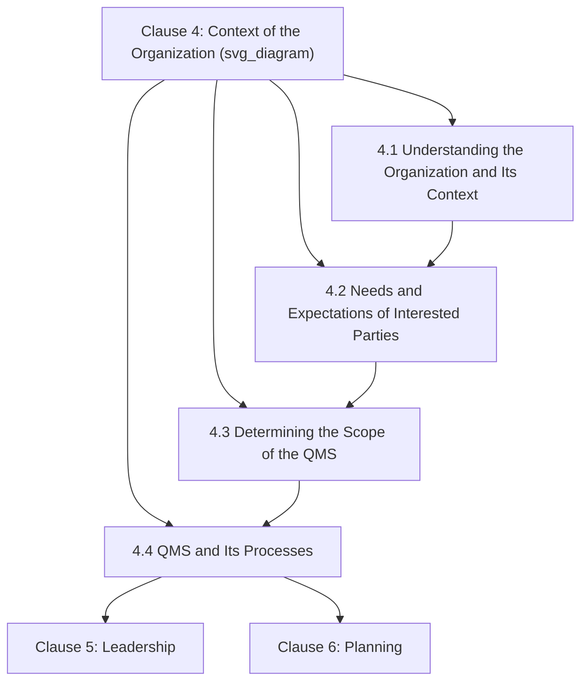
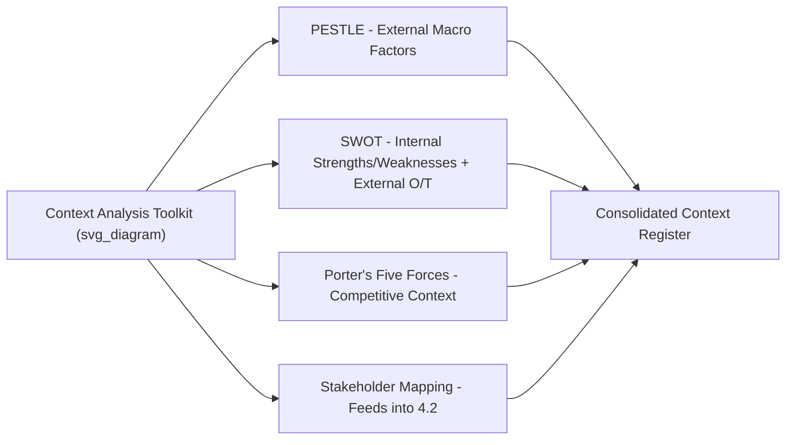

## Understanding the Organization and Its Context

### Overview and Purpose

Clause 4.1 of ISO 9001:2015/2026, *Understanding the organization and its context*, is the foundational requirement that opens the Harmonized Structure's substantive clauses. It requires an organization to determine the **external and internal issues** relevant to its purpose and strategic direction that affect its ability to achieve the intended results of its quality management system. This clause exists to ensure that a QMS is not designed in a vacuum, but is deliberately shaped by the real operating environment — economic, regulatory, technological, competitive, and cultural — in which the organization functions.

**Key Points**

- Corresponds to Harmonized Structure Clause 4.1, identical in numbering and intent across ISO 9001, ISO 14001, ISO 45001, and other management system standards
- No prescribed methodology is mandated by the standard — organizations select their own analytical tools
- Output feeds directly into Clause 4.3 (QMS scope), Clause 6.1 (risk and opportunity planning), and the broader planning cycle
- As of ISO 9001:2015/Amd 1:2024 (carried forward into ISO 9001:2026), climate change must be explicitly considered as a potential relevant issue

### Position Within the Clause 4 Sequence

Clause 4.1 is deliberately positioned first because its outputs (identified external/internal issues) are **inputs** to every subsequent planning activity: interested-party analysis (4.2) is partly derived from context; scope determination (4.3) is bounded by context; and risk/opportunity planning (6.1) draws directly on issues identified here.

### Defining "Issues": External and Internal

The standard requires organizations to determine issues that are **relevant to purpose and strategic direction** and that **affect the ability to achieve intended QMS results**. Issues are conventionally split into two categories:

| Category | Definition | Typical Analytical Tool |
| --- | --- | --- |
| External issues | Factors arising outside the organization's boundary that it does not control but must respond to | PESTLE analysis |
| Internal issues | Factors arising from within the organization's own structure, resources, and culture | SWOT analysis (internal half); organizational capability review |

#### External Issues: PESTLE Framework

**Example**

A mid-size food manufacturer conducting a PESTLE analysis for Clause 4.1 might identify:

- **Political**: New food-safety import regulations in a target export market
- **Economic**: Rising raw material costs due to currency fluctuation
- **Social**: Growing consumer demand for allergen transparency
- **Technological**: Emergence of blockchain-based supply-chain traceability tools
- **Legal**: Updated labeling requirements under regional food-safety law
- **Environmental**: Water scarcity risk affecting a key production region, and — per the 2024 climate amendment — explicit consideration of climate change relevance to the organization's context

#### Internal Issues: Organizational Capability Factors

Internal issues commonly assessed include:

- Organizational culture, values, and knowledge (linking to Clause 7.1.6, Organizational Knowledge)
- Governance structure, roles, and decision-making processes
- Resource availability (financial, human, infrastructure)
- Performance of existing processes and systems
- Contractual relationships that shape organizational behavior

### The Climate Change Requirement (2024 Amendment, Carried into 2026)

**Key Points**

Since **ISO 9001:2015/Amd 1:2024** (February 2024), Clause 4.1 explicitly requires organizations to **determine whether climate change is a relevant issue** to their context — this requirement is carried forward unchanged into ISO 9001:2026 and remains currently auditable.

- The requirement does not mandate a particular conclusion — an organization may legitimately determine climate change is not relevant to its scope
- The auditable requirement is the **documented assessment itself**; an absent or missing assessment, rather than a "not relevant" conclusion, is treated as the nonconformance trigger
- Clause 4.2 (Interested Parties) was correspondingly updated with a note that interested parties may hold climate-related requirements or expectations

**Example**

A professional services firm with no physical manufacturing operations documents in its Clause 4.1 context analysis that it assessed climate change and concluded it has limited direct operational relevance, while noting indirect relevance through client sustainability-reporting expectations — satisfying the documentation requirement even where the substantive conclusion is "low relevance."

### Analytical Methodologies Commonly Applied

While ISO 9001 prescribes no specific method, several established business-analysis frameworks are widely adopted to satisfy Clause 4.1's determination requirement:

| Framework | Primary Use | Output |
| --- | --- | --- |
| PESTLE | External macro-environmental scanning | List of political, economic, social, technological, legal, environmental issues |
| SWOT | Combined internal/external assessment | Strengths, Weaknesses, Opportunities, Threats matrix |
| Porter's Five Forces | Competitive/industry-structure analysis | Assessment of supplier power, buyer power, competitive rivalry, threat of substitutes/new entrants |
| Stakeholder/Interested Party Mapping | Identifying who is affected by or affects the organization | Feeds directly into Clause 4.2 |

[Inference] Because ISO 9001 deliberately avoids prescribing a specific methodology — consistent with the Harmonized Structure's general philosophy of outcome-based rather than prescriptive requirements — auditors typically evaluate the *adequacy and currency* of whatever method an organization has chosen, rather than mandating a specific framework by name.

### Monitoring and Review Requirement

Clause 4.1 explicitly requires that the organization **monitor and review information** about external and internal issues — this is not a one-time assessment performed only at initial certification, but an ongoing determination revisited as context evolves.

**Key Points**

- Common practice is to review context analysis as a standing input to **management review** (Clause 9.3.2), which explicitly requires "changes in external and internal issues that are relevant to the quality management system" as a review input
- Organizations experiencing significant environmental disruption (regulatory change, market shift, supply-chain disruption) should trigger an off-cycle context review rather than waiting for the next scheduled management review
- A stale or outdated context analysis — particularly one predating the 2024 climate amendment — is a common audit finding

### Relationship to Downstream Clauses

$$\text{Clause 4.1 Context} \rightarrow \text{Clause 4.2 Interested Parties} \rightarrow \text{Clause 4.3 QMS Scope} \rightarrow \text{Clause 6.1 Risk/Opportunity Planning}$$

**Example**

A logistics company identifies "increasing fuel price volatility" as an external economic issue under 4.1. This issue directly informs:

- **4.2**: Recognition that customers (an interested party) have cost-stability expectations affected by this issue
- **4.3**: No direct scope impact, but documented as contextual rationale
- **6.1**: A corresponding risk entry ("fuel cost volatility affecting service pricing stability") with a planned mitigating action (e.g., fuel surcharge contract clauses)

This traceability — from a raw contextual observation through to a concrete risk-treatment action — is what auditors look for as evidence that Clause 4.1 is functioning as a genuine planning input rather than a static, disconnected document.

### Common Documentation Approaches

While no specific documented information is mandated by name for Clause 4.1 itself, organizations commonly retain:

- A **context register** or **issues log** listing external/internal issues, their source, and relevance rationale
- **PESTLE or SWOT matrices** as supporting evidence
- **Meeting minutes** from context-review sessions (often integrated into management review)
- An explicit **climate-change relevance statement**, satisfying the 2024 amendment requirement

**Key Points**

- Clause 4.1 itself does not mandate retained documented information as a named requirement — but organizations invariably produce some form of record, since demonstrating the *determination* was actually performed requires objective evidence during audit

### Common Misconceptions

**Key Points**

- **Misconception**: Clause 4.1 is a one-time exercise completed at initial QMS setup. *Reality*: the clause explicitly requires ongoing monitoring and review, commonly integrated into the management review cycle.
- **Misconception**: A specific framework (e.g., PESTLE) is mandated by the standard. *Reality*: ISO 9001 is deliberately silent on methodology; any adequate, documented approach to determining relevant issues satisfies the requirement.
- **Misconception**: Concluding "climate change is not relevant" fails the 2024/2026 requirement. *Reality*: the requirement is to document a considered assessment, not to reach any particular conclusion — a well-reasoned "not relevant" finding is compliant.
- **Misconception**: Clause 4.1 exists in isolation from operational planning. *Reality*: it is the upstream input to interested-party analysis, scope determination, and risk/opportunity planning — its value is realized through downstream traceability, not as a standalone exercise.

### Practical Implementation Guidance

1. **Select and document a consistent methodology** (e.g., PESTLE for external, SWOT or capability review for internal) rather than an ad hoc, undocumented brainstorm.
2. **Explicitly address climate change** as a distinct line item in the context register, even if the conclusion is low relevance — document the reasoning, not just the conclusion.
3. **Integrate context review into management review** as a standing agenda item, satisfying both the 4.1 monitoring requirement and the 9.3.2 management review input requirement simultaneously.
4. **Trace issues forward** into the risk/opportunity register (6.1) and interested-party analysis (4.2) to demonstrate the context analysis is functioning as genuine planning input.
5. **Refresh the analysis** following significant external disruption (regulatory change, market shift, major internal reorganization) rather than waiting for the next scheduled review cycle.

### Conclusion

Clause 4.1 establishes the analytical foundation upon which the entire ISO 9001 quality management system is built — requiring organizations to systematically identify and monitor the external and internal issues shaping their strategic direction and QMS effectiveness. Its deliberately non-prescriptive, outcome-based design gives organizations flexibility in methodology while demanding genuine, traceable linkage to downstream planning activities, with the 2024/2026 climate-change requirement representing the most recent and currently auditable extension of this foundational clause.

**Related Topics**

- Needs and Expectations of Interested Parties (Clause 4.2)
- Determining the Scope of the Quality Management System (Clause 4.3)
- Risk-Based and Opportunity-Based Thinking (Clause 6.1)
- PESTLE and SWOT Analysis Techniques for QMS Context
- The Climate Change Amendment (ISO 9001:2015/Amd 1:2024) and ISO 9001:2026
- Management Review Inputs and Outputs (Clause 9.3)
- Organizational Knowledge Requirements (Clause 7.1.6)