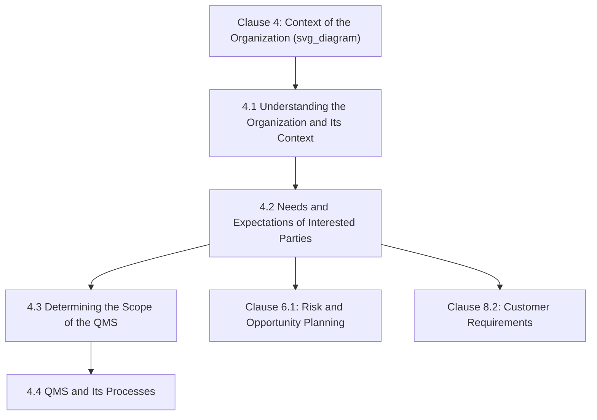
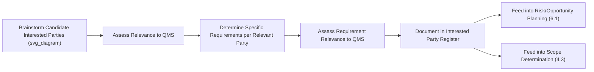

## Understanding Needs and Expectations of Interested Parties

### Overview and Purpose

Clause 4.2 requires an organization to determine the **interested parties relevant to the QMS** and the **requirements of those interested parties** that are relevant to it. This clause extends the contextual awareness established in Clause 4.1 from broad environmental issues to specific stakeholders whose needs and expectations can directly influence — or be influenced by — the organization's ability to consistently provide conforming products and services.

**Key Points**

- Corresponds to Harmonized Structure Clause 4.2, common across ISO 9001, ISO 14001, ISO 45001, and other MSS
- Interested parties extend beyond customers to include regulators, suppliers, employees, owners, and society
- Not every requirement of every interested party must be addressed — only those **relevant to the QMS**
- Output feeds directly into Clause 4.3 (scope determination) and risk/opportunity planning (6.1)
- The 2024/2026 climate-change amendment added an explicit note that interested parties may hold climate-related requirements

### Position Within the Clause 4 Sequence

### Defining "Interested Party"

Per ISO 9000:2015 terminology, an **interested party** (synonymous with "stakeholder") is a *person or organization that can affect, be affected by, or perceive itself to be affected by a decision or activity*. This definition is intentionally broad, encompassing both entities that directly influence the QMS and those merely perceiving an effect — the latter clause exists to capture reputational and perception-based stakeholder dynamics, not solely direct operational relationships.

### Two-Step Requirement Structure

Clause 4.2 is structured as a two-part determination:

1. **Determine** which interested parties are relevant to the QMS
2. **Determine** the requirements of those interested parties that are relevant to the QMS

**Key Points**

This two-step structure is deliberate: not every stakeholder identified in step one automatically generates relevant requirements in step two. An organization may recognize a party as "interested" in a general sense while determining that none of its specific expectations are relevant to QMS planning.

### Common Categories of Interested Parties

| Category | Typical Examples | Typical Relevant Requirements |
| --- | --- | --- |
| Customers | Direct purchasers, end users, distributors | Product/service conformity, delivery reliability, price |
| Regulatory bodies | Government agencies, industry regulators | Legal and statutory compliance, licensing, safety standards |
| Suppliers/Partners | Raw material suppliers, outsourced service providers | Contractual terms, payment reliability, specification clarity |
| Employees | Direct staff, contractors | Safe working conditions, fair treatment, competence development |
| Owners/Shareholders | Investors, parent company | Financial performance, risk management, reputational protection |
| Certification/Accreditation Bodies | CBs, NABs | Conformity to certification scheme requirements |
| Society/Community | Local community, NGOs, general public | Environmental responsibility, ethical conduct, climate impact |

**Example**

A pharmaceutical contract manufacturer's Clause 4.2 analysis identifies:

- **Regulatory bodies** (e.g., national drug regulatory agencies) → requirement: adherence to Good Manufacturing Practice (GMP) standards
- **Customers** (pharmaceutical brand owners) → requirement: batch traceability and consistent potency specifications
- **Employees** → requirement: safety protocols for handling active pharmaceutical ingredients

Each identified requirement then becomes a traceable input to operational planning (Clause 8) and risk assessment (Clause 6.1).

### Interested Party Analysis Methodology

A common practical tool is a **stakeholder relevance matrix**, often scored across two dimensions:

$$\text{Priority} = f(\text{Influence on QMS Outcomes}, \text{Degree of Impact from QMS Decisions})$$

| Stakeholder | Influence on QMS | Impact from QMS | Priority |
| --- | --- | --- | --- |
| Key customer | High | High | Critical — direct requirement tracking |
| Local regulator | High | Medium | High — compliance monitoring |
| General public | Low | Low–Medium | Lower — monitored but not individually tracked |

### Distinguishing "Interested" from "Relevant"

**Key Points**

A frequent audit focus area is whether an organization has meaningfully filtered its interested-party list rather than treating every conceivable stakeholder as equally relevant. The standard's relevance qualifier ("relevant to the QMS") exists precisely to prevent an unbounded, unmanageable stakeholder list.

**Example**

A regional bakery might correctly identify "local environmental advocacy groups" as an interested party in a general sense (per the broad ISO 9000 definition, since such a group could perceive itself affected by the bakery's operations) but reasonably determine, through documented rationale, that no *specific* requirement from that group is currently relevant to its QMS — satisfying the two-step structure without over-extending scope.

### The Climate Change Note (2024/2026 Amendment)

Since ISO 9001:2015/Amd 1:2024 (carried into ISO 9001:2026), Clause 4.2 includes an explicit note that **interested parties may have requirements related to climate change**. This is a clarifying note rather than a new standalone requirement, but it directs organizations to explicitly consider climate-related expectations when conducting interested-party analysis.

**Example**

A corporate customer increasingly requires its suppliers to report Scope 3 emissions data as part of procurement qualification — this customer expectation, if determined relevant, should be captured under Clause 4.2 as a climate-related interested-party requirement, cross-referenced with the Clause 4.1 climate-relevance assessment.

### Relationship to Clause 8.2 (Customer Requirements)

While Clause 4.2 addresses interested parties broadly, **customers specifically** receive dedicated, more granular treatment under Clause 8.2 (Requirements for products and services). Clause 4.2's customer-related findings are typically high-level ("customers require on-time delivery and consistent quality"), while Clause 8.2 addresses the operational mechanics of determining, reviewing, and communicating specific product/service requirements.

| Clause | Scope Regarding Customers |
| --- | --- |
| 4.2 | Strategic-level identification that customers are a relevant interested party with general requirement categories |
| 8.2 | Operational-level determination, review, and communication of specific product/service requirements per order or contract |

### Monitoring and Review Requirement

Like Clause 4.1, Clause 4.2 requires the organization to **monitor and review information** about interested parties and their relevant requirements — this is an ongoing determination, not a static one-time exercise.

**Key Points**

- Commonly integrated into management review (Clause 9.3.2), which explicitly requires consideration of interested-party needs and expectations as a review input alongside context changes
- New regulatory requirements, shifting customer expectations, or new supplier dependencies should trigger interim review rather than waiting for the next scheduled cycle

### Common Documentation Approaches

While no specific named documented information is mandated for Clause 4.2 itself, common practice includes:

- An **interested party register** listing parties, their relevant requirements, and relevance rationale
- A **stakeholder relevance matrix** supporting the prioritization exercise
- Cross-references linking specific interested-party requirements to corresponding risk/opportunity entries (Clause 6.1) or scope statements (Clause 4.3)

### Common Misconceptions

**Key Points**

- **Misconception**: Every conceivable stakeholder must be documented and tracked. *Reality*: the "relevant to the QMS" qualifier exists specifically to bound the analysis — organizations must exercise and document judgment about relevance, not enumerate every theoretically interested party.
- **Misconception**: Clause 4.2 only concerns customers. *Reality*: the clause explicitly extends to regulators, suppliers, employees, owners, and broader societal interests — customer-specific requirements are handled in greater operational depth under Clause 8.2.
- **Misconception**: Once documented, the interested-party list is static. *Reality*: the clause requires ongoing monitoring and review, typically synchronized with management review cycles.
- **Misconception**: The climate-change note under 4.2 is a standalone new requirement. *Reality*: it is a clarifying note directing attention to climate-related expectations within the existing interested-party determination process, not an independent auditable clause.

### Practical Implementation Guidance

1. **Build a structured interested-party register** rather than relying on informal or undocumented assumptions about stakeholder relevance.
2. **Apply the two-step test explicitly**: first assess whether a party is relevant, then separately assess whether its specific requirements are relevant — avoid conflating the two.
3. **Cross-reference climate-related expectations** between Clause 4.1 (organizational climate relevance) and Clause 4.2 (interested-party climate requirements) for audit traceability.
4. **Prioritize using an influence/impact matrix** to focus analytical effort on the stakeholders most material to QMS outcomes, rather than treating all parties with equal depth.
5. **Synchronize review cadence** with management review (9.3.2) to satisfy the ongoing monitoring requirement efficiently.

### Conclusion

Clause 4.2 extends the contextual awareness established in Clause 4.1 into a structured, two-step determination of relevant interested parties and their applicable requirements — spanning customers, regulators, suppliers, employees, and society. Its deliberately bounded "relevance" qualifier requires organizations to exercise documented judgment rather than exhaustively tracking every conceivable stakeholder, while its outputs directly inform scope determination (4.3) and risk/opportunity planning (6.1), reinforcing Clause 4's role as the analytical foundation for the entire quality management system.

**Related Topics**

- Understanding the Organization and Its Context (Clause 4.1)
- Determining the Scope of the Quality Management System (Clause 4.3)
- Customer Requirements for Products and Services (Clause 8.2)
- Risk-Based and Opportunity-Based Thinking (Clause 6.1)
- Stakeholder Mapping and Relevance Prioritization Techniques
- Management Review Inputs and Outputs (Clause 9.3)
- The Climate Change Amendment (ISO 9001:2015/Amd 1:2024) and ISO 9001:2026