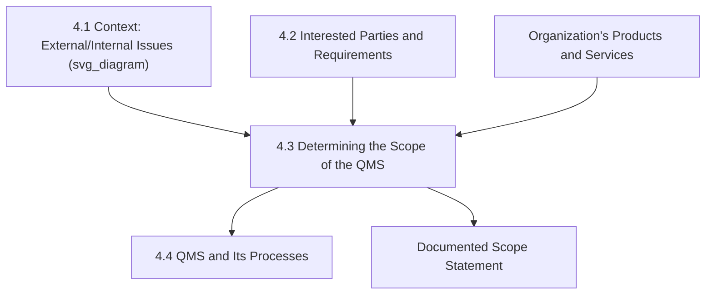
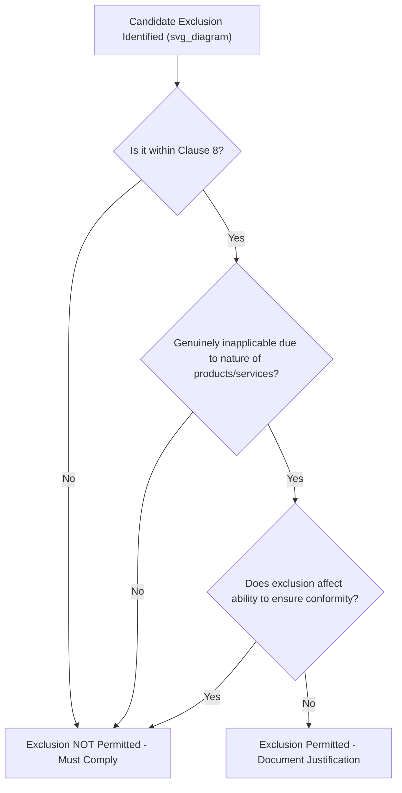

## Determining the Scope of the Quality Management System

### Overview and Purpose

Clause 4.3 requires an organization to determine the **boundaries and applicability** of its quality management system in order to establish its scope. The scope defines precisely what the QMS covers — which products, services, sites, processes, and organizational units fall within certification — and serves as the formal boundary statement that certification bodies audit against. It is the direct synthesis point of Clauses 4.1 (context) and 4.2 (interested parties), converting broad contextual and stakeholder analysis into a concrete, documented statement of QMS applicability.

**Key Points**

- Corresponds to Harmonized Structure Clause 4.3, common across ISO 9001, ISO 14001, ISO 45001, and other MSS
- Scope must be **maintained as documented information** — this is one of the few Clause 4 items with an explicit documentation mandate
- Must consider three specific inputs: external/internal issues (4.1), interested-party requirements (4.2), and the organization's products and services
- Exclusions are permitted **only within Clause 8** (Operation), and only where justified by the nature of the organization's products/services

### Position Within the Clause 4 Sequence

### The Three Mandatory Inputs to Scope Determination

Clause 4.3 explicitly requires the organization to consider three inputs when determining scope, rather than allowing scope to be set arbitrarily or purely by organizational convenience:

| Input | Source Clause | Role in Scope Determination |
| --- | --- | --- |
| External and internal issues | 4.1 | Bounds scope by relevant operating context (e.g., excluding a discontinued product line no longer relevant to context) |
| Requirements of relevant interested parties | 4.2 | Ensures scope addresses stakeholder-driven boundary considerations (e.g., regulatory jurisdiction) |
| Products and services of the organization | Organizational fact base | Defines the substantive activities the QMS applies to |

**Example**

A multi-site manufacturing group with facilities in three countries determines its QMS scope by cross-referencing: (a) Clause 4.1 context findings that two sites operate in a heavily regulated export market while the third serves only domestic demand under lighter regulation; (b) Clause 4.2 findings that key customers require certification coverage across all three sites; and (c) product-line facts showing all three sites manufacture the same core product family. The resulting scope statement includes all three sites, explicitly referencing the regulatory and customer-driven rationale for unified coverage.

### Components of a Scope Statement

A properly constructed QMS scope statement, retained as documented information, typically specifies:

- **Products and services covered** (and explicitly, those excluded, where relevant)
- **Physical locations/sites** included within certification boundaries
- **Organizational units or business functions** covered
- **Justification for any Clause 8 exclusions**, with rationale for why the excluded requirement does not affect the organization's ability or responsibility to ensure conformity

**Example**

*"This Quality Management System applies to the design, manufacture, and distribution of precision-machined aerospace components at the Springfield and Millbrook facilities. Design and development (Clause 8.3) requirements are excluded, as the organization manufactures exclusively to customer-supplied specifications and does not perform independent product design."*

This example illustrates the standard pattern: a positive scope statement (what is covered), a site boundary, and a specific, justified exclusion referencing the applicable sub-clause.

### The Exclusion Mechanism

**Key Points**

- Exclusions apply **only to Clause 8** (Operation) — no exclusions are permitted anywhere in Clauses 4, 5, 6, 7, 9, or 10, which are considered universally applicable regardless of organization type
- An exclusion is valid only where the excluded requirement **does not apply** due to the nature of the organization's products/services — it cannot be invoked merely because an organization finds a requirement inconvenient or under-resourced
- The organization must be able to justify that the exclusion **does not affect its ability or responsibility** to ensure conformity of products and services and to enhance customer satisfaction

**Example**

A software-as-a-service company legitimately excludes Clause 8.5.2 (Identification and Traceability) requirements related to physical product lot tracking, since it produces no physical goods requiring lot traceability — this exclusion is justified by the genuine nature of the organization's service-only offering, not by administrative convenience.

### Common Exclusion Patterns by Organization Type

| Organization Type | Common Clause 8 Exclusion | Typical Justification |
| --- | --- | --- |
| Service-only providers (consulting, SaaS) | 8.3 Design and Development | No independent product design function |
| Build-to-print manufacturers | 8.3 Design and Development | Manufacture exclusively to customer-supplied specifications |
| Distributors/resellers (no manufacturing) | 8.5.1 (portions related to production control) | No production activity; only storage/distribution |
| Pure design/engineering firms | 8.5 Production and Service Provision (production-specific elements) | No physical production function |

[Inference] Because certification bodies apply consistent scrutiny to exclusion justifications during both initial certification and surveillance audits, organizations claiming exclusions are generally expected to demonstrate that the excluded activity genuinely does not occur anywhere within the defined scope — a partial or inconsistent exclusion claim (e.g., excluding design while performing informal design modifications) is a common source of audit findings.

### Scope Boundaries: Sites, Processes, and Organizational Units

Scope determination also requires clarity on **physical and organizational boundaries**, particularly relevant for:

- **Multi-site organizations**: Determining whether certification covers a single site, multiple sites individually, or a unified multi-site certification
- **Shared services**: Determining whether centralized functions (e.g., a shared corporate quality function serving multiple business units) fall within or outside a given site's scope
- **Outsourced processes**: Clarifying that outsourcing a process does not remove it from QMS scope — Clause 8.4 (Control of externally provided processes) still applies, meaning outsourced activities remain within the conceptual scope of control even if not physically performed on-site

**Key Points**

- Outsourcing a process is **not** equivalent to excluding it from scope — the organization retains responsibility for controlling externally provided processes per Clause 8.4, and the scope statement should reflect this rather than treating outsourced activities as outside QMS boundaries

### Relationship to Certification Audits

The documented scope statement is the primary reference document certification bodies use to define **audit boundaries** — determining which sites are visited, which processes are sampled, and which product/service lines are evaluated during certification and surveillance audits. A scope statement that is vague, overly broad relative to actual operations, or inconsistent with marketing/customer-facing claims is a frequent source of nonconformance findings.

$$\text{Audit Scope} \equiv \text{Documented QMS Scope (Clause 4.3)}$$

### Monitoring and Review

While Clause 4.3 does not explicitly repeat the "monitor and review" language used in 4.1 and 4.2, scope is expected to remain **current and available as documented information**, and is implicitly subject to review whenever underlying context (4.1) or interested-party requirements (4.2) materially change — for example, following a merger, new product line launch, new facility, or divestiture.

**Example**

A company acquiring a new production facility mid-certification-cycle must update its documented QMS scope statement to reflect the new site before that facility can be considered part of the certified system — simply beginning operations at the new site does not automatically extend certification coverage.

### Common Misconceptions

**Key Points**

- **Misconception**: Exclusions can be applied anywhere in the standard to reduce audit burden. *Reality*: exclusions are strictly limited to Clause 8; all of Clauses 4–7, 9, and 10 apply universally with no exclusion mechanism.
- **Misconception**: Outsourcing a process removes it from QMS scope. *Reality*: outsourced processes remain within scope via Clause 8.4 control requirements — the organization retains responsibility for their conformity.
- **Misconception**: Scope is set once at initial certification and never revisited. *Reality*: scope must reflect current organizational reality and should be updated following significant changes (new sites, new product lines, divestitures) identified through ongoing context and interested-party review.
- **Misconception**: A broad, vague scope statement provides audit flexibility. *Reality*: certification bodies expect scope statements precise enough to define clear audit boundaries; vagueness is more likely to generate findings than flexibility.

### Practical Implementation Guidance

1. **Draft scope statements with explicit boundaries**: name specific sites, product/service lines, and organizational units rather than using generic language.
2. **Justify every Clause 8 exclusion individually**, referencing the specific sub-clause and the substantive reason the requirement does not apply.
3. **Cross-reference Clause 4.1 and 4.2 findings explicitly** within the scope rationale to demonstrate the required three-input consideration.
4. **Treat outsourced processes as in-scope-but-externally-controlled**, documenting Clause 8.4 control mechanisms rather than treating them as excluded.
5. **Trigger scope review upon organizational change**: mergers, acquisitions, new facilities, discontinued product lines, or significant shifts in interested-party requirements should prompt scope reassessment.

### Conclusion

Clause 4.3 converts the analytical outputs of Clauses 4.1 and 4.2 into a concrete, documented boundary statement defining precisely what the quality management system covers — its products, services, sites, and organizational units — while providing the sole mechanism (via Clause 8 exclusions) for tailoring requirements to genuine organizational circumstances. A precise, well-justified, and current scope statement is foundational not only to QMS integrity but to defining the practical boundaries of every certification and surveillance audit the organization undergoes.

**Related Topics**

- Understanding the Organization and Its Context (Clause 4.1)
- Understanding Needs and Expectations of Interested Parties (Clause 4.2)
- QMS and Its Processes (Clause 4.4)
- Control of Externally Provided Processes, Products, and Services (Clause 8.4)
- Multi-Site Certification Strategies and Audit Sampling
- Justifying and Documenting Clause 8 Exclusions
- Managing Scope Changes Following Mergers, Acquisitions, or New Facilities