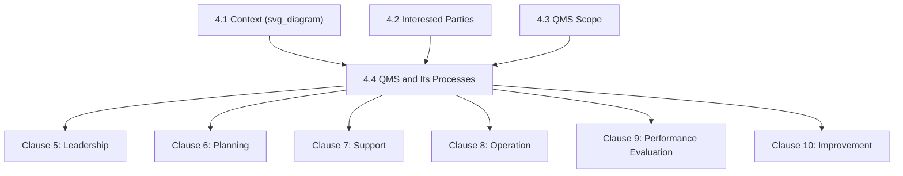
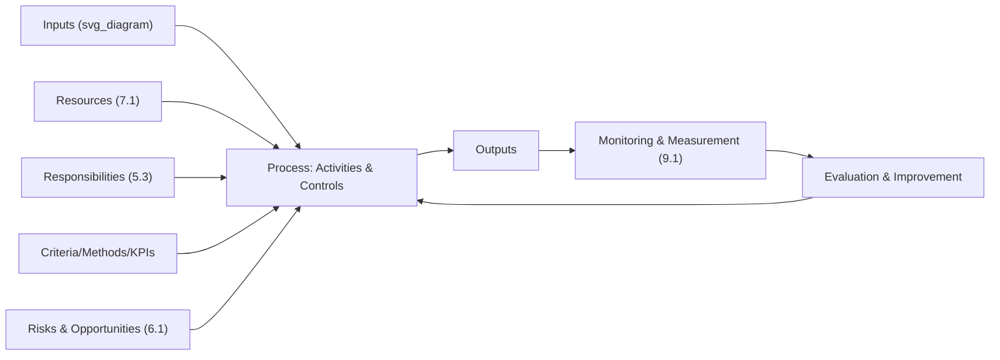
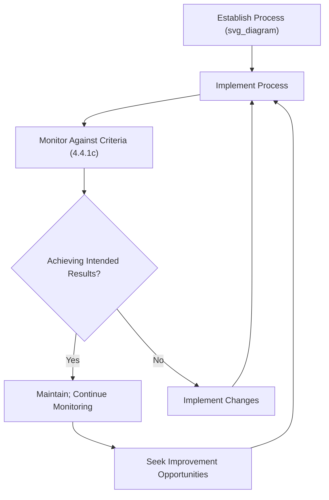

## The Quality Management System and Its Processes

### Overview and Purpose

Clause 4.4 is the culminating requirement of Clause 4, converting the analytical work of Clauses 4.1–4.3 into the operational architecture of the QMS itself. It requires an organization to **establish, implement, maintain, and continually improve** its quality management system, including the processes needed and their interactions, in accordance with the standard's requirements. This clause is the formal expression of the **process approach** — one of the seven Quality Management Principles from ISO 9000 — translated into concrete, auditable requirements.

**Key Points**

- Corresponds to Harmonized Structure Clause 4.4, common across ISO 9001, ISO 14001, ISO 45001, and other MSS
- Requires determination of processes, their sequence and interaction, and defined criteria/methods for effective operation and control
- Contains one of the most detailed sub-requirement lists in Clause 4, split across 4.4.1 (general) and 4.4.2 (documented information)
- Serves as the direct bridge between Clause 4 (Context) and Clauses 5–10 (the operational management system itself)

### Position Within the Clause 4 Sequence

### The Six Core Sub-Requirements (Clause 4.4.1)

Clause 4.4.1 specifies six distinct determinations an organization must make regarding its processes. These sub-requirements form the practical checklist for establishing process-based QMS architecture.

| Sub-requirement | Requirement | Practical Output |
| --- | --- | --- |
| (a) | Determine required inputs and expected outputs of each process | Process input/output specification |
| (b) | Determine the sequence and interaction of processes | Process interaction map/model |
| (c) | Determine criteria and methods (including monitoring, measurement, KPIs) needed for effective operation and control | Process performance indicators and control criteria |
| (d) | Determine resources needed and ensure availability | Resource allocation records, links to Clause 7.1 |
| (e) | Assign responsibilities and authorities for processes | Roles/responsibilities matrix, links to Clause 5.3 |
| (f) | Address risks and opportunities per Clause 6.1 requirements | Process-level risk/opportunity linkage |

**Additional requirements** under 4.4.1 also require the organization to:

- Evaluate processes and implement changes to ensure they achieve intended results
- Improve processes and the QMS

**Example**

A precision-machining manufacturer defines its "Order Fulfillment" process with: **inputs** (customer purchase order, engineering specifications); **outputs** (conforming machined parts, shipping documentation); **sequence** (order review → production scheduling → machining → inspection → packaging → shipment); **criteria/methods** (on-time delivery rate ≥ 98%, first-pass yield ≥ 95%); **resources** (CNC machines, calibrated inspection equipment, trained machinists); **responsibilities** (Production Manager owns process performance); and **risk linkage** (machine downtime risk tracked in the Clause 6.1 risk register with a preventive-maintenance mitigation).

### The Process Approach: Conceptual Model

ISO 9000 formally defines a process as a set of interrelated or interacting activities that use inputs to deliver an intended result. Clause 4.4 operationalizes this via the classic **SIPOC-style input-transformation-output model**, extended with control and resource dimensions.

$$\text{Process Output Quality} = f(\text{Input Quality}, \text{Resource Adequacy}, \text{Control Effectiveness}, \text{Competence})$$

### Process Interaction Mapping

A central deliverable of Clause 4.4 is a **process interaction map** (sometimes called a "turtle diagram" set or QMS process landscape), illustrating how outputs of one process feed as inputs into subsequent processes across the organization.

**Example**

A typical manufacturing QMS process map shows: Sales/Order Intake → Design Review (if applicable) → Procurement → Production Planning → Manufacturing → Quality Inspection → Packaging/Shipping → Post-Delivery Support, with feedback loops from Performance Evaluation (Clause 9) and Improvement (Clause 10) processes looping back into Planning (Clause 6) and Leadership (Clause 5) processes — illustrating the QMS as an interconnected system rather than a linear chain.

**Key Points**

- Process interaction maps are not explicitly mandated by name, but are the most common practical tool organizations use to demonstrate compliance with sub-requirement (b) — sequence and interaction determination
- Auditors commonly use process interaction maps as a navigation tool during audits, tracing a single customer order or product through the mapped sequence to verify the map reflects actual operational reality

### Documented Information Requirements (Clause 4.4.2)

Clause 4.4.2 requires the organization to maintain documented information to the extent necessary to **support the operation of processes**, and to retain documented information to have confidence that processes are being carried out as planned.

| Sub-clause | Requirement | Typical Form |
| --- | --- | --- |
| 4.4.2(a) | Maintain documented information to support process operation | Process maps, procedures, work instructions, flowcharts |
| 4.4.2(b) | Retain documented information for confidence that processes are carried out as planned | Records, logs, inspection results, process performance data |

**Key Points**

- Unlike the 2008 edition's six mandatory documented procedures, Clause 4.4.2 is outcome-based: the organization determines the *extent* of documentation necessary based on process complexity, competence of personnel, and risk — not a fixed universal list
- [Inference] Because auditors assess documentation adequacy against whether it genuinely supports process operation and provides confidence in planned execution, organizations with highly competent, experienced staff performing simple processes may reasonably maintain less extensive documentation than organizations with complex, high-risk, or frequently turned-over-staff processes — the standard does not mandate uniform documentation depth across all processes.

### Integration with Outsourced and Externally Provided Processes

Clause 4.4 explicitly extends to processes that are **outsourced**, requiring the organization to ensure control over such externally provided processes (elaborated further under Clause 8.4). A process does not fall outside QMS architecture merely because it is performed by an external party.

**Example**

A furniture manufacturer outsourcing its powder-coating process to a third-party supplier still includes "Powder Coating" within its QMS process map, documenting the control criteria applied (e.g., supplier qualification requirements, incoming inspection of coated parts) even though the activity itself occurs off-site.

### The Continual Improvement Loop Within Clause 4.4

Clause 4.4.1 explicitly requires organizations to **evaluate these processes and implement changes needed to ensure these processes achieve their intended results**, and to **improve the processes and the quality management system**. This creates a direct, clause-level PDCA loop embedded within the process architecture itself, distinct from (but feeding into) the broader Clause 9/10 performance evaluation and improvement machinery.

### Relationship to Other Clauses

$$\text{Clause 4.4} \Rightarrow \begin{cases} \text{Resourcing} \rightarrow \text{Clause 7.1} \\ \text{Responsibilities} \rightarrow \text{Clause 5.3} \\ \text{Risk/Opportunity} \rightarrow \text{Clause 6.1} \\ \text{Operational Detail} \rightarrow \text{Clause 8} \\ \text{Monitoring/Measurement} \rightarrow \text{Clause 9.1} \end{cases}$$

Clause 4.4 functions as the **architectural skeleton** referenced throughout the rest of the standard — subsequent clauses provide the detailed requirements for specific elements (resources, responsibilities, risk, operational control) that Clause 4.4 requires the organization to determine and integrate at the process level.

### Common Documentation Approaches

Organizations commonly satisfy Clause 4.4 documentation expectations through a combination of:

- **QMS process map / process landscape diagram**: visual representation of process sequence and interaction
- **Turtle diagrams** or **process characterization sheets**: per-process detail covering inputs, outputs, resources, methods, criteria, and responsibilities
- **Procedure documents and work instructions**: where complexity or risk warrants detailed documented guidance
- **Process performance dashboards/records**: retained evidence of monitoring against defined criteria

### Common Misconceptions

**Key Points**

- **Misconception**: Clause 4.4 requires a fixed set of mandatory procedures. *Reality*: documentation extent is outcome-based and determined by the organization according to process complexity and risk, not a prescribed universal list.
- **Misconception**: Outsourced processes fall outside the QMS process architecture. *Reality*: outsourced/externally provided processes remain part of the QMS process landscape and require defined control criteria, elaborated further under Clause 8.4.
- **Misconception**: A process interaction map alone satisfies Clause 4.4. *Reality*: the map addresses only sub-requirement (b) (sequence/interaction); the clause also requires input/output determination, control criteria, resourcing, responsibility assignment, and risk/opportunity linkage per process.
- **Misconception**: Clause 4.4 is a documentation exercise disconnected from performance. *Reality*: the clause explicitly requires ongoing evaluation and improvement of processes, embedding a PDCA loop directly within process management rather than treating it as a static architectural diagram.

### Practical Implementation Guidance

1. **Build a process landscape map first**, then characterize each individual process against all six 4.4.1 sub-requirements (inputs/outputs, sequence, criteria, resources, responsibilities, risk).
2. **Calibrate documentation depth to risk and complexity** rather than defaulting to exhaustive procedural documentation for every process regardless of criticality.
3. **Explicitly include outsourced processes** in the process map, with defined control criteria even where operational execution occurs externally.
4. **Link each process to its Clause 6.1 risk/opportunity entries** to satisfy sub-requirement (f) and demonstrate integrated, rather than siloed, risk management.
5. **Establish process-level KPIs** feeding into Clause 9.1 monitoring and measurement, ensuring the evaluation loop required under 4.4.1 is genuinely operational rather than aspirational.

### Conclusion

Clause 4.4 operationalizes the process approach at the heart of ISO 9001, requiring organizations to move beyond abstract contextual awareness and scope definition into concrete process architecture — defining inputs, outputs, sequence, control criteria, resourcing, responsibility, and risk linkage for every process within the QMS. As the structural bridge between Clause 4's foundational analysis and the detailed operational requirements of Clauses 5 through 10, it establishes the process-based system logic that underpins the entire standard, while its outcome-based documented information requirements preserve organizational flexibility in how that architecture is recorded and maintained.

**Related Topics**

- Determining the Scope of the Quality Management System (Clause 4.3)
- Resources: People, Infrastructure, and Environment (Clause 7.1)
- Organizational Roles, Responsibilities, and Authorities (Clause 5.3)
- Actions to Address Risks and Opportunities (Clause 6.1)
- Process Interaction Mapping and Turtle Diagram Techniques
- Control of Externally Provided Processes, Products, and Services (Clause 8.4)
- Monitoring, Measurement, Analysis, and Evaluation (Clause 9.1)