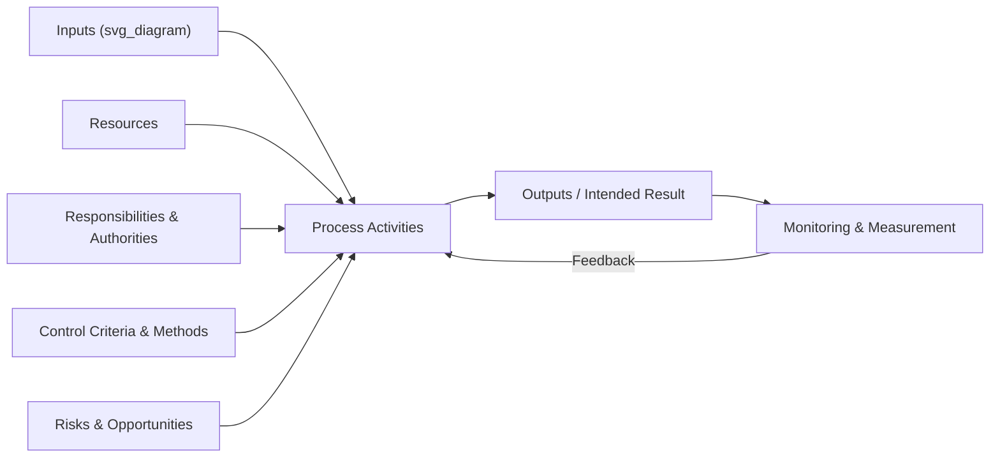
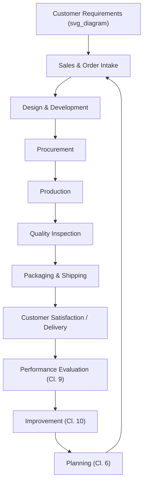
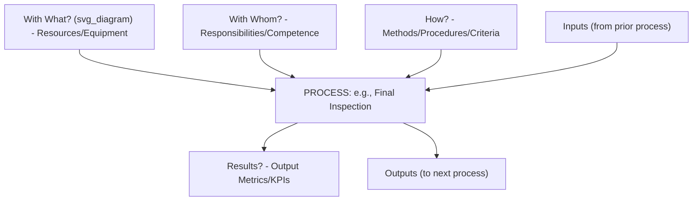

## Process Approach and Process Interaction Mapping

### Overview and Purpose

The **process approach** is one of the seven Quality Management Principles articulated in ISO 9000:2015 and the central organizing philosophy underlying ISO 9001's entire requirements structure. It holds that consistent, predictable results are achieved more effectively and efficiently when activities are understood and managed as **interrelated processes that function as a coherent system**, rather than as isolated departmental silos. **Process interaction mapping** is the primary practical technique organizations use to visualize, document, and manage this systemic view — directly supporting compliance with Clause 4.4 (QMS and its processes).

**Key Points**

- The process approach is QMP #4 of ISO 9000's seven Quality Management Principles
- Distinguishes "process thinking" from traditional functional/departmental (siloed) management thinking
- Directly operationalized through Clause 4.4's six sub-requirements
- Process interaction maps are the most common visual tool for demonstrating process sequence and interaction, though not explicitly named or mandated by the standard

### Conceptual Foundation: Process vs. Functional Thinking

Traditional organizational management often structures work around **functional departments** (sales, engineering, production, quality), each optimizing its own performance in isolation. The process approach instead structures work around **end-to-end processes** that cut across departmental boundaries, tracking how inputs are transformed into outputs that ultimately deliver value to the customer.

| Dimension | Functional/Departmental View | Process Approach View |
| --- | --- | --- |
| Organizing unit | Department (Sales, Production, QA) | Process (Order-to-Delivery, New Product Introduction) |
| Optimization focus | Individual department efficiency | End-to-end result and customer outcome |
| Handoff visibility | Often opaque between departments | Explicit inputs/outputs at each interface |
| Risk of local optimization | High — department may optimize itself at system's expense | Reduced — interactions and dependencies are explicit |

**Example**

A functional view of order processing might show "Sales handles the order, then hands off to Production, which hands off to Shipping" as three disconnected departmental activities. A process view instead defines "Order Fulfillment" as a single process with a defined input (customer purchase order), a defined output (delivered, conforming product), and explicit sub-activities and control points spanning all three departments — making cross-departmental dependencies and potential failure points visible.

### The Formal Definition of "Process"

Per ISO 9000:2015, a **process** is a set of interrelated or interacting activities that use inputs to deliver an intended result. Clause 4.4.1 operationalizes this definition through six specific determinations an organization must make for each process (detailed further under Clause 4.4).

$$\text{Process} : \text{Inputs} \xrightarrow{\text{Activities, Resources, Controls}} \text{Outputs (Intended Result)}$$

### The Generic Process Model

This model directly mirrors Clause 4.4.1's six sub-requirements: inputs/outputs (a), resources (d), responsibilities (e), criteria/methods (c), and risk/opportunity linkage (f) — with sequence/interaction (b) addressed at the multi-process, system level rather than within a single process model.

### Process Interaction Mapping: Purpose and Technique

A **process interaction map** (also called a process landscape diagram or QMS process model) visually represents how individual processes connect — where the output of one process becomes the input of another — across the entire management system. It directly demonstrates compliance with Clause 4.4.1(b): determining the sequence and interaction of processes.

**Key Points**

- Process interaction maps are not a named, mandatory document under ISO 9001 — but they are the most widely adopted practical tool for satisfying the sequence/interaction determination requirement
- Auditors commonly use these maps as a navigational reference, tracing a single order or product through the mapped flow to verify the diagram matches actual operational reality
- Maps typically distinguish **core/primary processes** (directly delivering customer value, e.g., production, service delivery) from **support processes** (enabling core processes, e.g., HR, IT, maintenance) and **management processes** (governing the system, e.g., planning, management review)

### Process Categorization: Core, Support, and Management Processes

| Category | Purpose | Examples |
| --- | --- | --- |
| Management processes | Direct and control the QMS at a strategic level | Strategic planning, management review, policy-setting |
| Core (primary) processes | Directly create value delivered to the customer | Order fulfillment, design and development, production, service delivery |
| Support processes | Enable core processes to function effectively | HR/competence management, IT infrastructure, maintenance, document control |

**Example**

A software development company categorizes its processes as: **management** (strategic roadmap planning, management review); **core** (requirements gathering, software design, coding, testing, release); **support** (recruitment and competence development, IT infrastructure management, document control). The process interaction map shows core processes flowing sequentially from customer requirement to release, with support processes shown as horizontal, cross-cutting enablers rather than sequential steps.

### The Turtle Diagram: Single-Process Characterization

Where the process interaction map addresses the **system-level** view (how processes connect), the **turtle diagram** is the complementary tool for characterizing an **individual process** in detail, directly mapping to Clause 4.4.1's six sub-requirements.

**Example**

A turtle diagram for a "Final Inspection" process specifies: **inputs** (assembled product from production); **with what** (calibrated gauges, inspection fixtures); **with whom** (certified quality inspectors); **how** (documented inspection procedure, sampling plan per AQL table); **results** (pass rate, defects-per-unit trend); **outputs** (conforming product released to packaging, nonconforming product routed to Clause 8.7 quarantine process).

### PDCA Integration Within the Process Approach

ISO 9000 explicitly links the process approach to the **PDCA cycle**, applicable both at the level of the overall QMS and at the level of individual processes:

| PDCA Phase | Application at Process Level |
| --- | --- |
| Plan | Establish process objectives, determine required inputs/resources/methods |
| Do | Execute the process as designed |
| Check | Monitor and measure against defined criteria (Clause 9.1) |
| Act | Implement changes and improvements to enhance process performance |

**Key Points**

- This process-level PDCA loop is distinct from, but feeds into, the organization-wide PDCA cycle spanning Clauses 4–10 — each individual process can be understood as running its own micro-PDCA cycle nested within the larger system

### Risk-Based Thinking Integrated at the Process Level

Clause 4.4.1(f) explicitly requires processes to address risks and opportunities per Clause 6.1. This means process interaction mapping is not merely a static flow diagram — mature implementations annotate the map or accompanying process characterizations with identified risks at key transition points (handoffs between processes) where failure is most likely to occur.

**Example**

A process interaction map for a food manufacturer might annotate the "Procurement → Production" interaction point with a flagged risk ("raw material contamination risk at receiving inspection"), directly linking the process map to the Clause 6.1 risk register and the corresponding HACCP-style control point in operational planning.

### Benefits of the Process Approach

**Key Points**

- **Improved cross-functional visibility**: makes handoffs and dependencies between departments explicit rather than hidden
- **Clearer accountability**: each process has a defined owner and responsibility structure (linking to Clause 5.3)
- **Better root-cause analysis**: nonconformities can be traced to specific process steps and interactions rather than vaguely attributed to "communication problems"
- **Facilitates integration with other management systems**: because the process approach and Harmonized Structure are shared across ISO 9001, ISO 14001, ISO 45001, and others, a well-mapped process landscape can support integrated management system (IMS) implementation
- **Supports systematic improvement**: by making process performance measurable and visible, it provides the data foundation for Clause 9 (Performance Evaluation) and Clause 10 (Improvement)

### Common Pitfalls in Process Mapping

**Key Points**

- **Pitfall**: Creating a process map that mirrors the organizational chart rather than actual workflow. *Risk*: this defeats the purpose of process thinking, effectively recreating functional silos with a different visual format.
- **Pitfall**: Building an aspirational map that does not reflect actual practice. *Risk*: auditors tracing real transactions against an inaccurate map will identify the discrepancy as a nonconformance against Clause 4.4's requirement that documented information genuinely support and evidence actual process operation.
- **Pitfall**: Mapping processes once and never revisiting them. *Risk*: as Clause 4.4.1 explicitly requires ongoing evaluation and improvement of processes, a static, unmaintained map fails to reflect organizational change over time.
- **Pitfall**: Excessive granularity, mapping every minor task as a discrete process. *Risk*: dilutes the strategic value of process thinking and creates unmanageable documentation burden; process boundaries should be set at a meaningful level of aggregation.

### Practical Implementation Guidance

1. **Start with core (value-delivering) processes** before mapping support and management processes, ensuring the customer-facing value stream is clearly represented first.
2. **Validate the map against real transactions**: trace an actual customer order or service delivery through the mapped sequence to confirm accuracy before finalizing.
3. **Use turtle diagrams to complement the interaction map**: the interaction map shows system-level flow; turtle diagrams provide the Clause 4.4.1-compliant detail for each individual process.
4. **Annotate risk and control points** at process interfaces, directly linking the map to the Clause 6.1 risk register.
5. **Review and update the map** following organizational change (new processes, restructured departments, new product lines) as part of the broader QMS maintenance cycle.

### Conclusion

The process approach reframes organizational management from siloed functional thinking toward an integrated, systemic view of interrelated processes — a philosophy formalized as one of ISO 9000's seven Quality Management Principles and operationalized through Clause 4.4's detailed process determination requirements. Process interaction mapping, complemented by tools like the turtle diagram for individual process characterization, provides the practical mechanism organizations use to visualize, document, and continually improve this process-based system, directly supporting audit traceability, cross-functional accountability, and the broader PDCA-driven improvement cycle at the heart of ISO 9001.

**Related Topics**

- The Quality Management System and Its Processes (Clause 4.4)
- ISO 9000 Fundamentals and the Seven Quality Management Principles
- Turtle Diagrams for Single-Process Characterization
- Risk-Based Thinking and Process-Level Risk Integration (Clause 6.1)
- PDCA Cycle Application at Process and System Levels
- Integrated Management Systems (IMS) and Shared Process Architecture
- Monitoring, Measurement, Analysis, and Evaluation of Process Performance (Clause 9.1)