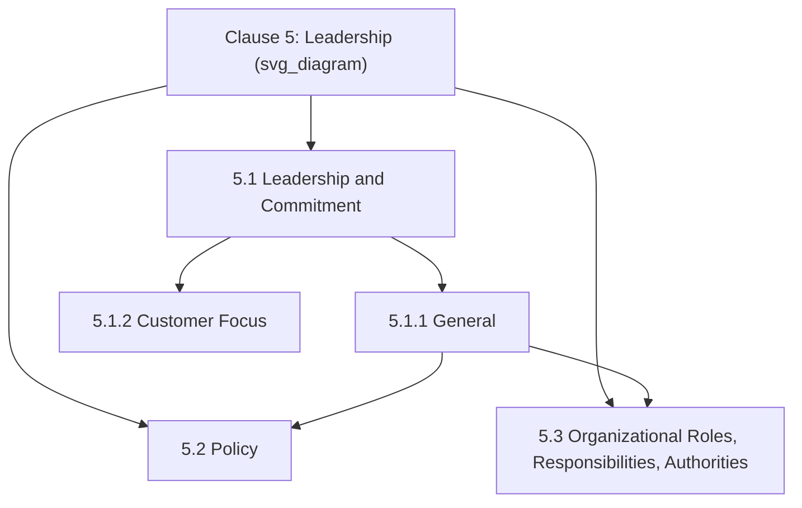
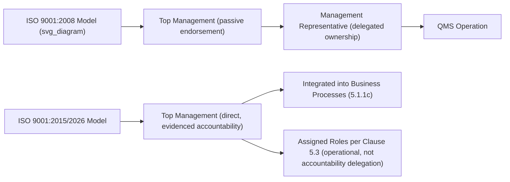

## Leadership and Commitment Requirements

### Overview and Purpose

Clause 5.1 requires **top management** to demonstrate leadership and commitment with respect to the quality management system through a specific, enumerated set of actions — not merely as a general endorsement, but as active, evidenced engagement in the QMS's design, operation, and outcomes. This clause represents a deliberate philosophical shift from earlier ISO 9001 editions, which permitted quality responsibility to be substantially delegated to a "management representative." Since the 2015 revision, accountability is anchored explicitly and non-delegably at the top management level.

**Key Points**

- Corresponds to Harmonized Structure Clause 5.1, split into 5.1.1 (General) and 5.1.2 (Customer focus)
- Eliminates the mandatory "management representative" role that existed under ISO 9001:2008
- Requires demonstrable, evidenced leadership actions — not passive approval or delegation
- ISO 9001:2026 adds an explicit new requirement (5.1.1) for promoting quality culture and ethical behaviour, elevating this from an implied to a documented expectation

### Position Within Clause 5

### Defining "Top Management"

Per ISO 9000:2015, **top management** is the person or group of people who directs and controls an organization at the highest level. This definition is deliberately scalable — it may refer to a CEO and executive team in a large corporation, or an owner-operator in a small business — but in all cases, it refers to those with ultimate authority and accountability for the organization, not a delegated quality function.

**Key Points**

- Top management cannot be represented by a "management representative" acting on their behalf for accountability purposes — while organizations may still assign operational roles and authorities (per Clause 5.3), ultimate leadership accountability remains with top management itself
- In organizations with multiple business units or complex governance structures, "top management" may apply differently depending on the scope of the QMS in question, but always refers to the highest relevant level of authority and control for that scope

### The Ten Leadership Demonstration Requirements (Clause 5.1.1 — General)

Clause 5.1.1 enumerates specific actions through which top management must demonstrate leadership and commitment. These function as an auditable checklist of evidenced behaviors rather than abstract principles.

| # | Requirement | Practical Evidence |
| --- | --- | --- |
| (a) | Accountability for QMS effectiveness | Documented ownership in policy/governance records |
| (b) | Ensuring quality policy and objectives are established and compatible with strategic direction | Policy/objectives cross-referenced to strategic plan |
| (c) | Ensuring QMS requirements are integrated into business processes | QMS embedded in operational workflows, not a parallel system |
| (d) | Promoting use of the process approach and risk-based thinking | Process maps, risk registers actively used in decision-making |
| (e) | Ensuring resources needed for the QMS are available | Budget allocations, staffing records |
| (f) | Communicating the importance of effective quality management and conformance | Town halls, internal communications, training records |
| (g) | Ensuring the QMS achieves its intended results | Performance evaluation and management review evidence |
| (h) | Engaging, directing, and supporting persons to contribute to QMS effectiveness | Employee engagement initiatives, recognition programs |
| (i) | Promoting improvement | Continual improvement initiatives sponsored by leadership |
| (j) | Supporting other relevant management roles to demonstrate leadership in their areas | Delegated leadership visible at departmental level |

**Example**

A manufacturing company demonstrates requirement (b) by showing that its quality objectives (e.g., "reduce customer complaint rate by 15%") are explicitly derived from and referenced within the organization's annual strategic plan, rather than existing as a standalone quality department initiative disconnected from broader business strategy.

### Clause 5.1.2: Customer Focus

A distinct sub-clause specifically addresses top management's responsibility to ensure **customer focus** throughout the organization, requiring:

- Customer and applicable statutory/regulatory requirements are determined, understood, and consistently met
- Risks and opportunities affecting product/service conformity and customer satisfaction are determined and addressed
- Focus on enhancing customer satisfaction is maintained

**Example**

Top management demonstrates customer focus by ensuring that customer satisfaction data (from Clause 9.1.2) is a standing agenda item in management review (9.3), with documented evidence that leadership decisions — such as resource reallocation to address recurring complaint themes — are directly traceable to that customer feedback data.

### ISO 9001:2026 — Quality Culture and Ethical Behaviour

The 2026 revision adds an explicit new leadership requirement under Clause 5.1.1: top management must **promote and demonstrate a quality culture and ethical behaviour**. A supporting note clarifies that culture and ethics may be demonstrated through shared values, beliefs, history, attitudes, and observed behaviours.

**Key Points**

- Previously implied within the general leadership commitment requirements, this is now a distinct, documented, auditable expectation
- Certification bodies characterize the expected evidence as a "light evidence trail" rather than a mandate for a standalone ethics program: culture/ethics language integrated into leadership communications, quality policy content, and management review discussion
- Clause 7.3 (Awareness) was correspondingly extended so that **all personnel**, not just leadership, are aware of quality culture and ethical behaviour expectations
- The new informative **Annex A** in ISO 9001:2026 explicitly states (A.5.1) that ethical behaviour is part of the culture of quality — serving as the interpretive anchor for this requirement, though Annex A itself remains non-normative

**Example**

Under the 2026 requirement, an organization's quality policy might be updated to explicitly reference "integrity and ethical conduct in all customer and supplier dealings" as a core value, with management review minutes documenting periodic discussion of culture/ethics indicators (e.g., ethics hotline usage trends, employee survey sentiment on trust and transparency) alongside traditional quality metrics.

### From "Management Representative" to Distributed Leadership Accountability

**Key Points**

- ISO 9001:2008 required appointment of a **management representative** — typically a Quality Manager — who held delegated responsibility and authority for QMS oversight, often creating a perception that quality was "owned" by a single department rather than the organization as a whole
- The 2015 revision (retained in 2026) removed this mandatory role, redistributing leadership accountability directly to top management (Clause 5.1) while allowing operational roles/responsibilities to still be assigned under Clause 5.3
- This shift reflects the broader philosophical intent that quality management is inseparable from general business management — not a specialized, delegable compliance function

### Relationship to Other Clauses

$$\text{Clause 5.1 Leadership} \Rightarrow \begin{cases} \text{Quality Policy} \rightarrow \text{Clause 5.2} \\ \text{Roles/Responsibilities} \rightarrow \text{Clause 5.3} \\ \text{Resource Provision} \rightarrow \text{Clause 7.1} \\ \text{Customer Requirements} \rightarrow \text{Clause 8.2} \\ \text{Management Review} \rightarrow \text{Clause 9.3} \end{cases}$$

Leadership commitment is not an isolated clause but a thread running through the entire standard — auditors typically assess Clause 5.1 conformity not through a standalone leadership interview alone, but by tracing evidence of leadership engagement across policy documents, resource decisions, management review records, and communication artifacts throughout the QMS.

### Common Evidence Sources for Audit

| Evidence Type | Demonstrates |
| --- | --- |
| Management review minutes | Accountability (a), achieving intended results (g), promoting improvement (i) |
| Strategic plan cross-referenced to quality objectives | Policy/objective compatibility with strategic direction (b) |
| Budget/resourcing records | Resource availability (e) |
| Internal communications, town halls, newsletters | Communicating importance of QMS (f); quality culture/ethics (2026) |
| Employee engagement survey data | Engaging and supporting persons (h) |
| Customer satisfaction data reviewed by leadership | Customer focus (5.1.2) |
| Process ownership/risk register engagement | Promoting process approach and risk-based thinking (d) |

### Common Misconceptions

**Key Points**

- **Misconception**: A Quality Manager can fulfill Clause 5.1 leadership requirements on behalf of top management. *Reality*: while a Quality Manager may hold assigned operational responsibilities under Clause 5.3, the accountability and evidenced engagement required under 5.1 rests with top management directly and cannot be fully delegated.
- **Misconception**: Leadership commitment is demonstrated by a single signed policy statement. *Reality*: the standard requires ongoing, evidenced engagement across ten distinct action areas, not a one-time documentation exercise.
- **Misconception**: The 2026 quality culture/ethics requirement demands a formal ethics program or compliance function. *Reality*: certification bodies describe the expected evidence as a light, integrated trail within existing leadership communications and management review — not a new standalone initiative.
- **Misconception**: Customer focus (5.1.2) is a quality-department responsibility. *Reality*: it is explicitly assigned to top management, reinforcing that customer-centricity is a leadership accountability, not merely an operational function.

### Practical Implementation Guidance

1. **Map each of the ten 5.1.1 requirements to specific, traceable evidence sources** rather than relying on generalized leadership endorsement statements.
2. **Embed quality culture and ethics language into existing artifacts** (policy, management review agendas, leadership communications) rather than creating parallel documentation specifically for Clause 5.1.1's 2026 addition.
3. **Ensure management review explicitly ties customer satisfaction data to leadership decisions**, satisfying both 5.1.2 and the broader accountability expectations of 5.1.1(g).
4. **Avoid reverting to a "management representative" mental model**: while operational quality roles remain valid under Clause 5.3, leadership training should reinforce that accountability sits with top management itself.
5. **Reference Annex A.5.1** (ISO 9001:2026) as an interpretive guide when developing culture/ethics evidence, understanding it is informative rather than a source of additional mandatory requirements.

### Conclusion

Clause 5.1 anchors quality management accountability firmly at the top management level, requiring evidenced, active engagement across ten distinct leadership actions rather than passive endorsement or full delegation to a quality function. The elimination of the mandatory management representative role in 2015, combined with the 2026 revision's explicit quality culture and ethical behaviour requirement, reflects a sustained trajectory toward treating quality management as an inseparable, leadership-owned dimension of overall organizational governance rather than a specialized compliance activity.

**Related Topics**

- Policy: Establishing and Communicating the Quality Policy (Clause 5.2)
- Organizational Roles, Responsibilities, and Authorities (Clause 5.3)
- Key Changes Introduced in the ISO 9001 2026 Revision
- Management Review Inputs and Outputs (Clause 9.3)
- Customer Focus and Customer Satisfaction Monitoring (Clauses 5.1.2, 9.1.2)
- Building a Quality Culture and Ethics Evidence Trail
- Awareness Requirements Extended to All Personnel (Clause 7.3)