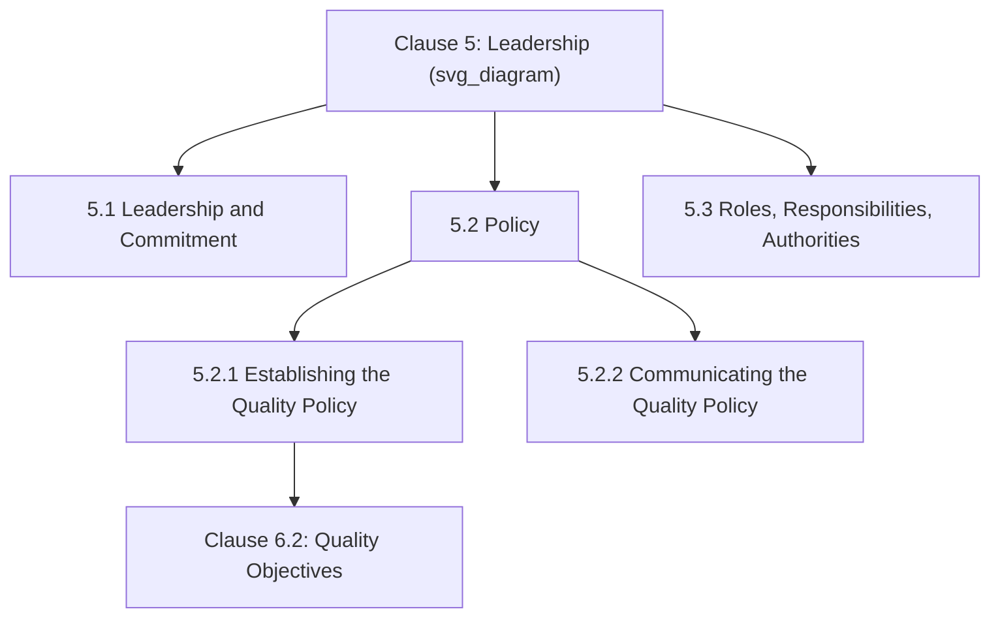

## Establishing a Quality Policy

### Overview and Purpose

Clause 5.2 requires top management to **establish, implement, and maintain a quality policy** — a formal statement of organizational intent and direction regarding quality, serving as the umbrella framework from which measurable quality objectives (Clause 6.2) are subsequently derived. The quality policy is one of the few Clause 5 elements with an explicit documented-information mandate, reflecting its role as a foundational, communicable reference point for the entire QMS.

**Key Points**

- Corresponds to Harmonized Structure Clause 5.2, split into 5.2.1 (Establishing) and 5.2.2 (Communicating)
- Must be appropriate to the organization's purpose and context, and support its strategic direction
- Must be retained as documented information, available to relevant interested parties as appropriate
- Directly feeds Clause 6.2 (Quality objectives), which must be consistent with the policy

### Position Within Clause 5

### Clause 5.2.1: Four Mandatory Content Requirements

The standard specifies that the quality policy must:

| # | Requirement | Practical Meaning |
| --- | --- | --- |
| (a) | Be appropriate to the purpose and context of the organization and support its strategic direction | Policy content reflects actual organizational context (Clause 4.1) and business strategy, not generic language |
| (b) | Provide a framework for setting quality objectives | Objectives (Clause 6.2) must trace back to and derive from policy commitments |
| (c) | Include a commitment to satisfy applicable requirements | Encompasses customer, statutory, regulatory, and other applicable requirements |
| (d) | Include a commitment to continual improvement of the QMS | Explicit, stated commitment — not merely implied by the existence of improvement processes |

**Example**

A precision electronics manufacturer's quality policy states: *"[Company] is committed to delivering electronic assemblies that consistently meet customer and regulatory requirements, achieved through a culture of continual process improvement, employee engagement, and rigorous supplier quality management, in support of our strategic goal of becoming the preferred contract manufacturer in the medical device sector."* This example satisfies all four content requirements: context-appropriateness (medical device sector focus), an objectives framework (process improvement, supplier management, employee engagement as thematic pillars), a requirements-satisfaction commitment, and an explicit continual improvement commitment.

### Clause 5.2.2: Communication Requirements

The policy must be:

- **Available and maintained as documented information**
- **Communicated, understood, and applied within the organization**
- **Available to relevant interested parties, as appropriate**

**Key Points**

- "Communicated and understood" is a materially higher bar than simple distribution — auditors commonly test this through employee interviews, asking staff at various levels to explain the policy's meaning and relevance to their own role, not merely to recite it verbatim
- "Available to relevant interested parties, as appropriate" gives organizations discretion regarding external communication — a policy need not be published publicly by default, but should be accessible where genuinely relevant (e.g., to customers requesting it as part of a supplier qualification process)

### Distinguishing Policy from Objectives

A common point of confusion is the relationship between the quality policy (Clause 5.2) and quality objectives (Clause 6.2). The policy is a **high-level statement of commitment and direction**; objectives are **specific, measurable targets** derived from and consistent with that policy.

| Dimension | Quality Policy (5.2) | Quality Objectives (6.2) |
| --- | --- | --- |
| Nature | Broad statement of commitment | Specific, measurable targets |
| Timeframe | Relatively stable, long-term | Typically reviewed/reset periodically (annually) |
| Content example | "Committed to continual improvement" | "Reduce customer complaint rate by 15% by Q4" |
| Owner | Top management (established) | Relevant functions/levels (established, but consistent with policy) |

$$\text{Quality Policy (Stable Commitment)} \rightarrow \text{Quality Objectives (Measurable Targets)} \rightarrow \text{Operational Plans}$$

### Policy Development Process

**Key Points**

- Effective policy development typically begins by revisiting Clause 4.1 (context) and 4.2 (interested parties) findings, ensuring the policy genuinely reflects the organization's actual operating environment rather than being drafted as generic, interchangeable boilerplate
- [Inference] Because auditors frequently test policy "understanding" through direct employee interview rather than document review alone, organizations that involve broader employee input during policy development — rather than treating it as an executive-only drafting exercise — often demonstrate stronger evidence of genuine comprehension during audits, though this is a practical observation rather than an explicit standard requirement.

### Common Structural Patterns

While no fixed format is mandated, quality policies commonly follow one of these structural patterns:

- **Narrative statement**: A single cohesive paragraph or short set of paragraphs weaving together all four content requirements
- **Pillar/thematic structure**: Organized around named strategic themes (e.g., "Customer Focus," "Continual Improvement," "People Development," "Supplier Partnership"), each briefly elaborated
- **Combined multi-standard policy**: For organizations pursuing Integrated Management Systems, a single policy addressing quality, environmental, and OH&S commitments together, leveraging the shared Harmonized Structure language across standards

**Example**

An organization pursuing an integrated ISO 9001/14001/45001 management system might issue a single **"Integrated Management Policy"** with dedicated sub-sections for quality, environmental, and occupational health and safety commitments — satisfying Clause 5.2's requirements for ISO 9001 while simultaneously addressing the equivalent policy clauses in ISO 14001 and ISO 45001, since all three share the same Harmonized Structure Clause 5.2 numbering and core text.

### Review and Currency

While Clause 5.2 does not mandate a fixed review cycle by name, the policy's requirement to remain "appropriate to the purpose and context" implies ongoing currency review, commonly synchronized with:

- **Management review** (Clause 9.3.2), where changes in context and strategic direction are standing review inputs
- **Significant organizational change** (new strategic direction, merger/acquisition, major market shift)

**Key Points**

- A quality policy that has remained unchanged for many years despite significant organizational or contextual change is a common area of audit scrutiny, since it may indicate the policy has become disconnected from actual context per requirement (a)

### Common Misconceptions

**Key Points**

- **Misconception**: Any generic, industry-standard-sounding policy statement satisfies Clause 5.2. *Reality*: the policy must be genuinely appropriate to the organization's specific context and strategic direction — generic boilerplate language unconnected to actual organizational circumstances is a recognized audit risk.
- **Misconception**: Posting the policy on a wall or intranet page satisfies the communication requirement. *Reality*: the standard requires the policy be "communicated, understood, and applied" — a materially higher bar than passive availability, commonly tested through employee interviews during audits.
- **Misconception**: The quality policy and quality objectives are interchangeable concepts. *Reality*: the policy is a stable, high-level commitment framework; objectives are specific, measurable, and more frequently revised targets that must remain consistent with the policy.
- **Misconception**: The policy must be published externally to the general public. *Reality*: the standard requires availability "to relevant interested parties, as appropriate" — organizational discretion applies regarding the extent of external publication.

### Practical Implementation Guidance

1. **Ground the policy in actual context findings** from Clauses 4.1 and 4.2 rather than drafting generic, interchangeable language.
2. **Explicitly address all four content requirements** (context-appropriateness, objectives framework, requirements commitment, continual improvement commitment) — omitting any one is a common documentation gap.
3. **Build genuine communication mechanisms** beyond passive posting: incorporate policy discussion into onboarding, periodic training refreshers, and team meetings to support the "understood and applied" standard.
4. **Synchronize policy review with management review** to ensure ongoing currency against evolving context and strategic direction.
5. **Consider an integrated policy structure** if pursuing certification to multiple Harmonized-Structure-aligned standards, reducing duplication while satisfying each standard's equivalent Clause 5.2 requirement.

### Conclusion

The quality policy serves as the foundational, documented statement of organizational commitment to quality — required to be genuinely appropriate to organizational context and strategic direction, to provide the framework from which measurable objectives are derived, and to be actively communicated and understood rather than merely published. Its deliberate linkage to Clause 4 (context), Clause 6.2 (objectives), and Clause 9.3 (management review) reinforces its role not as a standalone compliance document, but as a living reference point threading through the organization's broader planning and improvement cycle.

**Related Topics**

- Leadership and Commitment Requirements (Clause 5.1)
- Organizational Roles, Responsibilities, and Authorities (Clause 5.3)
- Quality Objectives and Planning to Achieve Them (Clause 6.2)
- Understanding the Organization and Its Context (Clause 4.1)
- Integrated Management System Policy Design (ISO 9001/14001/45001)
- Management Review Inputs and Outputs (Clause 9.3)
- Communicating and Embedding Quality Culture (Clause 7.3, ISO 9001:2026)