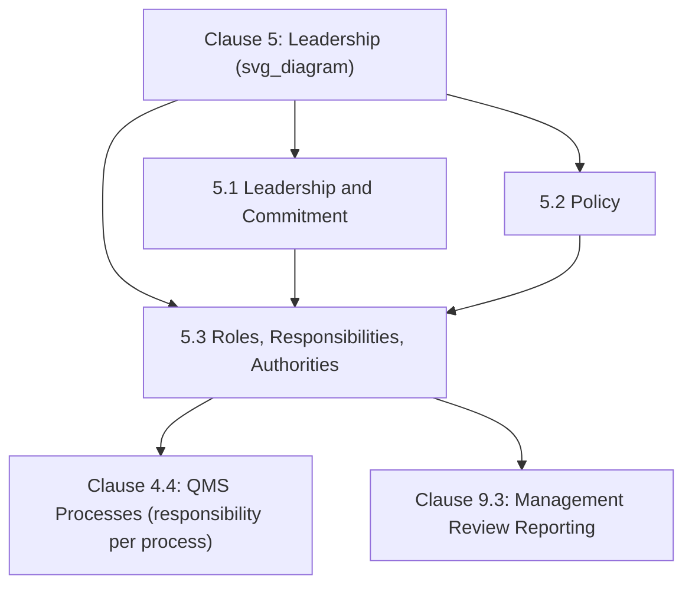
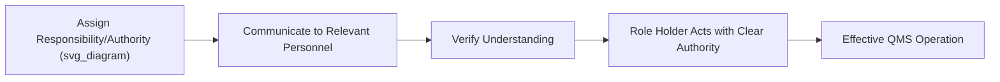

## Organizational Roles Responsibilities and Authorities

### Overview and Purpose

Clause 5.3 requires top management to **assign and communicate** the responsibilities and authorities for relevant roles within the quality management system, ensuring accountability is clearly distributed throughout the organization rather than left ambiguous or informally understood. This clause is the operational counterpart to Clause 5.1's leadership accountability — while 5.1 keeps ultimate accountability with top management, Clause 5.3 governs how top management **delegates specific functional responsibilities** to ensure the QMS operates effectively at every level.

**Key Points**

- Corresponds to Harmonized Structure Clause 5.3, common across ISO 9001, ISO 14001, ISO 45001, and other MSS
- Responsibilities and authorities must be **assigned, communicated, AND understood** — a three-part standard, not documentation alone
- Contains two specific mandatory responsibility assignments (conformity to requirements; reporting on QMS performance)
- Replaces the former ISO 9001:2008 concept of a single "management representative" with distributed, potentially multi-person role assignment

### Position Within Clause 5

### The Two Mandatory Responsibility Assignments

While Clause 5.3 grants organizations flexibility in how responsibilities are distributed overall, it specifically mandates that top management ensure responsibilities and authorities are assigned for two particular functions:

| Assignment | Requirement | Typical Role Holder |
| --- | --- | --- |
| (a) | Ensuring the QMS conforms to the requirements of ISO 9001 | Quality Manager, QMS Owner, or equivalent |
| (b) | Reporting on the performance of the QMS and on opportunities for improvement, particularly to top management | Quality Manager, or a designated QMS performance reporting role |

**Key Points**

- These two assignments echo the core functions previously concentrated in the ISO 9001:2008 "management representative" role, but the standard no longer mandates a single named individual holding both — organizations may distribute these responsibilities across multiple roles, provided both functions are clearly assigned and performed
- [Inference] Because many organizations find it practically efficient to retain a role functionally similar to the former management representative — often still titled "Quality Manager" or "QMS Coordinator" — this practice remains common even though the standard no longer requires or names such a role explicitly.

### Distinguishing Role Assignment from Accountability

A critical conceptual distinction underlies Clause 5.3: **assigning operational responsibility does not transfer ultimate accountability**, which remains with top management per Clause 5.1.

$$\text{Top Management (Clause 5.1: Ultimate Accountability)} \neq \text{Assigned Roles (Clause 5.3: Operational Responsibility)}$$

**Example**

A Quality Manager is assigned responsibility under 5.3(a) for ensuring the QMS conforms to ISO 9001 requirements, and performs day-to-day monitoring and coordination accordingly. However, if the QMS is found systemically deficient during a certification audit, accountability for that deficiency — including ensuring adequate resourcing and organizational commitment to remediation — remains with top management under Clause 5.1, not solely with the Quality Manager as the assigned role holder.

### The Three-Part Standard: Assigned, Communicated, Understood

Clause 5.3 requires that responsibilities and authorities be not merely assigned on paper, but **communicated** throughout the organization and genuinely **understood** by those affected.

**Key Points**

- "Communicated" implies active dissemination — job descriptions, organizational charts, process documentation, or formal announcements — rather than passive availability
- "Understood" implies role holders (and those interacting with them) can correctly describe their own responsibilities and the boundaries of their authority, a standard commonly tested through employee interview during audits, similar to the communication test applied to the quality policy (Clause 5.2.2)

### Common Documentation Tools

Organizations typically document Clause 5.3 assignments through a combination of:

- **Organizational charts**: visualizing reporting lines and role hierarchy
- **Job descriptions/role profiles**: detailing specific responsibilities and authorities per position
- **RACI matrices** (Responsible, Accountable, Consulted, Informed): mapping responsibility across processes, particularly useful for cross-functional processes with multiple contributing roles
- **Process characterization documents** (e.g., turtle diagrams, per Clause 4.4): assigning process ownership as part of broader process documentation

**Example**

A RACI matrix for a "Nonconforming Product Disposition" process might specify: Production Supervisor (Responsible for identifying and segregating nonconforming product); Quality Manager (Accountable for disposition decision and QMS conformance under 5.3(a)); Engineering (Consulted on root cause where design-related); Top Management (Informed via management review reporting under 5.3(b)).

### Relationship to Process-Level Responsibility (Clause 4.4)

Clause 4.4.1(e) separately requires that responsibilities and authorities be assigned **for each process** within the QMS. Clause 5.3 and Clause 4.4.1(e) are complementary: 5.3 addresses the overarching QMS-level responsibility structure (including the two mandatory assignments), while 4.4.1(e) requires that this responsibility assignment cascade down to the level of individual process ownership.

| Clause | Scope of Responsibility Assignment |
| --- | --- |
| 5.3 | Overarching QMS-level roles, including the two mandatory conformance and reporting assignments |
| 4.4.1(e) | Process-specific ownership and authority for each individual process within the QMS |

### Authority Versus Responsibility: A Conceptual Distinction

**Key Points**

- **Responsibility** refers to the obligation to perform a task or achieve an outcome
- **Authority** refers to the empowered right to make decisions, allocate resources, or direct action necessary to fulfill that responsibility
- A common implementation failure occurs when responsibility is assigned without corresponding authority — for example, assigning a Quality Inspector responsibility for stopping nonconforming production, without granting the actual authority to halt the production line, creating a structural gap between accountability and empowerment

**Example**

An organization assigns a Line Supervisor responsibility for ensuring in-process quality checks are performed (per 4.4.1(e) process ownership), and explicitly grants that supervisor the authority to halt production without prior managerial approval if a critical nonconformity is detected — ensuring responsibility and authority are matched rather than creating an accountability gap.

### Multi-Site and Complex Organizational Considerations

**Key Points**

- In multi-site or matrixed organizations, Clause 5.3 responsibility assignment can become more complex, particularly where shared corporate functions (e.g., a centralized quality function serving multiple manufacturing sites) intersect with site-specific operational authority
- Clear documentation distinguishing **site-level** responsibilities from **corporate/shared-function** responsibilities helps prevent gaps or overlaps in accountability, particularly relevant to the scope boundaries established under Clause 4.3

### Common Misconceptions

**Key Points**

- **Misconception**: Clause 5.3 requires reinstating a single "management representative" role. *Reality*: the standard no longer mandates this specific role; the two required assignments (conformance oversight and performance reporting) may be distributed across multiple roles, though many organizations retain a functionally similar role by practice rather than requirement.
- **Misconception**: Documenting a role in a job description satisfies Clause 5.3. *Reality*: the standard requires assignment, communication, AND demonstrated understanding — documentation alone does not fulfill the communication and understanding components.
- **Misconception**: Assigning responsibility to a role holder transfers ultimate accountability away from top management. *Reality*: operational responsibility assignment under 5.3 does not diminish top management's overarching accountability under Clause 5.1.
- **Misconception**: Clause 5.3 and Clause 4.4.1(e) are redundant requirements. *Reality*: 5.3 addresses overarching QMS-level roles including two specific mandatory assignments; 4.4.1(e) requires this responsibility structure to cascade to individual process-level ownership — they operate at different levels of granularity.

### Practical Implementation Guidance

1. **Explicitly document the two mandatory assignments** (conformance oversight, performance reporting) even where responsibilities are otherwise distributed across multiple roles.
2. **Pair every assigned responsibility with corresponding authority**, avoiding structural gaps where personnel are accountable for outcomes they lack the empowerment to control.
3. **Use RACI matrices for cross-functional processes** where multiple roles contribute to a single process outcome, clarifying who is Responsible versus Accountable.
4. **Verify understanding through interview-style checks**, not just document distribution — ask role holders to describe their own QMS responsibilities in their own words during internal audits.
5. **Clarify site-versus-corporate responsibility boundaries** explicitly in multi-site or matrixed organizational structures to prevent accountability gaps at scope boundaries.

### Conclusion

Clause 5.3 operationalizes leadership accountability by requiring top management to assign, communicate, and ensure genuine understanding of specific roles, responsibilities, and authorities throughout the organization — including two explicitly mandated functions covering QMS conformance oversight and performance reporting. By deliberately avoiding a single named "management representative" role, the standard allows organizational flexibility in distributing these responsibilities while preserving the critical distinction that operational delegation under Clause 5.3 never diminishes the ultimate leadership accountability retained by top management under Clause 5.1.

**Related Topics**

- Leadership and Commitment Requirements (Clause 5.1)
- Establishing a Quality Policy (Clause 5.2)
- The Quality Management System and Its Processes (Clause 4.4)
- RACI Matrix Design for Cross-Functional QMS Processes
- Management Review Inputs and Outputs (Clause 9.3)
- Determining the Scope of the Quality Management System (Clause 4.3)
- Competence Requirements for QMS Role Holders (Clause 7.2)