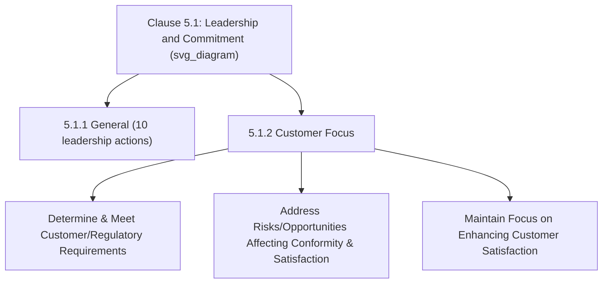
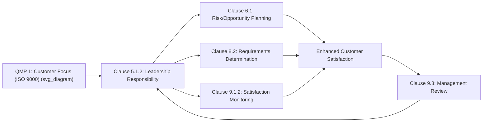

## Customer Focus as a Leadership Responsibility

### Overview and Purpose

Clause 5.1.2 establishes **customer focus** as a distinct, non-delegable leadership responsibility rather than an operational or quality-department function. It requires top management to ensure that customer and applicable statutory/regulatory requirements are determined and consistently met, that risks and opportunities affecting product/service conformity and customer satisfaction are identified and addressed, and that the focus on enhancing customer satisfaction is actively maintained. This clause structurally elevates customer-centricity from an implied cultural value to an explicit, auditable leadership accountability.

**Key Points**

- Corresponds to Harmonized Structure Clause 5.1.2, nested within the broader 5.1 Leadership and Commitment clause
- Directly traceable to Quality Management Principle #1 (Customer Focus) from ISO 9000:2015
- Assigns customer-centricity explicitly to top management — not to sales, customer service, or the quality function alone
- Interlinks with Clause 8.2 (customer requirements determination) and Clause 9.1.2 (customer satisfaction monitoring)

### Position Within Clause 5

### The Three Sub-Requirements of Clause 5.1.2

| Sub-requirement | Requirement | Downstream Linkage |
| --- | --- | --- |
| (a) | Customer requirements and applicable statutory/regulatory requirements are determined, understood, and consistently met | Clause 8.2 (Requirements for products and services) |
| (b) | Risks and opportunities that can affect conformity of products/services and the ability to enhance customer satisfaction are determined and addressed | Clause 6.1 (Actions to address risks and opportunities) |
| (c) | The focus on enhancing customer satisfaction is maintained | Clause 9.1.2 (Customer satisfaction monitoring) |

**Example**

A medical device contract manufacturer demonstrates all three sub-requirements by showing: (a) documented traceability from regulatory requirements (e.g., applicable medical device regulations) through to production specifications; (b) a risk register entry addressing "component obsolescence risk affecting on-time delivery to customers," with a mitigation plan; and (c) management review records showing customer satisfaction survey trends discussed alongside a leadership-sponsored initiative to reduce response time to customer complaints.

### Why Customer Focus Is a Leadership Clause, Not an Operational One

**Key Points**

The placement of customer focus within Clause 5 (Leadership) rather than solely within Clause 8 (Operation) is a deliberate structural choice reflecting ISO 9000's Quality Management Principle #1. The standard's logic holds that customer-centricity cannot be achieved through operational-level activity alone if it is not genuinely prioritized, resourced, and modeled by top management.

$$\text{Customer Satisfaction Outcomes} = f(\text{Leadership Prioritization (5.1.2)}, \text{Operational Execution (Clause 8)}, \text{Monitoring/Feedback (9.1.2)})$$

**Example**

An organization may have well-designed operational processes for capturing and responding to customer complaints (Clause 8), but if top management does not allocate resources to act on recurring complaint themes or does not review customer satisfaction data as a standing leadership priority, the organization would likely be found non-conformant to 5.1.2 despite adequate operational-level mechanisms — illustrating why this responsibility cannot be satisfied through operational compliance alone.

### Customer Focus Across the Quality Management Principles

ISO 9000:2015 positions Customer Focus as the **first** of the seven Quality Management Principles, reflecting its foundational status: *"The primary focus of quality management is to meet customer requirements and to strive to exceed customer expectations."* Clause 5.1.2 is the direct operationalization of this principle at the leadership level.

### Statutory and Regulatory Requirements: An Often-Overlooked Dimension

**Key Points**

- Clause 5.1.2(a) explicitly extends beyond direct customer-stated requirements to include **applicable statutory and regulatory requirements** — a dimension sometimes underemphasized relative to direct customer-facing requirements
- This means leadership accountability for customer focus is not limited to satisfying negotiated contractual terms, but extends to ensuring the organization understands and meets the broader legal/regulatory environment shaping what customers are legally entitled to expect

**Example**

A food packaging manufacturer's customer focus responsibility under 5.1.2(a) extends beyond meeting a specific customer's packaging specification to also ensuring compliance with applicable food-contact material safety regulations — even where a customer's own specification does not explicitly reference every relevant regulatory requirement, the organization retains responsibility for regulatory conformance as part of its customer-focus obligation.

### Risk and Opportunity Integration (5.1.2b)

Sub-requirement (b) explicitly links customer focus to the broader risk-based thinking framework established in Clause 6.1, requiring top management to ensure that risks and opportunities specifically affecting **product/service conformity** and **customer satisfaction enhancement** are identified and addressed — not merely generic organizational risks, but those with direct customer impact.

| Risk/Opportunity Type | Example |
| --- | --- |
| Conformity risk | Single-source supplier dependency threatening on-time, in-spec delivery |
| Satisfaction risk | Declining response time to customer inquiries trending negatively |
| Conformity opportunity | New inspection technology reducing defect escape rate |
| Satisfaction opportunity | Proactive customer communication portal reducing status-inquiry friction |

### Evidence Commonly Reviewed During Audits

| Evidence Type | Demonstrates |
| --- | --- |
| Management review minutes discussing customer satisfaction trends | Maintained focus on enhancing satisfaction (c) |
| Customer requirements traceability records | Determination and fulfillment of requirements (a) |
| Risk register entries tagged to customer impact | Risk/opportunity addressing per (b) |
| Resource allocation decisions tied to customer feedback themes | Leadership prioritization beyond passive awareness |
| Regulatory compliance tracking records | Statutory/regulatory requirement fulfillment (a) |

### Common Misconceptions

**Key Points**

- **Misconception**: Customer focus is primarily a sales or customer-service function responsibility. *Reality*: Clause 5.1.2 explicitly places this accountability with top management, reflecting ISO 9000's positioning of Customer Focus as the foundational Quality Management Principle.
- **Misconception**: Meeting explicit customer-stated requirements alone satisfies 5.1.2(a). *Reality*: the sub-requirement explicitly extends to applicable statutory and regulatory requirements, which may exceed what a customer has explicitly specified.
- **Misconception**: Customer satisfaction monitoring (Clause 9.1.2) alone satisfies the leadership requirement. *Reality*: 9.1.2 provides the measurement mechanism, but 5.1.2 requires leadership to actively maintain focus and act on that data — measurement without leadership-driven action does not satisfy the clause.
- **Misconception**: Customer-related risks are addressed separately from the general Clause 6.1 risk framework. *Reality*: 5.1.2(b) explicitly integrates customer-impact risk/opportunity determination into the same overarching risk-based thinking structure established in Clause 6.1.

### Practical Implementation Guidance

1. **Establish a standing management review agenda item** explicitly linking customer satisfaction data (9.1.2) to leadership decisions and resource allocation, creating clear audit traceability for 5.1.2(c).
2. **Extend requirements determination beyond contractual terms** to explicitly capture applicable statutory and regulatory requirements as part of the customer-focus evidence base for 5.1.2(a).
3. **Tag customer-impacting risks and opportunities distinctly** within the broader Clause 6.1 risk register, enabling clear demonstration of 5.1.2(b) compliance without creating a duplicate, parallel risk system.
4. **Ensure leadership visibly acts on customer feedback themes**, not merely reviews them passively — resource reallocation, process changes, or strategic initiatives traceable to customer data provide the strongest audit evidence.
5. **Avoid treating customer focus as solely a Clause 8 operational matter** during QMS design; explicitly document the leadership-level mechanisms (5.1.2) that drive and sustain operational customer-centricity.

### Conclusion

Clause 5.1.2 elevates customer focus from an operational activity to an explicit, non-delegable leadership responsibility, requiring top management to ensure customer and regulatory requirements are determined and met, customer-impacting risks and opportunities are addressed, and satisfaction enhancement remains an active, sustained priority. This leadership-level framing reflects ISO 9000's foundational Quality Management Principle of Customer Focus, reinforcing that genuine customer-centricity depends on demonstrable leadership prioritization and resourcing — not operational-level mechanisms alone — with clear structural linkages to risk planning (6.1), requirements determination (8.2), and satisfaction monitoring (9.1.2).

**Related Topics**

- Leadership and Commitment Requirements (Clause 5.1)
- Requirements for Products and Services (Clause 8.2)
- Monitoring Customer Satisfaction (Clause 9.1.2)
- Actions to Address Risks and Opportunities (Clause 6.1)
- ISO 9000 Fundamentals and the Seven Quality Management Principles
- Management Review Inputs and Outputs (Clause 9.3)
- Establishing a Quality Policy (Clause 5.2)