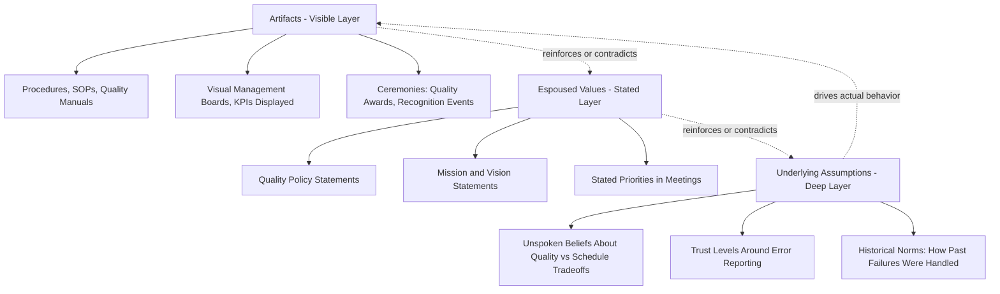
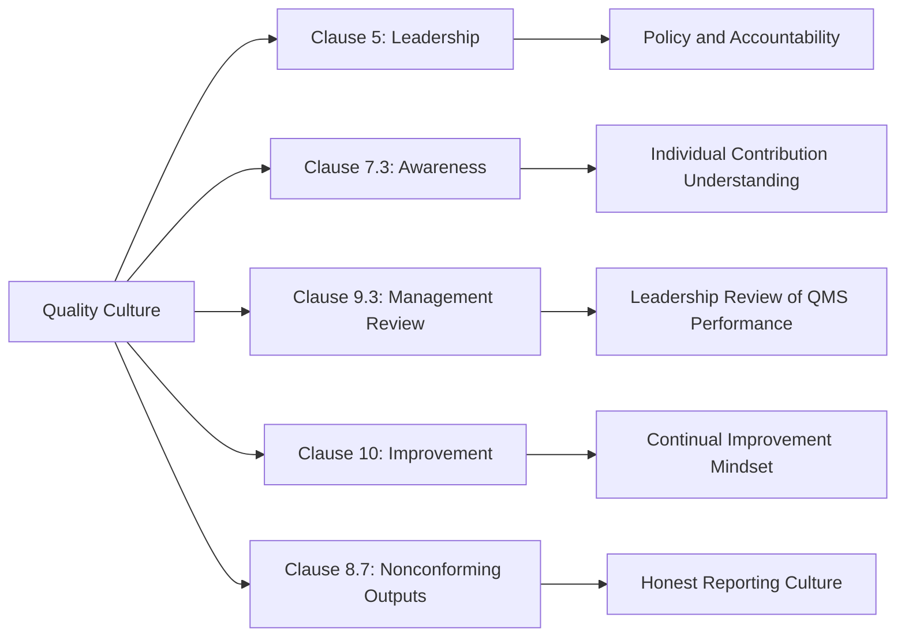

## Building and Sustaining a Quality Culture

### Definition and Conceptual Foundation

Quality culture refers to the shared values, beliefs, attitudes, and behavioral norms within an organization that consistently prioritize quality in decision-making, daily operations, and strategic planning. Unlike a documented QMS, which exists as procedures and records, quality culture is the underlying mindset that determines whether those procedures are followed enthusiastically, followed grudgingly, or bypassed.

ISO 9001:2015 does not use the term "quality culture" explicitly, but Clause 5 (Leadership) and Clause 7.3 (Awareness) establish the requirements that underpin it: top management must demonstrate leadership and commitment to the QMS, and personnel must be aware of the quality policy, relevant quality objectives, and their contribution to QMS effectiveness.

**Key Points:**

- Quality culture is behavioral and attitudinal, while a QMS is procedural and documented
- A strong quality culture reduces reliance on inspection and enforcement
- Culture is shaped by what leadership *does*, not merely what it *says*
- Culture change is a multi-year endeavor, not a single initiative or training event

### Why Quality Culture Matters

A QMS can be fully documented and certified while quality outcomes remain poor if the underlying culture does not support it. Organizations with weak quality culture typically exhibit workarounds to procedures, underreporting of nonconformities, and treating quality as "someone else's job" (usually the QA/QC department's).

Organizations with strong quality culture tend to show:

- Proactive nonconformity and near-miss reporting
- Employees stopping work when quality or safety is at risk, without fear of reprisal
- Continual improvement suggestions originating from the shop floor, not only management
- Quality considerations integrated into product/process design from the outset, rather than inspected in afterward

[Inference] Organizations with mature quality cultures generally experience lower cost of poor quality (COPQ) and fewer repeat nonconformities, though the magnitude of this effect varies by industry, maturity level, and measurement methodology.

### The Role of Leadership Commitment

ISO 9001:2015 Clause 5.1.1 requires top management to demonstrate leadership and commitment to the QMS by:

- Taking accountability for QMS effectiveness
- Ensuring the quality policy and objectives are established and compatible with strategic direction
- Ensuring QMS requirements are integrated into business processes
- Promoting process approach and risk-based thinking
- Ensuring resources are available
- Communicating the importance of effective quality management and conformity to QMS requirements
- Ensuring the QMS achieves its intended results
- Engaging, directing, and supporting persons to contribute to QMS effectiveness
- Promoting improvement
- Supporting other relevant management roles to demonstrate leadership in their areas of responsibility

**Key Points:**

- "Commitment" under ISO 9001 must be demonstrable, not merely stated — auditors look for evidence such as management review participation, resource allocation records, and visible engagement
- Leadership behavior is the single strongest predictor of whether a quality culture takes root, because employees calibrate their own behavior against what leaders visibly tolerate or reward

### Layers of Quality Culture

A useful model for understanding quality culture is to decompose it into three interacting layers, adapted from organizational culture theory (Schein's model applied to quality management):

When the visible artifacts (Layer A) and stated values (Layer B) contradict the underlying assumptions (Layer C) — for example, a quality policy stating "quality first" while employees privately believe schedule always wins — the culture will default to the deep layer under pressure. This gap is often called the "say-do gap" and is a primary audit and organizational diagnostic target.

### Diagnostic Model: Assessing Current Quality Culture Maturity

A widely used framework for assessing maturity is a five-stage progression, conceptually aligned with models such as the Westrum Organizational Culture model and various quality maturity frameworks used in automotive (IATF) and aerospace (AS9100) supply chains.

| Maturity Stage | Characteristics | Typical Behaviors |
| --- | --- | --- |
| 1. Pathological | Quality seen as a compliance burden | Information hidden, blame-focused, quality data manipulated |
| 2. Reactive | Quality addressed only after failures | Firefighting, corrective actions dominate, no prevention focus |
| 3. Calculative | Quality managed via systems and procedures | Audits pass, but culture treats quality as a separate department's job |
| 4. Proactive | Quality integrated into operations | Cross-functional ownership, risk-based thinking applied routinely |
| 5. Generative | Quality is part of organizational identity | Continuous improvement is self-sustaining, employees self-police standards |

[Unverified] The precise stage labels above are a synthesis drawn from commonly cited organizational-culture and safety-culture maturity frameworks; organizations should treat this as a diagnostic heuristic rather than a certified or standardized ISO maturity model, since ISO itself does not publish an official quality culture maturity scale.

### Building Quality Culture: Practical Mechanisms

**1. Visible and Consistent Leadership Behavior**

- Leaders participating personally in audits, gemba walks, and management reviews
- Leaders visibly prioritizing quality over schedule/cost when genuine conflicts arise
- Consistency between what is said in town halls and what is rewarded in performance reviews

**2. Psychological Safety for Reporting**

- Non-punitive nonconformity and near-miss reporting systems
- Just Culture principles: distinguishing honest mistakes from reckless or willful noncompliance, and calibrating response accordingly
- Anonymous or protected escalation channels for quality concerns

**3. Competence and Awareness (Clause 7.2, 7.3)**

- Role-specific quality training tied to actual job tasks, not generic compliance modules
- Ensuring personnel understand how their work affects product/service conformity and customer satisfaction
- Making quality objectives visible and traceable to individual/team contributions

**4. Recognition and Incentive Alignment**

- Rewarding quality-positive behaviors (e.g., catching defects early, proposing improvements) rather than only rewarding output volume
- Auditing whether incentive structures inadvertently punish quality (e.g., piece-rate pay that discourages stopping the line)

**5. Communication Cadence**

- Regular quality performance communication (COPQ, defect rates, customer complaints) to all levels, not just management
- Closing the loop: informing employees what happened to the corrective actions or suggestions they raised

**6. Embedding Quality in Process Design**

- Poka-yoke (error-proofing) built into processes rather than relying on inspection
- Design reviews and FMEA (Failure Mode and Effects Analysis) conducted collaboratively across functions

### Example: Contrasting Two Organizational Responses

**Scenario:** A production operator discovers a batch of components slightly out of tolerance, but within a range that "probably" wouldn't cause field failure. Shipping is due in two hours.

**Weak Quality Culture Response:**

- Operator hesitates to report, fearing blame for the delay
- Supervisor, under schedule pressure, unofficially approves shipment
- No nonconformity record created
- Issue potentially resurfaces as a customer complaint weeks later, with no traceability

**Strong Quality Culture Response:**

- Operator immediately stops the line and reports the deviation, without fear of blame
- Supervisor treats the report as valuable information, not a problem to suppress
- Nonconformity is documented per Clause 8.7 (Control of Nonconforming Outputs)
- Root cause analysis is triggered; disposition decision (rework, scrap, use-as-is with concession) is made through defined authority, not schedule pressure
- Lessons are fed back into FMEA or control plan for future prevention

This contrast illustrates why Clause 5 leadership requirements and Clause 8.7 nonconformity controls are procedurally similar in both scenarios — the differentiator is entirely cultural.

### Barriers to Sustaining Quality Culture

- **Leadership turnover:** New leaders who do not maintain visible commitment can rapidly erode culture built over years
- **Growth and scaling:** Rapid headcount growth can dilute culture faster than onboarding/training can reinforce it
- **Cost pressure cycles:** Economic downturns often tempt organizations to deprioritize quality investment, damaging trust built during stable periods
- **Siloed ownership:** Treating quality as "the QA department's job" rather than a cross-functional responsibility
- **Metric gaming:** When quality KPIs become targets divorced from genuine improvement, employees may optimize the metric rather than the outcome (a form of Goodhart's Law)

**Key Points:**

- Sustaining culture requires continual reinforcement mechanisms, not a one-time change program
- Culture regression is common during crises unless leadership deliberately protects quality priorities under pressure

### Measuring Quality Culture

Because culture is intangible, organizations typically use a blended measurement approach:

| Measurement Type | Examples |
| --- | --- |
| Lagging indicators | Customer complaints, COPQ, audit findings, warranty claims |
| Leading indicators | Near-miss reports, internal audit participation rates, training completion, employee suggestions submitted |
| Perception-based | Employee culture surveys, quality climate assessments, exit interview themes |
| Behavioral observation | Gemba walk findings, leadership audit participation frequency |

[Inference] Combining lagging, leading, and perception-based indicators tends to give a more reliable picture of culture health than relying on any single metric category, since lagging indicators alone reflect culture only after damage has already occurred.

### Relationship to ISO 9001 Clauses

### Common Pitfalls

- Treating a "culture initiative" (posters, slogans, one-time training) as sufficient without structural reinforcement
- Measuring only compliance (audit pass rates) rather than genuine behavioral indicators
- Punishing honest error reporting, which drives issues underground rather than eliminating them
- Assuming certification to ISO 9001 equates to strong quality culture — certification demonstrates the QMS meets documented requirements, but does not by itself measure cultural maturity

**Related Topics:**

- Just Culture and Blame-Free Reporting Systems
- Management Review (Clause 9.3) as a Culture Reinforcement Mechanism
- Employee Engagement and Quality Objectives (Clause 6.2)
- Risk-Based Thinking as a Cultural Driver
- Change Management Models Applied to QMS Transformation
- Cost of Poor Quality (COPQ) as a Culture Diagnostic
- Gemba Walks and Leadership Visibility Practices
- Safety Culture Parallels (ISO 45001 Alignment)