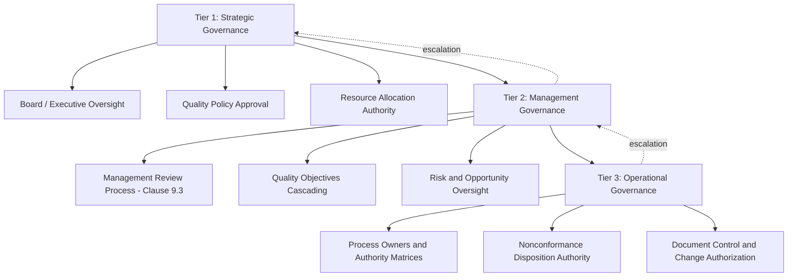
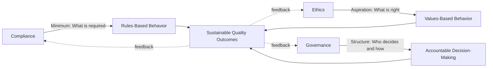

## Governance and Ethical Behavior in Quality Management

### Definition and Conceptual Foundation

Governance in quality management refers to the structures, policies, and decision-making authorities that ensure the QMS operates with accountability, transparency, and alignment to organizational and stakeholder interests. Ethical behavior refers to the values-based conduct of individuals within that governance structure — how decisions are made when compliance requirements, business pressure, and integrity intersect.

While ISO 9001:2015 does not contain a dedicated "governance" or "ethics" clause, these concepts are embedded throughout Clause 5 (Leadership), Clause 4.2 (Understanding the Needs and Expectations of Interested Parties), and the overarching quality management principles, particularly "engagement of people" and "relationship management."

**Key Points:**

- Governance provides the *structural* accountability framework (who decides, who is answerable)
- Ethics provides the *behavioral* framework (how decisions are made when rules are ambiguous or absent)
- Both are prerequisites for a QMS that produces trustworthy, not merely compliant, outcomes

### Governance Structures in Quality Management

Effective quality governance typically operates across three organizational tiers:

**Key governance mechanisms:**

- **Delegated authority matrices** — clearly defined who can approve deviations, concessions, or nonconforming product disposition
- **Segregation of duties** — separating those who perform work from those who verify/approve it, particularly relevant in calibration, inspection, and release authority
- **Management review** (Clause 9.3) — the formal governance checkpoint where top management evaluates QMS suitability, adequacy, and effectiveness
- **Internal audit independence** (Clause 9.2) — auditors must not audit their own work area, preserving objectivity

### Ethical Principles Underpinning Quality Management

Several international frameworks inform ethical expectations in quality management contexts, though ISO 9001 itself is process-focused rather than ethics-focused. Related standards and frameworks include:

- **ISO 37001** (Anti-bribery management systems) — directly addresses bribery risk in business processes, often integrated with QMS governance in regulated industries
- **ISO 19600 / ISO 37301** (Compliance management systems) — establishes systematic compliance governance, superseding ISO 19600
- **ASQ Code of Ethics** — professional conduct standards for quality practitioners, emphasizing honesty, integrity, and public safety over employer convenience

**Core ethical principles applied to quality contexts:**

| Principle | Application in QMS |
| --- | --- |
| Integrity of data | Not falsifying inspection records, test results, or calibration certificates |
| Independence of judgment | Inspectors/auditors not pressured to pass nonconforming product |
| Transparency | Honest reporting of nonconformities to customers and regulators when required |
| Accountability | Individuals accept responsibility for decisions within their authority |
| Fair dealing | Suppliers and customers treated equitably in quality-related disputes |

### The Ethics-Compliance-Culture Relationship

An organization can be fully compliant (meeting every documented QMS requirement) while still exhibiting poor ethics (e.g., technically passing an audit while concealing known quality risks from a customer). Mature quality governance closes this gap by making ethical expectations explicit rather than assuming compliance alone guarantees integrity.

### Common Ethical Risk Areas in Quality Management

**1. Data Integrity Manipulation**

- Falsifying test results to meet deadlines or specifications
- Backdating documentation
- Selective reporting (excluding unfavorable data points)

**2. Pressure on Inspection/Release Authority**

- Production or sales pressuring quality personnel to release nonconforming product
- Conflicts of interest where quality sign-off authority reports directly to production management with schedule incentives

**3. Supplier and Customer Relationship Conflicts**

- Accepting undisclosed incentives from suppliers that could bias qualification decisions
- Concealing known nonconformities from customers to avoid contract penalties

**4. Whistleblower Suppression**

- Retaliation against employees who report quality or safety concerns
- Lack of protected/anonymous reporting channels

[Inference] Data integrity violations are frequently cited in regulatory enforcement actions (particularly in pharmaceutical/medical device sectors under FDA and EU GMP oversight) as a leading root cause of major compliance failures, though exact prevalence figures vary by industry and enforcement body.

### Governance Controls to Mitigate Ethical Risk

**Structural controls:**

- Independent quality authority with escalation paths that bypass production management when necessary
- Dual sign-off requirements for critical release decisions
- Rotation of internal auditors to prevent familiarity bias

**Procedural controls:**

- Documented ethics and code-of-conduct policies specific to quality roles
- Mandatory reporting requirements for known nonconformities to regulators/customers where contractually or legally required
- Protected disclosure / whistleblower policies with non-retaliation guarantees

**Cultural controls:**

- Leadership modeling ethical decision-making under pressure (see related topic: Building and Sustaining a Quality Culture)
- Ethics training tied to real scenarios relevant to the organization's industry
- Recognition of employees who raise difficult issues, rather than only rewarding "no problems found"

### Example: Governance Failure Scenario

**Scenario:** A quality engineer discovers that a batch of medical device components failed a critical dimensional test. The production manager argues the failure is likely a measurement error, cites schedule pressure, and requests the batch be released with "use as-is" disposition without further investigation.

**Poor Governance Response:**

- Quality engineer lacks independent authority and is overruled by production management
- No documented nonconformance record created
- Decision made informally outside the defined disposition process

**Sound Governance Response:**

- Quality engineer's release authority is structurally independent of production's schedule incentives (segregation of duties)
- Nonconformance is documented per Clause 8.7, triggering formal investigation
- Disposition decision (use-as-is, rework, scrap) requires cross-functional sign-off per a documented authority matrix, not unilateral production override
- If use-as-is is ultimately justified by engineering analysis, decision and rationale are fully traceable
- If the product is safety-critical, applicable regulatory notification requirements (e.g., FDA 21 CFR Part 820 complaint handling, or customer contractual notification clauses) are evaluated

This illustrates how governance structure (independent authority, documented escalation) is what makes ethical behavior *possible* under pressure — without structural support, individual ethical intent is often insufficient to withstand organizational pressure.

### Governance in Multi-Site and Supply Chain Contexts

For organizations with multiple sites or extended supply chains, governance complexity increases:

- **Corporate quality governance** typically sets policy and minimum standards across all sites
- **Site-level governance** implements and may adapt controls to local regulatory context
- **Supplier governance** extends ethical and quality expectations contractually (e.g., supplier codes of conduct, right-to-audit clauses)

Standards such as IATF 16949 (automotive) and AS9100 (aerospace) impose more prescriptive governance requirements than ISO 9001 alone, including mandatory escalation of safety-related nonconformities and specific supplier governance clauses.

### Measuring Governance and Ethical Health

| Indicator Type | Examples |
| --- | --- |
| Structural indicators | Existence and independence of quality sign-off authority; audit committee oversight |
| Behavioral indicators | Whistleblower report volume and resolution time; retaliation complaint rates |
| Outcome indicators | Regulatory findings related to data integrity; repeat ethical violations |
| Perception indicators | Ethics climate survey results; trust in leadership scores |

[Inference] A low volume of ethics/whistleblower reports is not necessarily a positive signal — it may indicate either genuinely low incidence or a suppressed reporting culture, and should be interpreted alongside perception-based survey data rather than in isolation.

### Common Pitfalls

- Assuming a written code of conduct alone constitutes effective governance without structural enforcement mechanisms
- Placing quality release authority under the direct incentive structure of production/sales, creating inherent conflict of interest
- Treating ethics training as a one-time compliance checkbox rather than an ongoing reinforcement activity
- Failing to protect whistleblowers, which suppresses the exact information governance structures depend on to function

**Related Topics:**

- Building and Sustaining a Quality Culture
- Management Review as a Governance Mechanism (Clause 9.3)
- ISO 37001 Anti-Bribery Management Systems
- ISO 37301 Compliance Management Systems
- Internal Audit Independence and Objectivity (Clause 9.2)
- Segregation of Duties in Release and Disposition Authority
- Whistleblower Protection and Non-Retaliation Policies
- Supplier Code of Conduct and Extended Governance