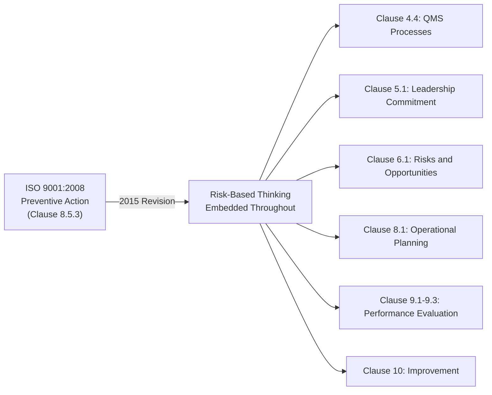
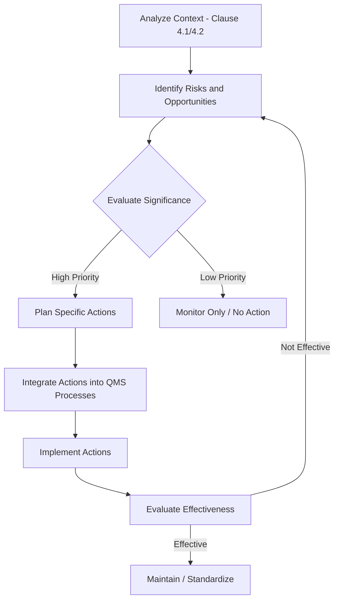
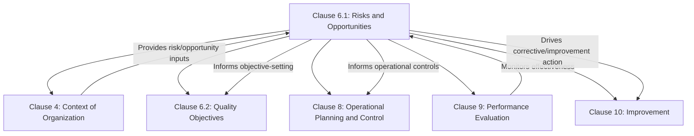

## Actions to Address Risks and Opportunities

### Definition and Clause Reference

"Actions to Address Risks and Opportunities" corresponds directly to **ISO 9001:2015 Clause 6.1**, one of the most significant additions introduced in the 2015 revision. It requires organizations to determine risks and opportunities related to QMS performance during planning, and to plan actions to address them, integrated into QMS processes rather than treated as a standalone risk management program.

The clause is structured in two parts:

- **6.1.1** — Determine risks and opportunities that need to be addressed to give assurance the QMS can achieve intended results, enhance desirable effects, prevent/reduce undesired effects, and achieve improvement
- **6.1.2** — Plan actions to address them, integrate and implement these actions into QMS processes, and evaluate the effectiveness of these actions

**Key Points:**

- This is often called "risk-based thinking" in ISO 9001:2015, and it replaces the more narrowly scoped "preventive action" clause from ISO 9001:2008
- Risk-based thinking is embedded throughout the standard's structure, not confined to Clause 6.1 alone
- There is no mandatory requirement for formal risk management methodology (e.g., no requirement to use FMEA specifically) — the organization determines the appropriate method

### Why This Clause Replaced "Preventive Action"

ISO 9001:2008 Clause 8.5.3 required documented preventive action procedures reacting to potential nonconformities. ISO 9001:2015 eliminated this as a standalone clause and distributed the underlying intent (anticipating and preventing problems) throughout the entire standard via risk-based thinking, embedded in planning (Clause 6), operational planning (Clause 8.1), performance evaluation (Clause 9), and improvement (Clause 10).

[Inference] The shift from a standalone preventive action clause to distributed risk-based thinking is widely interpreted by ISO 9001 practitioners as intended to make risk consideration proactive and continuous rather than a discrete, periodic administrative activity, though the standard itself does not use this exact framing.

### Relationship Between Risks and Opportunities

A common misconception is that Clause 6.1 is solely about risk avoidance. The clause explicitly pairs risks with opportunities, meaning organizations must also identify potential for improvement, new customers, process enhancement, or technology adoption — not only threats.

| Concept | Definition | QMS Example |
| --- | --- | --- |
| Risk | Effect of uncertainty that could negatively affect QMS outcomes | Key supplier has history of late deliveries |
| Opportunity | Circumstance that could positively affect QMS outcomes | Automating inspection could reduce error rate and free capacity |

$$\text{Risk Priority} = f(\text{Likelihood}, \text{Severity}, \text{Detectability})$$

This is the conceptual basis of many risk-scoring approaches (such as Risk Priority Number in FMEA), though ISO 9001 itself does not mandate this specific formula or methodology.

### Process for Determining Risks and Opportunities

**Step 1: Identify Context Inputs**

- Internal and external issues (Clause 4.1)
- Needs and expectations of interested parties (Clause 4.2)
- QMS process interactions and scope (Clause 4.3, 4.4)

**Step 2: Identify Risks and Opportunities**

Common techniques include:

- SWOT analysis (Strengths, Weaknesses, Opportunities, Threats)
- FMEA (Failure Mode and Effects Analysis) — common in automotive/aerospace sectors
- Brainstorming workshops with process owners
- Historical nonconformity and customer complaint trend analysis
- PESTLE analysis (Political, Economic, Social, Technological, Legal, Environmental) for external context

**Step 3: Evaluate and Prioritize**

- Qualitative scoring (High/Medium/Low likelihood and impact matrices)
- Quantitative scoring (numerical risk scores, e.g., RPN in FMEA)
- Organizations choose the depth of methodology proportional to their complexity — ISO 9001 explicitly does not require a documented risk management methodology

**Step 4: Plan Actions**

Per Clause 6.1.2, actions must be:

- Integrated into QMS processes (not a separate disconnected risk register)
- Proportionate to the potential impact on conformity of products/services and customer satisfaction
- Evaluated for effectiveness after implementation

### Risk Response Strategies

Per Clause 6.1.2, an organization's options for addressing identified risk include:

- **Avoid the risk** — eliminate the activity or condition causing the risk
- **Take the risk** in order to pursue an opportunity — knowingly accept risk because potential benefit outweighs it
- **Eliminate the risk source** — remove the root cause
- **Change the likelihood or consequences** — implement controls that reduce probability or severity
- **Share the risk** — insurance, contractual risk transfer, outsourcing to a more capable party
- **Retain the risk by informed decision** — consciously accept residual risk after evaluation

**Key Points:**

- Not every identified risk requires a documented action — proportionality is explicitly permitted by the standard
- Opportunities should be evaluated with equal rigor, not treated as an afterthought to risk avoidance

### Example: Applying Clause 6.1 in Practice

**Context:** A precision machining company identifies during context analysis (Clause 4.1) that a single supplier provides a critical raw material with no qualified backup supplier.

**Risk identified:** Supply disruption could halt production, causing missed customer delivery commitments and potential contract penalties.

**Opportunity identified:** Qualifying a second supplier could also enable negotiating better pricing through competitive sourcing.

**Action planned:**

1. Initiate qualification process for an alternate supplier (target: 2 quarters)
2. Increase safety stock of critical material by 30% as interim mitigation
3. Integrate supplier risk review into the existing supplier evaluation process (Clause 8.4) rather than creating a separate parallel process
4. Assign action owner and review date within management review (Clause 9.3)

**Effectiveness evaluation (after implementation):**

- Second supplier successfully qualified and incorporated into approved supplier list
- Safety stock policy formally incorporated into inventory management procedure
- Risk re-scored and reduced in subsequent review cycle

This example demonstrates the required integration: the action is embedded into existing processes (supplier evaluation, inventory management, management review) rather than existing as an isolated "risk register" disconnected from operations.

### Documentation Expectations

ISO 9001:2015 does not mandate a specific documented risk register format, but Clause 7.5 documented information requirements apply where the organization determines documentation is necessary for QMS effectiveness. Common practical approaches include:

- Risk and opportunity registers (spreadsheet or QMS software-based)
- Integration within process risk assessments (e.g., embedded in a process's turtle diagram or SIPOC documentation)
- FMEA documentation for product/process-specific risk (common in IATF 16949-certified automotive organizations, where FMEA is effectively mandatory via reference standards)

[Unverified] Whether a formal risk register is "required" is a frequent point of confusion in practitioner communities; ISO 9001:2015 itself imposes no such explicit mandatory format, though many certification bodies expect *some* objective evidence that risks and opportunities were systematically considered and are traceable to actions.

### Integration with Other QMS Clauses

### Common Pitfalls

- Treating Clause 6.1 as a one-time exercise performed only for certification audits, rather than an ongoing input to management review and planning
- Creating an isolated risk register that is never referenced in actual operational decision-making, violating the "integration" requirement
- Focusing exclusively on risks while neglecting to document and pursue identified opportunities
- Over-engineering the methodology (e.g., mandating full FMEA for a small, low-complexity organization) when a simpler proportionate approach would satisfy the requirement
- Failing to evaluate the effectiveness of planned actions, leaving Clause 6.1.2(b) unaddressed

**Related Topics:**

- Context of the Organization (Clause 4.1 and 4.2)
- Quality Objectives and Planning to Achieve Them (Clause 6.2)
- FMEA (Failure Mode and Effects Analysis) Methodology
- Management Review Inputs and Outputs (Clause 9.3)
- Corrective Action vs. Preventive Thinking (Clause 10.2)
- Supplier Risk Management (Clause 8.4)
- SWOT and PESTLE Analysis Techniques