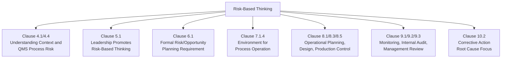
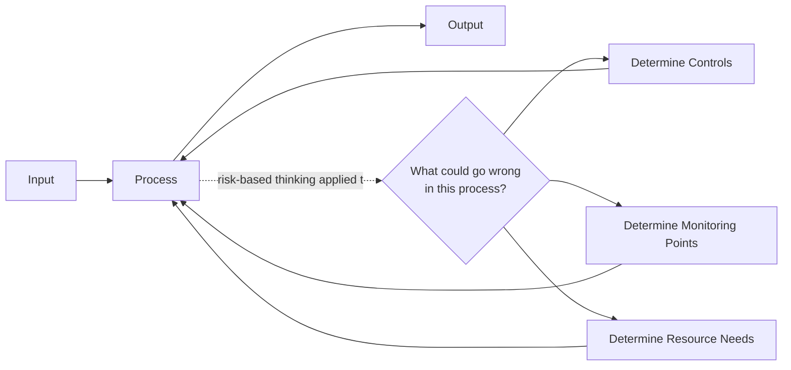

## Risk Based Thinking Fundamentals

### Definition and Origin

Risk-based thinking is the conceptual approach introduced formally in ISO 9001:2015 whereby organizations consider risk and opportunity throughout QMS planning, operation, and evaluation, rather than treating risk management as a separate, periodic activity. It is not a standalone clause but a philosophy embedded across the structure of the standard.

ISO 9001:2015's introduction explicitly states that risk-based thinking has always been implicit in prior editions (e.g., through the concept of preventive action), but the 2015 revision made it explicit and systematic, requiring organizations to understand and manage risk as an integral part of QMS design rather than a bolt-on activity.

**Key Points:**

- Risk-based thinking is a *mindset* applied throughout the standard, distinct from Clause 6.1 ("Actions to Address Risks and Opportunities"), which is the specific clause requiring formal planning output
- Risk-based thinking replaced the standalone preventive action requirement of ISO 9001:2008
- The intent is that risk consideration becomes proactive and continuous, not reactive and episodic

### Distinguishing Risk-Based Thinking from Clause 6.1

This is a frequent point of confusion for practitioners:

| Concept | Scope |
| --- | --- |
| Risk-based thinking | The underlying philosophy/mindset applied across the entire QMS (Clauses 4, 5, 6, 7, 8, 9, 10) |
| Clause 6.1 (Actions to Address Risks and Opportunities) | The specific, auditable requirement to determine and plan actions for risks/opportunities during planning |

Risk-based thinking is the "why" and the pervasive approach; Clause 6.1 is one specific "where" it is formally documented and actioned. Risk-based thinking also manifests in clauses such as 8.1 (operational planning and control), 8.5.1 (control of production/service provision), and 9.1 (monitoring, measurement, analysis, and evaluation).

### Core Principles of Risk-Based Thinking

**1. Risk and Opportunity Are Linked**

Risk-based thinking is not purely defensive. Every risk consideration should be paired with consideration of potential opportunity — a supplier disruption risk, for example, may reveal an opportunity to diversify sourcing and improve resilience.

**2. Proportionality**

The depth of risk analysis should match the complexity, size, and risk profile of the organization. ISO 9001 explicitly avoids mandating a specific methodology (e.g., no required use of FMEA or quantitative risk scoring) — a small service organization's risk-based thinking may be informal, while a medical device manufacturer's may be highly formalized.

**3. Preventive by Design**

Rather than reacting to nonconformities after they occur (corrective action), risk-based thinking aims to anticipate and design out failure modes before they manifest.

**4. Continuous, Not Episodic**

Risk-based thinking should inform ongoing decision-making — daily operational decisions, process design, supplier selection — not only appear during annual planning or audit preparation.

**5. Risk Awareness Proportional to Position**

Different organizational levels engage with risk-based thinking differently: strategic risk (top management, Clause 5) versus operational risk (process owners, Clause 8) versus product/service-specific risk (design and realization teams).

### Where Risk-Based Thinking Appears in ISO 9001:2015

**Key Points:**

- Clause 5.1.1(d) specifically requires top management to promote the use of the process approach and risk-based thinking
- Internal audits (Clause 9.2) should themselves be planned considering the risk profile of different processes — higher-risk processes typically warrant more frequent or in-depth audit attention

### Common Risk-Based Thinking Tools and Techniques

| Technique | Typical Use Case |
| --- | --- |
| SWOT Analysis | Strategic-level context and risk identification (Clause 4) |
| FMEA (Failure Mode and Effects Analysis) | Product/process-level risk in design and manufacturing |
| Risk Matrix (Likelihood × Severity) | Qualitative prioritization across most risk types |
| Fishbone/Ishikawa Diagram | Root cause identification, often paired with risk prevention |
| HACCP (Hazard Analysis Critical Control Points) | Food safety-specific risk-based thinking (ISO 22000 context) |
| Bowtie Analysis | Visualizing risk causes, controls, and consequences together |

$$\text{Risk Level} = \text{Likelihood} \times \text{Severity}$$

This simplified multiplicative model is one common qualitative approach; more sophisticated models (such as FMEA's RPN, which also incorporates detectability) extend this basic relationship. [Inference] The specific weighting or inclusion of a detectability factor varies by industry convention and is not mandated by ISO 9001 itself.

### Risk-Based Thinking Applied to the Process Approach

ISO 9001:2015 pairs risk-based thinking with the process approach (Clause 4.4) — every process within the QMS should be evaluated for its risk exposure as part of determining necessary controls, resources, and monitoring.

For each QMS process, risk-based thinking prompts questions such as:

- What could cause this process to fail to deliver its intended output?
- What are the consequences if this process fails?
- What controls currently exist, and are they sufficient given the risk level?
- What opportunities exist to make this process more effective or efficient?

### Example: Risk-Based Thinking in Daily Operations

**Scenario:** A calibration technician is scheduling routine equipment calibration.

**Without risk-based thinking (checklist compliance only):**

- All equipment calibrated on identical fixed intervals regardless of criticality or usage intensity
- No consideration of which equipment failures would have the greatest impact on product conformity

**With risk-based thinking applied:**

- Equipment used for critical dimensional tolerances on safety-critical components is calibrated more frequently than equipment used for non-critical visual inspection aids
- Equipment with a history of drift is flagged for increased monitoring frequency
- Calibration interval decisions are documented with rationale tied to risk of measurement error propagating into nonconforming product
- Opportunity identified: transitioning to a condition-based calibration trigger (rather than purely time-based) could reduce unnecessary calibration costs while maintaining risk control

This illustrates risk-based thinking as an operational mindset applied to a routine QMS activity (Clause 7.1.5, Monitoring and Measuring Resources), not merely a planning-phase exercise under Clause 6.1.

### Risk-Based Thinking vs. Formal Risk Management Systems

It is important to distinguish ISO 9001's risk-based thinking from dedicated risk management standards:

| Standard | Focus |
| --- | --- |
| ISO 9001:2015 | Risk-based thinking integrated into QMS; no prescribed methodology |
| ISO 31000 | Dedicated risk management principles and guidelines (broader than quality) |
| ISO 14971 | Risk management specifically for medical devices |
| IATF 16949 | Extends ISO 9001 with mandatory FMEA-based risk methodology for automotive |

[Unverified] Organizations are not required to adopt ISO 31000 to satisfy ISO 9001:2015's risk-based thinking expectations, though many organizations reference ISO 31000 principles voluntarily as a structured framework, since ISO 9001 leaves methodology selection open.

### Common Pitfalls

- Conflating risk-based thinking (the pervasive mindset) with Clause 6.1 (the specific documented planning requirement) — auditors often probe for evidence of the former beyond just the latter's paperwork
- Applying risk-based thinking only during annual planning cycles rather than as an ongoing operational consideration
- Over-formalizing risk-based thinking with excessive documentation disproportionate to organizational risk profile
- Focusing exclusively on threat avoidance while neglecting the opportunity dimension
- Treating risk-based thinking as solely a quality department responsibility rather than a shared mindset across all process owners

**Related Topics:**

- Actions to Address Risks and Opportunities (Clause 6.1)
- Process Approach (Clause 4.4)
- FMEA Methodology and Risk Priority Numbers
- ISO 31000 Risk Management Principles
- Internal Audit Planning Based on Process Risk (Clause 9.2)
- Corrective Action and Root Cause Analysis (Clause 10.2)
- Preventive Action Concept (Historical Context, ISO 9001:2008)